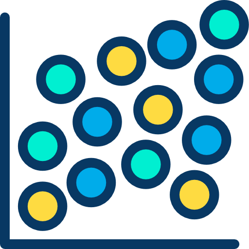
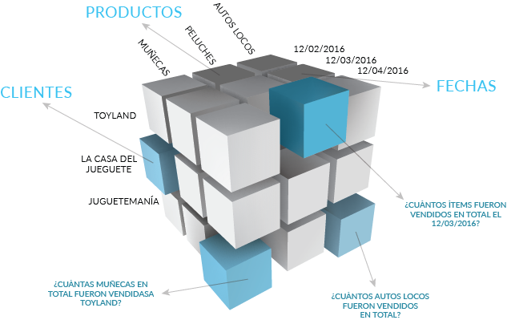
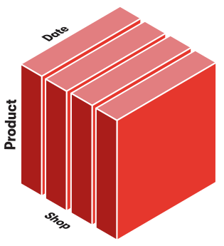
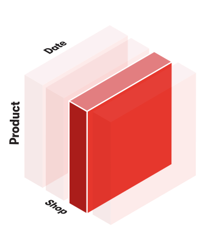
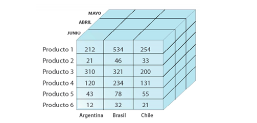
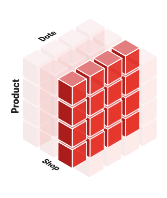
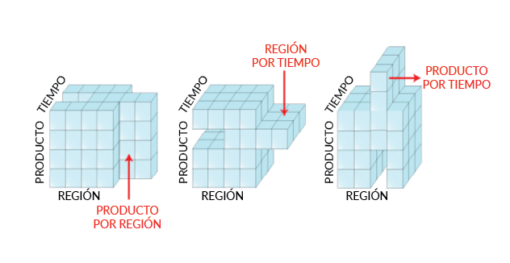
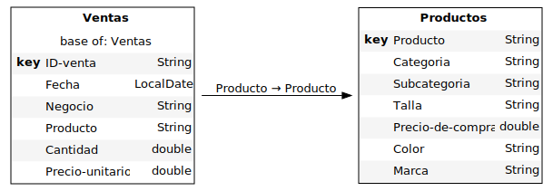
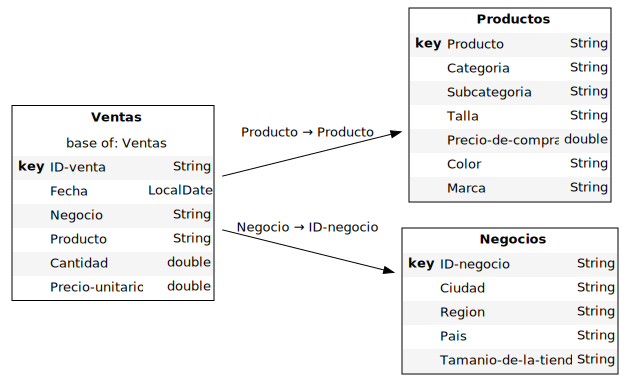

# Práctica para el curso "Adquisición, Gestión y Análisis de Datos a Gran escala - Big Data"

## _Data Science applied to Business Intelligence_

<p align="center">

</p>

#### _Elaborado por..._

**Garriga, Jess. 2022.**

FCPyS - UNCuyo.

Contacto: [garrigajess98@gmail.com](URL) | [Linkedin](https://www.linkedin.com/in/jess-garriga-b8bb95240/)

---

## Tabla de contenidos

- [Datos y librerías](#datos-y-librerias)
  * [Conceptos multidimensionales](#conceptos-multidimensionales)
  * [Primera visualización](#primera-visualizacion)
  * [Desglose y filtros](#desglose-y-filtros)
  * [Aplicación de dashboard (cuadro de mando o tablero)](#aplicacion-de-dashboard-cuadro-de-mando-o-tablero)
- [Enriquecer el cubo](#enriquecer-el-cubo)
  * [Unir *("Join")*](#unir-join)
    + [Tablas relacionales](#tablas-relacionales)
  * [Nuevas medidas](#nuevas-medidas)
    + [Precios máximos](#precios-maximos)
    + [Operaciones a nivel de hechos](#operaciones-a-nivel-de-hechos)
    + [Margen](#margen)
    + [Suma acumulada en el tiempo](#suma-acumulada-en-el-tiempo)
    + [Promedio por negocio](#promedio-por-negocio)
- [Simulaciones](#simulaciones)
  * [Simulación de Origen](#simulacion-de-origen)
  * [Simulaciones de parámetros](#simulaciones-de-parametros)

---

**Descripción**

El siguiente notebook presenta una aplicación de Ciencia de Datos aplicada a la Business Intelligence para analizar las ventas de una empresa ficticia, creada a los fines del ejercicio. Analizamos 5000 datarows de ventas.

**Conocimientos previos**

- Estadísticas (muy importante para las descripciones que realizaremos)
- Ciencia de datos
- Python
- Jupyter lab
- Business Intelligence

**Objetivos**

- Cargar datos normalizados en múltiples tablas para crear un cubo multidimensional
- Definir medidas agregadas para proporcionar información específica de la aplicación y de alto nivel
- Simular distintos escenarios económicos
- Construir gráficos y tablas interactivas low code
- Crear un dashboard (cuadro de mando o tablero) accesible para la toma de decisiones

## Datos y librerías

Crearemos nuestro cubo a partir de un archivo .csv y aplicaremos conceptos multidimensionales como cubo, dimensión, jerarquía y medida.

Importaremos la librería [atoti](https://github.com/atoti) para ejecutar tareas de Business Intelligence (inteligencia empresarial) en Python, aprovechando la potencia que tiene un lenguaje de programación frente a herramientas como Excel o Power BI, por ejemplo.


```python
import atoti as tt

# Opcionalmente desactivo la recopilación de datos de atoti y el mensaje inicial
ATOTI_HIDE_EULA_MESSAGE = True
ATOTI_DISABLE_TELEMETRY = True

# creo el objeto "session"
session = tt.Session()


Cargamos los datos del .csv en una tabla llamada _tabla_ventas_:


```python
tabla_ventas = session.read_csv("data/ventas.csv", keys=["ID-venta"]) 
# el método "read_csv" viene heredado de Pandas
```

Veremos los datos cargados. Las ventas de la empresa son:


```python
tabla_ventas.head()
```


<div>
<style scoped>
    .dataframe tbody tr th:only-of-type {
        vertical-align: middle;
    }

    .dataframe tbody tr th {
        vertical-align: top;
    }

    .dataframe thead th {
        text-align: right;
    }
</style>
<table border="1" class="dataframe">
  <thead>
    <tr style="text-align: right;">
      <th></th>
      <th>Fecha</th>
      <th>Negocio</th>
      <th>Producto</th>
      <th>Cantidad</th>
      <th>Precio-unitario</th>
    </tr>
    <tr>
      <th>ID-venta</th>
      <th></th>
      <th></th>
      <th></th>
      <th></th>
      <th></th>
    </tr>
  </thead>
  <tbody>
    <tr>
      <th>S000000001</th>
      <td>2021-02-03</td>
      <td>negocio_1</td>
      <td>TAB_1</td>
      <td>1.0</td>
      <td>300.0</td>
    </tr>
    <tr>
      <th>S000000003</th>
      <td>2021-02-01</td>
      <td>negocio_3</td>
      <td>BED_3</td>
      <td>1.0</td>
      <td>150.0</td>
    </tr>
    <tr>
      <th>S000000005</th>
      <td>2021-01-30</td>
      <td>negocio_5</td>
      <td>BED_5</td>
      <td>1.0</td>
      <td>395.0</td>
    </tr>
    <tr>
      <th>S000000009</th>
      <td>2021-01-26</td>
      <td>negocio_9</td>
      <td>TSH_9</td>
      <td>1.0</td>
      <td>22.0</td>
    </tr>
    <tr>
      <th>S000000013</th>
      <td>2021-01-22</td>
      <td>negocio_13</td>
      <td>HOO_13</td>
      <td>1.0</td>
      <td>48.0</td>
    </tr>
  </tbody>
</table>
</div>


Ahora vamos a usar la tabla para crear un cubo:


```python
cubo = session.create_cube(tabla_ventas)
```

### Conceptos multidimensionales

Un **cubo** es una vista multidimensional de datos que facilita la exploración, la agregación, el filtrado y la comparación. Se llama cubo porque cada atributo de los datos puede representarse como una dimensión del cubo:



Los ejes del cubo se denominan **jerarquías**. El propósito del **análisis multidimensional** es visualizar algunos indicadores numéricos en coordenadas específicas del cubo. Estos indicadores se denominan **medidas** como, por ejemplo, la cantidad de productos vendidos.

Podemos enumerar las jerarquías de nuestro cubo:


```python
jerarquias = cubo.hierarchies
jerarquias
```


<ul>
<li>Dimensions
  <ul>
  <li>Ventas
    <ul>
    <li>Fecha
      <ol>
      <li>Fecha</li>
      </ol>    </li>
    <li>ID-venta
      <ol>
      <li>ID-venta</li>
      </ol>    </li>
    <li>Negocio
      <ol>
      <li>Negocio</li>
      </ol>    </li>
    <li>Producto
      <ol>
      <li>Producto</li>
      </ol>    </li>
    </ul>
  </li>
  </ul>
</li>
</ul>


El cubo ha creado automáticamente una jerarquía para cada columna no numérica:

- Fecha, 
- Producto, 
- ID-venta, 
- Negocio.

La jerarquía se agrupa en **dimensiones**. Tenemos una sola dimensión llamada *Ventas*, que es el nombre de la tabla de la que provienen las columnas.

Las jerarquías también se componen de **niveles**. Los niveles de una misma jerarquía son atributos con una relación padre-hijo. Por ejemplo, una ciudad pertenece a un país, por lo que País y Ciudad podrían ser los dos niveles de una jerarquía de Geografía.

Por ahora sólo tenemos jerarquías de un nivel.


```python
niveles = cubo.levels
```

Estas son las medidas del cubo que se han deducido de los datos:


```python
medidas = cubo.measures
medidas
```


<ul>
<li>Measures
  <ul>
  <li>Cantidad.MEAN
    <ul>
    <li>formatter: DOUBLE[#,###.00]</li>
    </ul>
  </li>
  <li>Cantidad.SUM
    <ul>
    <li>formatter: DOUBLE[#,###.00]</li>
    </ul>
  </li>
  <li>Precio-unitario.MEAN
    <ul>
    <li>formatter: DOUBLE[#,###.00]</li>
    </ul>
  </li>
  <li>Precio-unitario.SUM
    <ul>
    <li>formatter: DOUBLE[#,###.00]</li>
    </ul>
  </li>
  <li>contributors.COUNT
    <ul>
    <li>formatter: INT[#,###]</li>
    </ul>
  </li>
  </ul>
</li>
</ul>


El cubo ha creado automáticamente las agregaciones de suma (recuento) y media aritmética para todas las columnas numéricas del conjunto de datos.

Una medida **no es un único resultado numérico**, es más bien una fórmula que puede ser evaluada para cualquier coordenada del cubo.

Ejemplo: podemos consultar el total general de "Cantidad.SUM", que significa la suma de las cantidades vendidas en todo el conjunto de datos.


```python
cubo.query(medidas["Cantidad.SUM"])
```


<div>
<style scoped>
    .dataframe tbody tr th:only-of-type {
        vertical-align: middle;
    }

    .dataframe tbody tr th {
        vertical-align: top;
    }

    .dataframe thead th {
        text-align: right;
    }
</style>
<table border="1" class="dataframe">
  <thead>
    <tr style="text-align: right;">
      <th></th>
      <th>Cantidad.SUM</th>
    </tr>
  </thead>
  <tbody>
    <tr>
      <th>0</th>
      <td>8,077.00</td>
    </tr>
  </tbody>
</table>
</div>


Pero también podemos cortar (*"dice"*, en inglés) el cubo para obtener la cantidad de cada negocio, lo que significa tomar una porción del cubo para cada local:




```python
cubo.query(medidas["Cantidad.SUM"], levels=[niveles["Negocio"]])
```


<div>
<style scoped>
    .dataframe tbody tr th:only-of-type {
        vertical-align: middle;
    }

    .dataframe tbody tr th {
        vertical-align: top;
    }

    .dataframe thead th {
        text-align: right;
    }
</style>
<table border="1" class="dataframe">
  <thead>
    <tr style="text-align: right;">
      <th></th>
      <th>Cantidad.SUM</th>
    </tr>
    <tr>
      <th>Negocio</th>
      <th></th>
    </tr>
  </thead>
  <tbody>
    <tr>
      <th>negocio_0</th>
      <td>202.00</td>
    </tr>
    <tr>
      <th>negocio_1</th>
      <td>202.00</td>
    </tr>
    <tr>
      <th>negocio_10</th>
      <td>203.00</td>
    </tr>
    <tr>
      <th>negocio_11</th>
      <td>203.00</td>
    </tr>
    <tr>
      <th>negocio_12</th>
      <td>201.00</td>
    </tr>
    <tr>
      <th>negocio_13</th>
      <td>202.00</td>
    </tr>
    <tr>
      <th>negocio_14</th>
      <td>202.00</td>
    </tr>
    <tr>
      <th>negocio_15</th>
      <td>202.00</td>
    </tr>
    <tr>
      <th>negocio_16</th>
      <td>201.00</td>
    </tr>
    <tr>
      <th>negocio_17</th>
      <td>204.00</td>
    </tr>
    <tr>
      <th>negocio_18</th>
      <td>202.00</td>
    </tr>
    <tr>
      <th>negocio_19</th>
      <td>202.00</td>
    </tr>
    <tr>
      <th>negocio_2</th>
      <td>202.00</td>
    </tr>
    <tr>
      <th>negocio_20</th>
      <td>201.00</td>
    </tr>
    <tr>
      <th>negocio_21</th>
      <td>201.00</td>
    </tr>
    <tr>
      <th>negocio_22</th>
      <td>201.00</td>
    </tr>
    <tr>
      <th>negocio_23</th>
      <td>203.00</td>
    </tr>
    <tr>
      <th>negocio_24</th>
      <td>203.00</td>
    </tr>
    <tr>
      <th>negocio_25</th>
      <td>201.00</td>
    </tr>
    <tr>
      <th>negocio_26</th>
      <td>202.00</td>
    </tr>
    <tr>
      <th>negocio_27</th>
      <td>202.00</td>
    </tr>
    <tr>
      <th>negocio_28</th>
      <td>202.00</td>
    </tr>
    <tr>
      <th>negocio_29</th>
      <td>201.00</td>
    </tr>
    <tr>
      <th>negocio_3</th>
      <td>201.00</td>
    </tr>
    <tr>
      <th>negocio_30</th>
      <td>204.00</td>
    </tr>
    <tr>
      <th>negocio_31</th>
      <td>202.00</td>
    </tr>
    <tr>
      <th>negocio_32</th>
      <td>202.00</td>
    </tr>
    <tr>
      <th>negocio_33</th>
      <td>201.00</td>
    </tr>
    <tr>
      <th>negocio_34</th>
      <td>201.00</td>
    </tr>
    <tr>
      <th>negocio_35</th>
      <td>201.00</td>
    </tr>
    <tr>
      <th>negocio_36</th>
      <td>203.00</td>
    </tr>
    <tr>
      <th>negocio_37</th>
      <td>203.00</td>
    </tr>
    <tr>
      <th>negocio_38</th>
      <td>201.00</td>
    </tr>
    <tr>
      <th>negocio_39</th>
      <td>202.00</td>
    </tr>
    <tr>
      <th>negocio_4</th>
      <td>204.00</td>
    </tr>
    <tr>
      <th>negocio_5</th>
      <td>202.00</td>
    </tr>
    <tr>
      <th>negocio_6</th>
      <td>202.00</td>
    </tr>
    <tr>
      <th>negocio_7</th>
      <td>201.00</td>
    </tr>
    <tr>
      <th>negocio_8</th>
      <td>201.00</td>
    </tr>
    <tr>
      <th>negocio_9</th>
      <td>201.00</td>
    </tr>
  </tbody>
</table>
</div>


También podemos cortar en un solo negocio:




```python
cubo.query(
    medidas["Cantidad.SUM"],
    filter=niveles["Negocio"] == "negocio_0",
)
```


<div>
<style scoped>
    .dataframe tbody tr th:only-of-type {
        vertical-align: middle;
    }

    .dataframe tbody tr th {
        vertical-align: top;
    }

    .dataframe thead th {
        text-align: right;
    }
</style>
<table border="1" class="dataframe">
  <thead>
    <tr style="text-align: right;">
      <th></th>
      <th>Cantidad.SUM</th>
    </tr>
  </thead>
  <tbody>
    <tr>
      <th>0</th>
      <td>202.00</td>
    </tr>
  </tbody>
</table>
</div>


Podemos cortar a lo largo de 2 ejes diferentes y tomar la cantidad por producto y la fecha.




```python
cubo.query(medidas["Cantidad.SUM"], levels=[niveles["Fecha"], niveles["Producto"]])
```


<div>
<style scoped>
    .dataframe tbody tr th:only-of-type {
        vertical-align: middle;
    }

    .dataframe tbody tr th {
        vertical-align: top;
    }

    .dataframe thead th {
        text-align: right;
    }
</style>
<table border="1" class="dataframe">
  <thead>
    <tr style="text-align: right;">
      <th></th>
      <th></th>
      <th>Cantidad.SUM</th>
    </tr>
    <tr>
      <th>Fecha</th>
      <th>Producto</th>
      <th></th>
    </tr>
  </thead>
  <tbody>
    <tr>
      <th rowspan="5" valign="top">2021-01-06</th>
      <th>BED_24</th>
      <td>8.00</td>
    </tr>
    <tr>
      <th>BED_25</th>
      <td>4.00</td>
    </tr>
    <tr>
      <th>BED_26</th>
      <td>6.00</td>
    </tr>
    <tr>
      <th>BED_27</th>
      <td>4.00</td>
    </tr>
    <tr>
      <th>BED_3</th>
      <td>2.00</td>
    </tr>
    <tr>
      <th>...</th>
      <th>...</th>
      <td>...</td>
    </tr>
    <tr>
      <th rowspan="5" valign="top">2021-02-04</th>
      <th>TSH_52</th>
      <td>6.00</td>
    </tr>
    <tr>
      <th>TSH_53</th>
      <td>4.00</td>
    </tr>
    <tr>
      <th>TSH_7</th>
      <td>3.00</td>
    </tr>
    <tr>
      <th>TSH_8</th>
      <td>5.00</td>
    </tr>
    <tr>
      <th>TSH_9</th>
      <td>3.00</td>
    </tr>
  </tbody>
</table>
<p>1830 rows × 1 columns</p>
</div>


Además, podemos combinar estas operaciones para cortar en una jerarquía y cortar en dados en las otras dos:




```python
cubo.query(
    medidas["Cantidad.SUM"],
    levels=[niveles["Fecha"], niveles["Producto"]],
    filter=niveles["Negocio"] == "negocio_0",
)
```


<div>
<style scoped>
    .dataframe tbody tr th:only-of-type {
        vertical-align: middle;
    }

    .dataframe tbody tr th {
        vertical-align: top;
    }

    .dataframe thead th {
        text-align: right;
    }
</style>
<table border="1" class="dataframe">
  <thead>
    <tr style="text-align: right;">
      <th></th>
      <th></th>
      <th>Cantidad.SUM</th>
    </tr>
    <tr>
      <th>Fecha</th>
      <th>Producto</th>
      <th></th>
    </tr>
  </thead>
  <tbody>
    <tr>
      <th rowspan="5" valign="top">2021-01-15</th>
      <th>BED_24</th>
      <td>1.00</td>
    </tr>
    <tr>
      <th>BED_26</th>
      <td>1.00</td>
    </tr>
    <tr>
      <th>BED_3</th>
      <td>1.00</td>
    </tr>
    <tr>
      <th>BED_4</th>
      <td>1.00</td>
    </tr>
    <tr>
      <th>BED_46</th>
      <td>1.00</td>
    </tr>
    <tr>
      <th>...</th>
      <th>...</th>
      <td>...</td>
    </tr>
    <tr>
      <th rowspan="5" valign="top">2021-02-04</th>
      <th>TSH_51</th>
      <td>2.00</td>
    </tr>
    <tr>
      <th>TSH_52</th>
      <td>1.00</td>
    </tr>
    <tr>
      <th>TSH_53</th>
      <td>1.00</td>
    </tr>
    <tr>
      <th>TSH_7</th>
      <td>1.00</td>
    </tr>
    <tr>
      <th>TSH_9</th>
      <td>1.00</td>
    </tr>
  </tbody>
</table>
<p>125 rows × 1 columns</p>
</div>


### Primera visualización

De momento usamos `cubo.query()` que devuelve una tabla como un DataFrame de pandas, pero una mejor manera de visualizar los datos multidimensionales es con una **tabla dinámica**. Con la extensión JupyterLab de atoti, haremos visualizaciones avanzadas e interactivas, como tablas dinámicas y gráficos, directamente en el jupyter notebook llamando a `session.visualize()`.

Esto creará un widget y abrirá la pestaña atoti a la izquierda con herramientas para manipular el widget.

Vamos crear una tabla dinámica:

- Ejecute `session.visualize()`.
- En el panel izquierdo, haga clic en una medida como Cantidad.SUM para añadirla.
- Haga clic en una jerarquía como Fecha para obtener la cantidad por fecha.
- Arrastre y suelte otra jerarquía como Producto a la sección Columnas para obtener la cantidad vendida por día y por producto.


```python
session.visualize("Cantidad por producto")
```


<img src="data:image/svg+xml;charset=utf8,%3C%3Fxml%20version%3D%221.0%22%20standalone%3D%22no%22%3F%3E%3Csvg%20xmlns%3D%22http%3A%2F%2Fwww.w3.org%2F2000%2Fsvg%22%20height%3D%22382%22%20width%3D%221580%22%3E%3CforeignObject%20width%3D%22100%25%22%20height%3D%22100%25%22%20x%3D%220%22%20y%3D%220%22%3E%3Cstyle%20xmlns%3D%22http%3A%2F%2Fwww.w3.org%2F1999%2Fxhtml%22%20type%3D%22text%2Fcss%22%3E*%2C%20%3A%3Abefore%2C%20%3A%3Aafter%20%7Bbox-sizing%3A%20unset%7D%0A.ant-root%20%5Bclass%5E%3D%22ant-%22%5D%2C%20.ant-root%20%5Bclass*%3D%22ant-%22%5D%2C%20.ant-root%20%5Bclass%5E%3D%22ant-%22%5D%20*%2C%20.ant-root%20%5Bclass*%3D%22ant-%22%5D%20*%2C%20.ant-root%20%5Bclass%5E%3D%22ant-%22%5D%20%3A%3Abefore%2C%20.ant-root%20%5Bclass*%3D%22ant-%22%5D%20%3A%3Abefore%2C%20.ant-root%20%5Bclass%5E%3D%22ant-%22%5D%20%3A%3Aafter%2C%20.ant-root%20%5Bclass*%3D%22ant-%22%5D%20%3A%3Aafter%20%7Bbox-sizing%3A%20border-box%7D%0A.ant-root%2C%20.ant-root%20%7Bwidth%3A%20100%25%3B%20height%3A%20100%25%7D%0A.ant-root%20*%2C%20.ant-root%20%3A%3Abefore%2C%20.ant-root%20%3A%3Aafter%20%7Bbox-sizing%3A%20border-box%7D%0A.ant-root%20%7Bfont-family%3A%20-apple-system%2C%20BlinkMacSystemFont%2C%20Segoe%20UI%2C%20Roboto%2C%20Helvetica%20Neue%2C%20Arial%2C%20Noto%20Sans%2C%20sans-serif%2C%20Apple%20Color%20Emoji%2C%20Segoe%20UI%20Emoji%2C%20Segoe%20UI%20Symbol%2C%20Noto%20Color%20Emoji%3B%20line-height%3A%201.66667%3B%20color%3A%20rgb(89%2C%2089%2C%2089)%3B%20font-variant-caps%3A%20normal%3B%20font-variant-alternates%3A%20normal%3B%20font-variant-east-asian%3A%20normal%3B%20font-variant-ligatures%3A%20normal%3B%20font-variant-numeric%3A%20tabular-nums%3B%20font-variant-position%3A%20normal%3B%20background-color%3A%20rgb(255%2C%20255%2C%20255)%3B%20margin-top%3A%200px%3B%20margin-right%3A%200px%3B%20margin-bottom%3A%200px%3B%20margin-left%3A%200px%3B%20font-size%3A%2012px%3B%20--antd-wave-shadow-color%3A%20%231890ff%3B%20--scroll-bar%3A%200%7D%0A.ant-root%20.aui-invisible-scrollbars%20%7Bscrollbar-width%3A%20none%7D%0A.css-12ebr42-AWidget%20%7Bheight%3A%20100%25%7D%0A.css-dvbwkq-LoadingOverlay%20%7Bheight%3A%20100%25%3B%20position%3A%20relative%7D%0A.css-1657ky8-LoadingOverlay%20%7Bdisplay%3A%20flex%3B%20height%3A%20100%25%3B%20-moz-box-pack%3A%20center%3B%20justify-content%3A%20center%3B%20position%3A%20absolute%3B%20width%3A%20100%25%3B%20-moz-box-align%3A%20center%3B%20align-items%3A%20center%3B%20pointer-events%3A%20none%3B%20z-index%3A%202%7D%0A.css-tjddi6-LoadingOverlay%20%7Bbackground-color%3A%20transparent%3B%20background-position-x%3A%200%25%3B%20background-position-y%3A%200%25%3B%20background-repeat%3A%20repeat%3B%20background-attachment%3A%20scroll%3B%20background-image%3A%20none%3B%20background-size%3A%20auto%3B%20background-origin%3A%20padding-box%3B%20background-clip%3A%20border-box%3B%20width%3A%20calc(100%25%20-%204px)%3B%20height%3A%20calc(100%25%20-%204px)%7D%0A.css-1hwl8p1-Table%20%7Bpadding-bottom%3A%202px%3B%20padding-right%3A%202px%3B%20height%3A%20100%25%7D%0A.css-14ejcn0-Table%20%7Bheight%3A%20calc(100%25%20-%2030px)%3B%20outline-color%3A%20currentcolor%3B%20outline-style%3A%20none%3B%20outline-width%3A%20medium%3B%20position%3A%20relative%7D%0A.css-1rxpjm0-ColumnResizeHint%20%7Bdisplay%3A%20none%3B%20position%3A%20absolute%3B%20z-index%3A%201%7D%0A.css-1bk59ax-ColumnResizeHint%20%7Bheight%3A%2056px%3B%20background-color%3A%20rgb(24%2C%20144%2C%20255)%3B%20width%3A%205px%7D%0A.css-1uww2vi-Table%20%7Bheight%3A%2030px%3B%20text-align%3A%20right%3B%20padding-right%3A%2025px%7D%0A.css-wg4rjk-ColumnResizeHint%20%7Bdisplay%3A%20none%3B%20float%3A%20right%3B%20height%3A%20294px%3B%20background-color%3A%20rgb(24%2C%20144%2C%20255)%3B%20opacity%3A%200.4%3B%20width%3A%202px%7D%0A.css-kxzy2y-Table%20%7Bdisplay%3A%20flex%3B%20height%3A%20350px%7D%0A.css-u4e0tt-Table%20%7Bborder-collapse%3A%20collapse%3B%20height%3A%2056px%3B%20width%3A%20120px%7D%0A.css-1c0bag9%20%7Bheight%3A%2056px%3B%20width%3A%20120px%7D%0A.css-1ebmaxq%20%7Bcursor%3A%20cell%3B%20height%3A%2056px%3B%20overflow-x%3A%20hidden%3B%20overflow-y%3A%20hidden%3B%20position%3A%20relative%3B%20width%3A%20120px%3B%20border-right-color%3A%20rgb(233%2C%20233%2C%20233)%3B%20border-right-style%3A%20solid%3B%20border-right-width%3A%202px%7D%0A.css-1hol363-ResizableCell%20%7Bdisplay%3A%20flex%3B%20flex-direction%3A%20column%3B%20position%3A%20absolute%3B%20top%3A%200px%3B%20left%3A%200px%3B%20height%3A%2028px%3B%20width%3A%20120px%7D%0A.css-xxcrt1-ResizableCell%20%7Bbackground-color%3A%20transparent%3B%20background-position-x%3A%200%25%3B%20background-position-y%3A%200%25%3B%20background-repeat%3A%20repeat%3B%20background-attachment%3A%20scroll%3B%20background-image%3A%20none%3B%20background-size%3A%20auto%3B%20background-origin%3A%20padding-box%3B%20background-clip%3A%20border-box%3B%20cursor%3A%20col-resize%3B%20height%3A%20100%25%3B%20position%3A%20absolute%3B%20right%3A%200px%3B%20width%3A%205px%3B%20z-index%3A%201%7D%0A.css-z51yao-ResizableCell%20%7Bdisplay%3A%20flex%3B%20flex-direction%3A%20column%3B%20position%3A%20absolute%3B%20top%3A%2028px%3B%20left%3A%200px%3B%20height%3A%2028px%3B%20width%3A%20120px%7D%0A.css-1hai9lw%20%7Bcursor%3A%20cell%3B%20height%3A%20868px%3B%20overflow-x%3A%20hidden%3B%20overflow-y%3A%20hidden%3B%20position%3A%20relative%3B%20width%3A%20120px%3B%20border-top-color%3A%20rgb(233%2C%20233%2C%20233)%3B%20border-top-style%3A%20solid%3B%20border-top-width%3A%202px%3B%20border-right-color%3A%20rgb(233%2C%20233%2C%20233)%3B%20border-right-style%3A%20solid%3B%20border-right-width%3A%202px%7D%0A.css-3euxj7%20%7Bcursor%3A%20cell%3B%20height%3A%2056px%3B%20overflow-x%3A%20hidden%3B%20overflow-y%3A%20hidden%3B%20position%3A%20relative%3B%20width%3A%207440px%7D%0A.css-fpuq48-ResizableCell%20%7Bdisplay%3A%20flex%3B%20flex-direction%3A%20column%3B%20position%3A%20absolute%3B%20top%3A%200px%3B%20left%3A%20120px%3B%20height%3A%2028px%3B%20width%3A%20120px%7D%0A.css-3geaec-ResizableCell%20%7Bdisplay%3A%20flex%3B%20flex-direction%3A%20column%3B%20position%3A%20absolute%3B%20top%3A%200px%3B%20left%3A%20240px%3B%20height%3A%2028px%3B%20width%3A%20120px%7D%0A.css-9kbkmr-ResizableCell%20%7Bdisplay%3A%20flex%3B%20flex-direction%3A%20column%3B%20position%3A%20absolute%3B%20top%3A%200px%3B%20left%3A%20360px%3B%20height%3A%2028px%3B%20width%3A%20120px%7D%0A.css-76qu0m-ResizableCell%20%7Bdisplay%3A%20flex%3B%20flex-direction%3A%20column%3B%20position%3A%20absolute%3B%20top%3A%200px%3B%20left%3A%20480px%3B%20height%3A%2028px%3B%20width%3A%20120px%7D%0A.css-10fw2tq-ResizableCell%20%7Bdisplay%3A%20flex%3B%20flex-direction%3A%20column%3B%20position%3A%20absolute%3B%20top%3A%2028px%3B%20left%3A%20120px%3B%20height%3A%2028px%3B%20width%3A%20120px%7D%0A.css-1pd7flk-ResizableCell%20%7Bdisplay%3A%20flex%3B%20flex-direction%3A%20column%3B%20position%3A%20absolute%3B%20top%3A%2028px%3B%20left%3A%20240px%3B%20height%3A%2028px%3B%20width%3A%20120px%7D%0A.css-eaczoo-ResizableCell%20%7Bdisplay%3A%20flex%3B%20flex-direction%3A%20column%3B%20position%3A%20absolute%3B%20top%3A%2028px%3B%20left%3A%20360px%3B%20height%3A%2028px%3B%20width%3A%20120px%7D%0A.css-ud38eq-ResizableCell%20%7Bdisplay%3A%20flex%3B%20flex-direction%3A%20column%3B%20position%3A%20absolute%3B%20top%3A%2028px%3B%20left%3A%20480px%3B%20height%3A%2028px%3B%20width%3A%20120px%7D%0A.css-1fi5ly1%20%7Bcursor%3A%20cell%3B%20height%3A%20868px%3B%20overflow-x%3A%20hidden%3B%20overflow-y%3A%20hidden%3B%20position%3A%20relative%3B%20width%3A%207440px%3B%20border-top-color%3A%20rgb(233%2C%20233%2C%20233)%3B%20border-top-style%3A%20solid%3B%20border-top-width%3A%202px%7D%0A.css-9y9tyh%20%7Bheight%3A%20276px%3B%20width%3A%20120px%3B%20overflow-x%3A%20hidden%3B%20overflow-y%3A%20auto%7D%0A.css-1h9kznl-ResizableCell%20%7Bdisplay%3A%20flex%3B%20flex-direction%3A%20column%3B%20position%3A%20absolute%3B%20top%3A%200px%3B%20left%3A%20600px%3B%20height%3A%2028px%3B%20width%3A%20120px%7D%0A.css-1ipcw93-ResizableCell%20%7Bdisplay%3A%20flex%3B%20flex-direction%3A%20column%3B%20position%3A%20absolute%3B%20top%3A%2028px%3B%20left%3A%20600px%3B%20height%3A%2028px%3B%20width%3A%20120px%7D%0A.css-3vd2qh-ResizableCell%20%7Bdisplay%3A%20flex%3B%20flex-direction%3A%20column%3B%20position%3A%20absolute%3B%20top%3A%200px%3B%20left%3A%20720px%3B%20height%3A%2028px%3B%20width%3A%20120px%7D%0A.css-1hcg36z-ResizableCell%20%7Bdisplay%3A%20flex%3B%20flex-direction%3A%20column%3B%20position%3A%20absolute%3B%20top%3A%200px%3B%20left%3A%20840px%3B%20height%3A%2028px%3B%20width%3A%20120px%7D%0A.css-qplnlo-ResizableCell%20%7Bdisplay%3A%20flex%3B%20flex-direction%3A%20column%3B%20position%3A%20absolute%3B%20top%3A%200px%3B%20left%3A%20960px%3B%20height%3A%2028px%3B%20width%3A%20120px%7D%0A.css-1vkqqng-ResizableCell%20%7Bdisplay%3A%20flex%3B%20flex-direction%3A%20column%3B%20position%3A%20absolute%3B%20top%3A%200px%3B%20left%3A%201080px%3B%20height%3A%2028px%3B%20width%3A%20120px%7D%0A.css-10cfvm3-ResizableCell%20%7Bdisplay%3A%20flex%3B%20flex-direction%3A%20column%3B%20position%3A%20absolute%3B%20top%3A%2028px%3B%20left%3A%20720px%3B%20height%3A%2028px%3B%20width%3A%20120px%7D%0A.css-l83k0q-ResizableCell%20%7Bdisplay%3A%20flex%3B%20flex-direction%3A%20column%3B%20position%3A%20absolute%3B%20top%3A%2028px%3B%20left%3A%20840px%3B%20height%3A%2028px%3B%20width%3A%20120px%7D%0A.css-1gon5fe-ResizableCell%20%7Bdisplay%3A%20flex%3B%20flex-direction%3A%20column%3B%20position%3A%20absolute%3B%20top%3A%2028px%3B%20left%3A%20960px%3B%20height%3A%2028px%3B%20width%3A%20120px%7D%0A.css-m9kxo2-ResizableCell%20%7Bdisplay%3A%20flex%3B%20flex-direction%3A%20column%3B%20position%3A%20absolute%3B%20top%3A%2028px%3B%20left%3A%201080px%3B%20height%3A%2028px%3B%20width%3A%20120px%7D%0A.css-1rgklur-Table%20%7Bwidth%3A%201458px%3B%20border-collapse%3A%20collapse%7D%0A.css-qylqy0%20%7Bheight%3A%2056px%3B%20width%3A%201440px%3B%20overflow-x%3A%20auto%3B%20overflow-y%3A%20hidden%7D%0A.css-pqt1r9-ResizableCell%20%7Bdisplay%3A%20flex%3B%20flex-direction%3A%20column%3B%20position%3A%20absolute%3B%20top%3A%200px%3B%20left%3A%201200px%3B%20height%3A%2028px%3B%20width%3A%20120px%7D%0A.css-3hj231-ResizableCell%20%7Bdisplay%3A%20flex%3B%20flex-direction%3A%20column%3B%20position%3A%20absolute%3B%20top%3A%200px%3B%20left%3A%201320px%3B%20height%3A%2028px%3B%20width%3A%20120px%7D%0A.css-1kqch1k-ResizableCell%20%7Bdisplay%3A%20flex%3B%20flex-direction%3A%20column%3B%20position%3A%20absolute%3B%20top%3A%200px%3B%20left%3A%201440px%3B%20height%3A%2028px%3B%20width%3A%20120px%7D%0A.css-1hbbd7y-ResizableCell%20%7Bdisplay%3A%20flex%3B%20flex-direction%3A%20column%3B%20position%3A%20absolute%3B%20top%3A%2028px%3B%20left%3A%201200px%3B%20height%3A%2028px%3B%20width%3A%20120px%7D%0A.css-k5yj9y-ResizableCell%20%7Bdisplay%3A%20flex%3B%20flex-direction%3A%20column%3B%20position%3A%20absolute%3B%20top%3A%2028px%3B%20left%3A%201320px%3B%20height%3A%2028px%3B%20width%3A%20120px%7D%0A.css-2huyj-ResizableCell%20%7Bdisplay%3A%20flex%3B%20flex-direction%3A%20column%3B%20position%3A%20absolute%3B%20top%3A%2028px%3B%20left%3A%201440px%3B%20height%3A%2028px%3B%20width%3A%20120px%7D%0A.css-vwmnop%20%7Bheight%3A%20294px%3B%20width%3A%201458px%3B%20overflow-x%3A%20auto%3B%20overflow-y%3A%20auto%7D%0A*%20%7B-ms-overflow-style%3A%20none%3B%20scrollbar-width%3A%20none%7D%0A*%3A%3A-webkit-scrollbar%20%7Bdisplay%3A%20none%7D%0A.atoti-hidden-in-snapshot%20%7Bdisplay%3A%20none%7D%3C%2Fstyle%3E%3Cdiv%20xmlns%3D%22http%3A%2F%2Fwww.w3.org%2F1999%2Fxhtml%22%20style%3D%22height%3A%20382px%3B%20width%3A%201580px%3B%22%3E%3Cdiv%20class%3D%22ant-root%20css-0%22%3E%3Cdiv%20class%3D%22ant-dropdown-trigger%20css-12ebr42-AWidget%22%3E%3Cdiv%20class%3D%22css-dvbwkq-LoadingOverlay%22%3E%3Cdiv%20class%3D%22css-1657ky8-LoadingOverlay%22%3E%3Cdiv%20class%3D%22css-tjddi6-LoadingOverlay%22%3E%3C%2Fdiv%3E%3C%2Fdiv%3E%3Cdiv%20class%3D%22css-1hwl8p1-Table%22%3E%3Cdiv%20tabindex%3D%220%22%20class%3D%22css-14ejcn0-Table%22%3E%3Cdiv%20class%3D%22css-1rxpjm0-ColumnResizeHint%22%3E%3Cdiv%20class%3D%22css-1bk59ax-ColumnResizeHint%22%3E%3C%2Fdiv%3E%3Cdiv%20class%3D%22css-wg4rjk-ColumnResizeHint%22%3E%3C%2Fdiv%3E%3C%2Fdiv%3E%3Cdiv%20class%3D%22css-kxzy2y-Table%22%3E%3Cdiv%20class%3D%22css-u4e0tt-Table%22%3E%3Cdiv%20class%3D%22%20css-1c0bag9%22%3E%3Cdiv%20class%3D%22css-1ebmaxq%22%3E%3Cdiv%20class%3D%22css-1hol363-ResizableCell%22%3E%3Cdiv%20class%3D%22aui-table-cell%22%20style%3D%22height%3A%2028px%3B%20left%3A%200px%3B%20top%3A%200px%3B%20width%3A%20115px%3B%20text-align%3A%20left%3B%20font-size%3A%2012px%3B%20padding%3A%204px%204px%203px%3B%20overflow%3A%20hidden%3B%20position%3A%20absolute%3B%20white-space%3A%20nowrap%3B%20text-overflow%3A%20ellipsis%3B%20font-weight%3A%20600%3B%20display%3A%20flex%3B%20align-items%3A%20center%3B%22%3E%3Cspan%3EFecha%3C%2Fspan%3E%3C%2Fdiv%3E%3Cdiv%20class%3D%22css-xxcrt1-ResizableCell%22%3E%3C%2Fdiv%3E%3C%2Fdiv%3E%3Cdiv%20class%3D%22css-z51yao-ResizableCell%22%3E%3Cdiv%20class%3D%22aui-table-cell%22%20style%3D%22height%3A%2028px%3B%20left%3A%200px%3B%20top%3A%200px%3B%20width%3A%20115px%3B%20text-align%3A%20left%3B%20font-size%3A%2012px%3B%20padding%3A%204px%204px%203px%3B%20overflow%3A%20hidden%3B%20position%3A%20absolute%3B%20white-space%3A%20nowrap%3B%20text-overflow%3A%20ellipsis%3B%20font-weight%3A%20600%3B%20display%3A%20none%3B%20align-items%3A%20center%3B%22%3E%3Cspan%3EFecha%3C%2Fspan%3E%3C%2Fdiv%3E%3Cdiv%20class%3D%22css-xxcrt1-ResizableCell%22%3E%3C%2Fdiv%3E%3C%2Fdiv%3E%3C%2Fdiv%3E%3C%2Fdiv%3E%3Cdiv%20class%3D%22aui-invisible-scrollbars%20css-9y9tyh%22%3E%3Cdiv%20class%3D%22css-1hai9lw%22%3E%3Cdiv%20style%3D%22display%3A%20flex%3B%20align-items%3A%20center%3B%20height%3A%2028px%3B%20left%3A%200px%3B%20top%3A%200px%3B%20width%3A%20120px%3B%20text-align%3A%20left%3B%20font-size%3A%2012px%3B%20padding%3A%204px%204px%203px%3B%20overflow%3A%20hidden%3B%20position%3A%20absolute%3B%20white-space%3A%20nowrap%3B%20text-overflow%3A%20ellipsis%3B%20background-color%3A%20transparent%3B%20border-right%3A%202px%20solid%20rgb(233%2C%20233%2C%20233)%3B%22%3E%3Cspan%20style%3D%22text-overflow%3A%20ellipsis%3B%20overflow%3A%20hidden%3B%20white-space%3A%20nowrap%3B%20max-width%3A%20calc(100%25%20%2B%200px)%3B%22%3ETotal%3C%2Fspan%3E%3C%2Fdiv%3E%3Cdiv%20style%3D%22display%3A%20flex%3B%20align-items%3A%20center%3B%20height%3A%2028px%3B%20left%3A%200px%3B%20top%3A%2028px%3B%20width%3A%20120px%3B%20text-align%3A%20left%3B%20font-size%3A%2012px%3B%20padding%3A%204px%204px%203px%3B%20overflow%3A%20hidden%3B%20position%3A%20absolute%3B%20white-space%3A%20nowrap%3B%20text-overflow%3A%20ellipsis%3B%20background-color%3A%20rgb(250%2C%20250%2C%20250)%3B%20border-right%3A%202px%20solid%20rgb(233%2C%20233%2C%20233)%3B%22%3E%3Cspan%20style%3D%22text-overflow%3A%20ellipsis%3B%20overflow%3A%20hidden%3B%20white-space%3A%20nowrap%3B%20max-width%3A%20calc(100%25%20%2B%200px)%3B%22%3E2021-01-06%3C%2Fspan%3E%3C%2Fdiv%3E%3Cdiv%20style%3D%22display%3A%20flex%3B%20align-items%3A%20center%3B%20height%3A%2028px%3B%20left%3A%200px%3B%20top%3A%2056px%3B%20width%3A%20120px%3B%20text-align%3A%20left%3B%20font-size%3A%2012px%3B%20padding%3A%204px%204px%203px%3B%20overflow%3A%20hidden%3B%20position%3A%20absolute%3B%20white-space%3A%20nowrap%3B%20text-overflow%3A%20ellipsis%3B%20background-color%3A%20transparent%3B%20border-right%3A%202px%20solid%20rgb(233%2C%20233%2C%20233)%3B%22%3E%3Cspan%20style%3D%22text-overflow%3A%20ellipsis%3B%20overflow%3A%20hidden%3B%20white-space%3A%20nowrap%3B%20max-width%3A%20calc(100%25%20%2B%200px)%3B%22%3E2021-01-07%3C%2Fspan%3E%3C%2Fdiv%3E%3Cdiv%20style%3D%22display%3A%20flex%3B%20align-items%3A%20center%3B%20height%3A%2028px%3B%20left%3A%200px%3B%20top%3A%2084px%3B%20width%3A%20120px%3B%20text-align%3A%20left%3B%20font-size%3A%2012px%3B%20padding%3A%204px%204px%203px%3B%20overflow%3A%20hidden%3B%20position%3A%20absolute%3B%20white-space%3A%20nowrap%3B%20text-overflow%3A%20ellipsis%3B%20background-color%3A%20rgb(250%2C%20250%2C%20250)%3B%20border-right%3A%202px%20solid%20rgb(233%2C%20233%2C%20233)%3B%22%3E%3Cspan%20style%3D%22text-overflow%3A%20ellipsis%3B%20overflow%3A%20hidden%3B%20white-space%3A%20nowrap%3B%20max-width%3A%20calc(100%25%20%2B%200px)%3B%22%3E2021-01-08%3C%2Fspan%3E%3C%2Fdiv%3E%3Cdiv%20style%3D%22display%3A%20flex%3B%20align-items%3A%20center%3B%20height%3A%2028px%3B%20left%3A%200px%3B%20top%3A%20112px%3B%20width%3A%20120px%3B%20text-align%3A%20left%3B%20font-size%3A%2012px%3B%20padding%3A%204px%204px%203px%3B%20overflow%3A%20hidden%3B%20position%3A%20absolute%3B%20white-space%3A%20nowrap%3B%20text-overflow%3A%20ellipsis%3B%20background-color%3A%20transparent%3B%20border-right%3A%202px%20solid%20rgb(233%2C%20233%2C%20233)%3B%22%3E%3Cspan%20style%3D%22text-overflow%3A%20ellipsis%3B%20overflow%3A%20hidden%3B%20white-space%3A%20nowrap%3B%20max-width%3A%20calc(100%25%20%2B%200px)%3B%22%3E2021-01-09%3C%2Fspan%3E%3C%2Fdiv%3E%3Cdiv%20style%3D%22display%3A%20flex%3B%20align-items%3A%20center%3B%20height%3A%2028px%3B%20left%3A%200px%3B%20top%3A%20140px%3B%20width%3A%20120px%3B%20text-align%3A%20left%3B%20font-size%3A%2012px%3B%20padding%3A%204px%204px%203px%3B%20overflow%3A%20hidden%3B%20position%3A%20absolute%3B%20white-space%3A%20nowrap%3B%20text-overflow%3A%20ellipsis%3B%20background-color%3A%20rgb(250%2C%20250%2C%20250)%3B%20border-right%3A%202px%20solid%20rgb(233%2C%20233%2C%20233)%3B%22%3E%3Cspan%20style%3D%22text-overflow%3A%20ellipsis%3B%20overflow%3A%20hidden%3B%20white-space%3A%20nowrap%3B%20max-width%3A%20calc(100%25%20%2B%200px)%3B%22%3E2021-01-10%3C%2Fspan%3E%3C%2Fdiv%3E%3Cdiv%20style%3D%22display%3A%20flex%3B%20align-items%3A%20center%3B%20height%3A%2028px%3B%20left%3A%200px%3B%20top%3A%20168px%3B%20width%3A%20120px%3B%20text-align%3A%20left%3B%20font-size%3A%2012px%3B%20padding%3A%204px%204px%203px%3B%20overflow%3A%20hidden%3B%20position%3A%20absolute%3B%20white-space%3A%20nowrap%3B%20text-overflow%3A%20ellipsis%3B%20background-color%3A%20transparent%3B%20border-right%3A%202px%20solid%20rgb(233%2C%20233%2C%20233)%3B%22%3E%3Cspan%20style%3D%22text-overflow%3A%20ellipsis%3B%20overflow%3A%20hidden%3B%20white-space%3A%20nowrap%3B%20max-width%3A%20calc(100%25%20%2B%200px)%3B%22%3E2021-01-11%3C%2Fspan%3E%3C%2Fdiv%3E%3Cdiv%20style%3D%22display%3A%20flex%3B%20align-items%3A%20center%3B%20height%3A%2028px%3B%20left%3A%200px%3B%20top%3A%20196px%3B%20width%3A%20120px%3B%20text-align%3A%20left%3B%20font-size%3A%2012px%3B%20padding%3A%204px%204px%203px%3B%20overflow%3A%20hidden%3B%20position%3A%20absolute%3B%20white-space%3A%20nowrap%3B%20text-overflow%3A%20ellipsis%3B%20background-color%3A%20rgb(250%2C%20250%2C%20250)%3B%20border-right%3A%202px%20solid%20rgb(233%2C%20233%2C%20233)%3B%22%3E%3Cspan%20style%3D%22text-overflow%3A%20ellipsis%3B%20overflow%3A%20hidden%3B%20white-space%3A%20nowrap%3B%20max-width%3A%20calc(100%25%20%2B%200px)%3B%22%3E2021-01-12%3C%2Fspan%3E%3C%2Fdiv%3E%3Cdiv%20style%3D%22display%3A%20flex%3B%20align-items%3A%20center%3B%20height%3A%2028px%3B%20left%3A%200px%3B%20top%3A%20224px%3B%20width%3A%20120px%3B%20text-align%3A%20left%3B%20font-size%3A%2012px%3B%20padding%3A%204px%204px%203px%3B%20overflow%3A%20hidden%3B%20position%3A%20absolute%3B%20white-space%3A%20nowrap%3B%20text-overflow%3A%20ellipsis%3B%20background-color%3A%20transparent%3B%20border-right%3A%202px%20solid%20rgb(233%2C%20233%2C%20233)%3B%22%3E%3Cspan%20style%3D%22text-overflow%3A%20ellipsis%3B%20overflow%3A%20hidden%3B%20white-space%3A%20nowrap%3B%20max-width%3A%20calc(100%25%20%2B%200px)%3B%22%3E2021-01-13%3C%2Fspan%3E%3C%2Fdiv%3E%3Cdiv%20style%3D%22display%3A%20flex%3B%20align-items%3A%20center%3B%20height%3A%2028px%3B%20left%3A%200px%3B%20top%3A%20252px%3B%20width%3A%20120px%3B%20text-align%3A%20left%3B%20font-size%3A%2012px%3B%20padding%3A%204px%204px%203px%3B%20overflow%3A%20hidden%3B%20position%3A%20absolute%3B%20white-space%3A%20nowrap%3B%20text-overflow%3A%20ellipsis%3B%20background-color%3A%20rgb(250%2C%20250%2C%20250)%3B%20border-right%3A%202px%20solid%20rgb(233%2C%20233%2C%20233)%3B%22%3E%3Cspan%20style%3D%22text-overflow%3A%20ellipsis%3B%20overflow%3A%20hidden%3B%20white-space%3A%20nowrap%3B%20max-width%3A%20calc(100%25%20%2B%200px)%3B%22%3E2021-01-14%3C%2Fspan%3E%3C%2Fdiv%3E%3Cdiv%20style%3D%22display%3A%20flex%3B%20align-items%3A%20center%3B%20height%3A%2028px%3B%20left%3A%200px%3B%20top%3A%20280px%3B%20width%3A%20120px%3B%20text-align%3A%20left%3B%20font-size%3A%2012px%3B%20padding%3A%204px%204px%203px%3B%20overflow%3A%20hidden%3B%20position%3A%20absolute%3B%20white-space%3A%20nowrap%3B%20text-overflow%3A%20ellipsis%3B%20background-color%3A%20transparent%3B%20border-right%3A%202px%20solid%20rgb(233%2C%20233%2C%20233)%3B%22%3E%3Cspan%20style%3D%22text-overflow%3A%20ellipsis%3B%20overflow%3A%20hidden%3B%20white-space%3A%20nowrap%3B%20max-width%3A%20calc(100%25%20%2B%200px)%3B%22%3E2021-01-15%3C%2Fspan%3E%3C%2Fdiv%3E%3C%2Fdiv%3E%3C%2Fdiv%3E%3C%2Fdiv%3E%3Cdiv%20class%3D%22css-1rgklur-Table%22%3E%3Cdiv%20class%3D%22aui-invisible-scrollbars%20css-qylqy0%22%3E%3Cdiv%20class%3D%22css-3euxj7%22%3E%3Cdiv%20class%3D%22css-1hol363-ResizableCell%22%3E%3Cdiv%20style%3D%22display%3A%20flex%3B%20align-items%3A%20center%3B%20height%3A%2028px%3B%20left%3A%200px%3B%20top%3A%200px%3B%20width%3A%20115px%3B%20text-align%3A%20left%3B%20font-size%3A%2012px%3B%20padding%3A%204px%204px%203px%3B%20overflow%3A%20hidden%3B%20position%3A%20absolute%3B%20white-space%3A%20nowrap%3B%20text-overflow%3A%20ellipsis%3B%20font-weight%3A%20600%3B%22%3E%3Cspan%20style%3D%22text-overflow%3A%20ellipsis%3B%20overflow%3A%20hidden%3B%20white-space%3A%20nowrap%3B%20max-width%3A%20calc(100%25%20%2B%200px)%3B%22%3ECantidad.SUM%3C%2Fspan%3E%3C%2Fdiv%3E%3Cdiv%20class%3D%22css-xxcrt1-ResizableCell%22%3E%3C%2Fdiv%3E%3C%2Fdiv%3E%3Cdiv%20class%3D%22css-fpuq48-ResizableCell%22%3E%3Cdiv%20style%3D%22display%3A%20none%3B%20align-items%3A%20center%3B%20height%3A%2028px%3B%20left%3A%200px%3B%20top%3A%200px%3B%20width%3A%20115px%3B%20text-align%3A%20left%3B%20font-size%3A%2012px%3B%20padding%3A%204px%204px%203px%3B%20overflow%3A%20hidden%3B%20position%3A%20absolute%3B%20white-space%3A%20nowrap%3B%20text-overflow%3A%20ellipsis%3B%20font-weight%3A%20600%3B%22%3E%3Cspan%20style%3D%22text-overflow%3A%20ellipsis%3B%20overflow%3A%20hidden%3B%20white-space%3A%20nowrap%3B%20max-width%3A%20calc(100%25%20%2B%200px)%3B%22%3ECantidad.SUM%3C%2Fspan%3E%3C%2Fdiv%3E%3Cdiv%20class%3D%22css-xxcrt1-ResizableCell%22%3E%3C%2Fdiv%3E%3C%2Fdiv%3E%3Cdiv%20class%3D%22css-3geaec-ResizableCell%22%3E%3Cdiv%20style%3D%22display%3A%20none%3B%20align-items%3A%20center%3B%20height%3A%2028px%3B%20left%3A%200px%3B%20top%3A%200px%3B%20width%3A%20115px%3B%20text-align%3A%20left%3B%20font-size%3A%2012px%3B%20padding%3A%204px%204px%203px%3B%20overflow%3A%20hidden%3B%20position%3A%20absolute%3B%20white-space%3A%20nowrap%3B%20text-overflow%3A%20ellipsis%3B%20font-weight%3A%20600%3B%22%3E%3Cspan%20style%3D%22text-overflow%3A%20ellipsis%3B%20overflow%3A%20hidden%3B%20white-space%3A%20nowrap%3B%20max-width%3A%20calc(100%25%20%2B%200px)%3B%22%3ECantidad.SUM%3C%2Fspan%3E%3C%2Fdiv%3E%3Cdiv%20class%3D%22css-xxcrt1-ResizableCell%22%3E%3C%2Fdiv%3E%3C%2Fdiv%3E%3Cdiv%20class%3D%22css-9kbkmr-ResizableCell%22%3E%3Cdiv%20style%3D%22display%3A%20none%3B%20align-items%3A%20center%3B%20height%3A%2028px%3B%20left%3A%200px%3B%20top%3A%200px%3B%20width%3A%20115px%3B%20text-align%3A%20left%3B%20font-size%3A%2012px%3B%20padding%3A%204px%204px%203px%3B%20overflow%3A%20hidden%3B%20position%3A%20absolute%3B%20white-space%3A%20nowrap%3B%20text-overflow%3A%20ellipsis%3B%20font-weight%3A%20600%3B%22%3E%3Cspan%20style%3D%22text-overflow%3A%20ellipsis%3B%20overflow%3A%20hidden%3B%20white-space%3A%20nowrap%3B%20max-width%3A%20calc(100%25%20%2B%200px)%3B%22%3ECantidad.SUM%3C%2Fspan%3E%3C%2Fdiv%3E%3Cdiv%20class%3D%22css-xxcrt1-ResizableCell%22%3E%3C%2Fdiv%3E%3C%2Fdiv%3E%3Cdiv%20class%3D%22css-76qu0m-ResizableCell%22%3E%3Cdiv%20style%3D%22display%3A%20none%3B%20align-items%3A%20center%3B%20height%3A%2028px%3B%20left%3A%200px%3B%20top%3A%200px%3B%20width%3A%20115px%3B%20text-align%3A%20left%3B%20font-size%3A%2012px%3B%20padding%3A%204px%204px%203px%3B%20overflow%3A%20hidden%3B%20position%3A%20absolute%3B%20white-space%3A%20nowrap%3B%20text-overflow%3A%20ellipsis%3B%20font-weight%3A%20600%3B%22%3E%3Cspan%20style%3D%22text-overflow%3A%20ellipsis%3B%20overflow%3A%20hidden%3B%20white-space%3A%20nowrap%3B%20max-width%3A%20calc(100%25%20%2B%200px)%3B%22%3ECantidad.SUM%3C%2Fspan%3E%3C%2Fdiv%3E%3Cdiv%20class%3D%22css-xxcrt1-ResizableCell%22%3E%3C%2Fdiv%3E%3C%2Fdiv%3E%3Cdiv%20class%3D%22css-1h9kznl-ResizableCell%22%3E%3Cdiv%20style%3D%22display%3A%20none%3B%20align-items%3A%20center%3B%20height%3A%2028px%3B%20left%3A%200px%3B%20top%3A%200px%3B%20width%3A%20115px%3B%20text-align%3A%20left%3B%20font-size%3A%2012px%3B%20padding%3A%204px%204px%203px%3B%20overflow%3A%20hidden%3B%20position%3A%20absolute%3B%20white-space%3A%20nowrap%3B%20text-overflow%3A%20ellipsis%3B%20font-weight%3A%20600%3B%22%3E%3Cspan%20style%3D%22text-overflow%3A%20ellipsis%3B%20overflow%3A%20hidden%3B%20white-space%3A%20nowrap%3B%20max-width%3A%20calc(100%25%20%2B%200px)%3B%22%3ECantidad.SUM%3C%2Fspan%3E%3C%2Fdiv%3E%3Cdiv%20class%3D%22css-xxcrt1-ResizableCell%22%3E%3C%2Fdiv%3E%3C%2Fdiv%3E%3Cdiv%20class%3D%22css-3vd2qh-ResizableCell%22%3E%3Cdiv%20style%3D%22display%3A%20none%3B%20align-items%3A%20center%3B%20height%3A%2028px%3B%20left%3A%200px%3B%20top%3A%200px%3B%20width%3A%20115px%3B%20text-align%3A%20left%3B%20font-size%3A%2012px%3B%20padding%3A%204px%204px%203px%3B%20overflow%3A%20hidden%3B%20position%3A%20absolute%3B%20white-space%3A%20nowrap%3B%20text-overflow%3A%20ellipsis%3B%20font-weight%3A%20600%3B%22%3E%3Cspan%20style%3D%22text-overflow%3A%20ellipsis%3B%20overflow%3A%20hidden%3B%20white-space%3A%20nowrap%3B%20max-width%3A%20calc(100%25%20%2B%200px)%3B%22%3ECantidad.SUM%3C%2Fspan%3E%3C%2Fdiv%3E%3Cdiv%20class%3D%22css-xxcrt1-ResizableCell%22%3E%3C%2Fdiv%3E%3C%2Fdiv%3E%3Cdiv%20class%3D%22css-1hcg36z-ResizableCell%22%3E%3Cdiv%20style%3D%22display%3A%20none%3B%20align-items%3A%20center%3B%20height%3A%2028px%3B%20left%3A%200px%3B%20top%3A%200px%3B%20width%3A%20115px%3B%20text-align%3A%20left%3B%20font-size%3A%2012px%3B%20padding%3A%204px%204px%203px%3B%20overflow%3A%20hidden%3B%20position%3A%20absolute%3B%20white-space%3A%20nowrap%3B%20text-overflow%3A%20ellipsis%3B%20font-weight%3A%20600%3B%22%3E%3Cspan%20style%3D%22text-overflow%3A%20ellipsis%3B%20overflow%3A%20hidden%3B%20white-space%3A%20nowrap%3B%20max-width%3A%20calc(100%25%20%2B%200px)%3B%22%3ECantidad.SUM%3C%2Fspan%3E%3C%2Fdiv%3E%3Cdiv%20class%3D%22css-xxcrt1-ResizableCell%22%3E%3C%2Fdiv%3E%3C%2Fdiv%3E%3Cdiv%20class%3D%22css-qplnlo-ResizableCell%22%3E%3Cdiv%20style%3D%22display%3A%20none%3B%20align-items%3A%20center%3B%20height%3A%2028px%3B%20left%3A%200px%3B%20top%3A%200px%3B%20width%3A%20115px%3B%20text-align%3A%20left%3B%20font-size%3A%2012px%3B%20padding%3A%204px%204px%203px%3B%20overflow%3A%20hidden%3B%20position%3A%20absolute%3B%20white-space%3A%20nowrap%3B%20text-overflow%3A%20ellipsis%3B%20font-weight%3A%20600%3B%22%3E%3Cspan%20style%3D%22text-overflow%3A%20ellipsis%3B%20overflow%3A%20hidden%3B%20white-space%3A%20nowrap%3B%20max-width%3A%20calc(100%25%20%2B%200px)%3B%22%3ECantidad.SUM%3C%2Fspan%3E%3C%2Fdiv%3E%3Cdiv%20class%3D%22css-xxcrt1-ResizableCell%22%3E%3C%2Fdiv%3E%3C%2Fdiv%3E%3Cdiv%20class%3D%22css-1vkqqng-ResizableCell%22%3E%3Cdiv%20style%3D%22display%3A%20none%3B%20align-items%3A%20center%3B%20height%3A%2028px%3B%20left%3A%200px%3B%20top%3A%200px%3B%20width%3A%20115px%3B%20text-align%3A%20left%3B%20font-size%3A%2012px%3B%20padding%3A%204px%204px%203px%3B%20overflow%3A%20hidden%3B%20position%3A%20absolute%3B%20white-space%3A%20nowrap%3B%20text-overflow%3A%20ellipsis%3B%20font-weight%3A%20600%3B%22%3E%3Cspan%20style%3D%22text-overflow%3A%20ellipsis%3B%20overflow%3A%20hidden%3B%20white-space%3A%20nowrap%3B%20max-width%3A%20calc(100%25%20%2B%200px)%3B%22%3ECantidad.SUM%3C%2Fspan%3E%3C%2Fdiv%3E%3Cdiv%20class%3D%22css-xxcrt1-ResizableCell%22%3E%3C%2Fdiv%3E%3C%2Fdiv%3E%3Cdiv%20class%3D%22css-pqt1r9-ResizableCell%22%3E%3Cdiv%20style%3D%22display%3A%20none%3B%20align-items%3A%20center%3B%20height%3A%2028px%3B%20left%3A%200px%3B%20top%3A%200px%3B%20width%3A%20115px%3B%20text-align%3A%20left%3B%20font-size%3A%2012px%3B%20padding%3A%204px%204px%203px%3B%20overflow%3A%20hidden%3B%20position%3A%20absolute%3B%20white-space%3A%20nowrap%3B%20text-overflow%3A%20ellipsis%3B%20font-weight%3A%20600%3B%22%3E%3Cspan%20style%3D%22text-overflow%3A%20ellipsis%3B%20overflow%3A%20hidden%3B%20white-space%3A%20nowrap%3B%20max-width%3A%20calc(100%25%20%2B%200px)%3B%22%3ECantidad.SUM%3C%2Fspan%3E%3C%2Fdiv%3E%3Cdiv%20class%3D%22css-xxcrt1-ResizableCell%22%3E%3C%2Fdiv%3E%3C%2Fdiv%3E%3Cdiv%20class%3D%22css-3hj231-ResizableCell%22%3E%3Cdiv%20style%3D%22display%3A%20none%3B%20align-items%3A%20center%3B%20height%3A%2028px%3B%20left%3A%200px%3B%20top%3A%200px%3B%20width%3A%20115px%3B%20text-align%3A%20left%3B%20font-size%3A%2012px%3B%20padding%3A%204px%204px%203px%3B%20overflow%3A%20hidden%3B%20position%3A%20absolute%3B%20white-space%3A%20nowrap%3B%20text-overflow%3A%20ellipsis%3B%20font-weight%3A%20600%3B%22%3E%3Cspan%20style%3D%22text-overflow%3A%20ellipsis%3B%20overflow%3A%20hidden%3B%20white-space%3A%20nowrap%3B%20max-width%3A%20calc(100%25%20%2B%200px)%3B%22%3ECantidad.SUM%3C%2Fspan%3E%3C%2Fdiv%3E%3Cdiv%20class%3D%22css-xxcrt1-ResizableCell%22%3E%3C%2Fdiv%3E%3C%2Fdiv%3E%3Cdiv%20class%3D%22css-1kqch1k-ResizableCell%22%3E%3Cdiv%20style%3D%22display%3A%20none%3B%20align-items%3A%20center%3B%20height%3A%2028px%3B%20left%3A%200px%3B%20top%3A%200px%3B%20width%3A%20115px%3B%20text-align%3A%20left%3B%20font-size%3A%2012px%3B%20padding%3A%204px%204px%203px%3B%20overflow%3A%20hidden%3B%20position%3A%20absolute%3B%20white-space%3A%20nowrap%3B%20text-overflow%3A%20ellipsis%3B%20font-weight%3A%20600%3B%22%3E%3Cspan%20style%3D%22text-overflow%3A%20ellipsis%3B%20overflow%3A%20hidden%3B%20white-space%3A%20nowrap%3B%20max-width%3A%20calc(100%25%20%2B%200px)%3B%22%3ECantidad.SUM%3C%2Fspan%3E%3C%2Fdiv%3E%3Cdiv%20class%3D%22css-xxcrt1-ResizableCell%22%3E%3C%2Fdiv%3E%3C%2Fdiv%3E%3Cdiv%20class%3D%22css-z51yao-ResizableCell%22%3E%3Cdiv%20style%3D%22display%3A%20flex%3B%20align-items%3A%20center%3B%20height%3A%2028px%3B%20left%3A%200px%3B%20top%3A%200px%3B%20width%3A%20115px%3B%20text-align%3A%20left%3B%20font-size%3A%2012px%3B%20padding%3A%204px%204px%203px%3B%20overflow%3A%20hidden%3B%20position%3A%20absolute%3B%20white-space%3A%20nowrap%3B%20text-overflow%3A%20ellipsis%3B%20font-weight%3A%20600%3B%22%3E%3Cspan%20style%3D%22text-overflow%3A%20ellipsis%3B%20overflow%3A%20hidden%3B%20white-space%3A%20nowrap%3B%20max-width%3A%20calc(100%25%20%2B%200px)%3B%22%3ETotal%3C%2Fspan%3E%3C%2Fdiv%3E%3Cdiv%20class%3D%22css-xxcrt1-ResizableCell%22%3E%3C%2Fdiv%3E%3C%2Fdiv%3E%3Cdiv%20class%3D%22css-10fw2tq-ResizableCell%22%3E%3Cdiv%20style%3D%22display%3A%20flex%3B%20align-items%3A%20center%3B%20height%3A%2028px%3B%20left%3A%200px%3B%20top%3A%200px%3B%20width%3A%20115px%3B%20text-align%3A%20left%3B%20font-size%3A%2012px%3B%20padding%3A%204px%204px%203px%3B%20overflow%3A%20hidden%3B%20position%3A%20absolute%3B%20white-space%3A%20nowrap%3B%20text-overflow%3A%20ellipsis%3B%20font-weight%3A%20600%3B%22%3E%3Cspan%20style%3D%22text-overflow%3A%20ellipsis%3B%20overflow%3A%20hidden%3B%20white-space%3A%20nowrap%3B%20max-width%3A%20calc(100%25%20%2B%200px)%3B%22%3EBED_24%3C%2Fspan%3E%3C%2Fdiv%3E%3Cdiv%20class%3D%22css-xxcrt1-ResizableCell%22%3E%3C%2Fdiv%3E%3C%2Fdiv%3E%3Cdiv%20class%3D%22css-1pd7flk-ResizableCell%22%3E%3Cdiv%20style%3D%22display%3A%20flex%3B%20align-items%3A%20center%3B%20height%3A%2028px%3B%20left%3A%200px%3B%20top%3A%200px%3B%20width%3A%20115px%3B%20text-align%3A%20left%3B%20font-size%3A%2012px%3B%20padding%3A%204px%204px%203px%3B%20overflow%3A%20hidden%3B%20position%3A%20absolute%3B%20white-space%3A%20nowrap%3B%20text-overflow%3A%20ellipsis%3B%20font-weight%3A%20600%3B%22%3E%3Cspan%20style%3D%22text-overflow%3A%20ellipsis%3B%20overflow%3A%20hidden%3B%20white-space%3A%20nowrap%3B%20max-width%3A%20calc(100%25%20%2B%200px)%3B%22%3EBED_25%3C%2Fspan%3E%3C%2Fdiv%3E%3Cdiv%20class%3D%22css-xxcrt1-ResizableCell%22%3E%3C%2Fdiv%3E%3C%2Fdiv%3E%3Cdiv%20class%3D%22css-eaczoo-ResizableCell%22%3E%3Cdiv%20style%3D%22display%3A%20flex%3B%20align-items%3A%20center%3B%20height%3A%2028px%3B%20left%3A%200px%3B%20top%3A%200px%3B%20width%3A%20115px%3B%20text-align%3A%20left%3B%20font-size%3A%2012px%3B%20padding%3A%204px%204px%203px%3B%20overflow%3A%20hidden%3B%20position%3A%20absolute%3B%20white-space%3A%20nowrap%3B%20text-overflow%3A%20ellipsis%3B%20font-weight%3A%20600%3B%22%3E%3Cspan%20style%3D%22text-overflow%3A%20ellipsis%3B%20overflow%3A%20hidden%3B%20white-space%3A%20nowrap%3B%20max-width%3A%20calc(100%25%20%2B%200px)%3B%22%3EBED_26%3C%2Fspan%3E%3C%2Fdiv%3E%3Cdiv%20class%3D%22css-xxcrt1-ResizableCell%22%3E%3C%2Fdiv%3E%3C%2Fdiv%3E%3Cdiv%20class%3D%22css-ud38eq-ResizableCell%22%3E%3Cdiv%20style%3D%22display%3A%20flex%3B%20align-items%3A%20center%3B%20height%3A%2028px%3B%20left%3A%200px%3B%20top%3A%200px%3B%20width%3A%20115px%3B%20text-align%3A%20left%3B%20font-size%3A%2012px%3B%20padding%3A%204px%204px%203px%3B%20overflow%3A%20hidden%3B%20position%3A%20absolute%3B%20white-space%3A%20nowrap%3B%20text-overflow%3A%20ellipsis%3B%20font-weight%3A%20600%3B%22%3E%3Cspan%20style%3D%22text-overflow%3A%20ellipsis%3B%20overflow%3A%20hidden%3B%20white-space%3A%20nowrap%3B%20max-width%3A%20calc(100%25%20%2B%200px)%3B%22%3EBED_27%3C%2Fspan%3E%3C%2Fdiv%3E%3Cdiv%20class%3D%22css-xxcrt1-ResizableCell%22%3E%3C%2Fdiv%3E%3C%2Fdiv%3E%3Cdiv%20class%3D%22css-1ipcw93-ResizableCell%22%3E%3Cdiv%20style%3D%22display%3A%20flex%3B%20align-items%3A%20center%3B%20height%3A%2028px%3B%20left%3A%200px%3B%20top%3A%200px%3B%20width%3A%20115px%3B%20text-align%3A%20left%3B%20font-size%3A%2012px%3B%20padding%3A%204px%204px%203px%3B%20overflow%3A%20hidden%3B%20position%3A%20absolute%3B%20white-space%3A%20nowrap%3B%20text-overflow%3A%20ellipsis%3B%20font-weight%3A%20600%3B%22%3E%3Cspan%20style%3D%22text-overflow%3A%20ellipsis%3B%20overflow%3A%20hidden%3B%20white-space%3A%20nowrap%3B%20max-width%3A%20calc(100%25%20%2B%200px)%3B%22%3EBED_3%3C%2Fspan%3E%3C%2Fdiv%3E%3Cdiv%20class%3D%22css-xxcrt1-ResizableCell%22%3E%3C%2Fdiv%3E%3C%2Fdiv%3E%3Cdiv%20class%3D%22css-10cfvm3-ResizableCell%22%3E%3Cdiv%20style%3D%22display%3A%20flex%3B%20align-items%3A%20center%3B%20height%3A%2028px%3B%20left%3A%200px%3B%20top%3A%200px%3B%20width%3A%20115px%3B%20text-align%3A%20left%3B%20font-size%3A%2012px%3B%20padding%3A%204px%204px%203px%3B%20overflow%3A%20hidden%3B%20position%3A%20absolute%3B%20white-space%3A%20nowrap%3B%20text-overflow%3A%20ellipsis%3B%20font-weight%3A%20600%3B%22%3E%3Cspan%20style%3D%22text-overflow%3A%20ellipsis%3B%20overflow%3A%20hidden%3B%20white-space%3A%20nowrap%3B%20max-width%3A%20calc(100%25%20%2B%200px)%3B%22%3EBED_4%3C%2Fspan%3E%3C%2Fdiv%3E%3Cdiv%20class%3D%22css-xxcrt1-ResizableCell%22%3E%3C%2Fdiv%3E%3C%2Fdiv%3E%3Cdiv%20class%3D%22css-l83k0q-ResizableCell%22%3E%3Cdiv%20style%3D%22display%3A%20flex%3B%20align-items%3A%20center%3B%20height%3A%2028px%3B%20left%3A%200px%3B%20top%3A%200px%3B%20width%3A%20115px%3B%20text-align%3A%20left%3B%20font-size%3A%2012px%3B%20padding%3A%204px%204px%203px%3B%20overflow%3A%20hidden%3B%20position%3A%20absolute%3B%20white-space%3A%20nowrap%3B%20text-overflow%3A%20ellipsis%3B%20font-weight%3A%20600%3B%22%3E%3Cspan%20style%3D%22text-overflow%3A%20ellipsis%3B%20overflow%3A%20hidden%3B%20white-space%3A%20nowrap%3B%20max-width%3A%20calc(100%25%20%2B%200px)%3B%22%3EBED_45%3C%2Fspan%3E%3C%2Fdiv%3E%3Cdiv%20class%3D%22css-xxcrt1-ResizableCell%22%3E%3C%2Fdiv%3E%3C%2Fdiv%3E%3Cdiv%20class%3D%22css-1gon5fe-ResizableCell%22%3E%3Cdiv%20style%3D%22display%3A%20flex%3B%20align-items%3A%20center%3B%20height%3A%2028px%3B%20left%3A%200px%3B%20top%3A%200px%3B%20width%3A%20115px%3B%20text-align%3A%20left%3B%20font-size%3A%2012px%3B%20padding%3A%204px%204px%203px%3B%20overflow%3A%20hidden%3B%20position%3A%20absolute%3B%20white-space%3A%20nowrap%3B%20text-overflow%3A%20ellipsis%3B%20font-weight%3A%20600%3B%22%3E%3Cspan%20style%3D%22text-overflow%3A%20ellipsis%3B%20overflow%3A%20hidden%3B%20white-space%3A%20nowrap%3B%20max-width%3A%20calc(100%25%20%2B%200px)%3B%22%3EBED_46%3C%2Fspan%3E%3C%2Fdiv%3E%3Cdiv%20class%3D%22css-xxcrt1-ResizableCell%22%3E%3C%2Fdiv%3E%3C%2Fdiv%3E%3Cdiv%20class%3D%22css-m9kxo2-ResizableCell%22%3E%3Cdiv%20style%3D%22display%3A%20flex%3B%20align-items%3A%20center%3B%20height%3A%2028px%3B%20left%3A%200px%3B%20top%3A%200px%3B%20width%3A%20115px%3B%20text-align%3A%20left%3B%20font-size%3A%2012px%3B%20padding%3A%204px%204px%203px%3B%20overflow%3A%20hidden%3B%20position%3A%20absolute%3B%20white-space%3A%20nowrap%3B%20text-overflow%3A%20ellipsis%3B%20font-weight%3A%20600%3B%22%3E%3Cspan%20style%3D%22text-overflow%3A%20ellipsis%3B%20overflow%3A%20hidden%3B%20white-space%3A%20nowrap%3B%20max-width%3A%20calc(100%25%20%2B%200px)%3B%22%3EBED_47%3C%2Fspan%3E%3C%2Fdiv%3E%3Cdiv%20class%3D%22css-xxcrt1-ResizableCell%22%3E%3C%2Fdiv%3E%3C%2Fdiv%3E%3Cdiv%20class%3D%22css-1hbbd7y-ResizableCell%22%3E%3Cdiv%20style%3D%22display%3A%20flex%3B%20align-items%3A%20center%3B%20height%3A%2028px%3B%20left%3A%200px%3B%20top%3A%200px%3B%20width%3A%20115px%3B%20text-align%3A%20left%3B%20font-size%3A%2012px%3B%20padding%3A%204px%204px%203px%3B%20overflow%3A%20hidden%3B%20position%3A%20absolute%3B%20white-space%3A%20nowrap%3B%20text-overflow%3A%20ellipsis%3B%20font-weight%3A%20600%3B%22%3E%3Cspan%20style%3D%22text-overflow%3A%20ellipsis%3B%20overflow%3A%20hidden%3B%20white-space%3A%20nowrap%3B%20max-width%3A%20calc(100%25%20%2B%200px)%3B%22%3EBED_48%3C%2Fspan%3E%3C%2Fdiv%3E%3Cdiv%20class%3D%22css-xxcrt1-ResizableCell%22%3E%3C%2Fdiv%3E%3C%2Fdiv%3E%3Cdiv%20class%3D%22css-k5yj9y-ResizableCell%22%3E%3Cdiv%20style%3D%22display%3A%20flex%3B%20align-items%3A%20center%3B%20height%3A%2028px%3B%20left%3A%200px%3B%20top%3A%200px%3B%20width%3A%20115px%3B%20text-align%3A%20left%3B%20font-size%3A%2012px%3B%20padding%3A%204px%204px%203px%3B%20overflow%3A%20hidden%3B%20position%3A%20absolute%3B%20white-space%3A%20nowrap%3B%20text-overflow%3A%20ellipsis%3B%20font-weight%3A%20600%3B%22%3E%3Cspan%20style%3D%22text-overflow%3A%20ellipsis%3B%20overflow%3A%20hidden%3B%20white-space%3A%20nowrap%3B%20max-width%3A%20calc(100%25%20%2B%200px)%3B%22%3EBED_5%3C%2Fspan%3E%3C%2Fdiv%3E%3Cdiv%20class%3D%22css-xxcrt1-ResizableCell%22%3E%3C%2Fdiv%3E%3C%2Fdiv%3E%3Cdiv%20class%3D%22css-2huyj-ResizableCell%22%3E%3Cdiv%20style%3D%22display%3A%20flex%3B%20align-items%3A%20center%3B%20height%3A%2028px%3B%20left%3A%200px%3B%20top%3A%200px%3B%20width%3A%20115px%3B%20text-align%3A%20left%3B%20font-size%3A%2012px%3B%20padding%3A%204px%204px%203px%3B%20overflow%3A%20hidden%3B%20position%3A%20absolute%3B%20white-space%3A%20nowrap%3B%20text-overflow%3A%20ellipsis%3B%20font-weight%3A%20600%3B%22%3E%3Cspan%20style%3D%22text-overflow%3A%20ellipsis%3B%20overflow%3A%20hidden%3B%20white-space%3A%20nowrap%3B%20max-width%3A%20calc(100%25%20%2B%200px)%3B%22%3EBED_6%3C%2Fspan%3E%3C%2Fdiv%3E%3Cdiv%20class%3D%22css-xxcrt1-ResizableCell%22%3E%3C%2Fdiv%3E%3C%2Fdiv%3E%3C%2Fdiv%3E%3C%2Fdiv%3E%3Cdiv%20class%3D%22%20css-vwmnop%22%3E%3Cdiv%20class%3D%22css-1fi5ly1%22%3E%3Cdiv%20class%3D%22aui-table-cell%22%20style%3D%22height%3A%2028px%3B%20left%3A%200px%3B%20top%3A%200px%3B%20width%3A%20120px%3B%20text-align%3A%20right%3B%20font-size%3A%2012px%3B%20padding%3A%204px%204px%203px%3B%20overflow%3A%20hidden%3B%20position%3A%20absolute%3B%20white-space%3A%20nowrap%3B%20text-overflow%3A%20ellipsis%3B%20background-color%3A%20transparent%3B%20border-right%3A%201px%20solid%20rgb(233%2C%20233%2C%20233)%3B%22%3E8%2C077.00%3C%2Fdiv%3E%3Cdiv%20class%3D%22aui-table-cell%22%20style%3D%22height%3A%2028px%3B%20left%3A%20120px%3B%20top%3A%200px%3B%20width%3A%20120px%3B%20text-align%3A%20right%3B%20font-size%3A%2012px%3B%20padding%3A%204px%204px%203px%3B%20overflow%3A%20hidden%3B%20position%3A%20absolute%3B%20white-space%3A%20nowrap%3B%20text-overflow%3A%20ellipsis%3B%20background-color%3A%20transparent%3B%20border-right%3A%201px%20solid%20rgb(233%2C%20233%2C%20233)%3B%22%3E134.00%3C%2Fdiv%3E%3Cdiv%20class%3D%22aui-table-cell%22%20style%3D%22height%3A%2028px%3B%20left%3A%20240px%3B%20top%3A%200px%3B%20width%3A%20120px%3B%20text-align%3A%20right%3B%20font-size%3A%2012px%3B%20padding%3A%204px%204px%203px%3B%20overflow%3A%20hidden%3B%20position%3A%20absolute%3B%20white-space%3A%20nowrap%3B%20text-overflow%3A%20ellipsis%3B%20background-color%3A%20transparent%3B%20border-right%3A%201px%20solid%20rgb(233%2C%20233%2C%20233)%3B%22%3E132.00%3C%2Fdiv%3E%3Cdiv%20class%3D%22aui-table-cell%22%20style%3D%22height%3A%2028px%3B%20left%3A%20360px%3B%20top%3A%200px%3B%20width%3A%20120px%3B%20text-align%3A%20right%3B%20font-size%3A%2012px%3B%20padding%3A%204px%204px%203px%3B%20overflow%3A%20hidden%3B%20position%3A%20absolute%3B%20white-space%3A%20nowrap%3B%20text-overflow%3A%20ellipsis%3B%20background-color%3A%20transparent%3B%20border-right%3A%201px%20solid%20rgb(233%2C%20233%2C%20233)%3B%22%3E130.00%3C%2Fdiv%3E%3Cdiv%20class%3D%22aui-table-cell%22%20style%3D%22height%3A%2028px%3B%20left%3A%20480px%3B%20top%3A%200px%3B%20width%3A%20120px%3B%20text-align%3A%20right%3B%20font-size%3A%2012px%3B%20padding%3A%204px%204px%203px%3B%20overflow%3A%20hidden%3B%20position%3A%20absolute%3B%20white-space%3A%20nowrap%3B%20text-overflow%3A%20ellipsis%3B%20background-color%3A%20transparent%3B%20border-right%3A%201px%20solid%20rgb(233%2C%20233%2C%20233)%3B%22%3E132.00%3C%2Fdiv%3E%3Cdiv%20class%3D%22aui-table-cell%22%20style%3D%22height%3A%2028px%3B%20left%3A%20600px%3B%20top%3A%200px%3B%20width%3A%20120px%3B%20text-align%3A%20right%3B%20font-size%3A%2012px%3B%20padding%3A%204px%204px%203px%3B%20overflow%3A%20hidden%3B%20position%3A%20absolute%3B%20white-space%3A%20nowrap%3B%20text-overflow%3A%20ellipsis%3B%20background-color%3A%20transparent%3B%20border-right%3A%201px%20solid%20rgb(233%2C%20233%2C%20233)%3B%22%3E132.00%3C%2Fdiv%3E%3Cdiv%20class%3D%22aui-table-cell%22%20style%3D%22height%3A%2028px%3B%20left%3A%20720px%3B%20top%3A%200px%3B%20width%3A%20120px%3B%20text-align%3A%20right%3B%20font-size%3A%2012px%3B%20padding%3A%204px%204px%203px%3B%20overflow%3A%20hidden%3B%20position%3A%20absolute%3B%20white-space%3A%20nowrap%3B%20text-overflow%3A%20ellipsis%3B%20background-color%3A%20transparent%3B%20border-right%3A%201px%20solid%20rgb(233%2C%20233%2C%20233)%3B%22%3E132.00%3C%2Fdiv%3E%3Cdiv%20class%3D%22aui-table-cell%22%20style%3D%22height%3A%2028px%3B%20left%3A%20840px%3B%20top%3A%200px%3B%20width%3A%20120px%3B%20text-align%3A%20right%3B%20font-size%3A%2012px%3B%20padding%3A%204px%204px%203px%3B%20overflow%3A%20hidden%3B%20position%3A%20absolute%3B%20white-space%3A%20nowrap%3B%20text-overflow%3A%20ellipsis%3B%20background-color%3A%20transparent%3B%20border-right%3A%201px%20solid%20rgb(233%2C%20233%2C%20233)%3B%22%3E136.00%3C%2Fdiv%3E%3Cdiv%20class%3D%22aui-table-cell%22%20style%3D%22height%3A%2028px%3B%20left%3A%20960px%3B%20top%3A%200px%3B%20width%3A%20120px%3B%20text-align%3A%20right%3B%20font-size%3A%2012px%3B%20padding%3A%204px%204px%203px%3B%20overflow%3A%20hidden%3B%20position%3A%20absolute%3B%20white-space%3A%20nowrap%3B%20text-overflow%3A%20ellipsis%3B%20background-color%3A%20transparent%3B%20border-right%3A%201px%20solid%20rgb(233%2C%20233%2C%20233)%3B%22%3E131.00%3C%2Fdiv%3E%3Cdiv%20class%3D%22aui-table-cell%22%20style%3D%22height%3A%2028px%3B%20left%3A%201080px%3B%20top%3A%200px%3B%20width%3A%20120px%3B%20text-align%3A%20right%3B%20font-size%3A%2012px%3B%20padding%3A%204px%204px%203px%3B%20overflow%3A%20hidden%3B%20position%3A%20absolute%3B%20white-space%3A%20nowrap%3B%20text-overflow%3A%20ellipsis%3B%20background-color%3A%20transparent%3B%20border-right%3A%201px%20solid%20rgb(233%2C%20233%2C%20233)%3B%22%3E132.00%3C%2Fdiv%3E%3Cdiv%20class%3D%22aui-table-cell%22%20style%3D%22height%3A%2028px%3B%20left%3A%201200px%3B%20top%3A%200px%3B%20width%3A%20120px%3B%20text-align%3A%20right%3B%20font-size%3A%2012px%3B%20padding%3A%204px%204px%203px%3B%20overflow%3A%20hidden%3B%20position%3A%20absolute%3B%20white-space%3A%20nowrap%3B%20text-overflow%3A%20ellipsis%3B%20background-color%3A%20transparent%3B%20border-right%3A%201px%20solid%20rgb(233%2C%20233%2C%20233)%3B%22%3E130.00%3C%2Fdiv%3E%3Cdiv%20class%3D%22aui-table-cell%22%20style%3D%22height%3A%2028px%3B%20left%3A%201320px%3B%20top%3A%200px%3B%20width%3A%20120px%3B%20text-align%3A%20right%3B%20font-size%3A%2012px%3B%20padding%3A%204px%204px%203px%3B%20overflow%3A%20hidden%3B%20position%3A%20absolute%3B%20white-space%3A%20nowrap%3B%20text-overflow%3A%20ellipsis%3B%20background-color%3A%20transparent%3B%20border-right%3A%201px%20solid%20rgb(233%2C%20233%2C%20233)%3B%22%3E131.00%3C%2Fdiv%3E%3Cdiv%20class%3D%22aui-table-cell%22%20style%3D%22height%3A%2028px%3B%20left%3A%201440px%3B%20top%3A%200px%3B%20width%3A%20120px%3B%20text-align%3A%20right%3B%20font-size%3A%2012px%3B%20padding%3A%204px%204px%203px%3B%20overflow%3A%20hidden%3B%20position%3A%20absolute%3B%20white-space%3A%20nowrap%3B%20text-overflow%3A%20ellipsis%3B%20background-color%3A%20transparent%3B%20border-right%3A%201px%20solid%20rgb(233%2C%20233%2C%20233)%3B%22%3E136.00%3C%2Fdiv%3E%3Cdiv%20class%3D%22aui-table-cell%22%20style%3D%22height%3A%2028px%3B%20left%3A%200px%3B%20top%3A%2028px%3B%20width%3A%20120px%3B%20text-align%3A%20right%3B%20font-size%3A%2012px%3B%20padding%3A%204px%204px%203px%3B%20overflow%3A%20hidden%3B%20position%3A%20absolute%3B%20white-space%3A%20nowrap%3B%20text-overflow%3A%20ellipsis%3B%20background-color%3A%20rgb(250%2C%20250%2C%20250)%3B%20border-right%3A%201px%20solid%20rgb(233%2C%20233%2C%20233)%3B%22%3E268.00%3C%2Fdiv%3E%3Cdiv%20class%3D%22aui-table-cell%22%20style%3D%22height%3A%2028px%3B%20left%3A%20120px%3B%20top%3A%2028px%3B%20width%3A%20120px%3B%20text-align%3A%20right%3B%20font-size%3A%2012px%3B%20padding%3A%204px%204px%203px%3B%20overflow%3A%20hidden%3B%20position%3A%20absolute%3B%20white-space%3A%20nowrap%3B%20text-overflow%3A%20ellipsis%3B%20background-color%3A%20rgb(250%2C%20250%2C%20250)%3B%20border-right%3A%201px%20solid%20rgb(233%2C%20233%2C%20233)%3B%22%3E8.00%3C%2Fdiv%3E%3Cdiv%20class%3D%22aui-table-cell%22%20style%3D%22height%3A%2028px%3B%20left%3A%20240px%3B%20top%3A%2028px%3B%20width%3A%20120px%3B%20text-align%3A%20right%3B%20font-size%3A%2012px%3B%20padding%3A%204px%204px%203px%3B%20overflow%3A%20hidden%3B%20position%3A%20absolute%3B%20white-space%3A%20nowrap%3B%20text-overflow%3A%20ellipsis%3B%20background-color%3A%20rgb(250%2C%20250%2C%20250)%3B%20border-right%3A%201px%20solid%20rgb(233%2C%20233%2C%20233)%3B%22%3E4.00%3C%2Fdiv%3E%3Cdiv%20class%3D%22aui-table-cell%22%20style%3D%22height%3A%2028px%3B%20left%3A%20360px%3B%20top%3A%2028px%3B%20width%3A%20120px%3B%20text-align%3A%20right%3B%20font-size%3A%2012px%3B%20padding%3A%204px%204px%203px%3B%20overflow%3A%20hidden%3B%20position%3A%20absolute%3B%20white-space%3A%20nowrap%3B%20text-overflow%3A%20ellipsis%3B%20background-color%3A%20rgb(250%2C%20250%2C%20250)%3B%20border-right%3A%201px%20solid%20rgb(233%2C%20233%2C%20233)%3B%22%3E6.00%3C%2Fdiv%3E%3Cdiv%20class%3D%22aui-table-cell%22%20style%3D%22height%3A%2028px%3B%20left%3A%20480px%3B%20top%3A%2028px%3B%20width%3A%20120px%3B%20text-align%3A%20right%3B%20font-size%3A%2012px%3B%20padding%3A%204px%204px%203px%3B%20overflow%3A%20hidden%3B%20position%3A%20absolute%3B%20white-space%3A%20nowrap%3B%20text-overflow%3A%20ellipsis%3B%20background-color%3A%20rgb(250%2C%20250%2C%20250)%3B%20border-right%3A%201px%20solid%20rgb(233%2C%20233%2C%20233)%3B%22%3E4.00%3C%2Fdiv%3E%3Cdiv%20class%3D%22aui-table-cell%22%20style%3D%22height%3A%2028px%3B%20left%3A%20600px%3B%20top%3A%2028px%3B%20width%3A%20120px%3B%20text-align%3A%20right%3B%20font-size%3A%2012px%3B%20padding%3A%204px%204px%203px%3B%20overflow%3A%20hidden%3B%20position%3A%20absolute%3B%20white-space%3A%20nowrap%3B%20text-overflow%3A%20ellipsis%3B%20background-color%3A%20rgb(250%2C%20250%2C%20250)%3B%20border-right%3A%201px%20solid%20rgb(233%2C%20233%2C%20233)%3B%22%3E2.00%3C%2Fdiv%3E%3Cdiv%20class%3D%22aui-table-cell%22%20style%3D%22height%3A%2028px%3B%20left%3A%20720px%3B%20top%3A%2028px%3B%20width%3A%20120px%3B%20text-align%3A%20right%3B%20font-size%3A%2012px%3B%20padding%3A%204px%204px%203px%3B%20overflow%3A%20hidden%3B%20position%3A%20absolute%3B%20white-space%3A%20nowrap%3B%20text-overflow%3A%20ellipsis%3B%20background-color%3A%20rgb(250%2C%20250%2C%20250)%3B%20border-right%3A%201px%20solid%20rgb(233%2C%20233%2C%20233)%3B%22%3E2.00%3C%2Fdiv%3E%3Cdiv%20class%3D%22aui-table-cell%22%20style%3D%22height%3A%2028px%3B%20left%3A%20840px%3B%20top%3A%2028px%3B%20width%3A%20120px%3B%20text-align%3A%20right%3B%20font-size%3A%2012px%3B%20padding%3A%204px%204px%203px%3B%20overflow%3A%20hidden%3B%20position%3A%20absolute%3B%20white-space%3A%20nowrap%3B%20text-overflow%3A%20ellipsis%3B%20background-color%3A%20rgb(250%2C%20250%2C%20250)%3B%20border-right%3A%201px%20solid%20rgb(233%2C%20233%2C%20233)%3B%22%3E4.00%3C%2Fdiv%3E%3Cdiv%20class%3D%22aui-table-cell%22%20style%3D%22height%3A%2028px%3B%20left%3A%20960px%3B%20top%3A%2028px%3B%20width%3A%20120px%3B%20text-align%3A%20right%3B%20font-size%3A%2012px%3B%20padding%3A%204px%204px%203px%3B%20overflow%3A%20hidden%3B%20position%3A%20absolute%3B%20white-space%3A%20nowrap%3B%20text-overflow%3A%20ellipsis%3B%20background-color%3A%20rgb(250%2C%20250%2C%20250)%3B%20border-right%3A%201px%20solid%20rgb(233%2C%20233%2C%20233)%3B%22%3E6.00%3C%2Fdiv%3E%3Cdiv%20class%3D%22aui-table-cell%22%20style%3D%22height%3A%2028px%3B%20left%3A%201080px%3B%20top%3A%2028px%3B%20width%3A%20120px%3B%20text-align%3A%20right%3B%20font-size%3A%2012px%3B%20padding%3A%204px%204px%203px%3B%20overflow%3A%20hidden%3B%20position%3A%20absolute%3B%20white-space%3A%20nowrap%3B%20text-overflow%3A%20ellipsis%3B%20background-color%3A%20rgb(250%2C%20250%2C%20250)%3B%20border-right%3A%201px%20solid%20rgb(233%2C%20233%2C%20233)%3B%22%3E4.00%3C%2Fdiv%3E%3Cdiv%20class%3D%22aui-table-cell%22%20style%3D%22height%3A%2028px%3B%20left%3A%201200px%3B%20top%3A%2028px%3B%20width%3A%20120px%3B%20text-align%3A%20right%3B%20font-size%3A%2012px%3B%20padding%3A%204px%204px%203px%3B%20overflow%3A%20hidden%3B%20position%3A%20absolute%3B%20white-space%3A%20nowrap%3B%20text-overflow%3A%20ellipsis%3B%20background-color%3A%20rgb(250%2C%20250%2C%20250)%3B%20border-right%3A%201px%20solid%20rgb(233%2C%20233%2C%20233)%3B%22%3E8.00%3C%2Fdiv%3E%3Cdiv%20class%3D%22aui-table-cell%22%20style%3D%22height%3A%2028px%3B%20left%3A%201320px%3B%20top%3A%2028px%3B%20width%3A%20120px%3B%20text-align%3A%20right%3B%20font-size%3A%2012px%3B%20padding%3A%204px%204px%203px%3B%20overflow%3A%20hidden%3B%20position%3A%20absolute%3B%20white-space%3A%20nowrap%3B%20text-overflow%3A%20ellipsis%3B%20background-color%3A%20rgb(250%2C%20250%2C%20250)%3B%20border-right%3A%201px%20solid%20rgb(233%2C%20233%2C%20233)%3B%22%3E2.00%3C%2Fdiv%3E%3Cdiv%20class%3D%22aui-table-cell%22%20style%3D%22height%3A%2028px%3B%20left%3A%201440px%3B%20top%3A%2028px%3B%20width%3A%20120px%3B%20text-align%3A%20right%3B%20font-size%3A%2012px%3B%20padding%3A%204px%204px%203px%3B%20overflow%3A%20hidden%3B%20position%3A%20absolute%3B%20white-space%3A%20nowrap%3B%20text-overflow%3A%20ellipsis%3B%20background-color%3A%20rgb(250%2C%20250%2C%20250)%3B%20border-right%3A%201px%20solid%20rgb(233%2C%20233%2C%20233)%3B%22%3E3.00%3C%2Fdiv%3E%3Cdiv%20class%3D%22aui-table-cell%22%20style%3D%22height%3A%2028px%3B%20left%3A%200px%3B%20top%3A%2056px%3B%20width%3A%20120px%3B%20text-align%3A%20right%3B%20font-size%3A%2012px%3B%20padding%3A%204px%204px%203px%3B%20overflow%3A%20hidden%3B%20position%3A%20absolute%3B%20white-space%3A%20nowrap%3B%20text-overflow%3A%20ellipsis%3B%20background-color%3A%20transparent%3B%20border-right%3A%201px%20solid%20rgb(233%2C%20233%2C%20233)%3B%22%3E266.00%3C%2Fdiv%3E%3Cdiv%20class%3D%22aui-table-cell%22%20style%3D%22height%3A%2028px%3B%20left%3A%20120px%3B%20top%3A%2056px%3B%20width%3A%20120px%3B%20text-align%3A%20right%3B%20font-size%3A%2012px%3B%20padding%3A%204px%204px%203px%3B%20overflow%3A%20hidden%3B%20position%3A%20absolute%3B%20white-space%3A%20nowrap%3B%20text-overflow%3A%20ellipsis%3B%20background-color%3A%20transparent%3B%20border-right%3A%201px%20solid%20rgb(233%2C%20233%2C%20233)%3B%22%3E4.00%3C%2Fdiv%3E%3Cdiv%20class%3D%22aui-table-cell%22%20style%3D%22height%3A%2028px%3B%20left%3A%20240px%3B%20top%3A%2056px%3B%20width%3A%20120px%3B%20text-align%3A%20right%3B%20font-size%3A%2012px%3B%20padding%3A%204px%204px%203px%3B%20overflow%3A%20hidden%3B%20position%3A%20absolute%3B%20white-space%3A%20nowrap%3B%20text-overflow%3A%20ellipsis%3B%20background-color%3A%20transparent%3B%20border-right%3A%201px%20solid%20rgb(233%2C%20233%2C%20233)%3B%22%3E4.00%3C%2Fdiv%3E%3Cdiv%20class%3D%22aui-table-cell%22%20style%3D%22height%3A%2028px%3B%20left%3A%20360px%3B%20top%3A%2056px%3B%20width%3A%20120px%3B%20text-align%3A%20right%3B%20font-size%3A%2012px%3B%20padding%3A%204px%204px%203px%3B%20overflow%3A%20hidden%3B%20position%3A%20absolute%3B%20white-space%3A%20nowrap%3B%20text-overflow%3A%20ellipsis%3B%20background-color%3A%20transparent%3B%20border-right%3A%201px%20solid%20rgb(233%2C%20233%2C%20233)%3B%22%3E4.00%3C%2Fdiv%3E%3Cdiv%20class%3D%22aui-table-cell%22%20style%3D%22height%3A%2028px%3B%20left%3A%20480px%3B%20top%3A%2056px%3B%20width%3A%20120px%3B%20text-align%3A%20right%3B%20font-size%3A%2012px%3B%20padding%3A%204px%204px%203px%3B%20overflow%3A%20hidden%3B%20position%3A%20absolute%3B%20white-space%3A%20nowrap%3B%20text-overflow%3A%20ellipsis%3B%20background-color%3A%20transparent%3B%20border-right%3A%201px%20solid%20rgb(233%2C%20233%2C%20233)%3B%22%3E6.00%3C%2Fdiv%3E%3Cdiv%20class%3D%22aui-table-cell%22%20style%3D%22height%3A%2028px%3B%20left%3A%20600px%3B%20top%3A%2056px%3B%20width%3A%20120px%3B%20text-align%3A%20right%3B%20font-size%3A%2012px%3B%20padding%3A%204px%204px%203px%3B%20overflow%3A%20hidden%3B%20position%3A%20absolute%3B%20white-space%3A%20nowrap%3B%20text-overflow%3A%20ellipsis%3B%20background-color%3A%20transparent%3B%20border-right%3A%201px%20solid%20rgb(233%2C%20233%2C%20233)%3B%22%3E5.00%3C%2Fdiv%3E%3Cdiv%20class%3D%22aui-table-cell%22%20style%3D%22height%3A%2028px%3B%20left%3A%20720px%3B%20top%3A%2056px%3B%20width%3A%20120px%3B%20text-align%3A%20right%3B%20font-size%3A%2012px%3B%20padding%3A%204px%204px%203px%3B%20overflow%3A%20hidden%3B%20position%3A%20absolute%3B%20white-space%3A%20nowrap%3B%20text-overflow%3A%20ellipsis%3B%20background-color%3A%20transparent%3B%20border-right%3A%201px%20solid%20rgb(233%2C%20233%2C%20233)%3B%22%3E2.00%3C%2Fdiv%3E%3Cdiv%20class%3D%22aui-table-cell%22%20style%3D%22height%3A%2028px%3B%20left%3A%20840px%3B%20top%3A%2056px%3B%20width%3A%20120px%3B%20text-align%3A%20right%3B%20font-size%3A%2012px%3B%20padding%3A%204px%204px%203px%3B%20overflow%3A%20hidden%3B%20position%3A%20absolute%3B%20white-space%3A%20nowrap%3B%20text-overflow%3A%20ellipsis%3B%20background-color%3A%20transparent%3B%20border-right%3A%201px%20solid%20rgb(233%2C%20233%2C%20233)%3B%22%3E4.00%3C%2Fdiv%3E%3Cdiv%20class%3D%22aui-table-cell%22%20style%3D%22height%3A%2028px%3B%20left%3A%20960px%3B%20top%3A%2056px%3B%20width%3A%20120px%3B%20text-align%3A%20right%3B%20font-size%3A%2012px%3B%20padding%3A%204px%204px%203px%3B%20overflow%3A%20hidden%3B%20position%3A%20absolute%3B%20white-space%3A%20nowrap%3B%20text-overflow%3A%20ellipsis%3B%20background-color%3A%20transparent%3B%20border-right%3A%201px%20solid%20rgb(233%2C%20233%2C%20233)%3B%22%3E6.00%3C%2Fdiv%3E%3Cdiv%20class%3D%22aui-table-cell%22%20style%3D%22height%3A%2028px%3B%20left%3A%201080px%3B%20top%3A%2056px%3B%20width%3A%20120px%3B%20text-align%3A%20right%3B%20font-size%3A%2012px%3B%20padding%3A%204px%204px%203px%3B%20overflow%3A%20hidden%3B%20position%3A%20absolute%3B%20white-space%3A%20nowrap%3B%20text-overflow%3A%20ellipsis%3B%20background-color%3A%20transparent%3B%20border-right%3A%201px%20solid%20rgb(233%2C%20233%2C%20233)%3B%22%3E3.00%3C%2Fdiv%3E%3Cdiv%20class%3D%22aui-table-cell%22%20style%3D%22height%3A%2028px%3B%20left%3A%201200px%3B%20top%3A%2056px%3B%20width%3A%20120px%3B%20text-align%3A%20right%3B%20font-size%3A%2012px%3B%20padding%3A%204px%204px%203px%3B%20overflow%3A%20hidden%3B%20position%3A%20absolute%3B%20white-space%3A%20nowrap%3B%20text-overflow%3A%20ellipsis%3B%20background-color%3A%20transparent%3B%20border-right%3A%201px%20solid%20rgb(233%2C%20233%2C%20233)%3B%22%3E4.00%3C%2Fdiv%3E%3Cdiv%20class%3D%22aui-table-cell%22%20style%3D%22height%3A%2028px%3B%20left%3A%201320px%3B%20top%3A%2056px%3B%20width%3A%20120px%3B%20text-align%3A%20right%3B%20font-size%3A%2012px%3B%20padding%3A%204px%204px%203px%3B%20overflow%3A%20hidden%3B%20position%3A%20absolute%3B%20white-space%3A%20nowrap%3B%20text-overflow%3A%20ellipsis%3B%20background-color%3A%20transparent%3B%20border-right%3A%201px%20solid%20rgb(233%2C%20233%2C%20233)%3B%22%3E4.00%3C%2Fdiv%3E%3Cdiv%20class%3D%22aui-table-cell%22%20style%3D%22height%3A%2028px%3B%20left%3A%201440px%3B%20top%3A%2056px%3B%20width%3A%20120px%3B%20text-align%3A%20right%3B%20font-size%3A%2012px%3B%20padding%3A%204px%204px%203px%3B%20overflow%3A%20hidden%3B%20position%3A%20absolute%3B%20white-space%3A%20nowrap%3B%20text-overflow%3A%20ellipsis%3B%20background-color%3A%20transparent%3B%20border-right%3A%201px%20solid%20rgb(233%2C%20233%2C%20233)%3B%22%3E3.00%3C%2Fdiv%3E%3Cdiv%20class%3D%22aui-table-cell%22%20style%3D%22height%3A%2028px%3B%20left%3A%200px%3B%20top%3A%2084px%3B%20width%3A%20120px%3B%20text-align%3A%20right%3B%20font-size%3A%2012px%3B%20padding%3A%204px%204px%203px%3B%20overflow%3A%20hidden%3B%20position%3A%20absolute%3B%20white-space%3A%20nowrap%3B%20text-overflow%3A%20ellipsis%3B%20background-color%3A%20rgb(250%2C%20250%2C%20250)%3B%20border-right%3A%201px%20solid%20rgb(233%2C%20233%2C%20233)%3B%22%3E268.00%3C%2Fdiv%3E%3Cdiv%20class%3D%22aui-table-cell%22%20style%3D%22height%3A%2028px%3B%20left%3A%20120px%3B%20top%3A%2084px%3B%20width%3A%20120px%3B%20text-align%3A%20right%3B%20font-size%3A%2012px%3B%20padding%3A%204px%204px%203px%3B%20overflow%3A%20hidden%3B%20position%3A%20absolute%3B%20white-space%3A%20nowrap%3B%20text-overflow%3A%20ellipsis%3B%20background-color%3A%20rgb(250%2C%20250%2C%20250)%3B%20border-right%3A%201px%20solid%20rgb(233%2C%20233%2C%20233)%3B%22%3E4.00%3C%2Fdiv%3E%3Cdiv%20class%3D%22aui-table-cell%22%20style%3D%22height%3A%2028px%3B%20left%3A%20240px%3B%20top%3A%2084px%3B%20width%3A%20120px%3B%20text-align%3A%20right%3B%20font-size%3A%2012px%3B%20padding%3A%204px%204px%203px%3B%20overflow%3A%20hidden%3B%20position%3A%20absolute%3B%20white-space%3A%20nowrap%3B%20text-overflow%3A%20ellipsis%3B%20background-color%3A%20rgb(250%2C%20250%2C%20250)%3B%20border-right%3A%201px%20solid%20rgb(233%2C%20233%2C%20233)%3B%22%3E8.00%3C%2Fdiv%3E%3Cdiv%20class%3D%22aui-table-cell%22%20style%3D%22height%3A%2028px%3B%20left%3A%20360px%3B%20top%3A%2084px%3B%20width%3A%20120px%3B%20text-align%3A%20right%3B%20font-size%3A%2012px%3B%20padding%3A%204px%204px%203px%3B%20overflow%3A%20hidden%3B%20position%3A%20absolute%3B%20white-space%3A%20nowrap%3B%20text-overflow%3A%20ellipsis%3B%20background-color%3A%20rgb(250%2C%20250%2C%20250)%3B%20border-right%3A%201px%20solid%20rgb(233%2C%20233%2C%20233)%3B%22%3E4.00%3C%2Fdiv%3E%3Cdiv%20class%3D%22aui-table-cell%22%20style%3D%22height%3A%2028px%3B%20left%3A%20480px%3B%20top%3A%2084px%3B%20width%3A%20120px%3B%20text-align%3A%20right%3B%20font-size%3A%2012px%3B%20padding%3A%204px%204px%203px%3B%20overflow%3A%20hidden%3B%20position%3A%20absolute%3B%20white-space%3A%20nowrap%3B%20text-overflow%3A%20ellipsis%3B%20background-color%3A%20rgb(250%2C%20250%2C%20250)%3B%20border-right%3A%201px%20solid%20rgb(233%2C%20233%2C%20233)%3B%22%3E6.00%3C%2Fdiv%3E%3Cdiv%20class%3D%22aui-table-cell%22%20style%3D%22height%3A%2028px%3B%20left%3A%20600px%3B%20top%3A%2084px%3B%20width%3A%20120px%3B%20text-align%3A%20right%3B%20font-size%3A%2012px%3B%20padding%3A%204px%204px%203px%3B%20overflow%3A%20hidden%3B%20position%3A%20absolute%3B%20white-space%3A%20nowrap%3B%20text-overflow%3A%20ellipsis%3B%20background-color%3A%20rgb(250%2C%20250%2C%20250)%3B%20border-right%3A%201px%20solid%20rgb(233%2C%20233%2C%20233)%3B%22%3E5.00%3C%2Fdiv%3E%3Cdiv%20class%3D%22aui-table-cell%22%20style%3D%22height%3A%2028px%3B%20left%3A%20720px%3B%20top%3A%2084px%3B%20width%3A%20120px%3B%20text-align%3A%20right%3B%20font-size%3A%2012px%3B%20padding%3A%204px%204px%203px%3B%20overflow%3A%20hidden%3B%20position%3A%20absolute%3B%20white-space%3A%20nowrap%3B%20text-overflow%3A%20ellipsis%3B%20background-color%3A%20rgb(250%2C%20250%2C%20250)%3B%20border-right%3A%201px%20solid%20rgb(233%2C%20233%2C%20233)%3B%22%3E2.00%3C%2Fdiv%3E%3Cdiv%20class%3D%22aui-table-cell%22%20style%3D%22height%3A%2028px%3B%20left%3A%20840px%3B%20top%3A%2084px%3B%20width%3A%20120px%3B%20text-align%3A%20right%3B%20font-size%3A%2012px%3B%20padding%3A%204px%204px%203px%3B%20overflow%3A%20hidden%3B%20position%3A%20absolute%3B%20white-space%3A%20nowrap%3B%20text-overflow%3A%20ellipsis%3B%20background-color%3A%20rgb(250%2C%20250%2C%20250)%3B%20border-right%3A%201px%20solid%20rgb(233%2C%20233%2C%20233)%3B%22%3E6.00%3C%2Fdiv%3E%3Cdiv%20class%3D%22aui-table-cell%22%20style%3D%22height%3A%2028px%3B%20left%3A%20960px%3B%20top%3A%2084px%3B%20width%3A%20120px%3B%20text-align%3A%20right%3B%20font-size%3A%2012px%3B%20padding%3A%204px%204px%203px%3B%20overflow%3A%20hidden%3B%20position%3A%20absolute%3B%20white-space%3A%20nowrap%3B%20text-overflow%3A%20ellipsis%3B%20background-color%3A%20rgb(250%2C%20250%2C%20250)%3B%20border-right%3A%201px%20solid%20rgb(233%2C%20233%2C%20233)%3B%22%3E4.00%3C%2Fdiv%3E%3Cdiv%20class%3D%22aui-table-cell%22%20style%3D%22height%3A%2028px%3B%20left%3A%201080px%3B%20top%3A%2084px%3B%20width%3A%20120px%3B%20text-align%3A%20right%3B%20font-size%3A%2012px%3B%20padding%3A%204px%204px%203px%3B%20overflow%3A%20hidden%3B%20position%3A%20absolute%3B%20white-space%3A%20nowrap%3B%20text-overflow%3A%20ellipsis%3B%20background-color%3A%20rgb(250%2C%20250%2C%20250)%3B%20border-right%3A%201px%20solid%20rgb(233%2C%20233%2C%20233)%3B%22%3E6.00%3C%2Fdiv%3E%3Cdiv%20class%3D%22aui-table-cell%22%20style%3D%22height%3A%2028px%3B%20left%3A%201200px%3B%20top%3A%2084px%3B%20width%3A%20120px%3B%20text-align%3A%20right%3B%20font-size%3A%2012px%3B%20padding%3A%204px%204px%203px%3B%20overflow%3A%20hidden%3B%20position%3A%20absolute%3B%20white-space%3A%20nowrap%3B%20text-overflow%3A%20ellipsis%3B%20background-color%3A%20rgb(250%2C%20250%2C%20250)%3B%20border-right%3A%201px%20solid%20rgb(233%2C%20233%2C%20233)%3B%22%3E4.00%3C%2Fdiv%3E%3Cdiv%20class%3D%22aui-table-cell%22%20style%3D%22height%3A%2028px%3B%20left%3A%201320px%3B%20top%3A%2084px%3B%20width%3A%20120px%3B%20text-align%3A%20right%3B%20font-size%3A%2012px%3B%20padding%3A%204px%204px%203px%3B%20overflow%3A%20hidden%3B%20position%3A%20absolute%3B%20white-space%3A%20nowrap%3B%20text-overflow%3A%20ellipsis%3B%20background-color%3A%20rgb(250%2C%20250%2C%20250)%3B%20border-right%3A%201px%20solid%20rgb(233%2C%20233%2C%20233)%3B%22%3E2.00%3C%2Fdiv%3E%3Cdiv%20class%3D%22aui-table-cell%22%20style%3D%22height%3A%2028px%3B%20left%3A%201440px%3B%20top%3A%2084px%3B%20width%3A%20120px%3B%20text-align%3A%20right%3B%20font-size%3A%2012px%3B%20padding%3A%204px%204px%203px%3B%20overflow%3A%20hidden%3B%20position%3A%20absolute%3B%20white-space%3A%20nowrap%3B%20text-overflow%3A%20ellipsis%3B%20background-color%3A%20rgb(250%2C%20250%2C%20250)%3B%20border-right%3A%201px%20solid%20rgb(233%2C%20233%2C%20233)%3B%22%3E4.00%3C%2Fdiv%3E%3Cdiv%20class%3D%22aui-table-cell%22%20style%3D%22height%3A%2028px%3B%20left%3A%200px%3B%20top%3A%20112px%3B%20width%3A%20120px%3B%20text-align%3A%20right%3B%20font-size%3A%2012px%3B%20padding%3A%204px%204px%203px%3B%20overflow%3A%20hidden%3B%20position%3A%20absolute%3B%20white-space%3A%20nowrap%3B%20text-overflow%3A%20ellipsis%3B%20background-color%3A%20transparent%3B%20border-right%3A%201px%20solid%20rgb(233%2C%20233%2C%20233)%3B%22%3E270.00%3C%2Fdiv%3E%3Cdiv%20class%3D%22aui-table-cell%22%20style%3D%22height%3A%2028px%3B%20left%3A%20120px%3B%20top%3A%20112px%3B%20width%3A%20120px%3B%20text-align%3A%20right%3B%20font-size%3A%2012px%3B%20padding%3A%204px%204px%203px%3B%20overflow%3A%20hidden%3B%20position%3A%20absolute%3B%20white-space%3A%20nowrap%3B%20text-overflow%3A%20ellipsis%3B%20background-color%3A%20transparent%3B%20border-right%3A%201px%20solid%20rgb(233%2C%20233%2C%20233)%3B%22%3E3.00%3C%2Fdiv%3E%3Cdiv%20class%3D%22aui-table-cell%22%20style%3D%22height%3A%2028px%3B%20left%3A%20240px%3B%20top%3A%20112px%3B%20width%3A%20120px%3B%20text-align%3A%20right%3B%20font-size%3A%2012px%3B%20padding%3A%204px%204px%203px%3B%20overflow%3A%20hidden%3B%20position%3A%20absolute%3B%20white-space%3A%20nowrap%3B%20text-overflow%3A%20ellipsis%3B%20background-color%3A%20transparent%3B%20border-right%3A%201px%20solid%20rgb(233%2C%20233%2C%20233)%3B%22%3E4.00%3C%2Fdiv%3E%3Cdiv%20class%3D%22aui-table-cell%22%20style%3D%22height%3A%2028px%3B%20left%3A%20360px%3B%20top%3A%20112px%3B%20width%3A%20120px%3B%20text-align%3A%20right%3B%20font-size%3A%2012px%3B%20padding%3A%204px%204px%203px%3B%20overflow%3A%20hidden%3B%20position%3A%20absolute%3B%20white-space%3A%20nowrap%3B%20text-overflow%3A%20ellipsis%3B%20background-color%3A%20transparent%3B%20border-right%3A%201px%20solid%20rgb(233%2C%20233%2C%20233)%3B%22%3E4.00%3C%2Fdiv%3E%3Cdiv%20class%3D%22aui-table-cell%22%20style%3D%22height%3A%2028px%3B%20left%3A%20480px%3B%20top%3A%20112px%3B%20width%3A%20120px%3B%20text-align%3A%20right%3B%20font-size%3A%2012px%3B%20padding%3A%204px%204px%203px%3B%20overflow%3A%20hidden%3B%20position%3A%20absolute%3B%20white-space%3A%20nowrap%3B%20text-overflow%3A%20ellipsis%3B%20background-color%3A%20transparent%3B%20border-right%3A%201px%20solid%20rgb(233%2C%20233%2C%20233)%3B%22%3E3.00%3C%2Fdiv%3E%3Cdiv%20class%3D%22aui-table-cell%22%20style%3D%22height%3A%2028px%3B%20left%3A%20600px%3B%20top%3A%20112px%3B%20width%3A%20120px%3B%20text-align%3A%20right%3B%20font-size%3A%2012px%3B%20padding%3A%204px%204px%203px%3B%20overflow%3A%20hidden%3B%20position%3A%20absolute%3B%20white-space%3A%20nowrap%3B%20text-overflow%3A%20ellipsis%3B%20background-color%3A%20transparent%3B%20border-right%3A%201px%20solid%20rgb(233%2C%20233%2C%20233)%3B%22%3E3.00%3C%2Fdiv%3E%3Cdiv%20class%3D%22aui-table-cell%22%20style%3D%22height%3A%2028px%3B%20left%3A%20720px%3B%20top%3A%20112px%3B%20width%3A%20120px%3B%20text-align%3A%20right%3B%20font-size%3A%2012px%3B%20padding%3A%204px%204px%203px%3B%20overflow%3A%20hidden%3B%20position%3A%20absolute%3B%20white-space%3A%20nowrap%3B%20text-overflow%3A%20ellipsis%3B%20background-color%3A%20transparent%3B%20border-right%3A%201px%20solid%20rgb(233%2C%20233%2C%20233)%3B%22%3E5.00%3C%2Fdiv%3E%3Cdiv%20class%3D%22aui-table-cell%22%20style%3D%22height%3A%2028px%3B%20left%3A%20840px%3B%20top%3A%20112px%3B%20width%3A%20120px%3B%20text-align%3A%20right%3B%20font-size%3A%2012px%3B%20padding%3A%204px%204px%203px%3B%20overflow%3A%20hidden%3B%20position%3A%20absolute%3B%20white-space%3A%20nowrap%3B%20text-overflow%3A%20ellipsis%3B%20background-color%3A%20transparent%3B%20border-right%3A%201px%20solid%20rgb(233%2C%20233%2C%20233)%3B%22%3E6.00%3C%2Fdiv%3E%3Cdiv%20class%3D%22aui-table-cell%22%20style%3D%22height%3A%2028px%3B%20left%3A%20960px%3B%20top%3A%20112px%3B%20width%3A%20120px%3B%20text-align%3A%20right%3B%20font-size%3A%2012px%3B%20padding%3A%204px%204px%203px%3B%20overflow%3A%20hidden%3B%20position%3A%20absolute%3B%20white-space%3A%20nowrap%3B%20text-overflow%3A%20ellipsis%3B%20background-color%3A%20transparent%3B%20border-right%3A%201px%20solid%20rgb(233%2C%20233%2C%20233)%3B%22%3E4.00%3C%2Fdiv%3E%3Cdiv%20class%3D%22aui-table-cell%22%20style%3D%22height%3A%2028px%3B%20left%3A%201080px%3B%20top%3A%20112px%3B%20width%3A%20120px%3B%20text-align%3A%20right%3B%20font-size%3A%2012px%3B%20padding%3A%204px%204px%203px%3B%20overflow%3A%20hidden%3B%20position%3A%20absolute%3B%20white-space%3A%20nowrap%3B%20text-overflow%3A%20ellipsis%3B%20background-color%3A%20transparent%3B%20border-right%3A%201px%20solid%20rgb(233%2C%20233%2C%20233)%3B%22%3E6.00%3C%2Fdiv%3E%3Cdiv%20class%3D%22aui-table-cell%22%20style%3D%22height%3A%2028px%3B%20left%3A%201200px%3B%20top%3A%20112px%3B%20width%3A%20120px%3B%20text-align%3A%20right%3B%20font-size%3A%2012px%3B%20padding%3A%204px%204px%203px%3B%20overflow%3A%20hidden%3B%20position%3A%20absolute%3B%20white-space%3A%20nowrap%3B%20text-overflow%3A%20ellipsis%3B%20background-color%3A%20transparent%3B%20border-right%3A%201px%20solid%20rgb(233%2C%20233%2C%20233)%3B%22%3E3.00%3C%2Fdiv%3E%3Cdiv%20class%3D%22aui-table-cell%22%20style%3D%22height%3A%2028px%3B%20left%3A%201320px%3B%20top%3A%20112px%3B%20width%3A%20120px%3B%20text-align%3A%20right%3B%20font-size%3A%2012px%3B%20padding%3A%204px%204px%203px%3B%20overflow%3A%20hidden%3B%20position%3A%20absolute%3B%20white-space%3A%20nowrap%3B%20text-overflow%3A%20ellipsis%3B%20background-color%3A%20transparent%3B%20border-right%3A%201px%20solid%20rgb(233%2C%20233%2C%20233)%3B%22%3E4.00%3C%2Fdiv%3E%3Cdiv%20class%3D%22aui-table-cell%22%20style%3D%22height%3A%2028px%3B%20left%3A%201440px%3B%20top%3A%20112px%3B%20width%3A%20120px%3B%20text-align%3A%20right%3B%20font-size%3A%2012px%3B%20padding%3A%204px%204px%203px%3B%20overflow%3A%20hidden%3B%20position%3A%20absolute%3B%20white-space%3A%20nowrap%3B%20text-overflow%3A%20ellipsis%3B%20background-color%3A%20transparent%3B%20border-right%3A%201px%20solid%20rgb(233%2C%20233%2C%20233)%3B%22%3E8.00%3C%2Fdiv%3E%3Cdiv%20class%3D%22aui-table-cell%22%20style%3D%22height%3A%2028px%3B%20left%3A%200px%3B%20top%3A%20140px%3B%20width%3A%20120px%3B%20text-align%3A%20right%3B%20font-size%3A%2012px%3B%20padding%3A%204px%204px%203px%3B%20overflow%3A%20hidden%3B%20position%3A%20absolute%3B%20white-space%3A%20nowrap%3B%20text-overflow%3A%20ellipsis%3B%20background-color%3A%20rgb(250%2C%20250%2C%20250)%3B%20border-right%3A%201px%20solid%20rgb(233%2C%20233%2C%20233)%3B%22%3E268.00%3C%2Fdiv%3E%3Cdiv%20class%3D%22aui-table-cell%22%20style%3D%22height%3A%2028px%3B%20left%3A%20120px%3B%20top%3A%20140px%3B%20width%3A%20120px%3B%20text-align%3A%20right%3B%20font-size%3A%2012px%3B%20padding%3A%204px%204px%203px%3B%20overflow%3A%20hidden%3B%20position%3A%20absolute%3B%20white-space%3A%20nowrap%3B%20text-overflow%3A%20ellipsis%3B%20background-color%3A%20rgb(250%2C%20250%2C%20250)%3B%20border-right%3A%201px%20solid%20rgb(233%2C%20233%2C%20233)%3B%22%3E6.00%3C%2Fdiv%3E%3Cdiv%20class%3D%22aui-table-cell%22%20style%3D%22height%3A%2028px%3B%20left%3A%20240px%3B%20top%3A%20140px%3B%20width%3A%20120px%3B%20text-align%3A%20right%3B%20font-size%3A%2012px%3B%20padding%3A%204px%204px%203px%3B%20overflow%3A%20hidden%3B%20position%3A%20absolute%3B%20white-space%3A%20nowrap%3B%20text-overflow%3A%20ellipsis%3B%20background-color%3A%20rgb(250%2C%20250%2C%20250)%3B%20border-right%3A%201px%20solid%20rgb(233%2C%20233%2C%20233)%3B%22%3E4.00%3C%2Fdiv%3E%3Cdiv%20class%3D%22aui-table-cell%22%20style%3D%22height%3A%2028px%3B%20left%3A%20360px%3B%20top%3A%20140px%3B%20width%3A%20120px%3B%20text-align%3A%20right%3B%20font-size%3A%2012px%3B%20padding%3A%204px%204px%203px%3B%20overflow%3A%20hidden%3B%20position%3A%20absolute%3B%20white-space%3A%20nowrap%3B%20text-overflow%3A%20ellipsis%3B%20background-color%3A%20rgb(250%2C%20250%2C%20250)%3B%20border-right%3A%201px%20solid%20rgb(233%2C%20233%2C%20233)%3B%22%3E5.00%3C%2Fdiv%3E%3Cdiv%20class%3D%22aui-table-cell%22%20style%3D%22height%3A%2028px%3B%20left%3A%20480px%3B%20top%3A%20140px%3B%20width%3A%20120px%3B%20text-align%3A%20right%3B%20font-size%3A%2012px%3B%20padding%3A%204px%204px%203px%3B%20overflow%3A%20hidden%3B%20position%3A%20absolute%3B%20white-space%3A%20nowrap%3B%20text-overflow%3A%20ellipsis%3B%20background-color%3A%20rgb(250%2C%20250%2C%20250)%3B%20border-right%3A%201px%20solid%20rgb(233%2C%20233%2C%20233)%3B%22%3E3.00%3C%2Fdiv%3E%3Cdiv%20class%3D%22aui-table-cell%22%20style%3D%22height%3A%2028px%3B%20left%3A%20600px%3B%20top%3A%20140px%3B%20width%3A%20120px%3B%20text-align%3A%20right%3B%20font-size%3A%2012px%3B%20padding%3A%204px%204px%203px%3B%20overflow%3A%20hidden%3B%20position%3A%20absolute%3B%20white-space%3A%20nowrap%3B%20text-overflow%3A%20ellipsis%3B%20background-color%3A%20rgb(250%2C%20250%2C%20250)%3B%20border-right%3A%201px%20solid%20rgb(233%2C%20233%2C%20233)%3B%22%3E3.00%3C%2Fdiv%3E%3Cdiv%20class%3D%22aui-table-cell%22%20style%3D%22height%3A%2028px%3B%20left%3A%20720px%3B%20top%3A%20140px%3B%20width%3A%20120px%3B%20text-align%3A%20right%3B%20font-size%3A%2012px%3B%20padding%3A%204px%204px%203px%3B%20overflow%3A%20hidden%3B%20position%3A%20absolute%3B%20white-space%3A%20nowrap%3B%20text-overflow%3A%20ellipsis%3B%20background-color%3A%20rgb(250%2C%20250%2C%20250)%3B%20border-right%3A%201px%20solid%20rgb(233%2C%20233%2C%20233)%3B%22%3E6.00%3C%2Fdiv%3E%3Cdiv%20class%3D%22aui-table-cell%22%20style%3D%22height%3A%2028px%3B%20left%3A%20840px%3B%20top%3A%20140px%3B%20width%3A%20120px%3B%20text-align%3A%20right%3B%20font-size%3A%2012px%3B%20padding%3A%204px%204px%203px%3B%20overflow%3A%20hidden%3B%20position%3A%20absolute%3B%20white-space%3A%20nowrap%3B%20text-overflow%3A%20ellipsis%3B%20background-color%3A%20rgb(250%2C%20250%2C%20250)%3B%20border-right%3A%201px%20solid%20rgb(233%2C%20233%2C%20233)%3B%22%3E4.00%3C%2Fdiv%3E%3Cdiv%20class%3D%22aui-table-cell%22%20style%3D%22height%3A%2028px%3B%20left%3A%20960px%3B%20top%3A%20140px%3B%20width%3A%20120px%3B%20text-align%3A%20right%3B%20font-size%3A%2012px%3B%20padding%3A%204px%204px%203px%3B%20overflow%3A%20hidden%3B%20position%3A%20absolute%3B%20white-space%3A%20nowrap%3B%20text-overflow%3A%20ellipsis%3B%20background-color%3A%20rgb(250%2C%20250%2C%20250)%3B%20border-right%3A%201px%20solid%20rgb(233%2C%20233%2C%20233)%3B%22%3E6.00%3C%2Fdiv%3E%3Cdiv%20class%3D%22aui-table-cell%22%20style%3D%22height%3A%2028px%3B%20left%3A%201080px%3B%20top%3A%20140px%3B%20width%3A%20120px%3B%20text-align%3A%20right%3B%20font-size%3A%2012px%3B%20padding%3A%204px%204px%203px%3B%20overflow%3A%20hidden%3B%20position%3A%20absolute%3B%20white-space%3A%20nowrap%3B%20text-overflow%3A%20ellipsis%3B%20background-color%3A%20rgb(250%2C%20250%2C%20250)%3B%20border-right%3A%201px%20solid%20rgb(233%2C%20233%2C%20233)%3B%22%3E4.00%3C%2Fdiv%3E%3Cdiv%20class%3D%22aui-table-cell%22%20style%3D%22height%3A%2028px%3B%20left%3A%201200px%3B%20top%3A%20140px%3B%20width%3A%20120px%3B%20text-align%3A%20right%3B%20font-size%3A%2012px%3B%20padding%3A%204px%204px%203px%3B%20overflow%3A%20hidden%3B%20position%3A%20absolute%3B%20white-space%3A%20nowrap%3B%20text-overflow%3A%20ellipsis%3B%20background-color%3A%20rgb(250%2C%20250%2C%20250)%3B%20border-right%3A%201px%20solid%20rgb(233%2C%20233%2C%20233)%3B%22%3E6.00%3C%2Fdiv%3E%3Cdiv%20class%3D%22aui-table-cell%22%20style%3D%22height%3A%2028px%3B%20left%3A%201320px%3B%20top%3A%20140px%3B%20width%3A%20120px%3B%20text-align%3A%20right%3B%20font-size%3A%2012px%3B%20padding%3A%204px%204px%203px%3B%20overflow%3A%20hidden%3B%20position%3A%20absolute%3B%20white-space%3A%20nowrap%3B%20text-overflow%3A%20ellipsis%3B%20background-color%3A%20rgb(250%2C%20250%2C%20250)%3B%20border-right%3A%201px%20solid%20rgb(233%2C%20233%2C%20233)%3B%22%3E3.00%3C%2Fdiv%3E%3Cdiv%20class%3D%22aui-table-cell%22%20style%3D%22height%3A%2028px%3B%20left%3A%201440px%3B%20top%3A%20140px%3B%20width%3A%20120px%3B%20text-align%3A%20right%3B%20font-size%3A%2012px%3B%20padding%3A%204px%204px%203px%3B%20overflow%3A%20hidden%3B%20position%3A%20absolute%3B%20white-space%3A%20nowrap%3B%20text-overflow%3A%20ellipsis%3B%20background-color%3A%20rgb(250%2C%20250%2C%20250)%3B%20border-right%3A%201px%20solid%20rgb(233%2C%20233%2C%20233)%3B%22%3E4.00%3C%2Fdiv%3E%3Cdiv%20class%3D%22aui-table-cell%22%20style%3D%22height%3A%2028px%3B%20left%3A%200px%3B%20top%3A%20168px%3B%20width%3A%20120px%3B%20text-align%3A%20right%3B%20font-size%3A%2012px%3B%20padding%3A%204px%204px%203px%3B%20overflow%3A%20hidden%3B%20position%3A%20absolute%3B%20white-space%3A%20nowrap%3B%20text-overflow%3A%20ellipsis%3B%20background-color%3A%20transparent%3B%20border-right%3A%201px%20solid%20rgb(233%2C%20233%2C%20233)%3B%22%3E269.00%3C%2Fdiv%3E%3Cdiv%20class%3D%22aui-table-cell%22%20style%3D%22height%3A%2028px%3B%20left%3A%20120px%3B%20top%3A%20168px%3B%20width%3A%20120px%3B%20text-align%3A%20right%3B%20font-size%3A%2012px%3B%20padding%3A%204px%204px%203px%3B%20overflow%3A%20hidden%3B%20position%3A%20absolute%3B%20white-space%3A%20nowrap%3B%20text-overflow%3A%20ellipsis%3B%20background-color%3A%20transparent%3B%20border-right%3A%201px%20solid%20rgb(233%2C%20233%2C%20233)%3B%22%3E6.00%3C%2Fdiv%3E%3Cdiv%20class%3D%22aui-table-cell%22%20style%3D%22height%3A%2028px%3B%20left%3A%20240px%3B%20top%3A%20168px%3B%20width%3A%20120px%3B%20text-align%3A%20right%3B%20font-size%3A%2012px%3B%20padding%3A%204px%204px%203px%3B%20overflow%3A%20hidden%3B%20position%3A%20absolute%3B%20white-space%3A%20nowrap%3B%20text-overflow%3A%20ellipsis%3B%20background-color%3A%20transparent%3B%20border-right%3A%201px%20solid%20rgb(233%2C%20233%2C%20233)%3B%22%3E2.00%3C%2Fdiv%3E%3Cdiv%20class%3D%22aui-table-cell%22%20style%3D%22height%3A%2028px%3B%20left%3A%20360px%3B%20top%3A%20168px%3B%20width%3A%20120px%3B%20text-align%3A%20right%3B%20font-size%3A%2012px%3B%20padding%3A%204px%204px%203px%3B%20overflow%3A%20hidden%3B%20position%3A%20absolute%3B%20white-space%3A%20nowrap%3B%20text-overflow%3A%20ellipsis%3B%20background-color%3A%20transparent%3B%20border-right%3A%201px%20solid%20rgb(233%2C%20233%2C%20233)%3B%22%3E3.00%3C%2Fdiv%3E%3Cdiv%20class%3D%22aui-table-cell%22%20style%3D%22height%3A%2028px%3B%20left%3A%20480px%3B%20top%3A%20168px%3B%20width%3A%20120px%3B%20text-align%3A%20right%3B%20font-size%3A%2012px%3B%20padding%3A%204px%204px%203px%3B%20overflow%3A%20hidden%3B%20position%3A%20absolute%3B%20white-space%3A%20nowrap%3B%20text-overflow%3A%20ellipsis%3B%20background-color%3A%20transparent%3B%20border-right%3A%201px%20solid%20rgb(233%2C%20233%2C%20233)%3B%22%3E3.00%3C%2Fdiv%3E%3Cdiv%20class%3D%22aui-table-cell%22%20style%3D%22height%3A%2028px%3B%20left%3A%20600px%3B%20top%3A%20168px%3B%20width%3A%20120px%3B%20text-align%3A%20right%3B%20font-size%3A%2012px%3B%20padding%3A%204px%204px%203px%3B%20overflow%3A%20hidden%3B%20position%3A%20absolute%3B%20white-space%3A%20nowrap%3B%20text-overflow%3A%20ellipsis%3B%20background-color%3A%20transparent%3B%20border-right%3A%201px%20solid%20rgb(233%2C%20233%2C%20233)%3B%22%3E6.00%3C%2Fdiv%3E%3Cdiv%20class%3D%22aui-table-cell%22%20style%3D%22height%3A%2028px%3B%20left%3A%20720px%3B%20top%3A%20168px%3B%20width%3A%20120px%3B%20text-align%3A%20right%3B%20font-size%3A%2012px%3B%20padding%3A%204px%204px%203px%3B%20overflow%3A%20hidden%3B%20position%3A%20absolute%3B%20white-space%3A%20nowrap%3B%20text-overflow%3A%20ellipsis%3B%20background-color%3A%20transparent%3B%20border-right%3A%201px%20solid%20rgb(233%2C%20233%2C%20233)%3B%22%3E4.00%3C%2Fdiv%3E%3Cdiv%20class%3D%22aui-table-cell%22%20style%3D%22height%3A%2028px%3B%20left%3A%20840px%3B%20top%3A%20168px%3B%20width%3A%20120px%3B%20text-align%3A%20right%3B%20font-size%3A%2012px%3B%20padding%3A%204px%204px%203px%3B%20overflow%3A%20hidden%3B%20position%3A%20absolute%3B%20white-space%3A%20nowrap%3B%20text-overflow%3A%20ellipsis%3B%20background-color%3A%20transparent%3B%20border-right%3A%201px%20solid%20rgb(233%2C%20233%2C%20233)%3B%22%3E4.00%3C%2Fdiv%3E%3Cdiv%20class%3D%22aui-table-cell%22%20style%3D%22height%3A%2028px%3B%20left%3A%20960px%3B%20top%3A%20168px%3B%20width%3A%20120px%3B%20text-align%3A%20right%3B%20font-size%3A%2012px%3B%20padding%3A%204px%204px%203px%3B%20overflow%3A%20hidden%3B%20position%3A%20absolute%3B%20white-space%3A%20nowrap%3B%20text-overflow%3A%20ellipsis%3B%20background-color%3A%20transparent%3B%20border-right%3A%201px%20solid%20rgb(233%2C%20233%2C%20233)%3B%22%3E6.00%3C%2Fdiv%3E%3Cdiv%20class%3D%22aui-table-cell%22%20style%3D%22height%3A%2028px%3B%20left%3A%201080px%3B%20top%3A%20168px%3B%20width%3A%20120px%3B%20text-align%3A%20right%3B%20font-size%3A%2012px%3B%20padding%3A%204px%204px%203px%3B%20overflow%3A%20hidden%3B%20position%3A%20absolute%3B%20white-space%3A%20nowrap%3B%20text-overflow%3A%20ellipsis%3B%20background-color%3A%20transparent%3B%20border-right%3A%201px%20solid%20rgb(233%2C%20233%2C%20233)%3B%22%3E4.00%3C%2Fdiv%3E%3Cdiv%20class%3D%22aui-table-cell%22%20style%3D%22height%3A%2028px%3B%20left%3A%201200px%3B%20top%3A%20168px%3B%20width%3A%20120px%3B%20text-align%3A%20right%3B%20font-size%3A%2012px%3B%20padding%3A%204px%204px%203px%3B%20overflow%3A%20hidden%3B%20position%3A%20absolute%3B%20white-space%3A%20nowrap%3B%20text-overflow%3A%20ellipsis%3B%20background-color%3A%20transparent%3B%20border-right%3A%201px%20solid%20rgb(233%2C%20233%2C%20233)%3B%22%3E6.00%3C%2Fdiv%3E%3Cdiv%20class%3D%22aui-table-cell%22%20style%3D%22height%3A%2028px%3B%20left%3A%201320px%3B%20top%3A%20168px%3B%20width%3A%20120px%3B%20text-align%3A%20right%3B%20font-size%3A%2012px%3B%20padding%3A%204px%204px%203px%3B%20overflow%3A%20hidden%3B%20position%3A%20absolute%3B%20white-space%3A%20nowrap%3B%20text-overflow%3A%20ellipsis%3B%20background-color%3A%20transparent%3B%20border-right%3A%201px%20solid%20rgb(233%2C%20233%2C%20233)%3B%22%3E6.00%3C%2Fdiv%3E%3Cdiv%20class%3D%22aui-table-cell%22%20style%3D%22height%3A%2028px%3B%20left%3A%201440px%3B%20top%3A%20168px%3B%20width%3A%20120px%3B%20text-align%3A%20right%3B%20font-size%3A%2012px%3B%20padding%3A%204px%204px%203px%3B%20overflow%3A%20hidden%3B%20position%3A%20absolute%3B%20white-space%3A%20nowrap%3B%20text-overflow%3A%20ellipsis%3B%20background-color%3A%20transparent%3B%20border-right%3A%201px%20solid%20rgb(233%2C%20233%2C%20233)%3B%22%3E4.00%3C%2Fdiv%3E%3Cdiv%20class%3D%22aui-table-cell%22%20style%3D%22height%3A%2028px%3B%20left%3A%200px%3B%20top%3A%20196px%3B%20width%3A%20120px%3B%20text-align%3A%20right%3B%20font-size%3A%2012px%3B%20padding%3A%204px%204px%203px%3B%20overflow%3A%20hidden%3B%20position%3A%20absolute%3B%20white-space%3A%20nowrap%3B%20text-overflow%3A%20ellipsis%3B%20background-color%3A%20rgb(250%2C%20250%2C%20250)%3B%20border-right%3A%201px%20solid%20rgb(233%2C%20233%2C%20233)%3B%22%3E265.00%3C%2Fdiv%3E%3Cdiv%20class%3D%22aui-table-cell%22%20style%3D%22height%3A%2028px%3B%20left%3A%20120px%3B%20top%3A%20196px%3B%20width%3A%20120px%3B%20text-align%3A%20right%3B%20font-size%3A%2012px%3B%20padding%3A%204px%204px%203px%3B%20overflow%3A%20hidden%3B%20position%3A%20absolute%3B%20white-space%3A%20nowrap%3B%20text-overflow%3A%20ellipsis%3B%20background-color%3A%20rgb(250%2C%20250%2C%20250)%3B%20border-right%3A%201px%20solid%20rgb(233%2C%20233%2C%20233)%3B%22%3E2.00%3C%2Fdiv%3E%3Cdiv%20class%3D%22aui-table-cell%22%20style%3D%22height%3A%2028px%3B%20left%3A%20240px%3B%20top%3A%20196px%3B%20width%3A%20120px%3B%20text-align%3A%20right%3B%20font-size%3A%2012px%3B%20padding%3A%204px%204px%203px%3B%20overflow%3A%20hidden%3B%20position%3A%20absolute%3B%20white-space%3A%20nowrap%3B%20text-overflow%3A%20ellipsis%3B%20background-color%3A%20rgb(250%2C%20250%2C%20250)%3B%20border-right%3A%201px%20solid%20rgb(233%2C%20233%2C%20233)%3B%22%3E4.00%3C%2Fdiv%3E%3Cdiv%20class%3D%22aui-table-cell%22%20style%3D%22height%3A%2028px%3B%20left%3A%20360px%3B%20top%3A%20196px%3B%20width%3A%20120px%3B%20text-align%3A%20right%3B%20font-size%3A%2012px%3B%20padding%3A%204px%204px%203px%3B%20overflow%3A%20hidden%3B%20position%3A%20absolute%3B%20white-space%3A%20nowrap%3B%20text-overflow%3A%20ellipsis%3B%20background-color%3A%20rgb(250%2C%20250%2C%20250)%3B%20border-right%3A%201px%20solid%20rgb(233%2C%20233%2C%20233)%3B%22%3E3.00%3C%2Fdiv%3E%3Cdiv%20class%3D%22aui-table-cell%22%20style%3D%22height%3A%2028px%3B%20left%3A%20480px%3B%20top%3A%20196px%3B%20width%3A%20120px%3B%20text-align%3A%20right%3B%20font-size%3A%2012px%3B%20padding%3A%204px%204px%203px%3B%20overflow%3A%20hidden%3B%20position%3A%20absolute%3B%20white-space%3A%20nowrap%3B%20text-overflow%3A%20ellipsis%3B%20background-color%3A%20rgb(250%2C%20250%2C%20250)%3B%20border-right%3A%201px%20solid%20rgb(233%2C%20233%2C%20233)%3B%22%3E5.00%3C%2Fdiv%3E%3Cdiv%20class%3D%22aui-table-cell%22%20style%3D%22height%3A%2028px%3B%20left%3A%20600px%3B%20top%3A%20196px%3B%20width%3A%20120px%3B%20text-align%3A%20right%3B%20font-size%3A%2012px%3B%20padding%3A%204px%204px%203px%3B%20overflow%3A%20hidden%3B%20position%3A%20absolute%3B%20white-space%3A%20nowrap%3B%20text-overflow%3A%20ellipsis%3B%20background-color%3A%20rgb(250%2C%20250%2C%20250)%3B%20border-right%3A%201px%20solid%20rgb(233%2C%20233%2C%20233)%3B%22%3E6.00%3C%2Fdiv%3E%3Cdiv%20class%3D%22aui-table-cell%22%20style%3D%22height%3A%2028px%3B%20left%3A%20720px%3B%20top%3A%20196px%3B%20width%3A%20120px%3B%20text-align%3A%20right%3B%20font-size%3A%2012px%3B%20padding%3A%204px%204px%203px%3B%20overflow%3A%20hidden%3B%20position%3A%20absolute%3B%20white-space%3A%20nowrap%3B%20text-overflow%3A%20ellipsis%3B%20background-color%3A%20rgb(250%2C%20250%2C%20250)%3B%20border-right%3A%201px%20solid%20rgb(233%2C%20233%2C%20233)%3B%22%3E4.00%3C%2Fdiv%3E%3Cdiv%20class%3D%22aui-table-cell%22%20style%3D%22height%3A%2028px%3B%20left%3A%20840px%3B%20top%3A%20196px%3B%20width%3A%20120px%3B%20text-align%3A%20right%3B%20font-size%3A%2012px%3B%20padding%3A%204px%204px%203px%3B%20overflow%3A%20hidden%3B%20position%3A%20absolute%3B%20white-space%3A%20nowrap%3B%20text-overflow%3A%20ellipsis%3B%20background-color%3A%20rgb(250%2C%20250%2C%20250)%3B%20border-right%3A%201px%20solid%20rgb(233%2C%20233%2C%20233)%3B%22%3E4.00%3C%2Fdiv%3E%3Cdiv%20class%3D%22aui-table-cell%22%20style%3D%22height%3A%2028px%3B%20left%3A%20960px%3B%20top%3A%20196px%3B%20width%3A%20120px%3B%20text-align%3A%20right%3B%20font-size%3A%2012px%3B%20padding%3A%204px%204px%203px%3B%20overflow%3A%20hidden%3B%20position%3A%20absolute%3B%20white-space%3A%20nowrap%3B%20text-overflow%3A%20ellipsis%3B%20background-color%3A%20rgb(250%2C%20250%2C%20250)%3B%20border-right%3A%201px%20solid%20rgb(233%2C%20233%2C%20233)%3B%22%3E4.00%3C%2Fdiv%3E%3Cdiv%20class%3D%22aui-table-cell%22%20style%3D%22height%3A%2028px%3B%20left%3A%201080px%3B%20top%3A%20196px%3B%20width%3A%20120px%3B%20text-align%3A%20right%3B%20font-size%3A%2012px%3B%20padding%3A%204px%204px%203px%3B%20overflow%3A%20hidden%3B%20position%3A%20absolute%3B%20white-space%3A%20nowrap%3B%20text-overflow%3A%20ellipsis%3B%20background-color%3A%20rgb(250%2C%20250%2C%20250)%3B%20border-right%3A%201px%20solid%20rgb(233%2C%20233%2C%20233)%3B%22%3E6.00%3C%2Fdiv%3E%3Cdiv%20class%3D%22aui-table-cell%22%20style%3D%22height%3A%2028px%3B%20left%3A%201200px%3B%20top%3A%20196px%3B%20width%3A%20120px%3B%20text-align%3A%20right%3B%20font-size%3A%2012px%3B%20padding%3A%204px%204px%203px%3B%20overflow%3A%20hidden%3B%20position%3A%20absolute%3B%20white-space%3A%20nowrap%3B%20text-overflow%3A%20ellipsis%3B%20background-color%3A%20rgb(250%2C%20250%2C%20250)%3B%20border-right%3A%201px%20solid%20rgb(233%2C%20233%2C%20233)%3B%22%3E4.00%3C%2Fdiv%3E%3Cdiv%20class%3D%22aui-table-cell%22%20style%3D%22height%3A%2028px%3B%20left%3A%201320px%3B%20top%3A%20196px%3B%20width%3A%20120px%3B%20text-align%3A%20right%3B%20font-size%3A%2012px%3B%20padding%3A%204px%204px%203px%3B%20overflow%3A%20hidden%3B%20position%3A%20absolute%3B%20white-space%3A%20nowrap%3B%20text-overflow%3A%20ellipsis%3B%20background-color%3A%20rgb(250%2C%20250%2C%20250)%3B%20border-right%3A%201px%20solid%20rgb(233%2C%20233%2C%20233)%3B%22%3E6.00%3C%2Fdiv%3E%3Cdiv%20class%3D%22aui-table-cell%22%20style%3D%22height%3A%2028px%3B%20left%3A%201440px%3B%20top%3A%20196px%3B%20width%3A%20120px%3B%20text-align%3A%20right%3B%20font-size%3A%2012px%3B%20padding%3A%204px%204px%203px%3B%20overflow%3A%20hidden%3B%20position%3A%20absolute%3B%20white-space%3A%20nowrap%3B%20text-overflow%3A%20ellipsis%3B%20background-color%3A%20rgb(250%2C%20250%2C%20250)%3B%20border-right%3A%201px%20solid%20rgb(233%2C%20233%2C%20233)%3B%22%3E3.00%3C%2Fdiv%3E%3Cdiv%20class%3D%22aui-table-cell%22%20style%3D%22height%3A%2028px%3B%20left%3A%200px%3B%20top%3A%20224px%3B%20width%3A%20120px%3B%20text-align%3A%20right%3B%20font-size%3A%2012px%3B%20padding%3A%204px%204px%203px%3B%20overflow%3A%20hidden%3B%20position%3A%20absolute%3B%20white-space%3A%20nowrap%3B%20text-overflow%3A%20ellipsis%3B%20background-color%3A%20transparent%3B%20border-right%3A%201px%20solid%20rgb(233%2C%20233%2C%20233)%3B%22%3E270.00%3C%2Fdiv%3E%3Cdiv%20class%3D%22aui-table-cell%22%20style%3D%22height%3A%2028px%3B%20left%3A%20120px%3B%20top%3A%20224px%3B%20width%3A%20120px%3B%20text-align%3A%20right%3B%20font-size%3A%2012px%3B%20padding%3A%204px%204px%203px%3B%20overflow%3A%20hidden%3B%20position%3A%20absolute%3B%20white-space%3A%20nowrap%3B%20text-overflow%3A%20ellipsis%3B%20background-color%3A%20transparent%3B%20border-right%3A%201px%20solid%20rgb(233%2C%20233%2C%20233)%3B%22%3E2.00%3C%2Fdiv%3E%3Cdiv%20class%3D%22aui-table-cell%22%20style%3D%22height%3A%2028px%3B%20left%3A%20240px%3B%20top%3A%20224px%3B%20width%3A%20120px%3B%20text-align%3A%20right%3B%20font-size%3A%2012px%3B%20padding%3A%204px%204px%203px%3B%20overflow%3A%20hidden%3B%20position%3A%20absolute%3B%20white-space%3A%20nowrap%3B%20text-overflow%3A%20ellipsis%3B%20background-color%3A%20transparent%3B%20border-right%3A%201px%20solid%20rgb(233%2C%20233%2C%20233)%3B%22%3E2.00%3C%2Fdiv%3E%3Cdiv%20class%3D%22aui-table-cell%22%20style%3D%22height%3A%2028px%3B%20left%3A%20360px%3B%20top%3A%20224px%3B%20width%3A%20120px%3B%20text-align%3A%20right%3B%20font-size%3A%2012px%3B%20padding%3A%204px%204px%203px%3B%20overflow%3A%20hidden%3B%20position%3A%20absolute%3B%20white-space%3A%20nowrap%3B%20text-overflow%3A%20ellipsis%3B%20background-color%3A%20transparent%3B%20border-right%3A%201px%20solid%20rgb(233%2C%20233%2C%20233)%3B%22%3E2.00%3C%2Fdiv%3E%3Cdiv%20class%3D%22aui-table-cell%22%20style%3D%22height%3A%2028px%3B%20left%3A%20480px%3B%20top%3A%20224px%3B%20width%3A%20120px%3B%20text-align%3A%20right%3B%20font-size%3A%2012px%3B%20padding%3A%204px%204px%203px%3B%20overflow%3A%20hidden%3B%20position%3A%20absolute%3B%20white-space%3A%20nowrap%3B%20text-overflow%3A%20ellipsis%3B%20background-color%3A%20transparent%3B%20border-right%3A%201px%20solid%20rgb(233%2C%20233%2C%20233)%3B%22%3E3.00%3C%2Fdiv%3E%3Cdiv%20class%3D%22aui-table-cell%22%20style%3D%22height%3A%2028px%3B%20left%3A%20600px%3B%20top%3A%20224px%3B%20width%3A%20120px%3B%20text-align%3A%20right%3B%20font-size%3A%2012px%3B%20padding%3A%204px%204px%203px%3B%20overflow%3A%20hidden%3B%20position%3A%20absolute%3B%20white-space%3A%20nowrap%3B%20text-overflow%3A%20ellipsis%3B%20background-color%3A%20transparent%3B%20border-right%3A%201px%20solid%20rgb(233%2C%20233%2C%20233)%3B%22%3E4.00%3C%2Fdiv%3E%3Cdiv%20class%3D%22aui-table-cell%22%20style%3D%22height%3A%2028px%3B%20left%3A%20720px%3B%20top%3A%20224px%3B%20width%3A%20120px%3B%20text-align%3A%20right%3B%20font-size%3A%2012px%3B%20padding%3A%204px%204px%203px%3B%20overflow%3A%20hidden%3B%20position%3A%20absolute%3B%20white-space%3A%20nowrap%3B%20text-overflow%3A%20ellipsis%3B%20background-color%3A%20transparent%3B%20border-right%3A%201px%20solid%20rgb(233%2C%20233%2C%20233)%3B%22%3E6.00%3C%2Fdiv%3E%3Cdiv%20class%3D%22aui-table-cell%22%20style%3D%22height%3A%2028px%3B%20left%3A%20840px%3B%20top%3A%20224px%3B%20width%3A%20120px%3B%20text-align%3A%20right%3B%20font-size%3A%2012px%3B%20padding%3A%204px%204px%203px%3B%20overflow%3A%20hidden%3B%20position%3A%20absolute%3B%20white-space%3A%20nowrap%3B%20text-overflow%3A%20ellipsis%3B%20background-color%3A%20transparent%3B%20border-right%3A%201px%20solid%20rgb(233%2C%20233%2C%20233)%3B%22%3E8.00%3C%2Fdiv%3E%3Cdiv%20class%3D%22aui-table-cell%22%20style%3D%22height%3A%2028px%3B%20left%3A%20960px%3B%20top%3A%20224px%3B%20width%3A%20120px%3B%20text-align%3A%20right%3B%20font-size%3A%2012px%3B%20padding%3A%204px%204px%203px%3B%20overflow%3A%20hidden%3B%20position%3A%20absolute%3B%20white-space%3A%20nowrap%3B%20text-overflow%3A%20ellipsis%3B%20background-color%3A%20transparent%3B%20border-right%3A%201px%20solid%20rgb(233%2C%20233%2C%20233)%3B%22%3E4.00%3C%2Fdiv%3E%3Cdiv%20class%3D%22aui-table-cell%22%20style%3D%22height%3A%2028px%3B%20left%3A%201080px%3B%20top%3A%20224px%3B%20width%3A%20120px%3B%20text-align%3A%20right%3B%20font-size%3A%2012px%3B%20padding%3A%204px%204px%203px%3B%20overflow%3A%20hidden%3B%20position%3A%20absolute%3B%20white-space%3A%20nowrap%3B%20text-overflow%3A%20ellipsis%3B%20background-color%3A%20transparent%3B%20border-right%3A%201px%20solid%20rgb(233%2C%20233%2C%20233)%3B%22%3E6.00%3C%2Fdiv%3E%3Cdiv%20class%3D%22aui-table-cell%22%20style%3D%22height%3A%2028px%3B%20left%3A%201200px%3B%20top%3A%20224px%3B%20width%3A%20120px%3B%20text-align%3A%20right%3B%20font-size%3A%2012px%3B%20padding%3A%204px%204px%203px%3B%20overflow%3A%20hidden%3B%20position%3A%20absolute%3B%20white-space%3A%20nowrap%3B%20text-overflow%3A%20ellipsis%3B%20background-color%3A%20transparent%3B%20border-right%3A%201px%20solid%20rgb(233%2C%20233%2C%20233)%3B%22%3E4.00%3C%2Fdiv%3E%3Cdiv%20class%3D%22aui-table-cell%22%20style%3D%22height%3A%2028px%3B%20left%3A%201320px%3B%20top%3A%20224px%3B%20width%3A%20120px%3B%20text-align%3A%20right%3B%20font-size%3A%2012px%3B%20padding%3A%204px%204px%203px%3B%20overflow%3A%20hidden%3B%20position%3A%20absolute%3B%20white-space%3A%20nowrap%3B%20text-overflow%3A%20ellipsis%3B%20background-color%3A%20transparent%3B%20border-right%3A%201px%20solid%20rgb(233%2C%20233%2C%20233)%3B%22%3E4.00%3C%2Fdiv%3E%3Cdiv%20class%3D%22aui-table-cell%22%20style%3D%22height%3A%2028px%3B%20left%3A%201440px%3B%20top%3A%20224px%3B%20width%3A%20120px%3B%20text-align%3A%20right%3B%20font-size%3A%2012px%3B%20padding%3A%204px%204px%203px%3B%20overflow%3A%20hidden%3B%20position%3A%20absolute%3B%20white-space%3A%20nowrap%3B%20text-overflow%3A%20ellipsis%3B%20background-color%3A%20transparent%3B%20border-right%3A%201px%20solid%20rgb(233%2C%20233%2C%20233)%3B%22%3E6.00%3C%2Fdiv%3E%3Cdiv%20class%3D%22aui-table-cell%22%20style%3D%22height%3A%2028px%3B%20left%3A%200px%3B%20top%3A%20252px%3B%20width%3A%20120px%3B%20text-align%3A%20right%3B%20font-size%3A%2012px%3B%20padding%3A%204px%204px%203px%3B%20overflow%3A%20hidden%3B%20position%3A%20absolute%3B%20white-space%3A%20nowrap%3B%20text-overflow%3A%20ellipsis%3B%20background-color%3A%20rgb(250%2C%20250%2C%20250)%3B%20border-right%3A%201px%20solid%20rgb(233%2C%20233%2C%20233)%3B%22%3E268.00%3C%2Fdiv%3E%3Cdiv%20class%3D%22aui-table-cell%22%20style%3D%22height%3A%2028px%3B%20left%3A%20120px%3B%20top%3A%20252px%3B%20width%3A%20120px%3B%20text-align%3A%20right%3B%20font-size%3A%2012px%3B%20padding%3A%204px%204px%203px%3B%20overflow%3A%20hidden%3B%20position%3A%20absolute%3B%20white-space%3A%20nowrap%3B%20text-overflow%3A%20ellipsis%3B%20background-color%3A%20rgb(250%2C%20250%2C%20250)%3B%20border-right%3A%201px%20solid%20rgb(233%2C%20233%2C%20233)%3B%22%3E5.00%3C%2Fdiv%3E%3Cdiv%20class%3D%22aui-table-cell%22%20style%3D%22height%3A%2028px%3B%20left%3A%20240px%3B%20top%3A%20252px%3B%20width%3A%20120px%3B%20text-align%3A%20right%3B%20font-size%3A%2012px%3B%20padding%3A%204px%204px%203px%3B%20overflow%3A%20hidden%3B%20position%3A%20absolute%3B%20white-space%3A%20nowrap%3B%20text-overflow%3A%20ellipsis%3B%20background-color%3A%20rgb(250%2C%20250%2C%20250)%3B%20border-right%3A%201px%20solid%20rgb(233%2C%20233%2C%20233)%3B%22%3E2.00%3C%2Fdiv%3E%3Cdiv%20class%3D%22aui-table-cell%22%20style%3D%22height%3A%2028px%3B%20left%3A%20360px%3B%20top%3A%20252px%3B%20width%3A%20120px%3B%20text-align%3A%20right%3B%20font-size%3A%2012px%3B%20padding%3A%204px%204px%203px%3B%20overflow%3A%20hidden%3B%20position%3A%20absolute%3B%20white-space%3A%20nowrap%3B%20text-overflow%3A%20ellipsis%3B%20background-color%3A%20rgb(250%2C%20250%2C%20250)%3B%20border-right%3A%201px%20solid%20rgb(233%2C%20233%2C%20233)%3B%22%3E4.00%3C%2Fdiv%3E%3Cdiv%20class%3D%22aui-table-cell%22%20style%3D%22height%3A%2028px%3B%20left%3A%20480px%3B%20top%3A%20252px%3B%20width%3A%20120px%3B%20text-align%3A%20right%3B%20font-size%3A%2012px%3B%20padding%3A%204px%204px%203px%3B%20overflow%3A%20hidden%3B%20position%3A%20absolute%3B%20white-space%3A%20nowrap%3B%20text-overflow%3A%20ellipsis%3B%20background-color%3A%20rgb(250%2C%20250%2C%20250)%3B%20border-right%3A%201px%20solid%20rgb(233%2C%20233%2C%20233)%3B%22%3E3.00%3C%2Fdiv%3E%3Cdiv%20class%3D%22aui-table-cell%22%20style%3D%22height%3A%2028px%3B%20left%3A%20600px%3B%20top%3A%20252px%3B%20width%3A%20120px%3B%20text-align%3A%20right%3B%20font-size%3A%2012px%3B%20padding%3A%204px%204px%203px%3B%20overflow%3A%20hidden%3B%20position%3A%20absolute%3B%20white-space%3A%20nowrap%3B%20text-overflow%3A%20ellipsis%3B%20background-color%3A%20rgb(250%2C%20250%2C%20250)%3B%20border-right%3A%201px%20solid%20rgb(233%2C%20233%2C%20233)%3B%22%3E4.00%3C%2Fdiv%3E%3Cdiv%20class%3D%22aui-table-cell%22%20style%3D%22height%3A%2028px%3B%20left%3A%20720px%3B%20top%3A%20252px%3B%20width%3A%20120px%3B%20text-align%3A%20right%3B%20font-size%3A%2012px%3B%20padding%3A%204px%204px%203px%3B%20overflow%3A%20hidden%3B%20position%3A%20absolute%3B%20white-space%3A%20nowrap%3B%20text-overflow%3A%20ellipsis%3B%20background-color%3A%20rgb(250%2C%20250%2C%20250)%3B%20border-right%3A%201px%20solid%20rgb(233%2C%20233%2C%20233)%3B%22%3E6.00%3C%2Fdiv%3E%3Cdiv%20class%3D%22aui-table-cell%22%20style%3D%22height%3A%2028px%3B%20left%3A%20840px%3B%20top%3A%20252px%3B%20width%3A%20120px%3B%20text-align%3A%20right%3B%20font-size%3A%2012px%3B%20padding%3A%204px%204px%203px%3B%20overflow%3A%20hidden%3B%20position%3A%20absolute%3B%20white-space%3A%20nowrap%3B%20text-overflow%3A%20ellipsis%3B%20background-color%3A%20rgb(250%2C%20250%2C%20250)%3B%20border-right%3A%201px%20solid%20rgb(233%2C%20233%2C%20233)%3B%22%3E4.00%3C%2Fdiv%3E%3Cdiv%20class%3D%22aui-table-cell%22%20style%3D%22height%3A%2028px%3B%20left%3A%20960px%3B%20top%3A%20252px%3B%20width%3A%20120px%3B%20text-align%3A%20right%3B%20font-size%3A%2012px%3B%20padding%3A%204px%204px%203px%3B%20overflow%3A%20hidden%3B%20position%3A%20absolute%3B%20white-space%3A%20nowrap%3B%20text-overflow%3A%20ellipsis%3B%20background-color%3A%20rgb(250%2C%20250%2C%20250)%3B%20border-right%3A%201px%20solid%20rgb(233%2C%20233%2C%20233)%3B%22%3E4.00%3C%2Fdiv%3E%3Cdiv%20class%3D%22aui-table-cell%22%20style%3D%22height%3A%2028px%3B%20left%3A%201080px%3B%20top%3A%20252px%3B%20width%3A%20120px%3B%20text-align%3A%20right%3B%20font-size%3A%2012px%3B%20padding%3A%204px%204px%203px%3B%20overflow%3A%20hidden%3B%20position%3A%20absolute%3B%20white-space%3A%20nowrap%3B%20text-overflow%3A%20ellipsis%3B%20background-color%3A%20rgb(250%2C%20250%2C%20250)%3B%20border-right%3A%201px%20solid%20rgb(233%2C%20233%2C%20233)%3B%22%3E4.00%3C%2Fdiv%3E%3Cdiv%20class%3D%22aui-table-cell%22%20style%3D%22height%3A%2028px%3B%20left%3A%201200px%3B%20top%3A%20252px%3B%20width%3A%20120px%3B%20text-align%3A%20right%3B%20font-size%3A%2012px%3B%20padding%3A%204px%204px%203px%3B%20overflow%3A%20hidden%3B%20position%3A%20absolute%3B%20white-space%3A%20nowrap%3B%20text-overflow%3A%20ellipsis%3B%20background-color%3A%20rgb(250%2C%20250%2C%20250)%3B%20border-right%3A%201px%20solid%20rgb(233%2C%20233%2C%20233)%3B%22%3E6.00%3C%2Fdiv%3E%3Cdiv%20class%3D%22aui-table-cell%22%20style%3D%22height%3A%2028px%3B%20left%3A%201320px%3B%20top%3A%20252px%3B%20width%3A%20120px%3B%20text-align%3A%20right%3B%20font-size%3A%2012px%3B%20padding%3A%204px%204px%203px%3B%20overflow%3A%20hidden%3B%20position%3A%20absolute%3B%20white-space%3A%20nowrap%3B%20text-overflow%3A%20ellipsis%3B%20background-color%3A%20rgb(250%2C%20250%2C%20250)%3B%20border-right%3A%201px%20solid%20rgb(233%2C%20233%2C%20233)%3B%22%3E4.00%3C%2Fdiv%3E%3Cdiv%20class%3D%22aui-table-cell%22%20style%3D%22height%3A%2028px%3B%20left%3A%201440px%3B%20top%3A%20252px%3B%20width%3A%20120px%3B%20text-align%3A%20right%3B%20font-size%3A%2012px%3B%20padding%3A%204px%204px%203px%3B%20overflow%3A%20hidden%3B%20position%3A%20absolute%3B%20white-space%3A%20nowrap%3B%20text-overflow%3A%20ellipsis%3B%20background-color%3A%20rgb(250%2C%20250%2C%20250)%3B%20border-right%3A%201px%20solid%20rgb(233%2C%20233%2C%20233)%3B%22%3E6.00%3C%2Fdiv%3E%3Cdiv%20class%3D%22aui-table-cell%22%20style%3D%22height%3A%2028px%3B%20left%3A%200px%3B%20top%3A%20280px%3B%20width%3A%20120px%3B%20text-align%3A%20right%3B%20font-size%3A%2012px%3B%20padding%3A%204px%204px%203px%3B%20overflow%3A%20hidden%3B%20position%3A%20absolute%3B%20white-space%3A%20nowrap%3B%20text-overflow%3A%20ellipsis%3B%20background-color%3A%20transparent%3B%20border-right%3A%201px%20solid%20rgb(233%2C%20233%2C%20233)%3B%22%3E270.00%3C%2Fdiv%3E%3Cdiv%20class%3D%22aui-table-cell%22%20style%3D%22height%3A%2028px%3B%20left%3A%20120px%3B%20top%3A%20280px%3B%20width%3A%20120px%3B%20text-align%3A%20right%3B%20font-size%3A%2012px%3B%20padding%3A%204px%204px%203px%3B%20overflow%3A%20hidden%3B%20position%3A%20absolute%3B%20white-space%3A%20nowrap%3B%20text-overflow%3A%20ellipsis%3B%20background-color%3A%20transparent%3B%20border-right%3A%201px%20solid%20rgb(233%2C%20233%2C%20233)%3B%22%3E5.00%3C%2Fdiv%3E%3Cdiv%20class%3D%22aui-table-cell%22%20style%3D%22height%3A%2028px%3B%20left%3A%20240px%3B%20top%3A%20280px%3B%20width%3A%20120px%3B%20text-align%3A%20right%3B%20font-size%3A%2012px%3B%20padding%3A%204px%204px%203px%3B%20overflow%3A%20hidden%3B%20position%3A%20absolute%3B%20white-space%3A%20nowrap%3B%20text-overflow%3A%20ellipsis%3B%20background-color%3A%20transparent%3B%20border-right%3A%201px%20solid%20rgb(233%2C%20233%2C%20233)%3B%22%3E2.00%3C%2Fdiv%3E%3Cdiv%20class%3D%22aui-table-cell%22%20style%3D%22height%3A%2028px%3B%20left%3A%20360px%3B%20top%3A%20280px%3B%20width%3A%20120px%3B%20text-align%3A%20right%3B%20font-size%3A%2012px%3B%20padding%3A%204px%204px%203px%3B%20overflow%3A%20hidden%3B%20position%3A%20absolute%3B%20white-space%3A%20nowrap%3B%20text-overflow%3A%20ellipsis%3B%20background-color%3A%20transparent%3B%20border-right%3A%201px%20solid%20rgb(233%2C%20233%2C%20233)%3B%22%3E2.00%3C%2Fdiv%3E%3Cdiv%20class%3D%22aui-table-cell%22%20style%3D%22height%3A%2028px%3B%20left%3A%20480px%3B%20top%3A%20280px%3B%20width%3A%20120px%3B%20text-align%3A%20right%3B%20font-size%3A%2012px%3B%20padding%3A%204px%204px%203px%3B%20overflow%3A%20hidden%3B%20position%3A%20absolute%3B%20white-space%3A%20nowrap%3B%20text-overflow%3A%20ellipsis%3B%20background-color%3A%20transparent%3B%20border-right%3A%201px%20solid%20rgb(233%2C%20233%2C%20233)%3B%22%3E2.00%3C%2Fdiv%3E%3Cdiv%20class%3D%22aui-table-cell%22%20style%3D%22height%3A%2028px%3B%20left%3A%20600px%3B%20top%3A%20280px%3B%20width%3A%20120px%3B%20text-align%3A%20right%3B%20font-size%3A%2012px%3B%20padding%3A%204px%204px%203px%3B%20overflow%3A%20hidden%3B%20position%3A%20absolute%3B%20white-space%3A%20nowrap%3B%20text-overflow%3A%20ellipsis%3B%20background-color%3A%20transparent%3B%20border-right%3A%201px%20solid%20rgb(233%2C%20233%2C%20233)%3B%22%3E4.00%3C%2Fdiv%3E%3Cdiv%20class%3D%22aui-table-cell%22%20style%3D%22height%3A%2028px%3B%20left%3A%20720px%3B%20top%3A%20280px%3B%20width%3A%20120px%3B%20text-align%3A%20right%3B%20font-size%3A%2012px%3B%20padding%3A%204px%204px%203px%3B%20overflow%3A%20hidden%3B%20position%3A%20absolute%3B%20white-space%3A%20nowrap%3B%20text-overflow%3A%20ellipsis%3B%20background-color%3A%20transparent%3B%20border-right%3A%201px%20solid%20rgb(233%2C%20233%2C%20233)%3B%22%3E4.00%3C%2Fdiv%3E%3Cdiv%20class%3D%22aui-table-cell%22%20style%3D%22height%3A%2028px%3B%20left%3A%20840px%3B%20top%3A%20280px%3B%20width%3A%20120px%3B%20text-align%3A%20right%3B%20font-size%3A%2012px%3B%20padding%3A%204px%204px%203px%3B%20overflow%3A%20hidden%3B%20position%3A%20absolute%3B%20white-space%3A%20nowrap%3B%20text-overflow%3A%20ellipsis%3B%20background-color%3A%20transparent%3B%20border-right%3A%201px%20solid%20rgb(233%2C%20233%2C%20233)%3B%22%3E4.00%3C%2Fdiv%3E%3Cdiv%20class%3D%22aui-table-cell%22%20style%3D%22height%3A%2028px%3B%20left%3A%20960px%3B%20top%3A%20280px%3B%20width%3A%20120px%3B%20text-align%3A%20right%3B%20font-size%3A%2012px%3B%20padding%3A%204px%204px%203px%3B%20overflow%3A%20hidden%3B%20position%3A%20absolute%3B%20white-space%3A%20nowrap%3B%20text-overflow%3A%20ellipsis%3B%20background-color%3A%20transparent%3B%20border-right%3A%201px%20solid%20rgb(233%2C%20233%2C%20233)%3B%22%3E8.00%3C%2Fdiv%3E%3Cdiv%20class%3D%22aui-table-cell%22%20style%3D%22height%3A%2028px%3B%20left%3A%201080px%3B%20top%3A%20280px%3B%20width%3A%20120px%3B%20text-align%3A%20right%3B%20font-size%3A%2012px%3B%20padding%3A%204px%204px%203px%3B%20overflow%3A%20hidden%3B%20position%3A%20absolute%3B%20white-space%3A%20nowrap%3B%20text-overflow%3A%20ellipsis%3B%20background-color%3A%20transparent%3B%20border-right%3A%201px%20solid%20rgb(233%2C%20233%2C%20233)%3B%22%3E4.00%3C%2Fdiv%3E%3Cdiv%20class%3D%22aui-table-cell%22%20style%3D%22height%3A%2028px%3B%20left%3A%201200px%3B%20top%3A%20280px%3B%20width%3A%20120px%3B%20text-align%3A%20right%3B%20font-size%3A%2012px%3B%20padding%3A%204px%204px%203px%3B%20overflow%3A%20hidden%3B%20position%3A%20absolute%3B%20white-space%3A%20nowrap%3B%20text-overflow%3A%20ellipsis%3B%20background-color%3A%20transparent%3B%20border-right%3A%201px%20solid%20rgb(233%2C%20233%2C%20233)%3B%22%3E6.00%3C%2Fdiv%3E%3Cdiv%20class%3D%22aui-table-cell%22%20style%3D%22height%3A%2028px%3B%20left%3A%201320px%3B%20top%3A%20280px%3B%20width%3A%20120px%3B%20text-align%3A%20right%3B%20font-size%3A%2012px%3B%20padding%3A%204px%204px%203px%3B%20overflow%3A%20hidden%3B%20position%3A%20absolute%3B%20white-space%3A%20nowrap%3B%20text-overflow%3A%20ellipsis%3B%20background-color%3A%20transparent%3B%20border-right%3A%201px%20solid%20rgb(233%2C%20233%2C%20233)%3B%22%3E6.00%3C%2Fdiv%3E%3Cdiv%20class%3D%22aui-table-cell%22%20style%3D%22height%3A%2028px%3B%20left%3A%201440px%3B%20top%3A%20280px%3B%20width%3A%20120px%3B%20text-align%3A%20right%3B%20font-size%3A%2012px%3B%20padding%3A%204px%204px%203px%3B%20overflow%3A%20hidden%3B%20position%3A%20absolute%3B%20white-space%3A%20nowrap%3B%20text-overflow%3A%20ellipsis%3B%20background-color%3A%20transparent%3B%20border-right%3A%201px%20solid%20rgb(233%2C%20233%2C%20233)%3B%22%3E4.00%3C%2Fdiv%3E%3Cdiv%20class%3D%22aui-table-cell%22%20style%3D%22height%3A%2028px%3B%20left%3A%200px%3B%20top%3A%20308px%3B%20width%3A%20120px%3B%20text-align%3A%20right%3B%20font-size%3A%2012px%3B%20padding%3A%204px%204px%203px%3B%20overflow%3A%20hidden%3B%20position%3A%20absolute%3B%20white-space%3A%20nowrap%3B%20text-overflow%3A%20ellipsis%3B%20background-color%3A%20rgb(250%2C%20250%2C%20250)%3B%20border-right%3A%201px%20solid%20rgb(233%2C%20233%2C%20233)%3B%22%3E267.00%3C%2Fdiv%3E%3Cdiv%20class%3D%22aui-table-cell%22%20style%3D%22height%3A%2028px%3B%20left%3A%20120px%3B%20top%3A%20308px%3B%20width%3A%20120px%3B%20text-align%3A%20right%3B%20font-size%3A%2012px%3B%20padding%3A%204px%204px%203px%3B%20overflow%3A%20hidden%3B%20position%3A%20absolute%3B%20white-space%3A%20nowrap%3B%20text-overflow%3A%20ellipsis%3B%20background-color%3A%20rgb(250%2C%20250%2C%20250)%3B%20border-right%3A%201px%20solid%20rgb(233%2C%20233%2C%20233)%3B%22%3E3.00%3C%2Fdiv%3E%3Cdiv%20class%3D%22aui-table-cell%22%20style%3D%22height%3A%2028px%3B%20left%3A%20240px%3B%20top%3A%20308px%3B%20width%3A%20120px%3B%20text-align%3A%20right%3B%20font-size%3A%2012px%3B%20padding%3A%204px%204px%203px%3B%20overflow%3A%20hidden%3B%20position%3A%20absolute%3B%20white-space%3A%20nowrap%3B%20text-overflow%3A%20ellipsis%3B%20background-color%3A%20rgb(250%2C%20250%2C%20250)%3B%20border-right%3A%201px%20solid%20rgb(233%2C%20233%2C%20233)%3B%22%3E5.00%3C%2Fdiv%3E%3Cdiv%20class%3D%22aui-table-cell%22%20style%3D%22height%3A%2028px%3B%20left%3A%20360px%3B%20top%3A%20308px%3B%20width%3A%20120px%3B%20text-align%3A%20right%3B%20font-size%3A%2012px%3B%20padding%3A%204px%204px%203px%3B%20overflow%3A%20hidden%3B%20position%3A%20absolute%3B%20white-space%3A%20nowrap%3B%20text-overflow%3A%20ellipsis%3B%20background-color%3A%20rgb(250%2C%20250%2C%20250)%3B%20border-right%3A%201px%20solid%20rgb(233%2C%20233%2C%20233)%3B%22%3E2.00%3C%2Fdiv%3E%3Cdiv%20class%3D%22aui-table-cell%22%20style%3D%22height%3A%2028px%3B%20left%3A%20480px%3B%20top%3A%20308px%3B%20width%3A%20120px%3B%20text-align%3A%20right%3B%20font-size%3A%2012px%3B%20padding%3A%204px%204px%203px%3B%20overflow%3A%20hidden%3B%20position%3A%20absolute%3B%20white-space%3A%20nowrap%3B%20text-overflow%3A%20ellipsis%3B%20background-color%3A%20rgb(250%2C%20250%2C%20250)%3B%20border-right%3A%201px%20solid%20rgb(233%2C%20233%2C%20233)%3B%22%3E4.00%3C%2Fdiv%3E%3Cdiv%20class%3D%22aui-table-cell%22%20style%3D%22height%3A%2028px%3B%20left%3A%20600px%3B%20top%3A%20308px%3B%20width%3A%20120px%3B%20text-align%3A%20right%3B%20font-size%3A%2012px%3B%20padding%3A%204px%204px%203px%3B%20overflow%3A%20hidden%3B%20position%3A%20absolute%3B%20white-space%3A%20nowrap%3B%20text-overflow%3A%20ellipsis%3B%20background-color%3A%20rgb(250%2C%20250%2C%20250)%3B%20border-right%3A%201px%20solid%20rgb(233%2C%20233%2C%20233)%3B%22%3E8.00%3C%2Fdiv%3E%3Cdiv%20class%3D%22aui-table-cell%22%20style%3D%22height%3A%2028px%3B%20left%3A%20720px%3B%20top%3A%20308px%3B%20width%3A%20120px%3B%20text-align%3A%20right%3B%20font-size%3A%2012px%3B%20padding%3A%204px%204px%203px%3B%20overflow%3A%20hidden%3B%20position%3A%20absolute%3B%20white-space%3A%20nowrap%3B%20text-overflow%3A%20ellipsis%3B%20background-color%3A%20rgb(250%2C%20250%2C%20250)%3B%20border-right%3A%201px%20solid%20rgb(233%2C%20233%2C%20233)%3B%22%3E4.00%3C%2Fdiv%3E%3Cdiv%20class%3D%22aui-table-cell%22%20style%3D%22height%3A%2028px%3B%20left%3A%20840px%3B%20top%3A%20308px%3B%20width%3A%20120px%3B%20text-align%3A%20right%3B%20font-size%3A%2012px%3B%20padding%3A%204px%204px%203px%3B%20overflow%3A%20hidden%3B%20position%3A%20absolute%3B%20white-space%3A%20nowrap%3B%20text-overflow%3A%20ellipsis%3B%20background-color%3A%20rgb(250%2C%20250%2C%20250)%3B%20border-right%3A%201px%20solid%20rgb(233%2C%20233%2C%20233)%3B%22%3E3.00%3C%2Fdiv%3E%3Cdiv%20class%3D%22aui-table-cell%22%20style%3D%22height%3A%2028px%3B%20left%3A%20960px%3B%20top%3A%20308px%3B%20width%3A%20120px%3B%20text-align%3A%20right%3B%20font-size%3A%2012px%3B%20padding%3A%204px%204px%203px%3B%20overflow%3A%20hidden%3B%20position%3A%20absolute%3B%20white-space%3A%20nowrap%3B%20text-overflow%3A%20ellipsis%3B%20background-color%3A%20rgb(250%2C%20250%2C%20250)%3B%20border-right%3A%201px%20solid%20rgb(233%2C%20233%2C%20233)%3B%22%3E4.00%3C%2Fdiv%3E%3Cdiv%20class%3D%22aui-table-cell%22%20style%3D%22height%3A%2028px%3B%20left%3A%201080px%3B%20top%3A%20308px%3B%20width%3A%20120px%3B%20text-align%3A%20right%3B%20font-size%3A%2012px%3B%20padding%3A%204px%204px%203px%3B%20overflow%3A%20hidden%3B%20position%3A%20absolute%3B%20white-space%3A%20nowrap%3B%20text-overflow%3A%20ellipsis%3B%20background-color%3A%20rgb(250%2C%20250%2C%20250)%3B%20border-right%3A%201px%20solid%20rgb(233%2C%20233%2C%20233)%3B%22%3E4.00%3C%2Fdiv%3E%3Cdiv%20class%3D%22aui-table-cell%22%20style%3D%22height%3A%2028px%3B%20left%3A%201200px%3B%20top%3A%20308px%3B%20width%3A%20120px%3B%20text-align%3A%20right%3B%20font-size%3A%2012px%3B%20padding%3A%204px%204px%203px%3B%20overflow%3A%20hidden%3B%20position%3A%20absolute%3B%20white-space%3A%20nowrap%3B%20text-overflow%3A%20ellipsis%3B%20background-color%3A%20rgb(250%2C%20250%2C%20250)%3B%20border-right%3A%201px%20solid%20rgb(233%2C%20233%2C%20233)%3B%22%3E4.00%3C%2Fdiv%3E%3Cdiv%20class%3D%22aui-table-cell%22%20style%3D%22height%3A%2028px%3B%20left%3A%201320px%3B%20top%3A%20308px%3B%20width%3A%20120px%3B%20text-align%3A%20right%3B%20font-size%3A%2012px%3B%20padding%3A%204px%204px%203px%3B%20overflow%3A%20hidden%3B%20position%3A%20absolute%3B%20white-space%3A%20nowrap%3B%20text-overflow%3A%20ellipsis%3B%20background-color%3A%20rgb(250%2C%20250%2C%20250)%3B%20border-right%3A%201px%20solid%20rgb(233%2C%20233%2C%20233)%3B%22%3E6.00%3C%2Fdiv%3E%3Cdiv%20class%3D%22aui-table-cell%22%20style%3D%22height%3A%2028px%3B%20left%3A%201440px%3B%20top%3A%20308px%3B%20width%3A%20120px%3B%20text-align%3A%20right%3B%20font-size%3A%2012px%3B%20padding%3A%204px%204px%203px%3B%20overflow%3A%20hidden%3B%20position%3A%20absolute%3B%20white-space%3A%20nowrap%3B%20text-overflow%3A%20ellipsis%3B%20background-color%3A%20rgb(250%2C%20250%2C%20250)%3B%20border-right%3A%201px%20solid%20rgb(233%2C%20233%2C%20233)%3B%22%3E4.00%3C%2Fdiv%3E%3C%2Fdiv%3E%3C%2Fdiv%3E%3C%2Fdiv%3E%3C%2Fdiv%3E%3C%2Fdiv%3E%3Cdiv%20class%3D%22css-1uww2vi-Table%22%3E%3C%2Fdiv%3E%3C%2Fdiv%3E%3C%2Fdiv%3E%3C%2Fdiv%3E%3C%2Fdiv%3E%3C%2Fdiv%3E%3C%2FforeignObject%3E%3C%2Fsvg%3E">


Una tabla dinámica se puede convertir en un gráfico.

Por ejemplo, creemos a un gráfico de líneas.


```python
session.visualize("Cantidad por fecha")
```


<img src="data:image/svg+xml;charset=utf8,%3C%3Fxml%20version%3D%221.0%22%20standalone%3D%22no%22%3F%3E%3Csvg%20xmlns%3D%22http%3A%2F%2Fwww.w3.org%2F2000%2Fsvg%22%20xmlns%3Axlink%3D%22http%3A%2F%2Fwww.w3.org%2F1999%2Fxlink%22%20height%3D%22449%22%20width%3D%221580%22%20viewBox%3D%220%200%201580%20449%22%3E%3Cdefs%20id%3D%22defs-b02042%22%3E%3Cg%20class%3D%22clips%22%3E%3CclipPath%20id%3D%22clipb02042xyplot%22%20class%3D%22plotclip%22%3E%3Crect%20width%3D%221346%22%20height%3D%22379%22%2F%3E%3C%2FclipPath%3E%3CclipPath%20class%3D%22axesclip%22%20id%3D%22clipb02042x%22%3E%3Crect%20x%3D%2280%22%20y%3D%220%22%20width%3D%221346%22%20height%3D%22449%22%2F%3E%3C%2FclipPath%3E%3CclipPath%20class%3D%22axesclip%22%20id%3D%22clipb02042y%22%3E%3Crect%20x%3D%220%22%20y%3D%2230%22%20width%3D%221580%22%20height%3D%22379%22%2F%3E%3C%2FclipPath%3E%3CclipPath%20class%3D%22axesclip%22%20id%3D%22clipb02042xy%22%3E%3Crect%20x%3D%2280%22%20y%3D%2230%22%20width%3D%221346%22%20height%3D%22379%22%2F%3E%3C%2FclipPath%3E%3C%2Fg%3E%3Cg%20class%3D%22gradients%22%2F%3E%3C%2Fdefs%3E%3Cg%20class%3D%22bglayer%22%2F%3E%3Cg%20class%3D%22draglayer%20cursor-crosshair%22%3E%3Cg%20class%3D%22xy%22%3E%3Crect%20class%3D%22nsewdrag%20drag%22%20style%3D%22fill%3A%20transparent%3B%20stroke-width%3A%200px%3B%20pointer-events%3A%20all%3B%22%20data-subplot%3D%22xy%22%20x%3D%2280%22%20y%3D%2230%22%20width%3D%221346%22%20height%3D%22379%22%2F%3E%3Crect%20class%3D%22nwdrag%20drag%20cursor-nw-resize%22%20style%3D%22fill%3A%20transparent%3B%20stroke-width%3A%200px%3B%20pointer-events%3A%20all%3B%22%20data-subplot%3D%22xy%22%20x%3D%2260%22%20y%3D%2210%22%20width%3D%2220%22%20height%3D%2220%22%2F%3E%3Crect%20class%3D%22nedrag%20drag%20cursor-ne-resize%22%20style%3D%22fill%3A%20transparent%3B%20stroke-width%3A%200px%3B%20pointer-events%3A%20all%3B%22%20data-subplot%3D%22xy%22%20x%3D%221426%22%20y%3D%2210%22%20width%3D%2220%22%20height%3D%2220%22%2F%3E%3Crect%20class%3D%22swdrag%20drag%20cursor-sw-resize%22%20style%3D%22fill%3A%20transparent%3B%20stroke-width%3A%200px%3B%20pointer-events%3A%20all%3B%22%20data-subplot%3D%22xy%22%20x%3D%2260%22%20y%3D%22409%22%20width%3D%2220%22%20height%3D%2220%22%2F%3E%3Crect%20class%3D%22sedrag%20drag%20cursor-se-resize%22%20style%3D%22fill%3A%20transparent%3B%20stroke-width%3A%200px%3B%20pointer-events%3A%20all%3B%22%20data-subplot%3D%22xy%22%20x%3D%221426%22%20y%3D%22409%22%20width%3D%2220%22%20height%3D%2220%22%2F%3E%3Crect%20class%3D%22ewdrag%20drag%20cursor-ew-resize%22%20style%3D%22fill%3A%20transparent%3B%20stroke-width%3A%200px%3B%20pointer-events%3A%20all%3B%22%20data-subplot%3D%22xy%22%20x%3D%22214.6%22%20y%3D%22409.5%22%20width%3D%221076.8%22%20height%3D%2220%22%2F%3E%3Crect%20class%3D%22wdrag%20drag%20cursor-w-resize%22%20style%3D%22fill%3A%20transparent%3B%20stroke-width%3A%200px%3B%20pointer-events%3A%20all%3B%22%20data-subplot%3D%22xy%22%20x%3D%2280%22%20y%3D%22409.5%22%20width%3D%22134.6%22%20height%3D%2220%22%2F%3E%3Crect%20class%3D%22edrag%20drag%20cursor-e-resize%22%20style%3D%22fill%3A%20transparent%3B%20stroke-width%3A%200px%3B%20pointer-events%3A%20all%3B%22%20data-subplot%3D%22xy%22%20x%3D%221291.4%22%20y%3D%22409.5%22%20width%3D%22134.6%22%20height%3D%2220%22%2F%3E%3Crect%20class%3D%22nsdrag%20drag%20cursor-ns-resize%22%20style%3D%22fill%3A%20transparent%3B%20stroke-width%3A%200px%3B%20pointer-events%3A%20all%3B%22%20data-subplot%3D%22xy%22%20x%3D%2259.5%22%20y%3D%2267.9%22%20width%3D%2220%22%20height%3D%22303.2%22%2F%3E%3Crect%20class%3D%22sdrag%20drag%20cursor-s-resize%22%20style%3D%22fill%3A%20transparent%3B%20stroke-width%3A%200px%3B%20pointer-events%3A%20all%3B%22%20data-subplot%3D%22xy%22%20x%3D%2259.5%22%20y%3D%22371.1%22%20width%3D%2220%22%20height%3D%2237.9%22%2F%3E%3Crect%20class%3D%22ndrag%20drag%20cursor-n-resize%22%20style%3D%22fill%3A%20transparent%3B%20stroke-width%3A%200px%3B%20pointer-events%3A%20all%3B%22%20data-subplot%3D%22xy%22%20x%3D%2259.5%22%20y%3D%2230%22%20width%3D%2220%22%20height%3D%2237.9%22%2F%3E%3C%2Fg%3E%3C%2Fg%3E%3Cg%20class%3D%22layer-below%22%3E%3Cg%20class%3D%22imagelayer%22%2F%3E%3Cg%20class%3D%22shapelayer%22%2F%3E%3C%2Fg%3E%3Cg%20class%3D%22cartesianlayer%22%3E%3Cg%20class%3D%22subplot%20xy%22%3E%3Cg%20class%3D%22layer-subplot%22%3E%3Cg%20class%3D%22shapelayer%22%2F%3E%3Cg%20class%3D%22imagelayer%22%2F%3E%3C%2Fg%3E%3Cg%20class%3D%22gridlayer%22%3E%3Cg%20class%3D%22x%22%3E%3Cpath%20class%3D%22xgrid%20crisp%22%20transform%3D%22translate(317.11%2C0)%22%20d%3D%22M0%2C30v379%22%20style%3D%22stroke%3A%20rgb(89%2C%2089%2C%2089)%3B%20stroke-opacity%3A%200.25%3B%20stroke-width%3A%201px%3B%22%2F%3E%3Cpath%20class%3D%22xgrid%20crisp%22%20transform%3D%22translate(607.7%2C0)%22%20d%3D%22M0%2C30v379%22%20style%3D%22stroke%3A%20rgb(89%2C%2089%2C%2089)%3B%20stroke-opacity%3A%200.25%3B%20stroke-width%3A%201px%3B%22%2F%3E%3Cpath%20class%3D%22xgrid%20crisp%22%20transform%3D%22translate(898.3%2C0)%22%20d%3D%22M0%2C30v379%22%20style%3D%22stroke%3A%20rgb(89%2C%2089%2C%2089)%3B%20stroke-opacity%3A%200.25%3B%20stroke-width%3A%201px%3B%22%2F%3E%3Cpath%20class%3D%22xgrid%20crisp%22%20transform%3D%22translate(1188.89%2C0)%22%20d%3D%22M0%2C30v379%22%20style%3D%22stroke%3A%20rgb(89%2C%2089%2C%2089)%3B%20stroke-opacity%3A%200.25%3B%20stroke-width%3A%201px%3B%22%2F%3E%3C%2Fg%3E%3Cg%20class%3D%22y%22%3E%3Cpath%20class%3D%22ygrid%20crisp%22%20transform%3D%22translate(0%2C386.3)%22%20d%3D%22M80%2C0h1346%22%20style%3D%22stroke%3A%20rgb(89%2C%2089%2C%2089)%3B%20stroke-opacity%3A%200.25%3B%20stroke-width%3A%201px%3B%22%2F%3E%3Cpath%20class%3D%22ygrid%20crisp%22%20transform%3D%22translate(0%2C330.7)%22%20d%3D%22M80%2C0h1346%22%20style%3D%22stroke%3A%20rgb(89%2C%2089%2C%2089)%3B%20stroke-opacity%3A%200.25%3B%20stroke-width%3A%201px%3B%22%2F%3E%3Cpath%20class%3D%22ygrid%20crisp%22%20transform%3D%22translate(0%2C275.1)%22%20d%3D%22M80%2C0h1346%22%20style%3D%22stroke%3A%20rgb(89%2C%2089%2C%2089)%3B%20stroke-opacity%3A%200.25%3B%20stroke-width%3A%201px%3B%22%2F%3E%3Cpath%20class%3D%22ygrid%20crisp%22%20transform%3D%22translate(0%2C219.5)%22%20d%3D%22M80%2C0h1346%22%20style%3D%22stroke%3A%20rgb(89%2C%2089%2C%2089)%3B%20stroke-opacity%3A%200.25%3B%20stroke-width%3A%201px%3B%22%2F%3E%3Cpath%20class%3D%22ygrid%20crisp%22%20transform%3D%22translate(0%2C163.9)%22%20d%3D%22M80%2C0h1346%22%20style%3D%22stroke%3A%20rgb(89%2C%2089%2C%2089)%3B%20stroke-opacity%3A%200.25%3B%20stroke-width%3A%201px%3B%22%2F%3E%3Cpath%20class%3D%22ygrid%20crisp%22%20transform%3D%22translate(0%2C108.3)%22%20d%3D%22M80%2C0h1346%22%20style%3D%22stroke%3A%20rgb(89%2C%2089%2C%2089)%3B%20stroke-opacity%3A%200.25%3B%20stroke-width%3A%201px%3B%22%2F%3E%3Cpath%20class%3D%22ygrid%20crisp%22%20transform%3D%22translate(0%2C52.7)%22%20d%3D%22M80%2C0h1346%22%20style%3D%22stroke%3A%20rgb(89%2C%2089%2C%2089)%3B%20stroke-opacity%3A%200.25%3B%20stroke-width%3A%201px%3B%22%2F%3E%3C%2Fg%3E%3C%2Fg%3E%3Cg%20class%3D%22zerolinelayer%22%2F%3E%3Cpath%20class%3D%22xlines-below%22%2F%3E%3Cpath%20class%3D%22ylines-below%22%2F%3E%3Cg%20class%3D%22overlines-below%22%2F%3E%3Cg%20class%3D%22xaxislayer-below%22%2F%3E%3Cg%20class%3D%22yaxislayer-below%22%2F%3E%3Cg%20class%3D%22overaxes-below%22%2F%3E%3Cg%20class%3D%22plot%22%20transform%3D%22translate(80%2C30)%22%20clip-path%3D%22url('%23clipb02042xyplot')%22%3E%3Cg%20class%3D%22scatterlayer%20mlayer%22%3E%3Cg%20class%3D%22trace%20scatter%20trace188a220%22%20style%3D%22stroke-miterlimit%3A%202%3B%20opacity%3A%201%3B%22%3E%3Cg%20class%3D%22fills%22%2F%3E%3Cg%20class%3D%22errorbars%22%2F%3E%3Cg%20class%3D%22lines%22%3E%3Cpath%20class%3D%22js-line%22%20style%3D%22vector-effect%3A%20non-scaling-stroke%3B%20fill%3A%20none%3B%20stroke%3A%20rgb(78%2C%20121%2C%20167)%3B%20stroke-opacity%3A%201%3B%20stroke-width%3A%202px%3B%20opacity%3A%201%3B%22%20d%3D%22M71.05%2C189.5L112.56%2C300.7L154.08%2C189.5L195.59%2C78.3L237.11%2C189.5L278.62%2C133.9L320.13%2C356.3L361.65%2C78.3L403.16%2C189.5L444.67%2C78.3L486.19%2C245.1L527.7%2C22.7L569.22%2C22.7L610.73%2C22.7L652.24%2C245.1L693.76%2C78.3L735.27%2C22.7L776.78%2C133.9L818.3%2C78.3L859.81%2C133.9L901.33%2C22.7L942.84%2C133.9L984.35%2C22.7L1025.87%2C245.1L1067.38%2C22.7L1150.41%2C22.7L1191.92%2C245.1L1233.44%2C78.3L1274.95%2C22.7%22%2F%3E%3C%2Fg%3E%3Cg%20class%3D%22points%22%3E%3Cpath%20class%3D%22point%22%20transform%3D%22translate(71.05%2C189.5)%22%20style%3D%22opacity%3A%201%3B%20stroke-width%3A%200px%3B%20fill%3A%20rgb(78%2C%20121%2C%20167)%3B%20fill-opacity%3A%201%3B%22%20d%3D%22M3%2C0A3%2C3%200%201%2C1%200%2C-3A3%2C3%200%200%2C1%203%2C0Z%22%2F%3E%3Cpath%20class%3D%22point%22%20transform%3D%22translate(112.56%2C300.7)%22%20style%3D%22opacity%3A%201%3B%20stroke-width%3A%200px%3B%20fill%3A%20rgb(78%2C%20121%2C%20167)%3B%20fill-opacity%3A%201%3B%22%20d%3D%22M3%2C0A3%2C3%200%201%2C1%200%2C-3A3%2C3%200%200%2C1%203%2C0Z%22%2F%3E%3Cpath%20class%3D%22point%22%20transform%3D%22translate(154.08%2C189.5)%22%20style%3D%22opacity%3A%201%3B%20stroke-width%3A%200px%3B%20fill%3A%20rgb(78%2C%20121%2C%20167)%3B%20fill-opacity%3A%201%3B%22%20d%3D%22M3%2C0A3%2C3%200%201%2C1%200%2C-3A3%2C3%200%200%2C1%203%2C0Z%22%2F%3E%3Cpath%20class%3D%22point%22%20transform%3D%22translate(195.59%2C78.3)%22%20style%3D%22opacity%3A%201%3B%20stroke-width%3A%200px%3B%20fill%3A%20rgb(78%2C%20121%2C%20167)%3B%20fill-opacity%3A%201%3B%22%20d%3D%22M3%2C0A3%2C3%200%201%2C1%200%2C-3A3%2C3%200%200%2C1%203%2C0Z%22%2F%3E%3Cpath%20class%3D%22point%22%20transform%3D%22translate(237.11%2C189.5)%22%20style%3D%22opacity%3A%201%3B%20stroke-width%3A%200px%3B%20fill%3A%20rgb(78%2C%20121%2C%20167)%3B%20fill-opacity%3A%201%3B%22%20d%3D%22M3%2C0A3%2C3%200%201%2C1%200%2C-3A3%2C3%200%200%2C1%203%2C0Z%22%2F%3E%3Cpath%20class%3D%22point%22%20transform%3D%22translate(278.62%2C133.9)%22%20style%3D%22opacity%3A%201%3B%20stroke-width%3A%200px%3B%20fill%3A%20rgb(78%2C%20121%2C%20167)%3B%20fill-opacity%3A%201%3B%22%20d%3D%22M3%2C0A3%2C3%200%201%2C1%200%2C-3A3%2C3%200%200%2C1%203%2C0Z%22%2F%3E%3Cpath%20class%3D%22point%22%20transform%3D%22translate(320.13%2C356.3)%22%20style%3D%22opacity%3A%201%3B%20stroke-width%3A%200px%3B%20fill%3A%20rgb(78%2C%20121%2C%20167)%3B%20fill-opacity%3A%201%3B%22%20d%3D%22M3%2C0A3%2C3%200%201%2C1%200%2C-3A3%2C3%200%200%2C1%203%2C0Z%22%2F%3E%3Cpath%20class%3D%22point%22%20transform%3D%22translate(361.65%2C78.3)%22%20style%3D%22opacity%3A%201%3B%20stroke-width%3A%200px%3B%20fill%3A%20rgb(78%2C%20121%2C%20167)%3B%20fill-opacity%3A%201%3B%22%20d%3D%22M3%2C0A3%2C3%200%201%2C1%200%2C-3A3%2C3%200%200%2C1%203%2C0Z%22%2F%3E%3Cpath%20class%3D%22point%22%20transform%3D%22translate(403.16%2C189.5)%22%20style%3D%22opacity%3A%201%3B%20stroke-width%3A%200px%3B%20fill%3A%20rgb(78%2C%20121%2C%20167)%3B%20fill-opacity%3A%201%3B%22%20d%3D%22M3%2C0A3%2C3%200%201%2C1%200%2C-3A3%2C3%200%200%2C1%203%2C0Z%22%2F%3E%3Cpath%20class%3D%22point%22%20transform%3D%22translate(444.67%2C78.3)%22%20style%3D%22opacity%3A%201%3B%20stroke-width%3A%200px%3B%20fill%3A%20rgb(78%2C%20121%2C%20167)%3B%20fill-opacity%3A%201%3B%22%20d%3D%22M3%2C0A3%2C3%200%201%2C1%200%2C-3A3%2C3%200%200%2C1%203%2C0Z%22%2F%3E%3Cpath%20class%3D%22point%22%20transform%3D%22translate(486.19%2C245.1)%22%20style%3D%22opacity%3A%201%3B%20stroke-width%3A%200px%3B%20fill%3A%20rgb(78%2C%20121%2C%20167)%3B%20fill-opacity%3A%201%3B%22%20d%3D%22M3%2C0A3%2C3%200%201%2C1%200%2C-3A3%2C3%200%200%2C1%203%2C0Z%22%2F%3E%3Cpath%20class%3D%22point%22%20transform%3D%22translate(527.7%2C22.7)%22%20style%3D%22opacity%3A%201%3B%20stroke-width%3A%200px%3B%20fill%3A%20rgb(78%2C%20121%2C%20167)%3B%20fill-opacity%3A%201%3B%22%20d%3D%22M3%2C0A3%2C3%200%201%2C1%200%2C-3A3%2C3%200%200%2C1%203%2C0Z%22%2F%3E%3Cpath%20class%3D%22point%22%20transform%3D%22translate(569.22%2C22.7)%22%20style%3D%22opacity%3A%201%3B%20stroke-width%3A%200px%3B%20fill%3A%20rgb(78%2C%20121%2C%20167)%3B%20fill-opacity%3A%201%3B%22%20d%3D%22M3%2C0A3%2C3%200%201%2C1%200%2C-3A3%2C3%200%200%2C1%203%2C0Z%22%2F%3E%3Cpath%20class%3D%22point%22%20transform%3D%22translate(610.73%2C22.7)%22%20style%3D%22opacity%3A%201%3B%20stroke-width%3A%200px%3B%20fill%3A%20rgb(78%2C%20121%2C%20167)%3B%20fill-opacity%3A%201%3B%22%20d%3D%22M3%2C0A3%2C3%200%201%2C1%200%2C-3A3%2C3%200%200%2C1%203%2C0Z%22%2F%3E%3Cpath%20class%3D%22point%22%20transform%3D%22translate(652.24%2C245.1)%22%20style%3D%22opacity%3A%201%3B%20stroke-width%3A%200px%3B%20fill%3A%20rgb(78%2C%20121%2C%20167)%3B%20fill-opacity%3A%201%3B%22%20d%3D%22M3%2C0A3%2C3%200%201%2C1%200%2C-3A3%2C3%200%200%2C1%203%2C0Z%22%2F%3E%3Cpath%20class%3D%22point%22%20transform%3D%22translate(693.76%2C78.3)%22%20style%3D%22opacity%3A%201%3B%20stroke-width%3A%200px%3B%20fill%3A%20rgb(78%2C%20121%2C%20167)%3B%20fill-opacity%3A%201%3B%22%20d%3D%22M3%2C0A3%2C3%200%201%2C1%200%2C-3A3%2C3%200%200%2C1%203%2C0Z%22%2F%3E%3Cpath%20class%3D%22point%22%20transform%3D%22translate(735.27%2C22.7)%22%20style%3D%22opacity%3A%201%3B%20stroke-width%3A%200px%3B%20fill%3A%20rgb(78%2C%20121%2C%20167)%3B%20fill-opacity%3A%201%3B%22%20d%3D%22M3%2C0A3%2C3%200%201%2C1%200%2C-3A3%2C3%200%200%2C1%203%2C0Z%22%2F%3E%3Cpath%20class%3D%22point%22%20transform%3D%22translate(776.78%2C133.9)%22%20style%3D%22opacity%3A%201%3B%20stroke-width%3A%200px%3B%20fill%3A%20rgb(78%2C%20121%2C%20167)%3B%20fill-opacity%3A%201%3B%22%20d%3D%22M3%2C0A3%2C3%200%201%2C1%200%2C-3A3%2C3%200%200%2C1%203%2C0Z%22%2F%3E%3Cpath%20class%3D%22point%22%20transform%3D%22translate(818.3%2C78.3)%22%20style%3D%22opacity%3A%201%3B%20stroke-width%3A%200px%3B%20fill%3A%20rgb(78%2C%20121%2C%20167)%3B%20fill-opacity%3A%201%3B%22%20d%3D%22M3%2C0A3%2C3%200%201%2C1%200%2C-3A3%2C3%200%200%2C1%203%2C0Z%22%2F%3E%3Cpath%20class%3D%22point%22%20transform%3D%22translate(859.81%2C133.9)%22%20style%3D%22opacity%3A%201%3B%20stroke-width%3A%200px%3B%20fill%3A%20rgb(78%2C%20121%2C%20167)%3B%20fill-opacity%3A%201%3B%22%20d%3D%22M3%2C0A3%2C3%200%201%2C1%200%2C-3A3%2C3%200%200%2C1%203%2C0Z%22%2F%3E%3Cpath%20class%3D%22point%22%20transform%3D%22translate(901.33%2C22.7)%22%20style%3D%22opacity%3A%201%3B%20stroke-width%3A%200px%3B%20fill%3A%20rgb(78%2C%20121%2C%20167)%3B%20fill-opacity%3A%201%3B%22%20d%3D%22M3%2C0A3%2C3%200%201%2C1%200%2C-3A3%2C3%200%200%2C1%203%2C0Z%22%2F%3E%3Cpath%20class%3D%22point%22%20transform%3D%22translate(942.84%2C133.9)%22%20style%3D%22opacity%3A%201%3B%20stroke-width%3A%200px%3B%20fill%3A%20rgb(78%2C%20121%2C%20167)%3B%20fill-opacity%3A%201%3B%22%20d%3D%22M3%2C0A3%2C3%200%201%2C1%200%2C-3A3%2C3%200%200%2C1%203%2C0Z%22%2F%3E%3Cpath%20class%3D%22point%22%20transform%3D%22translate(984.35%2C22.7)%22%20style%3D%22opacity%3A%201%3B%20stroke-width%3A%200px%3B%20fill%3A%20rgb(78%2C%20121%2C%20167)%3B%20fill-opacity%3A%201%3B%22%20d%3D%22M3%2C0A3%2C3%200%201%2C1%200%2C-3A3%2C3%200%200%2C1%203%2C0Z%22%2F%3E%3Cpath%20class%3D%22point%22%20transform%3D%22translate(1025.87%2C245.1)%22%20style%3D%22opacity%3A%201%3B%20stroke-width%3A%200px%3B%20fill%3A%20rgb(78%2C%20121%2C%20167)%3B%20fill-opacity%3A%201%3B%22%20d%3D%22M3%2C0A3%2C3%200%201%2C1%200%2C-3A3%2C3%200%200%2C1%203%2C0Z%22%2F%3E%3Cpath%20class%3D%22point%22%20transform%3D%22translate(1067.38%2C22.7)%22%20style%3D%22opacity%3A%201%3B%20stroke-width%3A%200px%3B%20fill%3A%20rgb(78%2C%20121%2C%20167)%3B%20fill-opacity%3A%201%3B%22%20d%3D%22M3%2C0A3%2C3%200%201%2C1%200%2C-3A3%2C3%200%200%2C1%203%2C0Z%22%2F%3E%3Cpath%20class%3D%22point%22%20transform%3D%22translate(1108.89%2C22.7)%22%20style%3D%22opacity%3A%201%3B%20stroke-width%3A%200px%3B%20fill%3A%20rgb(78%2C%20121%2C%20167)%3B%20fill-opacity%3A%201%3B%22%20d%3D%22M3%2C0A3%2C3%200%201%2C1%200%2C-3A3%2C3%200%200%2C1%203%2C0Z%22%2F%3E%3Cpath%20class%3D%22point%22%20transform%3D%22translate(1150.41%2C22.7)%22%20style%3D%22opacity%3A%201%3B%20stroke-width%3A%200px%3B%20fill%3A%20rgb(78%2C%20121%2C%20167)%3B%20fill-opacity%3A%201%3B%22%20d%3D%22M3%2C0A3%2C3%200%201%2C1%200%2C-3A3%2C3%200%200%2C1%203%2C0Z%22%2F%3E%3Cpath%20class%3D%22point%22%20transform%3D%22translate(1191.92%2C245.1)%22%20style%3D%22opacity%3A%201%3B%20stroke-width%3A%200px%3B%20fill%3A%20rgb(78%2C%20121%2C%20167)%3B%20fill-opacity%3A%201%3B%22%20d%3D%22M3%2C0A3%2C3%200%201%2C1%200%2C-3A3%2C3%200%200%2C1%203%2C0Z%22%2F%3E%3Cpath%20class%3D%22point%22%20transform%3D%22translate(1233.44%2C78.3)%22%20style%3D%22opacity%3A%201%3B%20stroke-width%3A%200px%3B%20fill%3A%20rgb(78%2C%20121%2C%20167)%3B%20fill-opacity%3A%201%3B%22%20d%3D%22M3%2C0A3%2C3%200%201%2C1%200%2C-3A3%2C3%200%200%2C1%203%2C0Z%22%2F%3E%3Cpath%20class%3D%22point%22%20transform%3D%22translate(1274.95%2C22.7)%22%20style%3D%22opacity%3A%201%3B%20stroke-width%3A%200px%3B%20fill%3A%20rgb(78%2C%20121%2C%20167)%3B%20fill-opacity%3A%201%3B%22%20d%3D%22M3%2C0A3%2C3%200%201%2C1%200%2C-3A3%2C3%200%200%2C1%203%2C0Z%22%2F%3E%3C%2Fg%3E%3Cg%20class%3D%22text%22%2F%3E%3C%2Fg%3E%3C%2Fg%3E%3C%2Fg%3E%3Cg%20class%3D%22overplot%22%2F%3E%3Cpath%20class%3D%22xlines-above%20crisp%22%20style%3D%22fill%3A%20none%3B%20stroke-width%3A%201px%3B%20stroke%3A%20rgb(89%2C%2089%2C%2089)%3B%20stroke-opacity%3A%200.25%3B%22%20d%3D%22M79%2C409.5H1426%22%2F%3E%3Cpath%20class%3D%22ylines-above%20crisp%22%20style%3D%22fill%3A%20none%3B%20stroke-width%3A%201px%3B%20stroke%3A%20rgb(89%2C%2089%2C%2089)%3B%20stroke-opacity%3A%200.25%3B%22%20d%3D%22M79.5%2C30V409%22%2F%3E%3Cg%20class%3D%22overlines-above%22%2F%3E%3Cg%20class%3D%22xaxislayer-above%22%3E%3Cg%20class%3D%22xtick%22%3E%3Ctext%20text-anchor%3D%22middle%22%20x%3D%220%22%20y%3D%22424.4%22%20style%3D%22font-family%3A%20%26quot%3BOpen%20Sans%26quot%3B%2C%20verdana%2C%20arial%2C%20sans-serif%3B%20font-size%3A%2012px%3B%20fill%3A%20rgb(89%2C%2089%2C%2089)%3B%20fill-opacity%3A%201%3B%20white-space%3A%20pre%3B%22%20data-unformatted%3D%22Jan%2010%26lt%3Bbr%26gt%3B2021%22%20data-math%3D%22N%22%20transform%3D%22translate(317.11%2C0)%22%3E%3Ctspan%20class%3D%22line%22%20dy%3D%220em%22%20x%3D%220%22%20y%3D%22424.4%22%3EJan%2010%3C%2Ftspan%3E%3Ctspan%20class%3D%22line%22%20dy%3D%221.3em%22%20x%3D%220%22%20y%3D%22424.4%22%3E2021%3C%2Ftspan%3E%3C%2Ftext%3E%3C%2Fg%3E%3Cg%20class%3D%22xtick%22%3E%3Ctext%20text-anchor%3D%22middle%22%20x%3D%220%22%20y%3D%22424.4%22%20style%3D%22font-family%3A%20%26quot%3BOpen%20Sans%26quot%3B%2C%20verdana%2C%20arial%2C%20sans-serif%3B%20font-size%3A%2012px%3B%20fill%3A%20rgb(89%2C%2089%2C%2089)%3B%20fill-opacity%3A%201%3B%20white-space%3A%20pre%3B%22%20data-unformatted%3D%22Jan%2017%22%20data-math%3D%22N%22%20transform%3D%22translate(607.7%2C0)%22%3EJan%2017%3C%2Ftext%3E%3C%2Fg%3E%3Cg%20class%3D%22xtick%22%3E%3Ctext%20text-anchor%3D%22middle%22%20x%3D%220%22%20y%3D%22424.4%22%20style%3D%22font-family%3A%20%26quot%3BOpen%20Sans%26quot%3B%2C%20verdana%2C%20arial%2C%20sans-serif%3B%20font-size%3A%2012px%3B%20fill%3A%20rgb(89%2C%2089%2C%2089)%3B%20fill-opacity%3A%201%3B%20white-space%3A%20pre%3B%22%20data-unformatted%3D%22Jan%2024%22%20data-math%3D%22N%22%20transform%3D%22translate(898.3%2C0)%22%3EJan%2024%3C%2Ftext%3E%3C%2Fg%3E%3Cg%20class%3D%22xtick%22%3E%3Ctext%20text-anchor%3D%22middle%22%20x%3D%220%22%20y%3D%22424.4%22%20style%3D%22font-family%3A%20%26quot%3BOpen%20Sans%26quot%3B%2C%20verdana%2C%20arial%2C%20sans-serif%3B%20font-size%3A%2012px%3B%20fill%3A%20rgb(89%2C%2089%2C%2089)%3B%20fill-opacity%3A%201%3B%20white-space%3A%20pre%3B%22%20data-unformatted%3D%22Jan%2031%22%20data-math%3D%22N%22%20transform%3D%22translate(1188.89%2C0)%22%3EJan%2031%3C%2Ftext%3E%3C%2Fg%3E%3C%2Fg%3E%3Cg%20class%3D%22yaxislayer-above%22%3E%3Cg%20class%3D%22ytick%22%3E%3Ctext%20text-anchor%3D%22end%22%20x%3D%2276.6%22%20y%3D%224.199999999999999%22%20style%3D%22font-family%3A%20%26quot%3BOpen%20Sans%26quot%3B%2C%20verdana%2C%20arial%2C%20sans-serif%3B%20font-size%3A%2012px%3B%20fill%3A%20rgb(89%2C%2089%2C%2089)%3B%20fill-opacity%3A%201%3B%20white-space%3A%20pre%3B%22%20data-unformatted%3D%22265%22%20data-math%3D%22N%22%20transform%3D%22translate(0%2C386.3)%22%3E265%3C%2Ftext%3E%3C%2Fg%3E%3Cg%20class%3D%22ytick%22%3E%3Ctext%20text-anchor%3D%22end%22%20x%3D%2276.6%22%20y%3D%224.199999999999999%22%20style%3D%22font-family%3A%20%26quot%3BOpen%20Sans%26quot%3B%2C%20verdana%2C%20arial%2C%20sans-serif%3B%20font-size%3A%2012px%3B%20fill%3A%20rgb(89%2C%2089%2C%2089)%3B%20fill-opacity%3A%201%3B%20white-space%3A%20pre%3B%22%20data-unformatted%3D%22266%22%20data-math%3D%22N%22%20transform%3D%22translate(0%2C330.7)%22%3E266%3C%2Ftext%3E%3C%2Fg%3E%3Cg%20class%3D%22ytick%22%3E%3Ctext%20text-anchor%3D%22end%22%20x%3D%2276.6%22%20y%3D%224.199999999999999%22%20style%3D%22font-family%3A%20%26quot%3BOpen%20Sans%26quot%3B%2C%20verdana%2C%20arial%2C%20sans-serif%3B%20font-size%3A%2012px%3B%20fill%3A%20rgb(89%2C%2089%2C%2089)%3B%20fill-opacity%3A%201%3B%20white-space%3A%20pre%3B%22%20data-unformatted%3D%22267%22%20data-math%3D%22N%22%20transform%3D%22translate(0%2C275.1)%22%3E267%3C%2Ftext%3E%3C%2Fg%3E%3Cg%20class%3D%22ytick%22%3E%3Ctext%20text-anchor%3D%22end%22%20x%3D%2276.6%22%20y%3D%224.199999999999999%22%20style%3D%22font-family%3A%20%26quot%3BOpen%20Sans%26quot%3B%2C%20verdana%2C%20arial%2C%20sans-serif%3B%20font-size%3A%2012px%3B%20fill%3A%20rgb(89%2C%2089%2C%2089)%3B%20fill-opacity%3A%201%3B%20white-space%3A%20pre%3B%22%20data-unformatted%3D%22268%22%20data-math%3D%22N%22%20transform%3D%22translate(0%2C219.5)%22%3E268%3C%2Ftext%3E%3C%2Fg%3E%3Cg%20class%3D%22ytick%22%3E%3Ctext%20text-anchor%3D%22end%22%20x%3D%2276.6%22%20y%3D%224.199999999999999%22%20style%3D%22font-family%3A%20%26quot%3BOpen%20Sans%26quot%3B%2C%20verdana%2C%20arial%2C%20sans-serif%3B%20font-size%3A%2012px%3B%20fill%3A%20rgb(89%2C%2089%2C%2089)%3B%20fill-opacity%3A%201%3B%20white-space%3A%20pre%3B%22%20data-unformatted%3D%22269%22%20data-math%3D%22N%22%20transform%3D%22translate(0%2C163.9)%22%3E269%3C%2Ftext%3E%3C%2Fg%3E%3Cg%20class%3D%22ytick%22%3E%3Ctext%20text-anchor%3D%22end%22%20x%3D%2276.6%22%20y%3D%224.199999999999999%22%20style%3D%22font-family%3A%20%26quot%3BOpen%20Sans%26quot%3B%2C%20verdana%2C%20arial%2C%20sans-serif%3B%20font-size%3A%2012px%3B%20fill%3A%20rgb(89%2C%2089%2C%2089)%3B%20fill-opacity%3A%201%3B%20white-space%3A%20pre%3B%22%20data-unformatted%3D%22270%22%20data-math%3D%22N%22%20transform%3D%22translate(0%2C108.3)%22%3E270%3C%2Ftext%3E%3C%2Fg%3E%3Cg%20class%3D%22ytick%22%3E%3Ctext%20text-anchor%3D%22end%22%20x%3D%2276.6%22%20y%3D%224.199999999999999%22%20style%3D%22font-family%3A%20%26quot%3BOpen%20Sans%26quot%3B%2C%20verdana%2C%20arial%2C%20sans-serif%3B%20font-size%3A%2012px%3B%20fill%3A%20rgb(89%2C%2089%2C%2089)%3B%20fill-opacity%3A%201%3B%20white-space%3A%20pre%3B%22%20data-unformatted%3D%22271%22%20data-math%3D%22N%22%20transform%3D%22translate(0%2C52.7)%22%3E271%3C%2Ftext%3E%3C%2Fg%3E%3C%2Fg%3E%3Cg%20class%3D%22overaxes-above%22%2F%3E%3C%2Fg%3E%3C%2Fg%3E%3Cg%20class%3D%22polarlayer%22%2F%3E%3Cg%20class%3D%22ternarylayer%22%2F%3E%3Cg%20class%3D%22geolayer%22%2F%3E%3Cg%20class%3D%22funnelarealayer%22%2F%3E%3Cg%20class%3D%22pielayer%22%2F%3E%3Cg%20class%3D%22treemaplayer%22%2F%3E%3Cg%20class%3D%22sunburstlayer%22%2F%3E%3Cg%20class%3D%22glimages%22%2F%3E%3Cdefs%20id%3D%22topdefs-b02042%22%3E%3Cg%20class%3D%22clips%22%2F%3E%3CclipPath%20id%3D%22legendb02042%22%3E%3Crect%20width%3D%22127%22%20height%3D%2229%22%20x%3D%220%22%20y%3D%220%22%2F%3E%3C%2FclipPath%3E%3C%2Fdefs%3E%3Cg%20class%3D%22indicatorlayer%22%2F%3E%3Cg%20class%3D%22layer-above%22%3E%3Cg%20class%3D%22imagelayer%22%2F%3E%3Cg%20class%3D%22shapelayer%22%2F%3E%3C%2Fg%3E%3Cg%20class%3D%22infolayer%22%3E%3Cg%20class%3D%22legend%22%20pointer-events%3D%22all%22%20transform%3D%22translate(1452.92%2C30)%22%3E%3Crect%20class%3D%22bg%22%20shape-rendering%3D%22crispEdges%22%20style%3D%22stroke%3A%20rgb(68%2C%2068%2C%2068)%3B%20stroke-opacity%3A%201%3B%20fill%3A%20rgb(255%2C%20255%2C%20255)%3B%20fill-opacity%3A%201%3B%20stroke-width%3A%200px%3B%22%20width%3D%22127%22%20height%3D%2229%22%20x%3D%220%22%20y%3D%220%22%2F%3E%3Cg%20class%3D%22scrollbox%22%20transform%3D%22%22%20clip-path%3D%22url('%23legendb02042')%22%3E%3Cg%20class%3D%22groups%22%20transform%3D%22%22%3E%3Cg%20class%3D%22traces%22%20style%3D%22opacity%3A%201%3B%22%20transform%3D%22translate(0%2C14.5)%22%3E%3Ctext%20class%3D%22legendtext%22%20text-anchor%3D%22start%22%20style%3D%22font-family%3A%20%26quot%3BOpen%20Sans%26quot%3B%2C%20verdana%2C%20arial%2C%20sans-serif%3B%20font-size%3A%2012px%3B%20fill%3A%20rgb(89%2C%2089%2C%2089)%3B%20fill-opacity%3A%201%3B%20white-space%3A%20pre%3B%22%20x%3D%2240%22%20y%3D%224.680000000000001%22%20data-unformatted%3D%22Cantidad.SUM%22%20data-math%3D%22N%22%3ECantidad.SUM%3C%2Ftext%3E%3Cg%20class%3D%22layers%22%20style%3D%22opacity%3A%201%3B%22%3E%3Cg%20class%3D%22legendfill%22%2F%3E%3Cg%20class%3D%22legendlines%22%3E%3Cpath%20class%3D%22js-line%22%20d%3D%22M5%2C0h30%22%20style%3D%22fill%3A%20none%3B%20stroke%3A%20rgb(78%2C%20121%2C%20167)%3B%20stroke-opacity%3A%201%3B%20stroke-width%3A%202px%3B%22%2F%3E%3C%2Fg%3E%3Cg%20class%3D%22legendsymbols%22%3E%3Cg%20class%3D%22legendpoints%22%3E%3Cpath%20class%3D%22scatterpts%22%20transform%3D%22translate(20%2C0)%22%20style%3D%22opacity%3A%201%3B%20stroke-width%3A%200px%3B%20fill%3A%20rgb(78%2C%20121%2C%20167)%3B%20fill-opacity%3A%201%3B%22%20d%3D%22M3%2C0A3%2C3%200%201%2C1%200%2C-3A3%2C3%200%200%2C1%203%2C0Z%22%2F%3E%3C%2Fg%3E%3C%2Fg%3E%3C%2Fg%3E%3Crect%20class%3D%22legendtoggle%22%20style%3D%22cursor%3A%20pointer%3B%20fill%3A%20rgb(0%2C%200%2C%200)%3B%20fill-opacity%3A%200%3B%22%20pointer-events%3D%22all%22%20x%3D%220%22%20y%3D%22-9.5%22%20width%3D%22121.36666870117188%22%20height%3D%2219%22%2F%3E%3C%2Fg%3E%3C%2Fg%3E%3C%2Fg%3E%3Crect%20class%3D%22scrollbar%22%20rx%3D%2220%22%20ry%3D%223%22%20width%3D%220%22%20height%3D%220%22%20style%3D%22fill%3A%20rgb(128%2C%20139%2C%20164)%3B%20fill-opacity%3A%201%3B%22%20x%3D%220%22%20y%3D%220%22%2F%3E%3C%2Fg%3E%3Cg%20class%3D%22g-gtitle%22%2F%3E%3Cg%20class%3D%22g-xtitle%22%2F%3E%3Cg%20class%3D%22g-ytitle%22%2F%3E%3C%2Fg%3E%3Cg%20class%3D%22menulayer%22%2F%3E%3Cg%20class%3D%22zoomlayer%22%2F%3E%3Cg%20class%3D%22hoverlayer%22%2F%3E%3C%2Fsvg%3E">


### Desglose y filtros

El análisis multidimensional está pensado para hacerse de arriba a abajo: empieza visualizando los indicadores en el nivel superior y luego desglosa para explicar las cifras superiores con más detalles.

Por ejemplo, podemos visualizar algunas medidas por fecha y luego desglosar en *Negocio* para una fecha específica, y luego ver los productos vendidos por una tienda específica en esta fecha.

Usando la representación anterior del cubo, esto es como hacer un zoom más y más en una parte del cubo.




```python
session.visualize("Cantidad por fecha filtrando productos en negocio_19")
```


<img src="data:image/svg+xml;charset=utf8,%3C%3Fxml%20version%3D%221.0%22%20standalone%3D%22no%22%3F%3E%3Csvg%20xmlns%3D%22http%3A%2F%2Fwww.w3.org%2F2000%2Fsvg%22%20height%3D%22352%22%20width%3D%221580%22%3E%3CforeignObject%20width%3D%22100%25%22%20height%3D%22100%25%22%20x%3D%220%22%20y%3D%220%22%3E%3Cstyle%20xmlns%3D%22http%3A%2F%2Fwww.w3.org%2F1999%2Fxhtml%22%20type%3D%22text%2Fcss%22%3E.anticon%20%7Bdisplay%3A%20inline-block%3B%20color%3A%20inherit%3B%20font-style%3A%20normal%3B%20line-height%3A%200%3B%20text-align%3A%20center%3B%20text-transform%3A%20none%3B%20vertical-align%3A%20-0.125em%3B%20text-rendering%3A%20optimizelegibility%7D%0A.anticon%20%26gt%3B%20*%20%7Bline-height%3A%201%7D%0A.anticon%20svg%20%7Bdisplay%3A%20inline-block%7D%0A.anticon%5Btabindex%5D%20%7Bcursor%3A%20pointer%7D%0A*%2C%20%3A%3Abefore%2C%20%3A%3Aafter%20%7Bbox-sizing%3A%20unset%7D%0A.ant-root%20%5Bclass%5E%3D%22ant-%22%5D%2C%20.ant-root%20%5Bclass*%3D%22ant-%22%5D%2C%20.ant-root%20%5Bclass%5E%3D%22ant-%22%5D%20*%2C%20.ant-root%20%5Bclass*%3D%22ant-%22%5D%20*%2C%20.ant-root%20%5Bclass%5E%3D%22ant-%22%5D%20%3A%3Abefore%2C%20.ant-root%20%5Bclass*%3D%22ant-%22%5D%20%3A%3Abefore%2C%20.ant-root%20%5Bclass%5E%3D%22ant-%22%5D%20%3A%3Aafter%2C%20.ant-root%20%5Bclass*%3D%22ant-%22%5D%20%3A%3Aafter%20%7Bbox-sizing%3A%20border-box%7D%0A.ant-root%2C%20.ant-root%20%7Bwidth%3A%20100%25%3B%20height%3A%20100%25%7D%0A.ant-root%20*%2C%20.ant-root%20%3A%3Abefore%2C%20.ant-root%20%3A%3Aafter%20%7Bbox-sizing%3A%20border-box%7D%0A.ant-root%20%7Bfont-family%3A%20-apple-system%2C%20BlinkMacSystemFont%2C%20Segoe%20UI%2C%20Roboto%2C%20Helvetica%20Neue%2C%20Arial%2C%20Noto%20Sans%2C%20sans-serif%2C%20Apple%20Color%20Emoji%2C%20Segoe%20UI%20Emoji%2C%20Segoe%20UI%20Symbol%2C%20Noto%20Color%20Emoji%3B%20line-height%3A%201.66667%3B%20color%3A%20rgb(89%2C%2089%2C%2089)%3B%20font-variant-caps%3A%20normal%3B%20font-variant-alternates%3A%20normal%3B%20font-variant-east-asian%3A%20normal%3B%20font-variant-ligatures%3A%20normal%3B%20font-variant-numeric%3A%20tabular-nums%3B%20font-variant-position%3A%20normal%3B%20background-color%3A%20rgb(255%2C%20255%2C%20255)%3B%20margin-top%3A%200px%3B%20margin-right%3A%200px%3B%20margin-bottom%3A%200px%3B%20margin-left%3A%200px%3B%20font-size%3A%2012px%3B%20--antd-wave-shadow-color%3A%20%231890ff%3B%20--scroll-bar%3A%200%7D%0A.ant-root%20svg%3Anot(%3Aroot)%20%7Boverflow-x%3A%20hidden%3B%20overflow-y%3A%20hidden%7D%0A.ant-root%20.anticon%20%7Bcolor%3A%20inherit%3B%20text-align%3A%20center%3B%20text-transform%3A%20none%3B%20vertical-align%3A%20-0.125em%3B%20text-rendering%3A%20optimizelegibility%3B%20font-style%3A%20normal%3B%20line-height%3A%200%3B%20display%3A%20inline-block%7D%0A.ant-root%20.anticon%20%26gt%3B%20*%20%7Bline-height%3A%201%7D%0A.ant-root%20.anticon%20svg%20%7Bdisplay%3A%20inline-block%7D%0A.ant-root%20.anticon%5Btabindex%5D%20%7Bcursor%3A%20pointer%7D%0A.ant-root%20.aui-invisible-scrollbars%20%7Bscrollbar-width%3A%20none%7D%0A.css-12ebr42-AWidget%20%7Bheight%3A%20100%25%7D%0A.css-dvbwkq-LoadingOverlay%20%7Bheight%3A%20100%25%3B%20position%3A%20relative%7D%0A.css-1657ky8-LoadingOverlay%20%7Bdisplay%3A%20flex%3B%20height%3A%20100%25%3B%20-moz-box-pack%3A%20center%3B%20justify-content%3A%20center%3B%20position%3A%20absolute%3B%20width%3A%20100%25%3B%20-moz-box-align%3A%20center%3B%20align-items%3A%20center%3B%20pointer-events%3A%20none%3B%20z-index%3A%202%7D%0A.css-tjddi6-LoadingOverlay%20%7Bbackground-color%3A%20transparent%3B%20background-position-x%3A%200%25%3B%20background-position-y%3A%200%25%3B%20background-repeat%3A%20repeat%3B%20background-attachment%3A%20scroll%3B%20background-image%3A%20none%3B%20background-size%3A%20auto%3B%20background-origin%3A%20padding-box%3B%20background-clip%3A%20border-box%3B%20width%3A%20calc(100%25%20-%204px)%3B%20height%3A%20calc(100%25%20-%204px)%7D%0A.css-1hwl8p1-Table%20%7Bpadding-bottom%3A%202px%3B%20padding-right%3A%202px%3B%20height%3A%20100%25%7D%0A.css-14ejcn0-Table%20%7Bheight%3A%20calc(100%25%20-%2030px)%3B%20outline-color%3A%20currentcolor%3B%20outline-style%3A%20none%3B%20outline-width%3A%20medium%3B%20position%3A%20relative%7D%0A.css-1rxpjm0-ColumnResizeHint%20%7Bdisplay%3A%20none%3B%20position%3A%20absolute%3B%20z-index%3A%201%7D%0A.css-1uww2vi-Table%20%7Bheight%3A%2030px%3B%20text-align%3A%20right%3B%20padding-right%3A%2025px%7D%0A.css-1hol363-ResizableCell%20%7Bdisplay%3A%20flex%3B%20flex-direction%3A%20column%3B%20position%3A%20absolute%3B%20top%3A%200px%3B%20left%3A%200px%3B%20height%3A%2028px%3B%20width%3A%20120px%7D%0A.css-xxcrt1-ResizableCell%20%7Bbackground-color%3A%20transparent%3B%20background-position-x%3A%200%25%3B%20background-position-y%3A%200%25%3B%20background-repeat%3A%20repeat%3B%20background-attachment%3A%20scroll%3B%20background-image%3A%20none%3B%20background-size%3A%20auto%3B%20background-origin%3A%20padding-box%3B%20background-clip%3A%20border-box%3B%20cursor%3A%20col-resize%3B%20height%3A%20100%25%3B%20position%3A%20absolute%3B%20right%3A%200px%3B%20width%3A%205px%3B%20z-index%3A%201%7D%0A.css-fpuq48-ResizableCell%20%7Bdisplay%3A%20flex%3B%20flex-direction%3A%20column%3B%20position%3A%20absolute%3B%20top%3A%200px%3B%20left%3A%20120px%3B%20height%3A%2028px%3B%20width%3A%20120px%7D%0A.css-3geaec-ResizableCell%20%7Bdisplay%3A%20flex%3B%20flex-direction%3A%20column%3B%20position%3A%20absolute%3B%20top%3A%200px%3B%20left%3A%20240px%3B%20height%3A%2028px%3B%20width%3A%20120px%7D%0A.css-walxhl-ColumnResizeHint%20%7Bheight%3A%2028px%3B%20background-color%3A%20rgb(24%2C%20144%2C%20255)%3B%20width%3A%205px%7D%0A.css-cavlcc-ColumnResizeHint%20%7Bdisplay%3A%20none%3B%20float%3A%20right%3B%20height%3A%20292px%3B%20background-color%3A%20rgb(24%2C%20144%2C%20255)%3B%20opacity%3A%200.4%3B%20width%3A%202px%7D%0A.css-bi0kgd-Table%20%7Bdisplay%3A%20flex%3B%20height%3A%20320px%7D%0A.css-17w6qeo-Table%20%7Bborder-collapse%3A%20collapse%3B%20height%3A%2028px%3B%20width%3A%20360px%7D%0A.css-1mo0147%20%7Bheight%3A%2028px%3B%20width%3A%20360px%7D%0A.css-jp6lk1%20%7Bcursor%3A%20cell%3B%20height%3A%2028px%3B%20overflow-x%3A%20hidden%3B%20overflow-y%3A%20hidden%3B%20position%3A%20relative%3B%20width%3A%20360px%3B%20border-right-color%3A%20rgb(233%2C%20233%2C%20233)%3B%20border-right-style%3A%20solid%3B%20border-right-width%3A%202px%7D%0A.css-1nsfh78%20%7Bheight%3A%20292px%3B%20width%3A%20360px%3B%20overflow-x%3A%20hidden%3B%20overflow-y%3A%20auto%7D%0A.css-r2et9t%20%7Bcursor%3A%20cell%3B%20height%3A%202156px%3B%20overflow-x%3A%20hidden%3B%20overflow-y%3A%20hidden%3B%20position%3A%20relative%3B%20width%3A%20360px%3B%20border-top-color%3A%20rgb(233%2C%20233%2C%20233)%3B%20border-top-style%3A%20solid%3B%20border-top-width%3A%202px%3B%20border-right-color%3A%20rgb(233%2C%20233%2C%20233)%3B%20border-right-style%3A%20solid%3B%20border-right-width%3A%202px%7D%0A.css-99ih7p%20%7Bcursor%3A%20cell%3B%20height%3A%2028px%3B%20overflow-x%3A%20hidden%3B%20overflow-y%3A%20hidden%3B%20position%3A%20relative%3B%20width%3A%20240px%7D%0A.css-kbe8qt%20%7Bcursor%3A%20cell%3B%20height%3A%202156px%3B%20overflow-x%3A%20hidden%3B%20overflow-y%3A%20hidden%3B%20position%3A%20relative%3B%20width%3A%20240px%3B%20border-top-color%3A%20rgb(233%2C%20233%2C%20233)%3B%20border-top-style%3A%20solid%3B%20border-top-width%3A%202px%7D%0A.css-1x6w5ag-Table%20%7Bwidth%3A%201218px%3B%20border-collapse%3A%20collapse%7D%0A.css-1lwmi7e%20%7Bheight%3A%2028px%3B%20width%3A%201200px%3B%20overflow-x%3A%20auto%3B%20overflow-y%3A%20hidden%7D%0A.css-wyh3s7%20%7Bheight%3A%20292px%3B%20width%3A%201218px%3B%20overflow-x%3A%20auto%3B%20overflow-y%3A%20auto%7D%0A*%20%7B-ms-overflow-style%3A%20none%3B%20scrollbar-width%3A%20none%7D%0A*%3A%3A-webkit-scrollbar%20%7Bdisplay%3A%20none%7D%0A.atoti-hidden-in-snapshot%20%7Bdisplay%3A%20none%7D%3C%2Fstyle%3E%3Cdiv%20xmlns%3D%22http%3A%2F%2Fwww.w3.org%2F1999%2Fxhtml%22%20style%3D%22height%3A%20352px%3B%20width%3A%201580px%3B%22%3E%3Cdiv%20class%3D%22ant-root%20css-0%22%3E%3Cdiv%20class%3D%22ant-dropdown-trigger%20css-12ebr42-AWidget%22%3E%3Cdiv%20class%3D%22css-dvbwkq-LoadingOverlay%22%3E%3Cdiv%20class%3D%22css-1657ky8-LoadingOverlay%22%3E%3Cdiv%20class%3D%22css-tjddi6-LoadingOverlay%22%3E%3C%2Fdiv%3E%3C%2Fdiv%3E%3Cdiv%20class%3D%22css-1hwl8p1-Table%22%3E%3Cdiv%20tabindex%3D%220%22%20class%3D%22css-14ejcn0-Table%22%3E%3Cdiv%20class%3D%22css-1rxpjm0-ColumnResizeHint%22%3E%3Cdiv%20class%3D%22css-walxhl-ColumnResizeHint%22%3E%3C%2Fdiv%3E%3Cdiv%20class%3D%22css-cavlcc-ColumnResizeHint%22%3E%3C%2Fdiv%3E%3C%2Fdiv%3E%3Cdiv%20class%3D%22css-bi0kgd-Table%22%3E%3Cdiv%20class%3D%22css-17w6qeo-Table%22%3E%3Cdiv%20class%3D%22%20css-1mo0147%22%3E%3Cdiv%20class%3D%22css-jp6lk1%22%3E%3Cdiv%20class%3D%22css-1hol363-ResizableCell%22%3E%3Cdiv%20class%3D%22aui-table-cell%22%20style%3D%22height%3A%2028px%3B%20left%3A%200px%3B%20top%3A%200px%3B%20width%3A%20115px%3B%20text-align%3A%20left%3B%20font-size%3A%2012px%3B%20padding%3A%204px%204px%203px%3B%20overflow%3A%20hidden%3B%20position%3A%20absolute%3B%20white-space%3A%20nowrap%3B%20text-overflow%3A%20ellipsis%3B%20font-weight%3A%20600%3B%20display%3A%20flex%3B%20align-items%3A%20center%3B%22%3E%3Cspan%3EFecha%3C%2Fspan%3E%3C%2Fdiv%3E%3Cdiv%20class%3D%22css-xxcrt1-ResizableCell%22%3E%3C%2Fdiv%3E%3C%2Fdiv%3E%3Cdiv%20class%3D%22css-fpuq48-ResizableCell%22%3E%3Cdiv%20class%3D%22aui-table-cell%22%20style%3D%22height%3A%2028px%3B%20left%3A%200px%3B%20top%3A%200px%3B%20width%3A%20115px%3B%20text-align%3A%20left%3B%20font-size%3A%2012px%3B%20padding%3A%204px%204px%203px%3B%20overflow%3A%20hidden%3B%20position%3A%20absolute%3B%20white-space%3A%20nowrap%3B%20text-overflow%3A%20ellipsis%3B%20font-weight%3A%20600%3B%20display%3A%20flex%3B%20align-items%3A%20center%3B%22%3E%3Cspan%3ENegocio%3C%2Fspan%3E%3C%2Fdiv%3E%3Cdiv%20class%3D%22css-xxcrt1-ResizableCell%22%3E%3C%2Fdiv%3E%3C%2Fdiv%3E%3Cdiv%20class%3D%22css-3geaec-ResizableCell%22%3E%3Cdiv%20class%3D%22aui-table-cell%22%20style%3D%22height%3A%2028px%3B%20left%3A%200px%3B%20top%3A%200px%3B%20width%3A%20115px%3B%20text-align%3A%20left%3B%20font-size%3A%2012px%3B%20padding%3A%204px%204px%203px%3B%20overflow%3A%20hidden%3B%20position%3A%20absolute%3B%20white-space%3A%20nowrap%3B%20text-overflow%3A%20ellipsis%3B%20font-weight%3A%20600%3B%20display%3A%20flex%3B%20align-items%3A%20center%3B%22%3E%3Cspan%3EProducto%3C%2Fspan%3E%3C%2Fdiv%3E%3Cdiv%20class%3D%22css-xxcrt1-ResizableCell%22%3E%3C%2Fdiv%3E%3C%2Fdiv%3E%3C%2Fdiv%3E%3C%2Fdiv%3E%3Cdiv%20class%3D%22aui-invisible-scrollbars%20css-1nsfh78%22%3E%3Cdiv%20class%3D%22css-r2et9t%22%3E%3Cdiv%20style%3D%22display%3A%20flex%3B%20align-items%3A%20center%3B%20height%3A%2028px%3B%20left%3A%200px%3B%20top%3A%200px%3B%20width%3A%20120px%3B%20text-align%3A%20left%3B%20font-size%3A%2012px%3B%20padding%3A%204px%204px%203px%3B%20overflow%3A%20hidden%3B%20position%3A%20absolute%3B%20white-space%3A%20nowrap%3B%20text-overflow%3A%20ellipsis%3B%20background-color%3A%20transparent%3B%20font-weight%3A%20600%3B%22%3E%3Cspan%20style%3D%22text-overflow%3A%20ellipsis%3B%20overflow%3A%20hidden%3B%20white-space%3A%20nowrap%3B%20max-width%3A%20calc(100%25%20%2B%200px)%3B%22%3ETotal%3C%2Fspan%3E%3C%2Fdiv%3E%3Cdiv%20style%3D%22display%3A%20flex%3B%20align-items%3A%20center%3B%20height%3A%2028px%3B%20left%3A%20120px%3B%20top%3A%200px%3B%20width%3A%20120px%3B%20text-align%3A%20left%3B%20font-size%3A%2012px%3B%20padding%3A%204px%204px%203px%3B%20overflow%3A%20hidden%3B%20position%3A%20absolute%3B%20white-space%3A%20nowrap%3B%20text-overflow%3A%20ellipsis%3B%20background-color%3A%20transparent%3B%20font-weight%3A%20600%3B%22%3E%3Cspan%20style%3D%22text-overflow%3A%20ellipsis%3B%20overflow%3A%20hidden%3B%20white-space%3A%20nowrap%3B%20max-width%3A%20calc(100%25%20%2B%200px)%3B%22%3E%3C%2Fspan%3E%3C%2Fdiv%3E%3Cdiv%20style%3D%22display%3A%20flex%3B%20align-items%3A%20center%3B%20height%3A%2028px%3B%20left%3A%20240px%3B%20top%3A%200px%3B%20width%3A%20120px%3B%20text-align%3A%20left%3B%20font-size%3A%2012px%3B%20padding%3A%204px%204px%203px%3B%20overflow%3A%20hidden%3B%20position%3A%20absolute%3B%20white-space%3A%20nowrap%3B%20text-overflow%3A%20ellipsis%3B%20background-color%3A%20transparent%3B%20border-right%3A%202px%20solid%20rgb(233%2C%20233%2C%20233)%3B%22%3E%3Cspan%20style%3D%22text-overflow%3A%20ellipsis%3B%20overflow%3A%20hidden%3B%20white-space%3A%20nowrap%3B%20max-width%3A%20calc(100%25%20%2B%200px)%3B%22%3E%3C%2Fspan%3E%3C%2Fdiv%3E%3Cdiv%20style%3D%22display%3A%20flex%3B%20align-items%3A%20center%3B%20height%3A%2028px%3B%20left%3A%200px%3B%20top%3A%2028px%3B%20width%3A%20120px%3B%20text-align%3A%20left%3B%20font-size%3A%2012px%3B%20padding%3A%204px%204px%203px%3B%20overflow%3A%20hidden%3B%20position%3A%20absolute%3B%20white-space%3A%20nowrap%3B%20text-overflow%3A%20ellipsis%3B%20background-color%3A%20transparent%3B%20border-top%3A%201px%20solid%20rgb(233%2C%20233%2C%20233)%3B%20font-weight%3A%20600%3B%22%3E%3Cspan%20role%3D%22img%22%20aria-label%3D%22caret-down%22%20style%3D%22cursor%3A%20pointer%3B%20font-size%3A%2012px%3B%20margin-right%3A%206px%3B%20color%3A%20rgb(141%2C%20141%2C%20141)%3B%22%20tabindex%3D%22-1%22%20class%3D%22anticon%20anticon-caret-down%22%3E%3Csvg%20xmlns%3D%22http%3A%2F%2Fwww.w3.org%2F2000%2Fsvg%22%20viewBox%3D%220%200%201024%201024%22%20focusable%3D%22false%22%20data-icon%3D%22caret-down%22%20width%3D%221em%22%20height%3D%221em%22%20fill%3D%22currentColor%22%20aria-hidden%3D%22true%22%3E%3Cpath%20d%3D%22M840.4%20300H183.6c-19.7%200-30.7%2020.8-18.5%2035l328.4%20380.8c9.4%2010.9%2027.5%2010.9%2037%200L858.9%20335c12.2-14.2%201.2-35-18.5-35z%22%2F%3E%3C%2Fsvg%3E%3C%2Fspan%3E%3Cspan%20style%3D%22text-overflow%3A%20ellipsis%3B%20overflow%3A%20hidden%3B%20white-space%3A%20nowrap%3B%20max-width%3A%20calc(100%25%20-%2016px)%3B%22%3E2021-01-06%3C%2Fspan%3E%3C%2Fdiv%3E%3Cdiv%20style%3D%22display%3A%20flex%3B%20align-items%3A%20center%3B%20height%3A%2028px%3B%20left%3A%20120px%3B%20top%3A%2028px%3B%20width%3A%20120px%3B%20text-align%3A%20left%3B%20font-size%3A%2012px%3B%20padding%3A%204px%204px%203px%3B%20overflow%3A%20hidden%3B%20position%3A%20absolute%3B%20white-space%3A%20nowrap%3B%20text-overflow%3A%20ellipsis%3B%20background-color%3A%20transparent%3B%20border-top%3A%201px%20solid%20rgb(233%2C%20233%2C%20233)%3B%20font-weight%3A%20600%3B%22%3E%3Cspan%20style%3D%22text-overflow%3A%20ellipsis%3B%20overflow%3A%20hidden%3B%20white-space%3A%20nowrap%3B%20max-width%3A%20calc(100%25%20-%2016px)%3B%22%3E%3C%2Fspan%3E%3C%2Fdiv%3E%3Cdiv%20style%3D%22display%3A%20flex%3B%20align-items%3A%20center%3B%20height%3A%2028px%3B%20left%3A%20240px%3B%20top%3A%2028px%3B%20width%3A%20120px%3B%20text-align%3A%20left%3B%20font-size%3A%2012px%3B%20padding%3A%204px%204px%203px%3B%20overflow%3A%20hidden%3B%20position%3A%20absolute%3B%20white-space%3A%20nowrap%3B%20text-overflow%3A%20ellipsis%3B%20background-color%3A%20transparent%3B%20border-right%3A%202px%20solid%20rgb(233%2C%20233%2C%20233)%3B%20border-top%3A%201px%20solid%20rgb(233%2C%20233%2C%20233)%3B%22%3E%3Cspan%20style%3D%22text-overflow%3A%20ellipsis%3B%20overflow%3A%20hidden%3B%20white-space%3A%20nowrap%3B%20max-width%3A%20calc(100%25%20%2B%200px)%3B%22%3E%3C%2Fspan%3E%3C%2Fdiv%3E%3Cdiv%20style%3D%22display%3A%20none%3B%20align-items%3A%20center%3B%20height%3A%2028px%3B%20left%3A%200px%3B%20top%3A%2056px%3B%20width%3A%20120px%3B%20text-align%3A%20left%3B%20font-size%3A%2012px%3B%20padding%3A%204px%204px%203px%3B%20overflow%3A%20hidden%3B%20position%3A%20absolute%3B%20white-space%3A%20nowrap%3B%20text-overflow%3A%20ellipsis%3B%20background-color%3A%20transparent%3B%20border-top%3A%201px%20solid%20rgb(233%2C%20233%2C%20233)%3B%20font-weight%3A%20600%3B%22%3E%3Cspan%20role%3D%22img%22%20aria-label%3D%22caret-down%22%20style%3D%22cursor%3A%20pointer%3B%20font-size%3A%2012px%3B%20margin-right%3A%206px%3B%20color%3A%20rgb(141%2C%20141%2C%20141)%3B%22%20tabindex%3D%22-1%22%20class%3D%22anticon%20anticon-caret-down%22%3E%3Csvg%20xmlns%3D%22http%3A%2F%2Fwww.w3.org%2F2000%2Fsvg%22%20viewBox%3D%220%200%201024%201024%22%20focusable%3D%22false%22%20data-icon%3D%22caret-down%22%20width%3D%221em%22%20height%3D%221em%22%20fill%3D%22currentColor%22%20aria-hidden%3D%22true%22%3E%3Cpath%20d%3D%22M840.4%20300H183.6c-19.7%200-30.7%2020.8-18.5%2035l328.4%20380.8c9.4%2010.9%2027.5%2010.9%2037%200L858.9%20335c12.2-14.2%201.2-35-18.5-35z%22%2F%3E%3C%2Fsvg%3E%3C%2Fspan%3E%3Cspan%20style%3D%22text-overflow%3A%20ellipsis%3B%20overflow%3A%20hidden%3B%20white-space%3A%20nowrap%3B%20max-width%3A%20calc(100%25%20-%2016px)%3B%22%3E2021-01-06%3C%2Fspan%3E%3C%2Fdiv%3E%3Cdiv%20style%3D%22display%3A%20flex%3B%20align-items%3A%20center%3B%20height%3A%2028px%3B%20left%3A%20120px%3B%20top%3A%2056px%3B%20width%3A%20120px%3B%20text-align%3A%20left%3B%20font-size%3A%2012px%3B%20padding%3A%204px%204px%203px%3B%20overflow%3A%20hidden%3B%20position%3A%20absolute%3B%20white-space%3A%20nowrap%3B%20text-overflow%3A%20ellipsis%3B%20background-color%3A%20transparent%3B%20border-top%3A%201px%20solid%20rgb(233%2C%20233%2C%20233)%3B%20font-weight%3A%20600%3B%22%3E%3Cspan%20role%3D%22img%22%20aria-label%3D%22caret-down%22%20style%3D%22cursor%3A%20pointer%3B%20font-size%3A%2012px%3B%20margin-right%3A%206px%3B%20color%3A%20rgb(141%2C%20141%2C%20141)%3B%22%20tabindex%3D%22-1%22%20class%3D%22anticon%20anticon-caret-down%22%3E%3Csvg%20xmlns%3D%22http%3A%2F%2Fwww.w3.org%2F2000%2Fsvg%22%20viewBox%3D%220%200%201024%201024%22%20focusable%3D%22false%22%20data-icon%3D%22caret-down%22%20width%3D%221em%22%20height%3D%221em%22%20fill%3D%22currentColor%22%20aria-hidden%3D%22true%22%3E%3Cpath%20d%3D%22M840.4%20300H183.6c-19.7%200-30.7%2020.8-18.5%2035l328.4%20380.8c9.4%2010.9%2027.5%2010.9%2037%200L858.9%20335c12.2-14.2%201.2-35-18.5-35z%22%2F%3E%3C%2Fsvg%3E%3C%2Fspan%3E%3Cspan%20style%3D%22text-overflow%3A%20ellipsis%3B%20overflow%3A%20hidden%3B%20white-space%3A%20nowrap%3B%20max-width%3A%20calc(100%25%20-%2016px)%3B%22%3Enegocio_19%3C%2Fspan%3E%3C%2Fdiv%3E%3Cdiv%20style%3D%22display%3A%20flex%3B%20align-items%3A%20center%3B%20height%3A%2028px%3B%20left%3A%20240px%3B%20top%3A%2056px%3B%20width%3A%20120px%3B%20text-align%3A%20left%3B%20font-size%3A%2012px%3B%20padding%3A%204px%204px%203px%3B%20overflow%3A%20hidden%3B%20position%3A%20absolute%3B%20white-space%3A%20nowrap%3B%20text-overflow%3A%20ellipsis%3B%20background-color%3A%20transparent%3B%20border-right%3A%202px%20solid%20rgb(233%2C%20233%2C%20233)%3B%20border-top%3A%201px%20solid%20rgb(233%2C%20233%2C%20233)%3B%22%3E%3Cspan%20style%3D%22text-overflow%3A%20ellipsis%3B%20overflow%3A%20hidden%3B%20white-space%3A%20nowrap%3B%20max-width%3A%20calc(100%25%20%2B%200px)%3B%22%3E%3C%2Fspan%3E%3C%2Fdiv%3E%3Cdiv%20style%3D%22display%3A%20none%3B%20align-items%3A%20center%3B%20height%3A%2028px%3B%20left%3A%200px%3B%20top%3A%2084px%3B%20width%3A%20120px%3B%20text-align%3A%20left%3B%20font-size%3A%2012px%3B%20padding%3A%204px%204px%203px%3B%20overflow%3A%20hidden%3B%20position%3A%20absolute%3B%20white-space%3A%20nowrap%3B%20text-overflow%3A%20ellipsis%3B%20background-color%3A%20transparent%3B%20font-weight%3A%20600%3B%22%3E%3Cspan%20role%3D%22img%22%20aria-label%3D%22caret-down%22%20style%3D%22cursor%3A%20pointer%3B%20font-size%3A%2012px%3B%20margin-right%3A%206px%3B%20color%3A%20rgb(141%2C%20141%2C%20141)%3B%22%20tabindex%3D%22-1%22%20class%3D%22anticon%20anticon-caret-down%22%3E%3Csvg%20xmlns%3D%22http%3A%2F%2Fwww.w3.org%2F2000%2Fsvg%22%20viewBox%3D%220%200%201024%201024%22%20focusable%3D%22false%22%20data-icon%3D%22caret-down%22%20width%3D%221em%22%20height%3D%221em%22%20fill%3D%22currentColor%22%20aria-hidden%3D%22true%22%3E%3Cpath%20d%3D%22M840.4%20300H183.6c-19.7%200-30.7%2020.8-18.5%2035l328.4%20380.8c9.4%2010.9%2027.5%2010.9%2037%200L858.9%20335c12.2-14.2%201.2-35-18.5-35z%22%2F%3E%3C%2Fsvg%3E%3C%2Fspan%3E%3Cspan%20style%3D%22text-overflow%3A%20ellipsis%3B%20overflow%3A%20hidden%3B%20white-space%3A%20nowrap%3B%20max-width%3A%20calc(100%25%20-%2016px)%3B%22%3E2021-01-06%3C%2Fspan%3E%3C%2Fdiv%3E%3Cdiv%20style%3D%22display%3A%20none%3B%20align-items%3A%20center%3B%20height%3A%2028px%3B%20left%3A%20120px%3B%20top%3A%2084px%3B%20width%3A%20120px%3B%20text-align%3A%20left%3B%20font-size%3A%2012px%3B%20padding%3A%204px%204px%203px%3B%20overflow%3A%20hidden%3B%20position%3A%20absolute%3B%20white-space%3A%20nowrap%3B%20text-overflow%3A%20ellipsis%3B%20background-color%3A%20transparent%3B%20font-weight%3A%20600%3B%22%3E%3Cspan%20role%3D%22img%22%20aria-label%3D%22caret-down%22%20style%3D%22cursor%3A%20pointer%3B%20font-size%3A%2012px%3B%20margin-right%3A%206px%3B%20color%3A%20rgb(141%2C%20141%2C%20141)%3B%22%20tabindex%3D%22-1%22%20class%3D%22anticon%20anticon-caret-down%22%3E%3Csvg%20xmlns%3D%22http%3A%2F%2Fwww.w3.org%2F2000%2Fsvg%22%20viewBox%3D%220%200%201024%201024%22%20focusable%3D%22false%22%20data-icon%3D%22caret-down%22%20width%3D%221em%22%20height%3D%221em%22%20fill%3D%22currentColor%22%20aria-hidden%3D%22true%22%3E%3Cpath%20d%3D%22M840.4%20300H183.6c-19.7%200-30.7%2020.8-18.5%2035l328.4%20380.8c9.4%2010.9%2027.5%2010.9%2037%200L858.9%20335c12.2-14.2%201.2-35-18.5-35z%22%2F%3E%3C%2Fsvg%3E%3C%2Fspan%3E%3Cspan%20style%3D%22text-overflow%3A%20ellipsis%3B%20overflow%3A%20hidden%3B%20white-space%3A%20nowrap%3B%20max-width%3A%20calc(100%25%20-%2016px)%3B%22%3Enegocio_19%3C%2Fspan%3E%3C%2Fdiv%3E%3Cdiv%20style%3D%22display%3A%20flex%3B%20align-items%3A%20center%3B%20height%3A%2028px%3B%20left%3A%20240px%3B%20top%3A%2084px%3B%20width%3A%20120px%3B%20text-align%3A%20left%3B%20font-size%3A%2012px%3B%20padding%3A%204px%204px%203px%3B%20overflow%3A%20hidden%3B%20position%3A%20absolute%3B%20white-space%3A%20nowrap%3B%20text-overflow%3A%20ellipsis%3B%20background-color%3A%20rgb(250%2C%20250%2C%20250)%3B%20border-right%3A%202px%20solid%20rgb(233%2C%20233%2C%20233)%3B%22%3E%3Cspan%20style%3D%22text-overflow%3A%20ellipsis%3B%20overflow%3A%20hidden%3B%20white-space%3A%20nowrap%3B%20max-width%3A%20calc(100%25%20%2B%200px)%3B%22%3EBED_25%3C%2Fspan%3E%3C%2Fdiv%3E%3Cdiv%20style%3D%22display%3A%20none%3B%20align-items%3A%20center%3B%20height%3A%2028px%3B%20left%3A%200px%3B%20top%3A%20112px%3B%20width%3A%20120px%3B%20text-align%3A%20left%3B%20font-size%3A%2012px%3B%20padding%3A%204px%204px%203px%3B%20overflow%3A%20hidden%3B%20position%3A%20absolute%3B%20white-space%3A%20nowrap%3B%20text-overflow%3A%20ellipsis%3B%20background-color%3A%20transparent%3B%20font-weight%3A%20600%3B%22%3E%3Cspan%20role%3D%22img%22%20aria-label%3D%22caret-down%22%20style%3D%22cursor%3A%20pointer%3B%20font-size%3A%2012px%3B%20margin-right%3A%206px%3B%20color%3A%20rgb(141%2C%20141%2C%20141)%3B%22%20tabindex%3D%22-1%22%20class%3D%22anticon%20anticon-caret-down%22%3E%3Csvg%20xmlns%3D%22http%3A%2F%2Fwww.w3.org%2F2000%2Fsvg%22%20viewBox%3D%220%200%201024%201024%22%20focusable%3D%22false%22%20data-icon%3D%22caret-down%22%20width%3D%221em%22%20height%3D%221em%22%20fill%3D%22currentColor%22%20aria-hidden%3D%22true%22%3E%3Cpath%20d%3D%22M840.4%20300H183.6c-19.7%200-30.7%2020.8-18.5%2035l328.4%20380.8c9.4%2010.9%2027.5%2010.9%2037%200L858.9%20335c12.2-14.2%201.2-35-18.5-35z%22%2F%3E%3C%2Fsvg%3E%3C%2Fspan%3E%3Cspan%20style%3D%22text-overflow%3A%20ellipsis%3B%20overflow%3A%20hidden%3B%20white-space%3A%20nowrap%3B%20max-width%3A%20calc(100%25%20-%2016px)%3B%22%3E2021-01-06%3C%2Fspan%3E%3C%2Fdiv%3E%3Cdiv%20style%3D%22display%3A%20none%3B%20align-items%3A%20center%3B%20height%3A%2028px%3B%20left%3A%20120px%3B%20top%3A%20112px%3B%20width%3A%20120px%3B%20text-align%3A%20left%3B%20font-size%3A%2012px%3B%20padding%3A%204px%204px%203px%3B%20overflow%3A%20hidden%3B%20position%3A%20absolute%3B%20white-space%3A%20nowrap%3B%20text-overflow%3A%20ellipsis%3B%20background-color%3A%20transparent%3B%20font-weight%3A%20600%3B%22%3E%3Cspan%20role%3D%22img%22%20aria-label%3D%22caret-down%22%20style%3D%22cursor%3A%20pointer%3B%20font-size%3A%2012px%3B%20margin-right%3A%206px%3B%20color%3A%20rgb(141%2C%20141%2C%20141)%3B%22%20tabindex%3D%22-1%22%20class%3D%22anticon%20anticon-caret-down%22%3E%3Csvg%20xmlns%3D%22http%3A%2F%2Fwww.w3.org%2F2000%2Fsvg%22%20viewBox%3D%220%200%201024%201024%22%20focusable%3D%22false%22%20data-icon%3D%22caret-down%22%20width%3D%221em%22%20height%3D%221em%22%20fill%3D%22currentColor%22%20aria-hidden%3D%22true%22%3E%3Cpath%20d%3D%22M840.4%20300H183.6c-19.7%200-30.7%2020.8-18.5%2035l328.4%20380.8c9.4%2010.9%2027.5%2010.9%2037%200L858.9%20335c12.2-14.2%201.2-35-18.5-35z%22%2F%3E%3C%2Fsvg%3E%3C%2Fspan%3E%3Cspan%20style%3D%22text-overflow%3A%20ellipsis%3B%20overflow%3A%20hidden%3B%20white-space%3A%20nowrap%3B%20max-width%3A%20calc(100%25%20-%2016px)%3B%22%3Enegocio_19%3C%2Fspan%3E%3C%2Fdiv%3E%3Cdiv%20style%3D%22display%3A%20flex%3B%20align-items%3A%20center%3B%20height%3A%2028px%3B%20left%3A%20240px%3B%20top%3A%20112px%3B%20width%3A%20120px%3B%20text-align%3A%20left%3B%20font-size%3A%2012px%3B%20padding%3A%204px%204px%203px%3B%20overflow%3A%20hidden%3B%20position%3A%20absolute%3B%20white-space%3A%20nowrap%3B%20text-overflow%3A%20ellipsis%3B%20background-color%3A%20transparent%3B%20border-right%3A%202px%20solid%20rgb(233%2C%20233%2C%20233)%3B%22%3E%3Cspan%20style%3D%22text-overflow%3A%20ellipsis%3B%20overflow%3A%20hidden%3B%20white-space%3A%20nowrap%3B%20max-width%3A%20calc(100%25%20%2B%200px)%3B%22%3EBED_27%3C%2Fspan%3E%3C%2Fdiv%3E%3Cdiv%20style%3D%22display%3A%20none%3B%20align-items%3A%20center%3B%20height%3A%2028px%3B%20left%3A%200px%3B%20top%3A%20140px%3B%20width%3A%20120px%3B%20text-align%3A%20left%3B%20font-size%3A%2012px%3B%20padding%3A%204px%204px%203px%3B%20overflow%3A%20hidden%3B%20position%3A%20absolute%3B%20white-space%3A%20nowrap%3B%20text-overflow%3A%20ellipsis%3B%20background-color%3A%20transparent%3B%20font-weight%3A%20600%3B%22%3E%3Cspan%20role%3D%22img%22%20aria-label%3D%22caret-down%22%20style%3D%22cursor%3A%20pointer%3B%20font-size%3A%2012px%3B%20margin-right%3A%206px%3B%20color%3A%20rgb(141%2C%20141%2C%20141)%3B%22%20tabindex%3D%22-1%22%20class%3D%22anticon%20anticon-caret-down%22%3E%3Csvg%20xmlns%3D%22http%3A%2F%2Fwww.w3.org%2F2000%2Fsvg%22%20viewBox%3D%220%200%201024%201024%22%20focusable%3D%22false%22%20data-icon%3D%22caret-down%22%20width%3D%221em%22%20height%3D%221em%22%20fill%3D%22currentColor%22%20aria-hidden%3D%22true%22%3E%3Cpath%20d%3D%22M840.4%20300H183.6c-19.7%200-30.7%2020.8-18.5%2035l328.4%20380.8c9.4%2010.9%2027.5%2010.9%2037%200L858.9%20335c12.2-14.2%201.2-35-18.5-35z%22%2F%3E%3C%2Fsvg%3E%3C%2Fspan%3E%3Cspan%20style%3D%22text-overflow%3A%20ellipsis%3B%20overflow%3A%20hidden%3B%20white-space%3A%20nowrap%3B%20max-width%3A%20calc(100%25%20-%2016px)%3B%22%3E2021-01-06%3C%2Fspan%3E%3C%2Fdiv%3E%3Cdiv%20style%3D%22display%3A%20none%3B%20align-items%3A%20center%3B%20height%3A%2028px%3B%20left%3A%20120px%3B%20top%3A%20140px%3B%20width%3A%20120px%3B%20text-align%3A%20left%3B%20font-size%3A%2012px%3B%20padding%3A%204px%204px%203px%3B%20overflow%3A%20hidden%3B%20position%3A%20absolute%3B%20white-space%3A%20nowrap%3B%20text-overflow%3A%20ellipsis%3B%20background-color%3A%20transparent%3B%20font-weight%3A%20600%3B%22%3E%3Cspan%20role%3D%22img%22%20aria-label%3D%22caret-down%22%20style%3D%22cursor%3A%20pointer%3B%20font-size%3A%2012px%3B%20margin-right%3A%206px%3B%20color%3A%20rgb(141%2C%20141%2C%20141)%3B%22%20tabindex%3D%22-1%22%20class%3D%22anticon%20anticon-caret-down%22%3E%3Csvg%20xmlns%3D%22http%3A%2F%2Fwww.w3.org%2F2000%2Fsvg%22%20viewBox%3D%220%200%201024%201024%22%20focusable%3D%22false%22%20data-icon%3D%22caret-down%22%20width%3D%221em%22%20height%3D%221em%22%20fill%3D%22currentColor%22%20aria-hidden%3D%22true%22%3E%3Cpath%20d%3D%22M840.4%20300H183.6c-19.7%200-30.7%2020.8-18.5%2035l328.4%20380.8c9.4%2010.9%2027.5%2010.9%2037%200L858.9%20335c12.2-14.2%201.2-35-18.5-35z%22%2F%3E%3C%2Fsvg%3E%3C%2Fspan%3E%3Cspan%20style%3D%22text-overflow%3A%20ellipsis%3B%20overflow%3A%20hidden%3B%20white-space%3A%20nowrap%3B%20max-width%3A%20calc(100%25%20-%2016px)%3B%22%3Enegocio_19%3C%2Fspan%3E%3C%2Fdiv%3E%3Cdiv%20style%3D%22display%3A%20flex%3B%20align-items%3A%20center%3B%20height%3A%2028px%3B%20left%3A%20240px%3B%20top%3A%20140px%3B%20width%3A%20120px%3B%20text-align%3A%20left%3B%20font-size%3A%2012px%3B%20padding%3A%204px%204px%203px%3B%20overflow%3A%20hidden%3B%20position%3A%20absolute%3B%20white-space%3A%20nowrap%3B%20text-overflow%3A%20ellipsis%3B%20background-color%3A%20rgb(250%2C%20250%2C%20250)%3B%20border-right%3A%202px%20solid%20rgb(233%2C%20233%2C%20233)%3B%22%3E%3Cspan%20style%3D%22text-overflow%3A%20ellipsis%3B%20overflow%3A%20hidden%3B%20white-space%3A%20nowrap%3B%20max-width%3A%20calc(100%25%20%2B%200px)%3B%22%3EBED_3%3C%2Fspan%3E%3C%2Fdiv%3E%3Cdiv%20style%3D%22display%3A%20none%3B%20align-items%3A%20center%3B%20height%3A%2028px%3B%20left%3A%200px%3B%20top%3A%20168px%3B%20width%3A%20120px%3B%20text-align%3A%20left%3B%20font-size%3A%2012px%3B%20padding%3A%204px%204px%203px%3B%20overflow%3A%20hidden%3B%20position%3A%20absolute%3B%20white-space%3A%20nowrap%3B%20text-overflow%3A%20ellipsis%3B%20background-color%3A%20transparent%3B%20font-weight%3A%20600%3B%22%3E%3Cspan%20role%3D%22img%22%20aria-label%3D%22caret-down%22%20style%3D%22cursor%3A%20pointer%3B%20font-size%3A%2012px%3B%20margin-right%3A%206px%3B%20color%3A%20rgb(141%2C%20141%2C%20141)%3B%22%20tabindex%3D%22-1%22%20class%3D%22anticon%20anticon-caret-down%22%3E%3Csvg%20xmlns%3D%22http%3A%2F%2Fwww.w3.org%2F2000%2Fsvg%22%20viewBox%3D%220%200%201024%201024%22%20focusable%3D%22false%22%20data-icon%3D%22caret-down%22%20width%3D%221em%22%20height%3D%221em%22%20fill%3D%22currentColor%22%20aria-hidden%3D%22true%22%3E%3Cpath%20d%3D%22M840.4%20300H183.6c-19.7%200-30.7%2020.8-18.5%2035l328.4%20380.8c9.4%2010.9%2027.5%2010.9%2037%200L858.9%20335c12.2-14.2%201.2-35-18.5-35z%22%2F%3E%3C%2Fsvg%3E%3C%2Fspan%3E%3Cspan%20style%3D%22text-overflow%3A%20ellipsis%3B%20overflow%3A%20hidden%3B%20white-space%3A%20nowrap%3B%20max-width%3A%20calc(100%25%20-%2016px)%3B%22%3E2021-01-06%3C%2Fspan%3E%3C%2Fdiv%3E%3Cdiv%20style%3D%22display%3A%20none%3B%20align-items%3A%20center%3B%20height%3A%2028px%3B%20left%3A%20120px%3B%20top%3A%20168px%3B%20width%3A%20120px%3B%20text-align%3A%20left%3B%20font-size%3A%2012px%3B%20padding%3A%204px%204px%203px%3B%20overflow%3A%20hidden%3B%20position%3A%20absolute%3B%20white-space%3A%20nowrap%3B%20text-overflow%3A%20ellipsis%3B%20background-color%3A%20transparent%3B%20font-weight%3A%20600%3B%22%3E%3Cspan%20role%3D%22img%22%20aria-label%3D%22caret-down%22%20style%3D%22cursor%3A%20pointer%3B%20font-size%3A%2012px%3B%20margin-right%3A%206px%3B%20color%3A%20rgb(141%2C%20141%2C%20141)%3B%22%20tabindex%3D%22-1%22%20class%3D%22anticon%20anticon-caret-down%22%3E%3Csvg%20xmlns%3D%22http%3A%2F%2Fwww.w3.org%2F2000%2Fsvg%22%20viewBox%3D%220%200%201024%201024%22%20focusable%3D%22false%22%20data-icon%3D%22caret-down%22%20width%3D%221em%22%20height%3D%221em%22%20fill%3D%22currentColor%22%20aria-hidden%3D%22true%22%3E%3Cpath%20d%3D%22M840.4%20300H183.6c-19.7%200-30.7%2020.8-18.5%2035l328.4%20380.8c9.4%2010.9%2027.5%2010.9%2037%200L858.9%20335c12.2-14.2%201.2-35-18.5-35z%22%2F%3E%3C%2Fsvg%3E%3C%2Fspan%3E%3Cspan%20style%3D%22text-overflow%3A%20ellipsis%3B%20overflow%3A%20hidden%3B%20white-space%3A%20nowrap%3B%20max-width%3A%20calc(100%25%20-%2016px)%3B%22%3Enegocio_19%3C%2Fspan%3E%3C%2Fdiv%3E%3Cdiv%20style%3D%22display%3A%20flex%3B%20align-items%3A%20center%3B%20height%3A%2028px%3B%20left%3A%20240px%3B%20top%3A%20168px%3B%20width%3A%20120px%3B%20text-align%3A%20left%3B%20font-size%3A%2012px%3B%20padding%3A%204px%204px%203px%3B%20overflow%3A%20hidden%3B%20position%3A%20absolute%3B%20white-space%3A%20nowrap%3B%20text-overflow%3A%20ellipsis%3B%20background-color%3A%20transparent%3B%20border-right%3A%202px%20solid%20rgb(233%2C%20233%2C%20233)%3B%22%3E%3Cspan%20style%3D%22text-overflow%3A%20ellipsis%3B%20overflow%3A%20hidden%3B%20white-space%3A%20nowrap%3B%20max-width%3A%20calc(100%25%20%2B%200px)%3B%22%3EBED_45%3C%2Fspan%3E%3C%2Fdiv%3E%3Cdiv%20style%3D%22display%3A%20none%3B%20align-items%3A%20center%3B%20height%3A%2028px%3B%20left%3A%200px%3B%20top%3A%20196px%3B%20width%3A%20120px%3B%20text-align%3A%20left%3B%20font-size%3A%2012px%3B%20padding%3A%204px%204px%203px%3B%20overflow%3A%20hidden%3B%20position%3A%20absolute%3B%20white-space%3A%20nowrap%3B%20text-overflow%3A%20ellipsis%3B%20background-color%3A%20transparent%3B%20font-weight%3A%20600%3B%22%3E%3Cspan%20role%3D%22img%22%20aria-label%3D%22caret-down%22%20style%3D%22cursor%3A%20pointer%3B%20font-size%3A%2012px%3B%20margin-right%3A%206px%3B%20color%3A%20rgb(141%2C%20141%2C%20141)%3B%22%20tabindex%3D%22-1%22%20class%3D%22anticon%20anticon-caret-down%22%3E%3Csvg%20xmlns%3D%22http%3A%2F%2Fwww.w3.org%2F2000%2Fsvg%22%20viewBox%3D%220%200%201024%201024%22%20focusable%3D%22false%22%20data-icon%3D%22caret-down%22%20width%3D%221em%22%20height%3D%221em%22%20fill%3D%22currentColor%22%20aria-hidden%3D%22true%22%3E%3Cpath%20d%3D%22M840.4%20300H183.6c-19.7%200-30.7%2020.8-18.5%2035l328.4%20380.8c9.4%2010.9%2027.5%2010.9%2037%200L858.9%20335c12.2-14.2%201.2-35-18.5-35z%22%2F%3E%3C%2Fsvg%3E%3C%2Fspan%3E%3Cspan%20style%3D%22text-overflow%3A%20ellipsis%3B%20overflow%3A%20hidden%3B%20white-space%3A%20nowrap%3B%20max-width%3A%20calc(100%25%20-%2016px)%3B%22%3E2021-01-06%3C%2Fspan%3E%3C%2Fdiv%3E%3Cdiv%20style%3D%22display%3A%20none%3B%20align-items%3A%20center%3B%20height%3A%2028px%3B%20left%3A%20120px%3B%20top%3A%20196px%3B%20width%3A%20120px%3B%20text-align%3A%20left%3B%20font-size%3A%2012px%3B%20padding%3A%204px%204px%203px%3B%20overflow%3A%20hidden%3B%20position%3A%20absolute%3B%20white-space%3A%20nowrap%3B%20text-overflow%3A%20ellipsis%3B%20background-color%3A%20transparent%3B%20font-weight%3A%20600%3B%22%3E%3Cspan%20role%3D%22img%22%20aria-label%3D%22caret-down%22%20style%3D%22cursor%3A%20pointer%3B%20font-size%3A%2012px%3B%20margin-right%3A%206px%3B%20color%3A%20rgb(141%2C%20141%2C%20141)%3B%22%20tabindex%3D%22-1%22%20class%3D%22anticon%20anticon-caret-down%22%3E%3Csvg%20xmlns%3D%22http%3A%2F%2Fwww.w3.org%2F2000%2Fsvg%22%20viewBox%3D%220%200%201024%201024%22%20focusable%3D%22false%22%20data-icon%3D%22caret-down%22%20width%3D%221em%22%20height%3D%221em%22%20fill%3D%22currentColor%22%20aria-hidden%3D%22true%22%3E%3Cpath%20d%3D%22M840.4%20300H183.6c-19.7%200-30.7%2020.8-18.5%2035l328.4%20380.8c9.4%2010.9%2027.5%2010.9%2037%200L858.9%20335c12.2-14.2%201.2-35-18.5-35z%22%2F%3E%3C%2Fsvg%3E%3C%2Fspan%3E%3Cspan%20style%3D%22text-overflow%3A%20ellipsis%3B%20overflow%3A%20hidden%3B%20white-space%3A%20nowrap%3B%20max-width%3A%20calc(100%25%20-%2016px)%3B%22%3Enegocio_19%3C%2Fspan%3E%3C%2Fdiv%3E%3Cdiv%20style%3D%22display%3A%20flex%3B%20align-items%3A%20center%3B%20height%3A%2028px%3B%20left%3A%20240px%3B%20top%3A%20196px%3B%20width%3A%20120px%3B%20text-align%3A%20left%3B%20font-size%3A%2012px%3B%20padding%3A%204px%204px%203px%3B%20overflow%3A%20hidden%3B%20position%3A%20absolute%3B%20white-space%3A%20nowrap%3B%20text-overflow%3A%20ellipsis%3B%20background-color%3A%20rgb(250%2C%20250%2C%20250)%3B%20border-right%3A%202px%20solid%20rgb(233%2C%20233%2C%20233)%3B%22%3E%3Cspan%20style%3D%22text-overflow%3A%20ellipsis%3B%20overflow%3A%20hidden%3B%20white-space%3A%20nowrap%3B%20max-width%3A%20calc(100%25%20%2B%200px)%3B%22%3EBED_46%3C%2Fspan%3E%3C%2Fdiv%3E%3Cdiv%20style%3D%22display%3A%20none%3B%20align-items%3A%20center%3B%20height%3A%2028px%3B%20left%3A%200px%3B%20top%3A%20224px%3B%20width%3A%20120px%3B%20text-align%3A%20left%3B%20font-size%3A%2012px%3B%20padding%3A%204px%204px%203px%3B%20overflow%3A%20hidden%3B%20position%3A%20absolute%3B%20white-space%3A%20nowrap%3B%20text-overflow%3A%20ellipsis%3B%20background-color%3A%20transparent%3B%20font-weight%3A%20600%3B%22%3E%3Cspan%20role%3D%22img%22%20aria-label%3D%22caret-down%22%20style%3D%22cursor%3A%20pointer%3B%20font-size%3A%2012px%3B%20margin-right%3A%206px%3B%20color%3A%20rgb(141%2C%20141%2C%20141)%3B%22%20tabindex%3D%22-1%22%20class%3D%22anticon%20anticon-caret-down%22%3E%3Csvg%20xmlns%3D%22http%3A%2F%2Fwww.w3.org%2F2000%2Fsvg%22%20viewBox%3D%220%200%201024%201024%22%20focusable%3D%22false%22%20data-icon%3D%22caret-down%22%20width%3D%221em%22%20height%3D%221em%22%20fill%3D%22currentColor%22%20aria-hidden%3D%22true%22%3E%3Cpath%20d%3D%22M840.4%20300H183.6c-19.7%200-30.7%2020.8-18.5%2035l328.4%20380.8c9.4%2010.9%2027.5%2010.9%2037%200L858.9%20335c12.2-14.2%201.2-35-18.5-35z%22%2F%3E%3C%2Fsvg%3E%3C%2Fspan%3E%3Cspan%20style%3D%22text-overflow%3A%20ellipsis%3B%20overflow%3A%20hidden%3B%20white-space%3A%20nowrap%3B%20max-width%3A%20calc(100%25%20-%2016px)%3B%22%3E2021-01-06%3C%2Fspan%3E%3C%2Fdiv%3E%3Cdiv%20style%3D%22display%3A%20none%3B%20align-items%3A%20center%3B%20height%3A%2028px%3B%20left%3A%20120px%3B%20top%3A%20224px%3B%20width%3A%20120px%3B%20text-align%3A%20left%3B%20font-size%3A%2012px%3B%20padding%3A%204px%204px%203px%3B%20overflow%3A%20hidden%3B%20position%3A%20absolute%3B%20white-space%3A%20nowrap%3B%20text-overflow%3A%20ellipsis%3B%20background-color%3A%20transparent%3B%20font-weight%3A%20600%3B%22%3E%3Cspan%20role%3D%22img%22%20aria-label%3D%22caret-down%22%20style%3D%22cursor%3A%20pointer%3B%20font-size%3A%2012px%3B%20margin-right%3A%206px%3B%20color%3A%20rgb(141%2C%20141%2C%20141)%3B%22%20tabindex%3D%22-1%22%20class%3D%22anticon%20anticon-caret-down%22%3E%3Csvg%20xmlns%3D%22http%3A%2F%2Fwww.w3.org%2F2000%2Fsvg%22%20viewBox%3D%220%200%201024%201024%22%20focusable%3D%22false%22%20data-icon%3D%22caret-down%22%20width%3D%221em%22%20height%3D%221em%22%20fill%3D%22currentColor%22%20aria-hidden%3D%22true%22%3E%3Cpath%20d%3D%22M840.4%20300H183.6c-19.7%200-30.7%2020.8-18.5%2035l328.4%20380.8c9.4%2010.9%2027.5%2010.9%2037%200L858.9%20335c12.2-14.2%201.2-35-18.5-35z%22%2F%3E%3C%2Fsvg%3E%3C%2Fspan%3E%3Cspan%20style%3D%22text-overflow%3A%20ellipsis%3B%20overflow%3A%20hidden%3B%20white-space%3A%20nowrap%3B%20max-width%3A%20calc(100%25%20-%2016px)%3B%22%3Enegocio_19%3C%2Fspan%3E%3C%2Fdiv%3E%3Cdiv%20style%3D%22display%3A%20flex%3B%20align-items%3A%20center%3B%20height%3A%2028px%3B%20left%3A%20240px%3B%20top%3A%20224px%3B%20width%3A%20120px%3B%20text-align%3A%20left%3B%20font-size%3A%2012px%3B%20padding%3A%204px%204px%203px%3B%20overflow%3A%20hidden%3B%20position%3A%20absolute%3B%20white-space%3A%20nowrap%3B%20text-overflow%3A%20ellipsis%3B%20background-color%3A%20transparent%3B%20border-right%3A%202px%20solid%20rgb(233%2C%20233%2C%20233)%3B%22%3E%3Cspan%20style%3D%22text-overflow%3A%20ellipsis%3B%20overflow%3A%20hidden%3B%20white-space%3A%20nowrap%3B%20max-width%3A%20calc(100%25%20%2B%200px)%3B%22%3EBED_47%3C%2Fspan%3E%3C%2Fdiv%3E%3Cdiv%20style%3D%22display%3A%20none%3B%20align-items%3A%20center%3B%20height%3A%2028px%3B%20left%3A%200px%3B%20top%3A%20252px%3B%20width%3A%20120px%3B%20text-align%3A%20left%3B%20font-size%3A%2012px%3B%20padding%3A%204px%204px%203px%3B%20overflow%3A%20hidden%3B%20position%3A%20absolute%3B%20white-space%3A%20nowrap%3B%20text-overflow%3A%20ellipsis%3B%20background-color%3A%20transparent%3B%20font-weight%3A%20600%3B%22%3E%3Cspan%20role%3D%22img%22%20aria-label%3D%22caret-down%22%20style%3D%22cursor%3A%20pointer%3B%20font-size%3A%2012px%3B%20margin-right%3A%206px%3B%20color%3A%20rgb(141%2C%20141%2C%20141)%3B%22%20tabindex%3D%22-1%22%20class%3D%22anticon%20anticon-caret-down%22%3E%3Csvg%20xmlns%3D%22http%3A%2F%2Fwww.w3.org%2F2000%2Fsvg%22%20viewBox%3D%220%200%201024%201024%22%20focusable%3D%22false%22%20data-icon%3D%22caret-down%22%20width%3D%221em%22%20height%3D%221em%22%20fill%3D%22currentColor%22%20aria-hidden%3D%22true%22%3E%3Cpath%20d%3D%22M840.4%20300H183.6c-19.7%200-30.7%2020.8-18.5%2035l328.4%20380.8c9.4%2010.9%2027.5%2010.9%2037%200L858.9%20335c12.2-14.2%201.2-35-18.5-35z%22%2F%3E%3C%2Fsvg%3E%3C%2Fspan%3E%3Cspan%20style%3D%22text-overflow%3A%20ellipsis%3B%20overflow%3A%20hidden%3B%20white-space%3A%20nowrap%3B%20max-width%3A%20calc(100%25%20-%2016px)%3B%22%3E2021-01-06%3C%2Fspan%3E%3C%2Fdiv%3E%3Cdiv%20style%3D%22display%3A%20none%3B%20align-items%3A%20center%3B%20height%3A%2028px%3B%20left%3A%20120px%3B%20top%3A%20252px%3B%20width%3A%20120px%3B%20text-align%3A%20left%3B%20font-size%3A%2012px%3B%20padding%3A%204px%204px%203px%3B%20overflow%3A%20hidden%3B%20position%3A%20absolute%3B%20white-space%3A%20nowrap%3B%20text-overflow%3A%20ellipsis%3B%20background-color%3A%20transparent%3B%20font-weight%3A%20600%3B%22%3E%3Cspan%20role%3D%22img%22%20aria-label%3D%22caret-down%22%20style%3D%22cursor%3A%20pointer%3B%20font-size%3A%2012px%3B%20margin-right%3A%206px%3B%20color%3A%20rgb(141%2C%20141%2C%20141)%3B%22%20tabindex%3D%22-1%22%20class%3D%22anticon%20anticon-caret-down%22%3E%3Csvg%20xmlns%3D%22http%3A%2F%2Fwww.w3.org%2F2000%2Fsvg%22%20viewBox%3D%220%200%201024%201024%22%20focusable%3D%22false%22%20data-icon%3D%22caret-down%22%20width%3D%221em%22%20height%3D%221em%22%20fill%3D%22currentColor%22%20aria-hidden%3D%22true%22%3E%3Cpath%20d%3D%22M840.4%20300H183.6c-19.7%200-30.7%2020.8-18.5%2035l328.4%20380.8c9.4%2010.9%2027.5%2010.9%2037%200L858.9%20335c12.2-14.2%201.2-35-18.5-35z%22%2F%3E%3C%2Fsvg%3E%3C%2Fspan%3E%3Cspan%20style%3D%22text-overflow%3A%20ellipsis%3B%20overflow%3A%20hidden%3B%20white-space%3A%20nowrap%3B%20max-width%3A%20calc(100%25%20-%2016px)%3B%22%3Enegocio_19%3C%2Fspan%3E%3C%2Fdiv%3E%3Cdiv%20style%3D%22display%3A%20flex%3B%20align-items%3A%20center%3B%20height%3A%2028px%3B%20left%3A%20240px%3B%20top%3A%20252px%3B%20width%3A%20120px%3B%20text-align%3A%20left%3B%20font-size%3A%2012px%3B%20padding%3A%204px%204px%203px%3B%20overflow%3A%20hidden%3B%20position%3A%20absolute%3B%20white-space%3A%20nowrap%3B%20text-overflow%3A%20ellipsis%3B%20background-color%3A%20rgb(250%2C%20250%2C%20250)%3B%20border-right%3A%202px%20solid%20rgb(233%2C%20233%2C%20233)%3B%22%3E%3Cspan%20style%3D%22text-overflow%3A%20ellipsis%3B%20overflow%3A%20hidden%3B%20white-space%3A%20nowrap%3B%20max-width%3A%20calc(100%25%20%2B%200px)%3B%22%3EBED_48%3C%2Fspan%3E%3C%2Fdiv%3E%3Cdiv%20style%3D%22display%3A%20none%3B%20align-items%3A%20center%3B%20height%3A%2028px%3B%20left%3A%200px%3B%20top%3A%20280px%3B%20width%3A%20120px%3B%20text-align%3A%20left%3B%20font-size%3A%2012px%3B%20padding%3A%204px%204px%203px%3B%20overflow%3A%20hidden%3B%20position%3A%20absolute%3B%20white-space%3A%20nowrap%3B%20text-overflow%3A%20ellipsis%3B%20background-color%3A%20transparent%3B%20font-weight%3A%20600%3B%22%3E%3Cspan%20role%3D%22img%22%20aria-label%3D%22caret-down%22%20style%3D%22cursor%3A%20pointer%3B%20font-size%3A%2012px%3B%20margin-right%3A%206px%3B%20color%3A%20rgb(141%2C%20141%2C%20141)%3B%22%20tabindex%3D%22-1%22%20class%3D%22anticon%20anticon-caret-down%22%3E%3Csvg%20xmlns%3D%22http%3A%2F%2Fwww.w3.org%2F2000%2Fsvg%22%20viewBox%3D%220%200%201024%201024%22%20focusable%3D%22false%22%20data-icon%3D%22caret-down%22%20width%3D%221em%22%20height%3D%221em%22%20fill%3D%22currentColor%22%20aria-hidden%3D%22true%22%3E%3Cpath%20d%3D%22M840.4%20300H183.6c-19.7%200-30.7%2020.8-18.5%2035l328.4%20380.8c9.4%2010.9%2027.5%2010.9%2037%200L858.9%20335c12.2-14.2%201.2-35-18.5-35z%22%2F%3E%3C%2Fsvg%3E%3C%2Fspan%3E%3Cspan%20style%3D%22text-overflow%3A%20ellipsis%3B%20overflow%3A%20hidden%3B%20white-space%3A%20nowrap%3B%20max-width%3A%20calc(100%25%20-%2016px)%3B%22%3E2021-01-06%3C%2Fspan%3E%3C%2Fdiv%3E%3Cdiv%20style%3D%22display%3A%20none%3B%20align-items%3A%20center%3B%20height%3A%2028px%3B%20left%3A%20120px%3B%20top%3A%20280px%3B%20width%3A%20120px%3B%20text-align%3A%20left%3B%20font-size%3A%2012px%3B%20padding%3A%204px%204px%203px%3B%20overflow%3A%20hidden%3B%20position%3A%20absolute%3B%20white-space%3A%20nowrap%3B%20text-overflow%3A%20ellipsis%3B%20background-color%3A%20transparent%3B%20font-weight%3A%20600%3B%22%3E%3Cspan%20role%3D%22img%22%20aria-label%3D%22caret-down%22%20style%3D%22cursor%3A%20pointer%3B%20font-size%3A%2012px%3B%20margin-right%3A%206px%3B%20color%3A%20rgb(141%2C%20141%2C%20141)%3B%22%20tabindex%3D%22-1%22%20class%3D%22anticon%20anticon-caret-down%22%3E%3Csvg%20xmlns%3D%22http%3A%2F%2Fwww.w3.org%2F2000%2Fsvg%22%20viewBox%3D%220%200%201024%201024%22%20focusable%3D%22false%22%20data-icon%3D%22caret-down%22%20width%3D%221em%22%20height%3D%221em%22%20fill%3D%22currentColor%22%20aria-hidden%3D%22true%22%3E%3Cpath%20d%3D%22M840.4%20300H183.6c-19.7%200-30.7%2020.8-18.5%2035l328.4%20380.8c9.4%2010.9%2027.5%2010.9%2037%200L858.9%20335c12.2-14.2%201.2-35-18.5-35z%22%2F%3E%3C%2Fsvg%3E%3C%2Fspan%3E%3Cspan%20style%3D%22text-overflow%3A%20ellipsis%3B%20overflow%3A%20hidden%3B%20white-space%3A%20nowrap%3B%20max-width%3A%20calc(100%25%20-%2016px)%3B%22%3Enegocio_19%3C%2Fspan%3E%3C%2Fdiv%3E%3Cdiv%20style%3D%22display%3A%20flex%3B%20align-items%3A%20center%3B%20height%3A%2028px%3B%20left%3A%20240px%3B%20top%3A%20280px%3B%20width%3A%20120px%3B%20text-align%3A%20left%3B%20font-size%3A%2012px%3B%20padding%3A%204px%204px%203px%3B%20overflow%3A%20hidden%3B%20position%3A%20absolute%3B%20white-space%3A%20nowrap%3B%20text-overflow%3A%20ellipsis%3B%20background-color%3A%20transparent%3B%20border-right%3A%202px%20solid%20rgb(233%2C%20233%2C%20233)%3B%22%3E%3Cspan%20style%3D%22text-overflow%3A%20ellipsis%3B%20overflow%3A%20hidden%3B%20white-space%3A%20nowrap%3B%20max-width%3A%20calc(100%25%20%2B%200px)%3B%22%3EBED_5%3C%2Fspan%3E%3C%2Fdiv%3E%3Cdiv%20style%3D%22display%3A%20none%3B%20align-items%3A%20center%3B%20height%3A%2028px%3B%20left%3A%200px%3B%20top%3A%20308px%3B%20width%3A%20120px%3B%20text-align%3A%20left%3B%20font-size%3A%2012px%3B%20padding%3A%204px%204px%203px%3B%20overflow%3A%20hidden%3B%20position%3A%20absolute%3B%20white-space%3A%20nowrap%3B%20text-overflow%3A%20ellipsis%3B%20background-color%3A%20transparent%3B%20font-weight%3A%20600%3B%22%3E%3Cspan%20role%3D%22img%22%20aria-label%3D%22caret-down%22%20style%3D%22cursor%3A%20pointer%3B%20font-size%3A%2012px%3B%20margin-right%3A%206px%3B%20color%3A%20rgb(141%2C%20141%2C%20141)%3B%22%20tabindex%3D%22-1%22%20class%3D%22anticon%20anticon-caret-down%22%3E%3Csvg%20xmlns%3D%22http%3A%2F%2Fwww.w3.org%2F2000%2Fsvg%22%20viewBox%3D%220%200%201024%201024%22%20focusable%3D%22false%22%20data-icon%3D%22caret-down%22%20width%3D%221em%22%20height%3D%221em%22%20fill%3D%22currentColor%22%20aria-hidden%3D%22true%22%3E%3Cpath%20d%3D%22M840.4%20300H183.6c-19.7%200-30.7%2020.8-18.5%2035l328.4%20380.8c9.4%2010.9%2027.5%2010.9%2037%200L858.9%20335c12.2-14.2%201.2-35-18.5-35z%22%2F%3E%3C%2Fsvg%3E%3C%2Fspan%3E%3Cspan%20style%3D%22text-overflow%3A%20ellipsis%3B%20overflow%3A%20hidden%3B%20white-space%3A%20nowrap%3B%20max-width%3A%20calc(100%25%20-%2016px)%3B%22%3E2021-01-06%3C%2Fspan%3E%3C%2Fdiv%3E%3Cdiv%20style%3D%22display%3A%20none%3B%20align-items%3A%20center%3B%20height%3A%2028px%3B%20left%3A%20120px%3B%20top%3A%20308px%3B%20width%3A%20120px%3B%20text-align%3A%20left%3B%20font-size%3A%2012px%3B%20padding%3A%204px%204px%203px%3B%20overflow%3A%20hidden%3B%20position%3A%20absolute%3B%20white-space%3A%20nowrap%3B%20text-overflow%3A%20ellipsis%3B%20background-color%3A%20transparent%3B%20font-weight%3A%20600%3B%22%3E%3Cspan%20role%3D%22img%22%20aria-label%3D%22caret-down%22%20style%3D%22cursor%3A%20pointer%3B%20font-size%3A%2012px%3B%20margin-right%3A%206px%3B%20color%3A%20rgb(141%2C%20141%2C%20141)%3B%22%20tabindex%3D%22-1%22%20class%3D%22anticon%20anticon-caret-down%22%3E%3Csvg%20xmlns%3D%22http%3A%2F%2Fwww.w3.org%2F2000%2Fsvg%22%20viewBox%3D%220%200%201024%201024%22%20focusable%3D%22false%22%20data-icon%3D%22caret-down%22%20width%3D%221em%22%20height%3D%221em%22%20fill%3D%22currentColor%22%20aria-hidden%3D%22true%22%3E%3Cpath%20d%3D%22M840.4%20300H183.6c-19.7%200-30.7%2020.8-18.5%2035l328.4%20380.8c9.4%2010.9%2027.5%2010.9%2037%200L858.9%20335c12.2-14.2%201.2-35-18.5-35z%22%2F%3E%3C%2Fsvg%3E%3C%2Fspan%3E%3Cspan%20style%3D%22text-overflow%3A%20ellipsis%3B%20overflow%3A%20hidden%3B%20white-space%3A%20nowrap%3B%20max-width%3A%20calc(100%25%20-%2016px)%3B%22%3Enegocio_19%3C%2Fspan%3E%3C%2Fdiv%3E%3Cdiv%20style%3D%22display%3A%20flex%3B%20align-items%3A%20center%3B%20height%3A%2028px%3B%20left%3A%20240px%3B%20top%3A%20308px%3B%20width%3A%20120px%3B%20text-align%3A%20left%3B%20font-size%3A%2012px%3B%20padding%3A%204px%204px%203px%3B%20overflow%3A%20hidden%3B%20position%3A%20absolute%3B%20white-space%3A%20nowrap%3B%20text-overflow%3A%20ellipsis%3B%20background-color%3A%20rgb(250%2C%20250%2C%20250)%3B%20border-right%3A%202px%20solid%20rgb(233%2C%20233%2C%20233)%3B%22%3E%3Cspan%20style%3D%22text-overflow%3A%20ellipsis%3B%20overflow%3A%20hidden%3B%20white-space%3A%20nowrap%3B%20max-width%3A%20calc(100%25%20%2B%200px)%3B%22%3ECHA_23%3C%2Fspan%3E%3C%2Fdiv%3E%3C%2Fdiv%3E%3C%2Fdiv%3E%3C%2Fdiv%3E%3Cdiv%20class%3D%22css-1x6w5ag-Table%22%3E%3Cdiv%20class%3D%22aui-invisible-scrollbars%20css-1lwmi7e%22%3E%3Cdiv%20class%3D%22css-99ih7p%22%3E%3Cdiv%20class%3D%22css-1hol363-ResizableCell%22%3E%3Cdiv%20style%3D%22display%3A%20flex%3B%20align-items%3A%20center%3B%20height%3A%2028px%3B%20left%3A%200px%3B%20top%3A%200px%3B%20width%3A%20115px%3B%20text-align%3A%20left%3B%20font-size%3A%2012px%3B%20padding%3A%204px%204px%203px%3B%20overflow%3A%20hidden%3B%20position%3A%20absolute%3B%20white-space%3A%20nowrap%3B%20text-overflow%3A%20ellipsis%3B%20font-weight%3A%20600%3B%22%3E%3Cspan%20style%3D%22text-overflow%3A%20ellipsis%3B%20overflow%3A%20hidden%3B%20white-space%3A%20nowrap%3B%20max-width%3A%20calc(100%25%20%2B%200px)%3B%22%3ECantidad.SUM%3C%2Fspan%3E%3C%2Fdiv%3E%3Cdiv%20class%3D%22css-xxcrt1-ResizableCell%22%3E%3C%2Fdiv%3E%3C%2Fdiv%3E%3Cdiv%20class%3D%22css-fpuq48-ResizableCell%22%3E%3Cdiv%20style%3D%22display%3A%20flex%3B%20align-items%3A%20center%3B%20height%3A%2028px%3B%20left%3A%200px%3B%20top%3A%200px%3B%20width%3A%20115px%3B%20text-align%3A%20left%3B%20font-size%3A%2012px%3B%20padding%3A%204px%204px%203px%3B%20overflow%3A%20hidden%3B%20position%3A%20absolute%3B%20white-space%3A%20nowrap%3B%20text-overflow%3A%20ellipsis%3B%20font-weight%3A%20600%3B%22%3E%3Cspan%20style%3D%22text-overflow%3A%20ellipsis%3B%20overflow%3A%20hidden%3B%20white-space%3A%20nowrap%3B%20max-width%3A%20calc(100%25%20%2B%200px)%3B%22%3ECantidad.MEAN%3C%2Fspan%3E%3C%2Fdiv%3E%3Cdiv%20class%3D%22css-xxcrt1-ResizableCell%22%3E%3C%2Fdiv%3E%3C%2Fdiv%3E%3C%2Fdiv%3E%3C%2Fdiv%3E%3Cdiv%20class%3D%22%20css-wyh3s7%22%3E%3Cdiv%20class%3D%22css-kbe8qt%22%3E%3Cdiv%20class%3D%22aui-table-cell%22%20style%3D%22height%3A%2028px%3B%20left%3A%200px%3B%20top%3A%200px%3B%20width%3A%20120px%3B%20text-align%3A%20right%3B%20font-size%3A%2012px%3B%20padding%3A%204px%204px%203px%3B%20overflow%3A%20hidden%3B%20position%3A%20absolute%3B%20white-space%3A%20nowrap%3B%20text-overflow%3A%20ellipsis%3B%20background-color%3A%20transparent%3B%20border-right%3A%201px%20solid%20rgb(233%2C%20233%2C%20233)%3B%22%3E8%2C077.00%3C%2Fdiv%3E%3Cdiv%20class%3D%22aui-table-cell%22%20style%3D%22height%3A%2028px%3B%20left%3A%20120px%3B%20top%3A%200px%3B%20width%3A%20120px%3B%20text-align%3A%20right%3B%20font-size%3A%2012px%3B%20padding%3A%204px%204px%203px%3B%20overflow%3A%20hidden%3B%20position%3A%20absolute%3B%20white-space%3A%20nowrap%3B%20text-overflow%3A%20ellipsis%3B%20background-color%3A%20transparent%3B%20border-right%3A%201px%20solid%20rgb(233%2C%20233%2C%20233)%3B%22%3E1.62%3C%2Fdiv%3E%3Cdiv%20class%3D%22aui-table-cell%22%20style%3D%22height%3A%2028px%3B%20left%3A%200px%3B%20top%3A%2028px%3B%20width%3A%20120px%3B%20text-align%3A%20right%3B%20font-size%3A%2012px%3B%20padding%3A%204px%204px%203px%3B%20overflow%3A%20hidden%3B%20position%3A%20absolute%3B%20white-space%3A%20nowrap%3B%20text-overflow%3A%20ellipsis%3B%20background-color%3A%20transparent%3B%20border-right%3A%201px%20solid%20rgb(233%2C%20233%2C%20233)%3B%20border-top%3A%201px%20solid%20rgb(233%2C%20233%2C%20233)%3B%22%3E268.00%3C%2Fdiv%3E%3Cdiv%20class%3D%22aui-table-cell%22%20style%3D%22height%3A%2028px%3B%20left%3A%20120px%3B%20top%3A%2028px%3B%20width%3A%20120px%3B%20text-align%3A%20right%3B%20font-size%3A%2012px%3B%20padding%3A%204px%204px%203px%3B%20overflow%3A%20hidden%3B%20position%3A%20absolute%3B%20white-space%3A%20nowrap%3B%20text-overflow%3A%20ellipsis%3B%20background-color%3A%20transparent%3B%20border-right%3A%201px%20solid%20rgb(233%2C%20233%2C%20233)%3B%20border-top%3A%201px%20solid%20rgb(233%2C%20233%2C%20233)%3B%22%3E1.61%3C%2Fdiv%3E%3Cdiv%20class%3D%22aui-table-cell%22%20style%3D%22height%3A%2028px%3B%20left%3A%200px%3B%20top%3A%2056px%3B%20width%3A%20120px%3B%20text-align%3A%20right%3B%20font-size%3A%2012px%3B%20padding%3A%204px%204px%203px%3B%20overflow%3A%20hidden%3B%20position%3A%20absolute%3B%20white-space%3A%20nowrap%3B%20text-overflow%3A%20ellipsis%3B%20background-color%3A%20transparent%3B%20border-right%3A%201px%20solid%20rgb(233%2C%20233%2C%20233)%3B%20border-top%3A%201px%20solid%20rgb(233%2C%20233%2C%20233)%3B%22%3E67.00%3C%2Fdiv%3E%3Cdiv%20class%3D%22aui-table-cell%22%20style%3D%22height%3A%2028px%3B%20left%3A%20120px%3B%20top%3A%2056px%3B%20width%3A%20120px%3B%20text-align%3A%20right%3B%20font-size%3A%2012px%3B%20padding%3A%204px%204px%203px%3B%20overflow%3A%20hidden%3B%20position%3A%20absolute%3B%20white-space%3A%20nowrap%3B%20text-overflow%3A%20ellipsis%3B%20background-color%3A%20transparent%3B%20border-right%3A%201px%20solid%20rgb(233%2C%20233%2C%20233)%3B%20border-top%3A%201px%20solid%20rgb(233%2C%20233%2C%20233)%3B%22%3E1.60%3C%2Fdiv%3E%3Cdiv%20class%3D%22aui-table-cell%22%20style%3D%22height%3A%2028px%3B%20left%3A%200px%3B%20top%3A%2084px%3B%20width%3A%20120px%3B%20text-align%3A%20right%3B%20font-size%3A%2012px%3B%20padding%3A%204px%204px%203px%3B%20overflow%3A%20hidden%3B%20position%3A%20absolute%3B%20white-space%3A%20nowrap%3B%20text-overflow%3A%20ellipsis%3B%20background-color%3A%20rgb(250%2C%20250%2C%20250)%3B%20border-right%3A%201px%20solid%20rgb(233%2C%20233%2C%20233)%3B%22%3E2.00%3C%2Fdiv%3E%3Cdiv%20class%3D%22aui-table-cell%22%20style%3D%22height%3A%2028px%3B%20left%3A%20120px%3B%20top%3A%2084px%3B%20width%3A%20120px%3B%20text-align%3A%20right%3B%20font-size%3A%2012px%3B%20padding%3A%204px%204px%203px%3B%20overflow%3A%20hidden%3B%20position%3A%20absolute%3B%20white-space%3A%20nowrap%3B%20text-overflow%3A%20ellipsis%3B%20background-color%3A%20rgb(250%2C%20250%2C%20250)%3B%20border-right%3A%201px%20solid%20rgb(233%2C%20233%2C%20233)%3B%22%3E2.00%3C%2Fdiv%3E%3Cdiv%20class%3D%22aui-table-cell%22%20style%3D%22height%3A%2028px%3B%20left%3A%200px%3B%20top%3A%20112px%3B%20width%3A%20120px%3B%20text-align%3A%20right%3B%20font-size%3A%2012px%3B%20padding%3A%204px%204px%203px%3B%20overflow%3A%20hidden%3B%20position%3A%20absolute%3B%20white-space%3A%20nowrap%3B%20text-overflow%3A%20ellipsis%3B%20background-color%3A%20transparent%3B%20border-right%3A%201px%20solid%20rgb(233%2C%20233%2C%20233)%3B%22%3E1.00%3C%2Fdiv%3E%3Cdiv%20class%3D%22aui-table-cell%22%20style%3D%22height%3A%2028px%3B%20left%3A%20120px%3B%20top%3A%20112px%3B%20width%3A%20120px%3B%20text-align%3A%20right%3B%20font-size%3A%2012px%3B%20padding%3A%204px%204px%203px%3B%20overflow%3A%20hidden%3B%20position%3A%20absolute%3B%20white-space%3A%20nowrap%3B%20text-overflow%3A%20ellipsis%3B%20background-color%3A%20transparent%3B%20border-right%3A%201px%20solid%20rgb(233%2C%20233%2C%20233)%3B%22%3E1.00%3C%2Fdiv%3E%3Cdiv%20class%3D%22aui-table-cell%22%20style%3D%22height%3A%2028px%3B%20left%3A%200px%3B%20top%3A%20140px%3B%20width%3A%20120px%3B%20text-align%3A%20right%3B%20font-size%3A%2012px%3B%20padding%3A%204px%204px%203px%3B%20overflow%3A%20hidden%3B%20position%3A%20absolute%3B%20white-space%3A%20nowrap%3B%20text-overflow%3A%20ellipsis%3B%20background-color%3A%20rgb(250%2C%20250%2C%20250)%3B%20border-right%3A%201px%20solid%20rgb(233%2C%20233%2C%20233)%3B%22%3E1.00%3C%2Fdiv%3E%3Cdiv%20class%3D%22aui-table-cell%22%20style%3D%22height%3A%2028px%3B%20left%3A%20120px%3B%20top%3A%20140px%3B%20width%3A%20120px%3B%20text-align%3A%20right%3B%20font-size%3A%2012px%3B%20padding%3A%204px%204px%203px%3B%20overflow%3A%20hidden%3B%20position%3A%20absolute%3B%20white-space%3A%20nowrap%3B%20text-overflow%3A%20ellipsis%3B%20background-color%3A%20rgb(250%2C%20250%2C%20250)%3B%20border-right%3A%201px%20solid%20rgb(233%2C%20233%2C%20233)%3B%22%3E1.00%3C%2Fdiv%3E%3Cdiv%20class%3D%22aui-table-cell%22%20style%3D%22height%3A%2028px%3B%20left%3A%200px%3B%20top%3A%20168px%3B%20width%3A%20120px%3B%20text-align%3A%20right%3B%20font-size%3A%2012px%3B%20padding%3A%204px%204px%203px%3B%20overflow%3A%20hidden%3B%20position%3A%20absolute%3B%20white-space%3A%20nowrap%3B%20text-overflow%3A%20ellipsis%3B%20background-color%3A%20transparent%3B%20border-right%3A%201px%20solid%20rgb(233%2C%20233%2C%20233)%3B%22%3E2.00%3C%2Fdiv%3E%3Cdiv%20class%3D%22aui-table-cell%22%20style%3D%22height%3A%2028px%3B%20left%3A%20120px%3B%20top%3A%20168px%3B%20width%3A%20120px%3B%20text-align%3A%20right%3B%20font-size%3A%2012px%3B%20padding%3A%204px%204px%203px%3B%20overflow%3A%20hidden%3B%20position%3A%20absolute%3B%20white-space%3A%20nowrap%3B%20text-overflow%3A%20ellipsis%3B%20background-color%3A%20transparent%3B%20border-right%3A%201px%20solid%20rgb(233%2C%20233%2C%20233)%3B%22%3E2.00%3C%2Fdiv%3E%3Cdiv%20class%3D%22aui-table-cell%22%20style%3D%22height%3A%2028px%3B%20left%3A%200px%3B%20top%3A%20196px%3B%20width%3A%20120px%3B%20text-align%3A%20right%3B%20font-size%3A%2012px%3B%20padding%3A%204px%204px%203px%3B%20overflow%3A%20hidden%3B%20position%3A%20absolute%3B%20white-space%3A%20nowrap%3B%20text-overflow%3A%20ellipsis%3B%20background-color%3A%20rgb(250%2C%20250%2C%20250)%3B%20border-right%3A%201px%20solid%20rgb(233%2C%20233%2C%20233)%3B%22%3E1.00%3C%2Fdiv%3E%3Cdiv%20class%3D%22aui-table-cell%22%20style%3D%22height%3A%2028px%3B%20left%3A%20120px%3B%20top%3A%20196px%3B%20width%3A%20120px%3B%20text-align%3A%20right%3B%20font-size%3A%2012px%3B%20padding%3A%204px%204px%203px%3B%20overflow%3A%20hidden%3B%20position%3A%20absolute%3B%20white-space%3A%20nowrap%3B%20text-overflow%3A%20ellipsis%3B%20background-color%3A%20rgb(250%2C%20250%2C%20250)%3B%20border-right%3A%201px%20solid%20rgb(233%2C%20233%2C%20233)%3B%22%3E1.00%3C%2Fdiv%3E%3Cdiv%20class%3D%22aui-table-cell%22%20style%3D%22height%3A%2028px%3B%20left%3A%200px%3B%20top%3A%20224px%3B%20width%3A%20120px%3B%20text-align%3A%20right%3B%20font-size%3A%2012px%3B%20padding%3A%204px%204px%203px%3B%20overflow%3A%20hidden%3B%20position%3A%20absolute%3B%20white-space%3A%20nowrap%3B%20text-overflow%3A%20ellipsis%3B%20background-color%3A%20transparent%3B%20border-right%3A%201px%20solid%20rgb(233%2C%20233%2C%20233)%3B%22%3E1.00%3C%2Fdiv%3E%3Cdiv%20class%3D%22aui-table-cell%22%20style%3D%22height%3A%2028px%3B%20left%3A%20120px%3B%20top%3A%20224px%3B%20width%3A%20120px%3B%20text-align%3A%20right%3B%20font-size%3A%2012px%3B%20padding%3A%204px%204px%203px%3B%20overflow%3A%20hidden%3B%20position%3A%20absolute%3B%20white-space%3A%20nowrap%3B%20text-overflow%3A%20ellipsis%3B%20background-color%3A%20transparent%3B%20border-right%3A%201px%20solid%20rgb(233%2C%20233%2C%20233)%3B%22%3E1.00%3C%2Fdiv%3E%3Cdiv%20class%3D%22aui-table-cell%22%20style%3D%22height%3A%2028px%3B%20left%3A%200px%3B%20top%3A%20252px%3B%20width%3A%20120px%3B%20text-align%3A%20right%3B%20font-size%3A%2012px%3B%20padding%3A%204px%204px%203px%3B%20overflow%3A%20hidden%3B%20position%3A%20absolute%3B%20white-space%3A%20nowrap%3B%20text-overflow%3A%20ellipsis%3B%20background-color%3A%20rgb(250%2C%20250%2C%20250)%3B%20border-right%3A%201px%20solid%20rgb(233%2C%20233%2C%20233)%3B%22%3E4.00%3C%2Fdiv%3E%3Cdiv%20class%3D%22aui-table-cell%22%20style%3D%22height%3A%2028px%3B%20left%3A%20120px%3B%20top%3A%20252px%3B%20width%3A%20120px%3B%20text-align%3A%20right%3B%20font-size%3A%2012px%3B%20padding%3A%204px%204px%203px%3B%20overflow%3A%20hidden%3B%20position%3A%20absolute%3B%20white-space%3A%20nowrap%3B%20text-overflow%3A%20ellipsis%3B%20background-color%3A%20rgb(250%2C%20250%2C%20250)%3B%20border-right%3A%201px%20solid%20rgb(233%2C%20233%2C%20233)%3B%22%3E4.00%3C%2Fdiv%3E%3Cdiv%20class%3D%22aui-table-cell%22%20style%3D%22height%3A%2028px%3B%20left%3A%200px%3B%20top%3A%20280px%3B%20width%3A%20120px%3B%20text-align%3A%20right%3B%20font-size%3A%2012px%3B%20padding%3A%204px%204px%203px%3B%20overflow%3A%20hidden%3B%20position%3A%20absolute%3B%20white-space%3A%20nowrap%3B%20text-overflow%3A%20ellipsis%3B%20background-color%3A%20transparent%3B%20border-right%3A%201px%20solid%20rgb(233%2C%20233%2C%20233)%3B%22%3E1.00%3C%2Fdiv%3E%3Cdiv%20class%3D%22aui-table-cell%22%20style%3D%22height%3A%2028px%3B%20left%3A%20120px%3B%20top%3A%20280px%3B%20width%3A%20120px%3B%20text-align%3A%20right%3B%20font-size%3A%2012px%3B%20padding%3A%204px%204px%203px%3B%20overflow%3A%20hidden%3B%20position%3A%20absolute%3B%20white-space%3A%20nowrap%3B%20text-overflow%3A%20ellipsis%3B%20background-color%3A%20transparent%3B%20border-right%3A%201px%20solid%20rgb(233%2C%20233%2C%20233)%3B%22%3E1.00%3C%2Fdiv%3E%3Cdiv%20class%3D%22aui-table-cell%22%20style%3D%22height%3A%2028px%3B%20left%3A%200px%3B%20top%3A%20308px%3B%20width%3A%20120px%3B%20text-align%3A%20right%3B%20font-size%3A%2012px%3B%20padding%3A%204px%204px%203px%3B%20overflow%3A%20hidden%3B%20position%3A%20absolute%3B%20white-space%3A%20nowrap%3B%20text-overflow%3A%20ellipsis%3B%20background-color%3A%20rgb(250%2C%20250%2C%20250)%3B%20border-right%3A%201px%20solid%20rgb(233%2C%20233%2C%20233)%3B%22%3E1.00%3C%2Fdiv%3E%3Cdiv%20class%3D%22aui-table-cell%22%20style%3D%22height%3A%2028px%3B%20left%3A%20120px%3B%20top%3A%20308px%3B%20width%3A%20120px%3B%20text-align%3A%20right%3B%20font-size%3A%2012px%3B%20padding%3A%204px%204px%203px%3B%20overflow%3A%20hidden%3B%20position%3A%20absolute%3B%20white-space%3A%20nowrap%3B%20text-overflow%3A%20ellipsis%3B%20background-color%3A%20rgb(250%2C%20250%2C%20250)%3B%20border-right%3A%201px%20solid%20rgb(233%2C%20233%2C%20233)%3B%22%3E1.00%3C%2Fdiv%3E%3C%2Fdiv%3E%3C%2Fdiv%3E%3C%2Fdiv%3E%3C%2Fdiv%3E%3C%2Fdiv%3E%3Cdiv%20class%3D%22css-1uww2vi-Table%22%3E%3C%2Fdiv%3E%3C%2Fdiv%3E%3C%2Fdiv%3E%3C%2Fdiv%3E%3C%2Fdiv%3E%3C%2Fdiv%3E%3C%2FforeignObject%3E%3C%2Fsvg%3E">


Las jerarquías pueden ser filtradas al construir los widgets. Aplicamos un filtro al gráfico anterior y visualizamos sólo la cantidad de un grupo de productos seleccionados.


```python
session.visualize("Cantidad de productos por fecha")
```


<img src="data:image/svg+xml;charset=utf8,%3C%3Fxml%20version%3D%221.0%22%20standalone%3D%22no%22%3F%3E%3Csvg%20xmlns%3D%22http%3A%2F%2Fwww.w3.org%2F2000%2Fsvg%22%20xmlns%3Axlink%3D%22http%3A%2F%2Fwww.w3.org%2F1999%2Fxlink%22%20height%3D%22352%22%20width%3D%221580%22%20viewBox%3D%220%200%201580%20352%22%3E%3Cdefs%20id%3D%22defs-b8b840%22%3E%3Cg%20class%3D%22clips%22%3E%3CclipPath%20id%3D%22clipb8b840xyplot%22%20class%3D%22plotclip%22%3E%3Crect%20width%3D%221346%22%20height%3D%22282%22%2F%3E%3C%2FclipPath%3E%3CclipPath%20class%3D%22axesclip%22%20id%3D%22clipb8b840x%22%3E%3Crect%20x%3D%2280%22%20y%3D%220%22%20width%3D%221346%22%20height%3D%22352%22%2F%3E%3C%2FclipPath%3E%3CclipPath%20class%3D%22axesclip%22%20id%3D%22clipb8b840y%22%3E%3Crect%20x%3D%220%22%20y%3D%2230%22%20width%3D%221580%22%20height%3D%22282%22%2F%3E%3C%2FclipPath%3E%3CclipPath%20class%3D%22axesclip%22%20id%3D%22clipb8b840xy%22%3E%3Crect%20x%3D%2280%22%20y%3D%2230%22%20width%3D%221346%22%20height%3D%22282%22%2F%3E%3C%2FclipPath%3E%3C%2Fg%3E%3Cg%20class%3D%22gradients%22%2F%3E%3C%2Fdefs%3E%3Cg%20class%3D%22bglayer%22%2F%3E%3Cg%20class%3D%22draglayer%20cursor-crosshair%22%3E%3Cg%20class%3D%22xy%22%3E%3Crect%20class%3D%22nsewdrag%20drag%22%20style%3D%22fill%3A%20transparent%3B%20stroke-width%3A%200px%3B%20pointer-events%3A%20all%3B%22%20data-subplot%3D%22xy%22%20x%3D%2280%22%20y%3D%2230%22%20width%3D%221346%22%20height%3D%22282%22%2F%3E%3Crect%20class%3D%22nwdrag%20drag%20cursor-nw-resize%22%20style%3D%22fill%3A%20transparent%3B%20stroke-width%3A%200px%3B%20pointer-events%3A%20all%3B%22%20data-subplot%3D%22xy%22%20x%3D%2260%22%20y%3D%2210%22%20width%3D%2220%22%20height%3D%2220%22%2F%3E%3Crect%20class%3D%22nedrag%20drag%20cursor-ne-resize%22%20style%3D%22fill%3A%20transparent%3B%20stroke-width%3A%200px%3B%20pointer-events%3A%20all%3B%22%20data-subplot%3D%22xy%22%20x%3D%221426%22%20y%3D%2210%22%20width%3D%2220%22%20height%3D%2220%22%2F%3E%3Crect%20class%3D%22swdrag%20drag%20cursor-sw-resize%22%20style%3D%22fill%3A%20transparent%3B%20stroke-width%3A%200px%3B%20pointer-events%3A%20all%3B%22%20data-subplot%3D%22xy%22%20x%3D%2260%22%20y%3D%22312%22%20width%3D%2220%22%20height%3D%2220%22%2F%3E%3Crect%20class%3D%22sedrag%20drag%20cursor-se-resize%22%20style%3D%22fill%3A%20transparent%3B%20stroke-width%3A%200px%3B%20pointer-events%3A%20all%3B%22%20data-subplot%3D%22xy%22%20x%3D%221426%22%20y%3D%22312%22%20width%3D%2220%22%20height%3D%2220%22%2F%3E%3Crect%20class%3D%22ewdrag%20drag%20cursor-ew-resize%22%20style%3D%22fill%3A%20transparent%3B%20stroke-width%3A%200px%3B%20pointer-events%3A%20all%3B%22%20data-subplot%3D%22xy%22%20x%3D%22214.6%22%20y%3D%22312.5%22%20width%3D%221076.8%22%20height%3D%2220%22%2F%3E%3Crect%20class%3D%22wdrag%20drag%20cursor-w-resize%22%20style%3D%22fill%3A%20transparent%3B%20stroke-width%3A%200px%3B%20pointer-events%3A%20all%3B%22%20data-subplot%3D%22xy%22%20x%3D%2280%22%20y%3D%22312.5%22%20width%3D%22134.6%22%20height%3D%2220%22%2F%3E%3Crect%20class%3D%22edrag%20drag%20cursor-e-resize%22%20style%3D%22fill%3A%20transparent%3B%20stroke-width%3A%200px%3B%20pointer-events%3A%20all%3B%22%20data-subplot%3D%22xy%22%20x%3D%221291.4%22%20y%3D%22312.5%22%20width%3D%22134.6%22%20height%3D%2220%22%2F%3E%3Crect%20class%3D%22nsdrag%20drag%20cursor-ns-resize%22%20style%3D%22fill%3A%20transparent%3B%20stroke-width%3A%200px%3B%20pointer-events%3A%20all%3B%22%20data-subplot%3D%22xy%22%20x%3D%2259.5%22%20y%3D%2258.2%22%20width%3D%2220%22%20height%3D%22225.60000000000002%22%2F%3E%3Crect%20class%3D%22sdrag%20drag%20cursor-s-resize%22%20style%3D%22fill%3A%20transparent%3B%20stroke-width%3A%200px%3B%20pointer-events%3A%20all%3B%22%20data-subplot%3D%22xy%22%20x%3D%2259.5%22%20y%3D%22283.8%22%20width%3D%2220%22%20height%3D%2228.200000000000003%22%2F%3E%3Crect%20class%3D%22ndrag%20drag%20cursor-n-resize%22%20style%3D%22fill%3A%20transparent%3B%20stroke-width%3A%200px%3B%20pointer-events%3A%20all%3B%22%20data-subplot%3D%22xy%22%20x%3D%2259.5%22%20y%3D%2230%22%20width%3D%2220%22%20height%3D%2228.200000000000003%22%2F%3E%3C%2Fg%3E%3C%2Fg%3E%3Cg%20class%3D%22layer-below%22%3E%3Cg%20class%3D%22imagelayer%22%2F%3E%3Cg%20class%3D%22shapelayer%22%2F%3E%3C%2Fg%3E%3Cg%20class%3D%22cartesianlayer%22%3E%3Cg%20class%3D%22subplot%20xy%22%3E%3Cg%20class%3D%22layer-subplot%22%3E%3Cg%20class%3D%22shapelayer%22%2F%3E%3Cg%20class%3D%22imagelayer%22%2F%3E%3C%2Fg%3E%3Cg%20class%3D%22gridlayer%22%3E%3Cg%20class%3D%22x%22%3E%3Cpath%20class%3D%22xgrid%20crisp%22%20transform%3D%22translate(317.11%2C0)%22%20d%3D%22M0%2C30v282%22%20style%3D%22stroke%3A%20rgb(89%2C%2089%2C%2089)%3B%20stroke-opacity%3A%200.25%3B%20stroke-width%3A%201px%3B%22%2F%3E%3Cpath%20class%3D%22xgrid%20crisp%22%20transform%3D%22translate(607.7%2C0)%22%20d%3D%22M0%2C30v282%22%20style%3D%22stroke%3A%20rgb(89%2C%2089%2C%2089)%3B%20stroke-opacity%3A%200.25%3B%20stroke-width%3A%201px%3B%22%2F%3E%3Cpath%20class%3D%22xgrid%20crisp%22%20transform%3D%22translate(898.3%2C0)%22%20d%3D%22M0%2C30v282%22%20style%3D%22stroke%3A%20rgb(89%2C%2089%2C%2089)%3B%20stroke-opacity%3A%200.25%3B%20stroke-width%3A%201px%3B%22%2F%3E%3Cpath%20class%3D%22xgrid%20crisp%22%20transform%3D%22translate(1188.89%2C0)%22%20d%3D%22M0%2C30v282%22%20style%3D%22stroke%3A%20rgb(89%2C%2089%2C%2089)%3B%20stroke-opacity%3A%200.25%3B%20stroke-width%3A%201px%3B%22%2F%3E%3C%2Fg%3E%3Cg%20class%3D%22y%22%3E%3Cpath%20class%3D%22ygrid%20crisp%22%20transform%3D%22translate(0%2C294.15)%22%20d%3D%22M80%2C0h1346%22%20style%3D%22stroke%3A%20rgb(89%2C%2089%2C%2089)%3B%20stroke-opacity%3A%200.25%3B%20stroke-width%3A%201px%3B%22%2F%3E%3Cpath%20class%3D%22ygrid%20crisp%22%20transform%3D%22translate(0%2C253.1)%22%20d%3D%22M80%2C0h1346%22%20style%3D%22stroke%3A%20rgb(89%2C%2089%2C%2089)%3B%20stroke-opacity%3A%200.25%3B%20stroke-width%3A%201px%3B%22%2F%3E%3Cpath%20class%3D%22ygrid%20crisp%22%20transform%3D%22translate(0%2C212.05)%22%20d%3D%22M80%2C0h1346%22%20style%3D%22stroke%3A%20rgb(89%2C%2089%2C%2089)%3B%20stroke-opacity%3A%200.25%3B%20stroke-width%3A%201px%3B%22%2F%3E%3Cpath%20class%3D%22ygrid%20crisp%22%20transform%3D%22translate(0%2C171)%22%20d%3D%22M80%2C0h1346%22%20style%3D%22stroke%3A%20rgb(89%2C%2089%2C%2089)%3B%20stroke-opacity%3A%200.25%3B%20stroke-width%3A%201px%3B%22%2F%3E%3Cpath%20class%3D%22ygrid%20crisp%22%20transform%3D%22translate(0%2C129.95)%22%20d%3D%22M80%2C0h1346%22%20style%3D%22stroke%3A%20rgb(89%2C%2089%2C%2089)%3B%20stroke-opacity%3A%200.25%3B%20stroke-width%3A%201px%3B%22%2F%3E%3Cpath%20class%3D%22ygrid%20crisp%22%20transform%3D%22translate(0%2C88.9)%22%20d%3D%22M80%2C0h1346%22%20style%3D%22stroke%3A%20rgb(89%2C%2089%2C%2089)%3B%20stroke-opacity%3A%200.25%3B%20stroke-width%3A%201px%3B%22%2F%3E%3Cpath%20class%3D%22ygrid%20crisp%22%20transform%3D%22translate(0%2C47.85)%22%20d%3D%22M80%2C0h1346%22%20style%3D%22stroke%3A%20rgb(89%2C%2089%2C%2089)%3B%20stroke-opacity%3A%200.25%3B%20stroke-width%3A%201px%3B%22%2F%3E%3C%2Fg%3E%3C%2Fg%3E%3Cg%20class%3D%22zerolinelayer%22%2F%3E%3Cpath%20class%3D%22xlines-below%22%2F%3E%3Cpath%20class%3D%22ylines-below%22%2F%3E%3Cg%20class%3D%22overlines-below%22%2F%3E%3Cg%20class%3D%22xaxislayer-below%22%2F%3E%3Cg%20class%3D%22yaxislayer-below%22%2F%3E%3Cg%20class%3D%22overaxes-below%22%2F%3E%3Cg%20class%3D%22plot%22%20transform%3D%22translate(80%2C30)%22%20clip-path%3D%22url('%23clipb8b840xyplot')%22%3E%3Cg%20class%3D%22scatterlayer%20mlayer%22%3E%3Cg%20class%3D%22trace%20scatter%20traced754bf0%22%20style%3D%22stroke-miterlimit%3A%202%3B%20opacity%3A%201%3B%22%3E%3Cg%20class%3D%22fills%22%2F%3E%3Cg%20class%3D%22errorbars%22%2F%3E%3Cg%20class%3D%22lines%22%3E%3Cpath%20class%3D%22js-line%22%20style%3D%22vector-effect%3A%20non-scaling-stroke%3B%20fill%3A%20none%3B%20stroke%3A%20rgb(78%2C%20121%2C%20167)%3B%20stroke-opacity%3A%201%3B%20stroke-width%3A%202px%3B%20opacity%3A%201%3B%22%20d%3D%22M71.05%2C17.85L112.56%2C141L154.08%2C58.9L195.59%2C161.52L237.11%2C79.42L278.62%2C161.52L320.13%2C202.57L361.65%2C264.15L403.16%2C161.52L444.67%2C202.57L486.19%2C182.05L527.7%2C182.05L569.22%2C141L610.73%2C79.42L652.24%2C99.95L735.27%2C99.95L776.78%2C17.85L818.3%2C141L859.81%2C58.9L901.33%2C161.52L942.84%2C17.85L984.35%2C120.47L1025.87%2C99.95L1067.38%2C120.47L1108.89%2C58.9L1150.41%2C58.9L1191.92%2C99.95L1274.95%2C99.95%22%2F%3E%3C%2Fg%3E%3Cg%20class%3D%22points%22%3E%3Cpath%20class%3D%22point%22%20transform%3D%22translate(71.05%2C17.85)%22%20style%3D%22opacity%3A%201%3B%20stroke-width%3A%200px%3B%20fill%3A%20rgb(78%2C%20121%2C%20167)%3B%20fill-opacity%3A%201%3B%22%20d%3D%22M3%2C0A3%2C3%200%201%2C1%200%2C-3A3%2C3%200%200%2C1%203%2C0Z%22%2F%3E%3Cpath%20class%3D%22point%22%20transform%3D%22translate(112.56%2C141)%22%20style%3D%22opacity%3A%201%3B%20stroke-width%3A%200px%3B%20fill%3A%20rgb(78%2C%20121%2C%20167)%3B%20fill-opacity%3A%201%3B%22%20d%3D%22M3%2C0A3%2C3%200%201%2C1%200%2C-3A3%2C3%200%200%2C1%203%2C0Z%22%2F%3E%3Cpath%20class%3D%22point%22%20transform%3D%22translate(154.08%2C58.9)%22%20style%3D%22opacity%3A%201%3B%20stroke-width%3A%200px%3B%20fill%3A%20rgb(78%2C%20121%2C%20167)%3B%20fill-opacity%3A%201%3B%22%20d%3D%22M3%2C0A3%2C3%200%201%2C1%200%2C-3A3%2C3%200%200%2C1%203%2C0Z%22%2F%3E%3Cpath%20class%3D%22point%22%20transform%3D%22translate(195.59%2C161.52)%22%20style%3D%22opacity%3A%201%3B%20stroke-width%3A%200px%3B%20fill%3A%20rgb(78%2C%20121%2C%20167)%3B%20fill-opacity%3A%201%3B%22%20d%3D%22M3%2C0A3%2C3%200%201%2C1%200%2C-3A3%2C3%200%200%2C1%203%2C0Z%22%2F%3E%3Cpath%20class%3D%22point%22%20transform%3D%22translate(237.11%2C79.42)%22%20style%3D%22opacity%3A%201%3B%20stroke-width%3A%200px%3B%20fill%3A%20rgb(78%2C%20121%2C%20167)%3B%20fill-opacity%3A%201%3B%22%20d%3D%22M3%2C0A3%2C3%200%201%2C1%200%2C-3A3%2C3%200%200%2C1%203%2C0Z%22%2F%3E%3Cpath%20class%3D%22point%22%20transform%3D%22translate(278.62%2C161.52)%22%20style%3D%22opacity%3A%201%3B%20stroke-width%3A%200px%3B%20fill%3A%20rgb(78%2C%20121%2C%20167)%3B%20fill-opacity%3A%201%3B%22%20d%3D%22M3%2C0A3%2C3%200%201%2C1%200%2C-3A3%2C3%200%200%2C1%203%2C0Z%22%2F%3E%3Cpath%20class%3D%22point%22%20transform%3D%22translate(320.13%2C202.57)%22%20style%3D%22opacity%3A%201%3B%20stroke-width%3A%200px%3B%20fill%3A%20rgb(78%2C%20121%2C%20167)%3B%20fill-opacity%3A%201%3B%22%20d%3D%22M3%2C0A3%2C3%200%201%2C1%200%2C-3A3%2C3%200%200%2C1%203%2C0Z%22%2F%3E%3Cpath%20class%3D%22point%22%20transform%3D%22translate(361.65%2C264.15)%22%20style%3D%22opacity%3A%201%3B%20stroke-width%3A%200px%3B%20fill%3A%20rgb(78%2C%20121%2C%20167)%3B%20fill-opacity%3A%201%3B%22%20d%3D%22M3%2C0A3%2C3%200%201%2C1%200%2C-3A3%2C3%200%200%2C1%203%2C0Z%22%2F%3E%3Cpath%20class%3D%22point%22%20transform%3D%22translate(403.16%2C161.52)%22%20style%3D%22opacity%3A%201%3B%20stroke-width%3A%200px%3B%20fill%3A%20rgb(78%2C%20121%2C%20167)%3B%20fill-opacity%3A%201%3B%22%20d%3D%22M3%2C0A3%2C3%200%201%2C1%200%2C-3A3%2C3%200%200%2C1%203%2C0Z%22%2F%3E%3Cpath%20class%3D%22point%22%20transform%3D%22translate(444.67%2C202.57)%22%20style%3D%22opacity%3A%201%3B%20stroke-width%3A%200px%3B%20fill%3A%20rgb(78%2C%20121%2C%20167)%3B%20fill-opacity%3A%201%3B%22%20d%3D%22M3%2C0A3%2C3%200%201%2C1%200%2C-3A3%2C3%200%200%2C1%203%2C0Z%22%2F%3E%3Cpath%20class%3D%22point%22%20transform%3D%22translate(486.19%2C182.05)%22%20style%3D%22opacity%3A%201%3B%20stroke-width%3A%200px%3B%20fill%3A%20rgb(78%2C%20121%2C%20167)%3B%20fill-opacity%3A%201%3B%22%20d%3D%22M3%2C0A3%2C3%200%201%2C1%200%2C-3A3%2C3%200%200%2C1%203%2C0Z%22%2F%3E%3Cpath%20class%3D%22point%22%20transform%3D%22translate(527.7%2C182.05)%22%20style%3D%22opacity%3A%201%3B%20stroke-width%3A%200px%3B%20fill%3A%20rgb(78%2C%20121%2C%20167)%3B%20fill-opacity%3A%201%3B%22%20d%3D%22M3%2C0A3%2C3%200%201%2C1%200%2C-3A3%2C3%200%200%2C1%203%2C0Z%22%2F%3E%3Cpath%20class%3D%22point%22%20transform%3D%22translate(569.22%2C141)%22%20style%3D%22opacity%3A%201%3B%20stroke-width%3A%200px%3B%20fill%3A%20rgb(78%2C%20121%2C%20167)%3B%20fill-opacity%3A%201%3B%22%20d%3D%22M3%2C0A3%2C3%200%201%2C1%200%2C-3A3%2C3%200%200%2C1%203%2C0Z%22%2F%3E%3Cpath%20class%3D%22point%22%20transform%3D%22translate(610.73%2C79.42)%22%20style%3D%22opacity%3A%201%3B%20stroke-width%3A%200px%3B%20fill%3A%20rgb(78%2C%20121%2C%20167)%3B%20fill-opacity%3A%201%3B%22%20d%3D%22M3%2C0A3%2C3%200%201%2C1%200%2C-3A3%2C3%200%200%2C1%203%2C0Z%22%2F%3E%3Cpath%20class%3D%22point%22%20transform%3D%22translate(652.24%2C99.95)%22%20style%3D%22opacity%3A%201%3B%20stroke-width%3A%200px%3B%20fill%3A%20rgb(78%2C%20121%2C%20167)%3B%20fill-opacity%3A%201%3B%22%20d%3D%22M3%2C0A3%2C3%200%201%2C1%200%2C-3A3%2C3%200%200%2C1%203%2C0Z%22%2F%3E%3Cpath%20class%3D%22point%22%20transform%3D%22translate(693.76%2C99.95)%22%20style%3D%22opacity%3A%201%3B%20stroke-width%3A%200px%3B%20fill%3A%20rgb(78%2C%20121%2C%20167)%3B%20fill-opacity%3A%201%3B%22%20d%3D%22M3%2C0A3%2C3%200%201%2C1%200%2C-3A3%2C3%200%200%2C1%203%2C0Z%22%2F%3E%3Cpath%20class%3D%22point%22%20transform%3D%22translate(735.27%2C99.95)%22%20style%3D%22opacity%3A%201%3B%20stroke-width%3A%200px%3B%20fill%3A%20rgb(78%2C%20121%2C%20167)%3B%20fill-opacity%3A%201%3B%22%20d%3D%22M3%2C0A3%2C3%200%201%2C1%200%2C-3A3%2C3%200%200%2C1%203%2C0Z%22%2F%3E%3Cpath%20class%3D%22point%22%20transform%3D%22translate(776.78%2C17.85)%22%20style%3D%22opacity%3A%201%3B%20stroke-width%3A%200px%3B%20fill%3A%20rgb(78%2C%20121%2C%20167)%3B%20fill-opacity%3A%201%3B%22%20d%3D%22M3%2C0A3%2C3%200%201%2C1%200%2C-3A3%2C3%200%200%2C1%203%2C0Z%22%2F%3E%3Cpath%20class%3D%22point%22%20transform%3D%22translate(818.3%2C141)%22%20style%3D%22opacity%3A%201%3B%20stroke-width%3A%200px%3B%20fill%3A%20rgb(78%2C%20121%2C%20167)%3B%20fill-opacity%3A%201%3B%22%20d%3D%22M3%2C0A3%2C3%200%201%2C1%200%2C-3A3%2C3%200%200%2C1%203%2C0Z%22%2F%3E%3Cpath%20class%3D%22point%22%20transform%3D%22translate(859.81%2C58.9)%22%20style%3D%22opacity%3A%201%3B%20stroke-width%3A%200px%3B%20fill%3A%20rgb(78%2C%20121%2C%20167)%3B%20fill-opacity%3A%201%3B%22%20d%3D%22M3%2C0A3%2C3%200%201%2C1%200%2C-3A3%2C3%200%200%2C1%203%2C0Z%22%2F%3E%3Cpath%20class%3D%22point%22%20transform%3D%22translate(901.33%2C161.52)%22%20style%3D%22opacity%3A%201%3B%20stroke-width%3A%200px%3B%20fill%3A%20rgb(78%2C%20121%2C%20167)%3B%20fill-opacity%3A%201%3B%22%20d%3D%22M3%2C0A3%2C3%200%201%2C1%200%2C-3A3%2C3%200%200%2C1%203%2C0Z%22%2F%3E%3Cpath%20class%3D%22point%22%20transform%3D%22translate(942.84%2C17.85)%22%20style%3D%22opacity%3A%201%3B%20stroke-width%3A%200px%3B%20fill%3A%20rgb(78%2C%20121%2C%20167)%3B%20fill-opacity%3A%201%3B%22%20d%3D%22M3%2C0A3%2C3%200%201%2C1%200%2C-3A3%2C3%200%200%2C1%203%2C0Z%22%2F%3E%3Cpath%20class%3D%22point%22%20transform%3D%22translate(984.35%2C120.47)%22%20style%3D%22opacity%3A%201%3B%20stroke-width%3A%200px%3B%20fill%3A%20rgb(78%2C%20121%2C%20167)%3B%20fill-opacity%3A%201%3B%22%20d%3D%22M3%2C0A3%2C3%200%201%2C1%200%2C-3A3%2C3%200%200%2C1%203%2C0Z%22%2F%3E%3Cpath%20class%3D%22point%22%20transform%3D%22translate(1025.87%2C99.95)%22%20style%3D%22opacity%3A%201%3B%20stroke-width%3A%200px%3B%20fill%3A%20rgb(78%2C%20121%2C%20167)%3B%20fill-opacity%3A%201%3B%22%20d%3D%22M3%2C0A3%2C3%200%201%2C1%200%2C-3A3%2C3%200%200%2C1%203%2C0Z%22%2F%3E%3Cpath%20class%3D%22point%22%20transform%3D%22translate(1067.38%2C120.47)%22%20style%3D%22opacity%3A%201%3B%20stroke-width%3A%200px%3B%20fill%3A%20rgb(78%2C%20121%2C%20167)%3B%20fill-opacity%3A%201%3B%22%20d%3D%22M3%2C0A3%2C3%200%201%2C1%200%2C-3A3%2C3%200%200%2C1%203%2C0Z%22%2F%3E%3Cpath%20class%3D%22point%22%20transform%3D%22translate(1108.89%2C58.9)%22%20style%3D%22opacity%3A%201%3B%20stroke-width%3A%200px%3B%20fill%3A%20rgb(78%2C%20121%2C%20167)%3B%20fill-opacity%3A%201%3B%22%20d%3D%22M3%2C0A3%2C3%200%201%2C1%200%2C-3A3%2C3%200%200%2C1%203%2C0Z%22%2F%3E%3Cpath%20class%3D%22point%22%20transform%3D%22translate(1150.41%2C58.9)%22%20style%3D%22opacity%3A%201%3B%20stroke-width%3A%200px%3B%20fill%3A%20rgb(78%2C%20121%2C%20167)%3B%20fill-opacity%3A%201%3B%22%20d%3D%22M3%2C0A3%2C3%200%201%2C1%200%2C-3A3%2C3%200%200%2C1%203%2C0Z%22%2F%3E%3Cpath%20class%3D%22point%22%20transform%3D%22translate(1191.92%2C99.95)%22%20style%3D%22opacity%3A%201%3B%20stroke-width%3A%200px%3B%20fill%3A%20rgb(78%2C%20121%2C%20167)%3B%20fill-opacity%3A%201%3B%22%20d%3D%22M3%2C0A3%2C3%200%201%2C1%200%2C-3A3%2C3%200%200%2C1%203%2C0Z%22%2F%3E%3Cpath%20class%3D%22point%22%20transform%3D%22translate(1233.44%2C99.95)%22%20style%3D%22opacity%3A%201%3B%20stroke-width%3A%200px%3B%20fill%3A%20rgb(78%2C%20121%2C%20167)%3B%20fill-opacity%3A%201%3B%22%20d%3D%22M3%2C0A3%2C3%200%201%2C1%200%2C-3A3%2C3%200%200%2C1%203%2C0Z%22%2F%3E%3Cpath%20class%3D%22point%22%20transform%3D%22translate(1274.95%2C99.95)%22%20style%3D%22opacity%3A%201%3B%20stroke-width%3A%200px%3B%20fill%3A%20rgb(78%2C%20121%2C%20167)%3B%20fill-opacity%3A%201%3B%22%20d%3D%22M3%2C0A3%2C3%200%201%2C1%200%2C-3A3%2C3%200%200%2C1%203%2C0Z%22%2F%3E%3C%2Fg%3E%3Cg%20class%3D%22text%22%2F%3E%3C%2Fg%3E%3C%2Fg%3E%3C%2Fg%3E%3Cg%20class%3D%22overplot%22%2F%3E%3Cpath%20class%3D%22xlines-above%20crisp%22%20style%3D%22fill%3A%20none%3B%20stroke-width%3A%201px%3B%20stroke%3A%20rgb(89%2C%2089%2C%2089)%3B%20stroke-opacity%3A%200.25%3B%22%20d%3D%22M79%2C312.5H1426%22%2F%3E%3Cpath%20class%3D%22ylines-above%20crisp%22%20style%3D%22fill%3A%20none%3B%20stroke-width%3A%201px%3B%20stroke%3A%20rgb(89%2C%2089%2C%2089)%3B%20stroke-opacity%3A%200.25%3B%22%20d%3D%22M79.5%2C30V312%22%2F%3E%3Cg%20class%3D%22overlines-above%22%2F%3E%3Cg%20class%3D%22xaxislayer-above%22%3E%3Cg%20class%3D%22xtick%22%3E%3Ctext%20text-anchor%3D%22middle%22%20x%3D%220%22%20y%3D%22327.4%22%20style%3D%22font-family%3A%20%26quot%3BOpen%20Sans%26quot%3B%2C%20verdana%2C%20arial%2C%20sans-serif%3B%20font-size%3A%2012px%3B%20fill%3A%20rgb(89%2C%2089%2C%2089)%3B%20fill-opacity%3A%201%3B%20white-space%3A%20pre%3B%22%20data-unformatted%3D%22Jan%2010%26lt%3Bbr%26gt%3B2021%22%20data-math%3D%22N%22%20transform%3D%22translate(317.11%2C0)%22%3E%3Ctspan%20class%3D%22line%22%20dy%3D%220em%22%20x%3D%220%22%20y%3D%22327.4%22%3EJan%2010%3C%2Ftspan%3E%3Ctspan%20class%3D%22line%22%20dy%3D%221.3em%22%20x%3D%220%22%20y%3D%22327.4%22%3E2021%3C%2Ftspan%3E%3C%2Ftext%3E%3C%2Fg%3E%3Cg%20class%3D%22xtick%22%3E%3Ctext%20text-anchor%3D%22middle%22%20x%3D%220%22%20y%3D%22327.4%22%20style%3D%22font-family%3A%20%26quot%3BOpen%20Sans%26quot%3B%2C%20verdana%2C%20arial%2C%20sans-serif%3B%20font-size%3A%2012px%3B%20fill%3A%20rgb(89%2C%2089%2C%2089)%3B%20fill-opacity%3A%201%3B%20white-space%3A%20pre%3B%22%20data-unformatted%3D%22Jan%2017%22%20data-math%3D%22N%22%20transform%3D%22translate(607.7%2C0)%22%3EJan%2017%3C%2Ftext%3E%3C%2Fg%3E%3Cg%20class%3D%22xtick%22%3E%3Ctext%20text-anchor%3D%22middle%22%20x%3D%220%22%20y%3D%22327.4%22%20style%3D%22font-family%3A%20%26quot%3BOpen%20Sans%26quot%3B%2C%20verdana%2C%20arial%2C%20sans-serif%3B%20font-size%3A%2012px%3B%20fill%3A%20rgb(89%2C%2089%2C%2089)%3B%20fill-opacity%3A%201%3B%20white-space%3A%20pre%3B%22%20data-unformatted%3D%22Jan%2024%22%20data-math%3D%22N%22%20transform%3D%22translate(898.3%2C0)%22%3EJan%2024%3C%2Ftext%3E%3C%2Fg%3E%3Cg%20class%3D%22xtick%22%3E%3Ctext%20text-anchor%3D%22middle%22%20x%3D%220%22%20y%3D%22327.4%22%20style%3D%22font-family%3A%20%26quot%3BOpen%20Sans%26quot%3B%2C%20verdana%2C%20arial%2C%20sans-serif%3B%20font-size%3A%2012px%3B%20fill%3A%20rgb(89%2C%2089%2C%2089)%3B%20fill-opacity%3A%201%3B%20white-space%3A%20pre%3B%22%20data-unformatted%3D%22Jan%2031%22%20data-math%3D%22N%22%20transform%3D%22translate(1188.89%2C0)%22%3EJan%2031%3C%2Ftext%3E%3C%2Fg%3E%3C%2Fg%3E%3Cg%20class%3D%22yaxislayer-above%22%3E%3Cg%20class%3D%22ytick%22%3E%3Ctext%20text-anchor%3D%22end%22%20x%3D%2276.6%22%20y%3D%224.199999999999999%22%20style%3D%22font-family%3A%20%26quot%3BOpen%20Sans%26quot%3B%2C%20verdana%2C%20arial%2C%20sans-serif%3B%20font-size%3A%2012px%3B%20fill%3A%20rgb(89%2C%2089%2C%2089)%3B%20fill-opacity%3A%201%3B%20white-space%3A%20pre%3B%22%20data-unformatted%3D%226%22%20data-math%3D%22N%22%20transform%3D%22translate(0%2C294.15)%22%3E6%3C%2Ftext%3E%3C%2Fg%3E%3Cg%20class%3D%22ytick%22%3E%3Ctext%20text-anchor%3D%22end%22%20x%3D%2276.6%22%20y%3D%224.199999999999999%22%20style%3D%22font-family%3A%20%26quot%3BOpen%20Sans%26quot%3B%2C%20verdana%2C%20arial%2C%20sans-serif%3B%20font-size%3A%2012px%3B%20fill%3A%20rgb(89%2C%2089%2C%2089)%3B%20fill-opacity%3A%201%3B%20white-space%3A%20pre%3B%22%20data-unformatted%3D%228%22%20data-math%3D%22N%22%20transform%3D%22translate(0%2C253.1)%22%3E8%3C%2Ftext%3E%3C%2Fg%3E%3Cg%20class%3D%22ytick%22%3E%3Ctext%20text-anchor%3D%22end%22%20x%3D%2276.6%22%20y%3D%224.199999999999999%22%20style%3D%22font-family%3A%20%26quot%3BOpen%20Sans%26quot%3B%2C%20verdana%2C%20arial%2C%20sans-serif%3B%20font-size%3A%2012px%3B%20fill%3A%20rgb(89%2C%2089%2C%2089)%3B%20fill-opacity%3A%201%3B%20white-space%3A%20pre%3B%22%20data-unformatted%3D%2210%22%20data-math%3D%22N%22%20transform%3D%22translate(0%2C212.05)%22%3E10%3C%2Ftext%3E%3C%2Fg%3E%3Cg%20class%3D%22ytick%22%3E%3Ctext%20text-anchor%3D%22end%22%20x%3D%2276.6%22%20y%3D%224.199999999999999%22%20style%3D%22font-family%3A%20%26quot%3BOpen%20Sans%26quot%3B%2C%20verdana%2C%20arial%2C%20sans-serif%3B%20font-size%3A%2012px%3B%20fill%3A%20rgb(89%2C%2089%2C%2089)%3B%20fill-opacity%3A%201%3B%20white-space%3A%20pre%3B%22%20data-unformatted%3D%2212%22%20data-math%3D%22N%22%20transform%3D%22translate(0%2C171)%22%3E12%3C%2Ftext%3E%3C%2Fg%3E%3Cg%20class%3D%22ytick%22%3E%3Ctext%20text-anchor%3D%22end%22%20x%3D%2276.6%22%20y%3D%224.199999999999999%22%20style%3D%22font-family%3A%20%26quot%3BOpen%20Sans%26quot%3B%2C%20verdana%2C%20arial%2C%20sans-serif%3B%20font-size%3A%2012px%3B%20fill%3A%20rgb(89%2C%2089%2C%2089)%3B%20fill-opacity%3A%201%3B%20white-space%3A%20pre%3B%22%20data-unformatted%3D%2214%22%20data-math%3D%22N%22%20transform%3D%22translate(0%2C129.95)%22%3E14%3C%2Ftext%3E%3C%2Fg%3E%3Cg%20class%3D%22ytick%22%3E%3Ctext%20text-anchor%3D%22end%22%20x%3D%2276.6%22%20y%3D%224.199999999999999%22%20style%3D%22font-family%3A%20%26quot%3BOpen%20Sans%26quot%3B%2C%20verdana%2C%20arial%2C%20sans-serif%3B%20font-size%3A%2012px%3B%20fill%3A%20rgb(89%2C%2089%2C%2089)%3B%20fill-opacity%3A%201%3B%20white-space%3A%20pre%3B%22%20data-unformatted%3D%2216%22%20data-math%3D%22N%22%20transform%3D%22translate(0%2C88.9)%22%3E16%3C%2Ftext%3E%3C%2Fg%3E%3Cg%20class%3D%22ytick%22%3E%3Ctext%20text-anchor%3D%22end%22%20x%3D%2276.6%22%20y%3D%224.199999999999999%22%20style%3D%22font-family%3A%20%26quot%3BOpen%20Sans%26quot%3B%2C%20verdana%2C%20arial%2C%20sans-serif%3B%20font-size%3A%2012px%3B%20fill%3A%20rgb(89%2C%2089%2C%2089)%3B%20fill-opacity%3A%201%3B%20white-space%3A%20pre%3B%22%20data-unformatted%3D%2218%22%20data-math%3D%22N%22%20transform%3D%22translate(0%2C47.85)%22%3E18%3C%2Ftext%3E%3C%2Fg%3E%3C%2Fg%3E%3Cg%20class%3D%22overaxes-above%22%2F%3E%3C%2Fg%3E%3C%2Fg%3E%3Cg%20class%3D%22polarlayer%22%2F%3E%3Cg%20class%3D%22ternarylayer%22%2F%3E%3Cg%20class%3D%22geolayer%22%2F%3E%3Cg%20class%3D%22funnelarealayer%22%2F%3E%3Cg%20class%3D%22pielayer%22%2F%3E%3Cg%20class%3D%22treemaplayer%22%2F%3E%3Cg%20class%3D%22sunburstlayer%22%2F%3E%3Cg%20class%3D%22glimages%22%2F%3E%3Cdefs%20id%3D%22topdefs-b8b840%22%3E%3Cg%20class%3D%22clips%22%2F%3E%3CclipPath%20id%3D%22legendb8b840%22%3E%3Crect%20width%3D%22127%22%20height%3D%2229%22%20x%3D%220%22%20y%3D%220%22%2F%3E%3C%2FclipPath%3E%3C%2Fdefs%3E%3Cg%20class%3D%22indicatorlayer%22%2F%3E%3Cg%20class%3D%22layer-above%22%3E%3Cg%20class%3D%22imagelayer%22%2F%3E%3Cg%20class%3D%22shapelayer%22%2F%3E%3C%2Fg%3E%3Cg%20class%3D%22infolayer%22%3E%3Cg%20class%3D%22legend%22%20pointer-events%3D%22all%22%20transform%3D%22translate(1452.92%2C30)%22%3E%3Crect%20class%3D%22bg%22%20shape-rendering%3D%22crispEdges%22%20style%3D%22stroke%3A%20rgb(68%2C%2068%2C%2068)%3B%20stroke-opacity%3A%201%3B%20fill%3A%20rgb(255%2C%20255%2C%20255)%3B%20fill-opacity%3A%201%3B%20stroke-width%3A%200px%3B%22%20width%3D%22127%22%20height%3D%2229%22%20x%3D%220%22%20y%3D%220%22%2F%3E%3Cg%20class%3D%22scrollbox%22%20transform%3D%22%22%20clip-path%3D%22url('%23legendb8b840')%22%3E%3Cg%20class%3D%22groups%22%20transform%3D%22%22%3E%3Cg%20class%3D%22traces%22%20style%3D%22opacity%3A%201%3B%22%20transform%3D%22translate(0%2C14.5)%22%3E%3Ctext%20class%3D%22legendtext%22%20text-anchor%3D%22start%22%20style%3D%22font-family%3A%20%26quot%3BOpen%20Sans%26quot%3B%2C%20verdana%2C%20arial%2C%20sans-serif%3B%20font-size%3A%2012px%3B%20fill%3A%20rgb(89%2C%2089%2C%2089)%3B%20fill-opacity%3A%201%3B%20white-space%3A%20pre%3B%22%20x%3D%2240%22%20y%3D%224.680000000000001%22%20data-unformatted%3D%22Cantidad.SUM%22%20data-math%3D%22N%22%3ECantidad.SUM%3C%2Ftext%3E%3Cg%20class%3D%22layers%22%20style%3D%22opacity%3A%201%3B%22%3E%3Cg%20class%3D%22legendfill%22%2F%3E%3Cg%20class%3D%22legendlines%22%3E%3Cpath%20class%3D%22js-line%22%20d%3D%22M5%2C0h30%22%20style%3D%22fill%3A%20none%3B%20stroke%3A%20rgb(78%2C%20121%2C%20167)%3B%20stroke-opacity%3A%201%3B%20stroke-width%3A%202px%3B%22%2F%3E%3C%2Fg%3E%3Cg%20class%3D%22legendsymbols%22%3E%3Cg%20class%3D%22legendpoints%22%3E%3Cpath%20class%3D%22scatterpts%22%20transform%3D%22translate(20%2C0)%22%20style%3D%22opacity%3A%201%3B%20stroke-width%3A%200px%3B%20fill%3A%20rgb(78%2C%20121%2C%20167)%3B%20fill-opacity%3A%201%3B%22%20d%3D%22M3%2C0A3%2C3%200%201%2C1%200%2C-3A3%2C3%200%200%2C1%203%2C0Z%22%2F%3E%3C%2Fg%3E%3C%2Fg%3E%3C%2Fg%3E%3Crect%20class%3D%22legendtoggle%22%20style%3D%22cursor%3A%20pointer%3B%20fill%3A%20rgb(0%2C%200%2C%200)%3B%20fill-opacity%3A%200%3B%22%20pointer-events%3D%22all%22%20x%3D%220%22%20y%3D%22-9.5%22%20width%3D%22121.36666870117188%22%20height%3D%2219%22%2F%3E%3C%2Fg%3E%3C%2Fg%3E%3C%2Fg%3E%3Crect%20class%3D%22scrollbar%22%20rx%3D%2220%22%20ry%3D%223%22%20width%3D%220%22%20height%3D%220%22%20style%3D%22fill%3A%20rgb(128%2C%20139%2C%20164)%3B%20fill-opacity%3A%201%3B%22%20x%3D%220%22%20y%3D%220%22%2F%3E%3C%2Fg%3E%3Cg%20class%3D%22g-gtitle%22%2F%3E%3Cg%20class%3D%22g-xtitle%22%2F%3E%3Cg%20class%3D%22g-ytitle%22%2F%3E%3C%2Fg%3E%3Cg%20class%3D%22menulayer%22%2F%3E%3Cg%20class%3D%22zoomlayer%22%2F%3E%3Cg%20class%3D%22hoverlayer%22%2F%3E%3C%2Fsvg%3E">


### Aplicación de dashboard (cuadro de mando o tablero)

Vamos a crear una web app a la que se puede acceder fuera del notebook, en la que se pueden colocar widgets para formar dashboards.

Se puede acceder a la aplicación con este enlace:


```python
session.link()
```


    Open the notebook in JupyterLab with the atoti extension enabled to see this link.


## Enriquecer el cubo

Ya creamos un cubo básico y lo manipulamos. Ahora vamos a enriquecerlo con atributos adicionales y medidas más interesantes.

### Unir *("Join")*

#### Tablas relacionales

Tenemos una información muy limitada sobre nuestros productos: sólo el ID. Podemos cargar un .csv que contenga más detalles en una nueva tabla:


```python
tabla_productos = session.read_csv("data/productos.csv", keys=["Producto"])
```

Hay que tener en cuenta que una tabla puede tener un conjunto de claves. Estas claves son las columnas que hacen que cada línea sea única. En este caso, es el ID del producto.

Si intentamos insertar una nueva línea con las mismas claves que una línea existente, anulará la existente.


```python
tabla_productos.head()
```


<div>
<style scoped>
    .dataframe tbody tr th:only-of-type {
        vertical-align: middle;
    }

    .dataframe tbody tr th {
        vertical-align: top;
    }

    .dataframe thead th {
        text-align: right;
    }
</style>
<table border="1" class="dataframe">
  <thead>
    <tr style="text-align: right;">
      <th></th>
      <th>Categoria</th>
      <th>Subcategoria</th>
      <th>Talla</th>
      <th>Precio-de-compra</th>
      <th>Color</th>
      <th>Marca</th>
    </tr>
    <tr>
      <th>Producto</th>
      <th></th>
      <th></th>
      <th></th>
      <th></th>
      <th></th>
      <th></th>
    </tr>
  </thead>
  <tbody>
    <tr>
      <th>CHA_2</th>
      <td>Muebles</td>
      <td>Silla</td>
      <td>N/A</td>
      <td>48.0</td>
      <td>azul</td>
      <td>Basic</td>
    </tr>
    <tr>
      <th>BED_6</th>
      <td>Muebles</td>
      <td>Cama</td>
      <td>King</td>
      <td>375.0</td>
      <td>blanco</td>
      <td>Basic</td>
    </tr>
    <tr>
      <th>TSH_10</th>
      <td>Ropa</td>
      <td>Remera</td>
      <td>L</td>
      <td>20.0</td>
      <td>negro</td>
      <td>Over</td>
    </tr>
    <tr>
      <th>HOO_14</th>
      <td>Ropa</td>
      <td>Buzo</td>
      <td>L</td>
      <td>39.0</td>
      <td>marron</td>
      <td>Over</td>
    </tr>
    <tr>
      <th>SHO_18</th>
      <td>Ropa</td>
      <td>Zapatillas</td>
      <td>10</td>
      <td>46.0</td>
      <td>rojo</td>
      <td>Over</td>
    </tr>
  </tbody>
</table>
</div>


Esta tabla contiene "categoría, subcategoría, talla, color, precio de compra y marca" del producto. Ambas tablas tienen una columna *Producto* que podemos utilizar para unirlas.

Hay que tener en cuenta que se trata de una **unión tipo base de datos** y no una unión tipo pandas. Todos los detalles de la `tabla_productos` no se incorporarán a la `tabla_ventas`. En su lugar, esto sólo declara una referencia entre estas dos tablas que el cubo puede utilizar para proporcionar más ejes analíticos.


```python
tabla_ventas.join(tabla_productos, mapping={"Producto": "Producto"})
```

Podemos visualizar la estructura de las tablas de la sesión:


```python
session.tables
```


<ul>
<li>Tables
  <ul>
  <li>Productos
    <ul>
    <li>Producto
      <ul>
      <li>key: True</li>
      <li>type: String</li>
      <li>default_value: N/A</li>
      </ul>
    </li>
    <li>Categoria
      <ul>
      <li>key: False</li>
      <li>type: String</li>
      <li>default_value: N/A</li>
      </ul>
    </li>
    <li>Subcategoria
      <ul>
      <li>key: False</li>
      <li>type: String</li>
      <li>default_value: N/A</li>
      </ul>
    </li>
    <li>Talla
      <ul>
      <li>key: False</li>
      <li>type: String</li>
      <li>default_value: N/A</li>
      </ul>
    </li>
    <li>Precio-de-compra
      <ul>
      <li>key: False</li>
      <li>type: double</li>
      <li>default_value: None</li>
      </ul>
    </li>
    <li>Color
      <ul>
      <li>key: False</li>
      <li>type: String</li>
      <li>default_value: N/A</li>
      </ul>
    </li>
    <li>Marca
      <ul>
      <li>key: False</li>
      <li>type: String</li>
      <li>default_value: N/A</li>
      </ul>
    </li>
    </ul>
  </li>
  <li>Ventas
    <ul>
    <li>ID-venta
      <ul>
      <li>key: True</li>
      <li>type: String</li>
      <li>default_value: N/A</li>
      </ul>
    </li>
    <li>Fecha
      <ul>
      <li>key: False</li>
      <li>type: LocalDate</li>
      <li>default_value: datetime.date(1970, 1, 1)</li>
      </ul>
    </li>
    <li>Negocio
      <ul>
      <li>key: False</li>
      <li>type: String</li>
      <li>default_value: N/A</li>
      </ul>
    </li>
    <li>Producto
      <ul>
      <li>key: False</li>
      <li>type: String</li>
      <li>default_value: N/A</li>
      </ul>
    </li>
    <li>Cantidad
      <ul>
      <li>key: False</li>
      <li>type: double</li>
      <li>default_value: None</li>
      </ul>
    </li>
    <li>Precio-unitario
      <ul>
      <li>key: False</li>
      <li>type: double</li>
      <li>default_value: None</li>
      </ul>
    </li>
    </ul>
  </li>
  </ul>
</li>
</ul>


**IMPORTANTE**: Para este paso necesitamos tener instalado [Graphviz](https://www.graphviz.org).


```python
session.tables.schema
# para ver la distinción entre float y double ver https://hackr.io/blog/float-vs-double
```


    

    


Las nuevas columnas se han añadido automáticamente al cubo como jerarquías, en una dimensión con el mismo nombre que la nueva tabla:


```python
jerarquias
```


<ul>
<li>Dimensions
  <ul>
  <li>Productos
    <ul>
    <li>Categoria
      <ol>
      <li>Categoria</li>
      </ol>    </li>
    <li>Color
      <ol>
      <li>Color</li>
      </ol>    </li>
    <li>Marca
      <ol>
      <li>Marca</li>
      </ol>    </li>
    <li>Subcategoria
      <ol>
      <li>Subcategoria</li>
      </ol>    </li>
    <li>Talla
      <ol>
      <li>Talla</li>
      </ol>    </li>
    </ul>
  </li>
  <li>Ventas
    <ul>
    <li>Fecha
      <ol>
      <li>Fecha</li>
      </ol>    </li>
    <li>ID-venta
      <ol>
      <li>ID-venta</li>
      </ol>    </li>
    <li>Negocio
      <ol>
      <li>Negocio</li>
      </ol>    </li>
    <li>Producto
      <ol>
      <li>Producto</li>
      </ol>    </li>
    </ul>
  </li>
  </ul>
</li>
</ul>


Podemos usarlo en un nuevo widget. Por ejemplo, vamos a crear un gráfico de barras para visualizar el precio medio por subcategoría de producto:


```python
session.visualize("Precio medio por subcategoría de producto")
```


<img src="data:image/svg+xml;charset=utf8,%3C%3Fxml%20version%3D%221.0%22%20standalone%3D%22no%22%3F%3E%3Csvg%20xmlns%3D%22http%3A%2F%2Fwww.w3.org%2F2000%2Fsvg%22%20xmlns%3Axlink%3D%22http%3A%2F%2Fwww.w3.org%2F1999%2Fxlink%22%20height%3D%22352%22%20width%3D%221580%22%20viewBox%3D%220%200%201580%20352%22%3E%3Cdefs%20id%3D%22defs-26268c%22%3E%3Cg%20class%3D%22clips%22%3E%3CclipPath%20id%3D%22clip26268cxyplot%22%20class%3D%22plotclip%22%3E%3Crect%20width%3D%221315%22%20height%3D%22282%22%2F%3E%3C%2FclipPath%3E%3CclipPath%20class%3D%22axesclip%22%20id%3D%22clip26268cx%22%3E%3Crect%20x%3D%2280%22%20y%3D%220%22%20width%3D%221315%22%20height%3D%22352%22%2F%3E%3C%2FclipPath%3E%3CclipPath%20class%3D%22axesclip%22%20id%3D%22clip26268cy%22%3E%3Crect%20x%3D%220%22%20y%3D%2230%22%20width%3D%221580%22%20height%3D%22282%22%2F%3E%3C%2FclipPath%3E%3CclipPath%20class%3D%22axesclip%22%20id%3D%22clip26268cxy%22%3E%3Crect%20x%3D%2280%22%20y%3D%2230%22%20width%3D%221315%22%20height%3D%22282%22%2F%3E%3C%2FclipPath%3E%3C%2Fg%3E%3Cg%20class%3D%22gradients%22%2F%3E%3C%2Fdefs%3E%3Cg%20class%3D%22bglayer%22%2F%3E%3Cg%20class%3D%22draglayer%20cursor-crosshair%22%3E%3Cg%20class%3D%22xy%22%3E%3Crect%20class%3D%22nsewdrag%20drag%22%20style%3D%22fill%3A%20transparent%3B%20stroke-width%3A%200px%3B%20pointer-events%3A%20all%3B%22%20data-subplot%3D%22xy%22%20x%3D%2280%22%20y%3D%2230%22%20width%3D%221315%22%20height%3D%22282%22%2F%3E%3Crect%20class%3D%22nwdrag%20drag%20cursor-nw-resize%22%20style%3D%22fill%3A%20transparent%3B%20stroke-width%3A%200px%3B%20pointer-events%3A%20all%3B%22%20data-subplot%3D%22xy%22%20x%3D%2260%22%20y%3D%2210%22%20width%3D%2220%22%20height%3D%2220%22%2F%3E%3Crect%20class%3D%22nedrag%20drag%20cursor-ne-resize%22%20style%3D%22fill%3A%20transparent%3B%20stroke-width%3A%200px%3B%20pointer-events%3A%20all%3B%22%20data-subplot%3D%22xy%22%20x%3D%221395%22%20y%3D%2210%22%20width%3D%2220%22%20height%3D%2220%22%2F%3E%3Crect%20class%3D%22swdrag%20drag%20cursor-sw-resize%22%20style%3D%22fill%3A%20transparent%3B%20stroke-width%3A%200px%3B%20pointer-events%3A%20all%3B%22%20data-subplot%3D%22xy%22%20x%3D%2260%22%20y%3D%22312%22%20width%3D%2220%22%20height%3D%2220%22%2F%3E%3Crect%20class%3D%22sedrag%20drag%20cursor-se-resize%22%20style%3D%22fill%3A%20transparent%3B%20stroke-width%3A%200px%3B%20pointer-events%3A%20all%3B%22%20data-subplot%3D%22xy%22%20x%3D%221395%22%20y%3D%22312%22%20width%3D%2220%22%20height%3D%2220%22%2F%3E%3Crect%20class%3D%22ewdrag%20drag%20cursor-ew-resize%22%20style%3D%22fill%3A%20transparent%3B%20stroke-width%3A%200px%3B%20pointer-events%3A%20all%3B%22%20data-subplot%3D%22xy%22%20x%3D%22211.5%22%20y%3D%22312.5%22%20width%3D%221052%22%20height%3D%2220%22%2F%3E%3Crect%20class%3D%22wdrag%20drag%20cursor-w-resize%22%20style%3D%22fill%3A%20transparent%3B%20stroke-width%3A%200px%3B%20pointer-events%3A%20all%3B%22%20data-subplot%3D%22xy%22%20x%3D%2280%22%20y%3D%22312.5%22%20width%3D%22131.5%22%20height%3D%2220%22%2F%3E%3Crect%20class%3D%22edrag%20drag%20cursor-e-resize%22%20style%3D%22fill%3A%20transparent%3B%20stroke-width%3A%200px%3B%20pointer-events%3A%20all%3B%22%20data-subplot%3D%22xy%22%20x%3D%221263.5%22%20y%3D%22312.5%22%20width%3D%22131.5%22%20height%3D%2220%22%2F%3E%3Crect%20class%3D%22nsdrag%20drag%20cursor-ns-resize%22%20style%3D%22fill%3A%20transparent%3B%20stroke-width%3A%200px%3B%20pointer-events%3A%20all%3B%22%20data-subplot%3D%22xy%22%20x%3D%2259.5%22%20y%3D%2258.2%22%20width%3D%2220%22%20height%3D%22225.60000000000002%22%2F%3E%3Crect%20class%3D%22sdrag%20drag%20cursor-s-resize%22%20style%3D%22fill%3A%20transparent%3B%20stroke-width%3A%200px%3B%20pointer-events%3A%20all%3B%22%20data-subplot%3D%22xy%22%20x%3D%2259.5%22%20y%3D%22283.8%22%20width%3D%2220%22%20height%3D%2228.200000000000003%22%2F%3E%3Crect%20class%3D%22ndrag%20drag%20cursor-n-resize%22%20style%3D%22fill%3A%20transparent%3B%20stroke-width%3A%200px%3B%20pointer-events%3A%20all%3B%22%20data-subplot%3D%22xy%22%20x%3D%2259.5%22%20y%3D%2230%22%20width%3D%2220%22%20height%3D%2228.200000000000003%22%2F%3E%3C%2Fg%3E%3C%2Fg%3E%3Cg%20class%3D%22layer-below%22%3E%3Cg%20class%3D%22imagelayer%22%2F%3E%3Cg%20class%3D%22shapelayer%22%2F%3E%3C%2Fg%3E%3Cg%20class%3D%22cartesianlayer%22%3E%3Cg%20class%3D%22subplot%20xy%22%3E%3Cg%20class%3D%22layer-subplot%22%3E%3Cg%20class%3D%22shapelayer%22%2F%3E%3Cg%20class%3D%22imagelayer%22%2F%3E%3C%2Fg%3E%3Cg%20class%3D%22gridlayer%22%3E%3Cg%20class%3D%22x%22%3E%3Cpath%20class%3D%22xgrid%20crisp%22%20transform%3D%22translate(277.6%2C0)%22%20d%3D%22M0%2C30v282%22%20style%3D%22stroke%3A%20rgb(89%2C%2089%2C%2089)%3B%20stroke-opacity%3A%200.25%3B%20stroke-width%3A%201px%3B%22%2F%3E%3Cpath%20class%3D%22xgrid%20crisp%22%20transform%3D%22translate(475.19%2C0)%22%20d%3D%22M0%2C30v282%22%20style%3D%22stroke%3A%20rgb(89%2C%2089%2C%2089)%3B%20stroke-opacity%3A%200.25%3B%20stroke-width%3A%201px%3B%22%2F%3E%3Cpath%20class%3D%22xgrid%20crisp%22%20transform%3D%22translate(672.79%2C0)%22%20d%3D%22M0%2C30v282%22%20style%3D%22stroke%3A%20rgb(89%2C%2089%2C%2089)%3B%20stroke-opacity%3A%200.25%3B%20stroke-width%3A%201px%3B%22%2F%3E%3Cpath%20class%3D%22xgrid%20crisp%22%20transform%3D%22translate(870.39%2C0)%22%20d%3D%22M0%2C30v282%22%20style%3D%22stroke%3A%20rgb(89%2C%2089%2C%2089)%3B%20stroke-opacity%3A%200.25%3B%20stroke-width%3A%201px%3B%22%2F%3E%3Cpath%20class%3D%22xgrid%20crisp%22%20transform%3D%22translate(1067.99%2C0)%22%20d%3D%22M0%2C30v282%22%20style%3D%22stroke%3A%20rgb(89%2C%2089%2C%2089)%3B%20stroke-opacity%3A%200.25%3B%20stroke-width%3A%201px%3B%22%2F%3E%3Cpath%20class%3D%22xgrid%20crisp%22%20transform%3D%22translate(1265.58%2C0)%22%20d%3D%22M0%2C30v282%22%20style%3D%22stroke%3A%20rgb(89%2C%2089%2C%2089)%3B%20stroke-opacity%3A%200.25%3B%20stroke-width%3A%201px%3B%22%2F%3E%3C%2Fg%3E%3Cg%20class%3D%22y%22%3E%3Cpath%20class%3D%22ygrid%20crisp%22%20transform%3D%22translate(0%2C288.5)%22%20d%3D%22M80%2C0h1315%22%20style%3D%22stroke%3A%20rgb(0%2C%200%2C%200)%3B%20stroke-opacity%3A%200%3B%20stroke-width%3A%201px%3B%22%2F%3E%3Cpath%20class%3D%22ygrid%20crisp%22%20transform%3D%22translate(0%2C241.5)%22%20d%3D%22M80%2C0h1315%22%20style%3D%22stroke%3A%20rgb(0%2C%200%2C%200)%3B%20stroke-opacity%3A%200%3B%20stroke-width%3A%201px%3B%22%2F%3E%3Cpath%20class%3D%22ygrid%20crisp%22%20transform%3D%22translate(0%2C194.5)%22%20d%3D%22M80%2C0h1315%22%20style%3D%22stroke%3A%20rgb(0%2C%200%2C%200)%3B%20stroke-opacity%3A%200%3B%20stroke-width%3A%201px%3B%22%2F%3E%3Cpath%20class%3D%22ygrid%20crisp%22%20transform%3D%22translate(0%2C147.5)%22%20d%3D%22M80%2C0h1315%22%20style%3D%22stroke%3A%20rgb(0%2C%200%2C%200)%3B%20stroke-opacity%3A%200%3B%20stroke-width%3A%201px%3B%22%2F%3E%3Cpath%20class%3D%22ygrid%20crisp%22%20transform%3D%22translate(0%2C100.5)%22%20d%3D%22M80%2C0h1315%22%20style%3D%22stroke%3A%20rgb(0%2C%200%2C%200)%3B%20stroke-opacity%3A%200%3B%20stroke-width%3A%201px%3B%22%2F%3E%3Cpath%20class%3D%22ygrid%20crisp%22%20transform%3D%22translate(0%2C53.5)%22%20d%3D%22M80%2C0h1315%22%20style%3D%22stroke%3A%20rgb(0%2C%200%2C%200)%3B%20stroke-opacity%3A%200%3B%20stroke-width%3A%201px%3B%22%2F%3E%3C%2Fg%3E%3C%2Fg%3E%3Cg%20class%3D%22zerolinelayer%22%3E%3Cpath%20class%3D%22xzl%20zl%20crisp%22%20transform%3D%22translate(80%2C0)%22%20d%3D%22M0%2C30v282%22%20style%3D%22stroke%3A%20rgb(89%2C%2089%2C%2089)%3B%20stroke-opacity%3A%200.5%3B%20stroke-width%3A%201px%3B%22%2F%3E%3C%2Fg%3E%3Cpath%20class%3D%22xlines-below%22%2F%3E%3Cpath%20class%3D%22ylines-below%22%2F%3E%3Cg%20class%3D%22overlines-below%22%2F%3E%3Cg%20class%3D%22xaxislayer-below%22%2F%3E%3Cg%20class%3D%22yaxislayer-below%22%2F%3E%3Cg%20class%3D%22overaxes-below%22%2F%3E%3Cg%20class%3D%22plot%22%20transform%3D%22translate(80%2C30)%22%20clip-path%3D%22url('%23clip26268cxyplot')%22%3E%3Cg%20class%3D%22barlayer%20mlayer%22%3E%3Cg%20class%3D%22trace%20bars%22%20style%3D%22opacity%3A%201%3B%22%3E%3Cg%20class%3D%22points%22%3E%3Cg%20class%3D%22point%22%3E%3Cpath%20style%3D%22vector-effect%3A%20non-scaling-stroke%3B%20opacity%3A%201%3B%20stroke-width%3A%200px%3B%20fill%3A%20rgb(78%2C%20121%2C%20167)%3B%20fill-opacity%3A%201%3B%22%20d%3D%22M0%2C277.3V239.7H138.05V277.3Z%22%2F%3E%3C%2Fg%3E%3Cg%20class%3D%22point%22%3E%3Cpath%20style%3D%22vector-effect%3A%20non-scaling-stroke%3B%20opacity%3A%201%3B%20stroke-width%3A%200px%3B%20fill%3A%20rgb(78%2C%20121%2C%20167)%3B%20fill-opacity%3A%201%3B%22%20d%3D%22M0%2C230.3V192.7H1249.25V230.3Z%22%2F%3E%3C%2Fg%3E%3Cg%20class%3D%22point%22%3E%3Cpath%20style%3D%22vector-effect%3A%20non-scaling-stroke%3B%20opacity%3A%201%3B%20stroke-width%3A%200px%3B%20fill%3A%20rgb(78%2C%20121%2C%20167)%3B%20fill-opacity%3A%201%3B%22%20d%3D%22M0%2C183.3V145.7H495.81V183.3Z%22%2F%3E%3C%2Fg%3E%3Cg%20class%3D%22point%22%3E%3Cpath%20style%3D%22vector-effect%3A%20non-scaling-stroke%3B%20opacity%3A%201%3B%20stroke-width%3A%200px%3B%20fill%3A%20rgb(78%2C%20121%2C%20167)%3B%20fill-opacity%3A%201%3B%22%20d%3D%22M0%2C136.3V98.7H106.94V136.3Z%22%2F%3E%3C%2Fg%3E%3Cg%20class%3D%22point%22%3E%3Cpath%20style%3D%22vector-effect%3A%20non-scaling-stroke%3B%20opacity%3A%201%3B%20stroke-width%3A%200px%3B%20fill%3A%20rgb(78%2C%20121%2C%20167)%3B%20fill-opacity%3A%201%3B%22%20d%3D%22M0%2C89.3V51.7H58.33V89.3Z%22%2F%3E%3C%2Fg%3E%3Cg%20class%3D%22point%22%3E%3Cpath%20style%3D%22vector-effect%3A%20non-scaling-stroke%3B%20opacity%3A%201%3B%20stroke-width%3A%200px%3B%20fill%3A%20rgb(78%2C%20121%2C%20167)%3B%20fill-opacity%3A%201%3B%22%20d%3D%22M0%2C42.3V4.7H310.62V42.3Z%22%2F%3E%3C%2Fg%3E%3C%2Fg%3E%3C%2Fg%3E%3C%2Fg%3E%3C%2Fg%3E%3Cg%20class%3D%22overplot%22%2F%3E%3Cpath%20class%3D%22xlines-above%20crisp%22%20style%3D%22fill%3A%20none%3B%20stroke-width%3A%201px%3B%20stroke%3A%20rgb(89%2C%2089%2C%2089)%3B%20stroke-opacity%3A%200.25%3B%22%20d%3D%22M79%2C312.5H1395%22%2F%3E%3Cpath%20class%3D%22ylines-above%20crisp%22%20style%3D%22fill%3A%20none%3B%20stroke-width%3A%201px%3B%20stroke%3A%20rgb(89%2C%2089%2C%2089)%3B%20stroke-opacity%3A%200.25%3B%22%20d%3D%22M79.5%2C30V312%22%2F%3E%3Cg%20class%3D%22overlines-above%22%2F%3E%3Cg%20class%3D%22xaxislayer-above%22%3E%3Cg%20class%3D%22xtick%22%3E%3Ctext%20text-anchor%3D%22middle%22%20x%3D%220%22%20y%3D%22327.4%22%20style%3D%22font-family%3A%20%26quot%3BOpen%20Sans%26quot%3B%2C%20verdana%2C%20arial%2C%20sans-serif%3B%20font-size%3A%2012px%3B%20fill%3A%20rgb(89%2C%2089%2C%2089)%3B%20fill-opacity%3A%201%3B%20white-space%3A%20pre%3B%22%20data-unformatted%3D%220%22%20data-math%3D%22N%22%20transform%3D%22translate(80%2C0)%22%3E0%3C%2Ftext%3E%3C%2Fg%3E%3Cg%20class%3D%22xtick%22%3E%3Ctext%20text-anchor%3D%22middle%22%20x%3D%220%22%20y%3D%22327.4%22%20style%3D%22font-family%3A%20%26quot%3BOpen%20Sans%26quot%3B%2C%20verdana%2C%20arial%2C%20sans-serif%3B%20font-size%3A%2012px%3B%20fill%3A%20rgb(89%2C%2089%2C%2089)%3B%20fill-opacity%3A%201%3B%20white-space%3A%20pre%3B%22%20data-unformatted%3D%2250k%22%20data-math%3D%22N%22%20transform%3D%22translate(277.6%2C0)%22%3E50k%3C%2Ftext%3E%3C%2Fg%3E%3Cg%20class%3D%22xtick%22%3E%3Ctext%20text-anchor%3D%22middle%22%20x%3D%220%22%20y%3D%22327.4%22%20style%3D%22font-family%3A%20%26quot%3BOpen%20Sans%26quot%3B%2C%20verdana%2C%20arial%2C%20sans-serif%3B%20font-size%3A%2012px%3B%20fill%3A%20rgb(89%2C%2089%2C%2089)%3B%20fill-opacity%3A%201%3B%20white-space%3A%20pre%3B%22%20data-unformatted%3D%22100k%22%20data-math%3D%22N%22%20transform%3D%22translate(475.19%2C0)%22%3E100k%3C%2Ftext%3E%3C%2Fg%3E%3Cg%20class%3D%22xtick%22%3E%3Ctext%20text-anchor%3D%22middle%22%20x%3D%220%22%20y%3D%22327.4%22%20style%3D%22font-family%3A%20%26quot%3BOpen%20Sans%26quot%3B%2C%20verdana%2C%20arial%2C%20sans-serif%3B%20font-size%3A%2012px%3B%20fill%3A%20rgb(89%2C%2089%2C%2089)%3B%20fill-opacity%3A%201%3B%20white-space%3A%20pre%3B%22%20data-unformatted%3D%22150k%22%20data-math%3D%22N%22%20transform%3D%22translate(672.79%2C0)%22%3E150k%3C%2Ftext%3E%3C%2Fg%3E%3Cg%20class%3D%22xtick%22%3E%3Ctext%20text-anchor%3D%22middle%22%20x%3D%220%22%20y%3D%22327.4%22%20style%3D%22font-family%3A%20%26quot%3BOpen%20Sans%26quot%3B%2C%20verdana%2C%20arial%2C%20sans-serif%3B%20font-size%3A%2012px%3B%20fill%3A%20rgb(89%2C%2089%2C%2089)%3B%20fill-opacity%3A%201%3B%20white-space%3A%20pre%3B%22%20data-unformatted%3D%22200k%22%20data-math%3D%22N%22%20transform%3D%22translate(870.39%2C0)%22%3E200k%3C%2Ftext%3E%3C%2Fg%3E%3Cg%20class%3D%22xtick%22%3E%3Ctext%20text-anchor%3D%22middle%22%20x%3D%220%22%20y%3D%22327.4%22%20style%3D%22font-family%3A%20%26quot%3BOpen%20Sans%26quot%3B%2C%20verdana%2C%20arial%2C%20sans-serif%3B%20font-size%3A%2012px%3B%20fill%3A%20rgb(89%2C%2089%2C%2089)%3B%20fill-opacity%3A%201%3B%20white-space%3A%20pre%3B%22%20data-unformatted%3D%22250k%22%20data-math%3D%22N%22%20transform%3D%22translate(1067.99%2C0)%22%3E250k%3C%2Ftext%3E%3C%2Fg%3E%3Cg%20class%3D%22xtick%22%3E%3Ctext%20text-anchor%3D%22middle%22%20x%3D%220%22%20y%3D%22327.4%22%20style%3D%22font-family%3A%20%26quot%3BOpen%20Sans%26quot%3B%2C%20verdana%2C%20arial%2C%20sans-serif%3B%20font-size%3A%2012px%3B%20fill%3A%20rgb(89%2C%2089%2C%2089)%3B%20fill-opacity%3A%201%3B%20white-space%3A%20pre%3B%22%20data-unformatted%3D%22300k%22%20data-math%3D%22N%22%20transform%3D%22translate(1265.58%2C0)%22%3E300k%3C%2Ftext%3E%3C%2Fg%3E%3C%2Fg%3E%3Cg%20class%3D%22yaxislayer-above%22%3E%3Cg%20class%3D%22ytick%22%3E%3Ctext%20text-anchor%3D%22end%22%20x%3D%2276.6%22%20y%3D%224.199999999999999%22%20style%3D%22font-family%3A%20%26quot%3BOpen%20Sans%26quot%3B%2C%20verdana%2C%20arial%2C%20sans-serif%3B%20font-size%3A%2012px%3B%20fill%3A%20rgb(89%2C%2089%2C%2089)%3B%20fill-opacity%3A%201%3B%20white-space%3A%20pre%3B%22%20data-unformatted%3D%22Buzo%22%20data-math%3D%22N%22%20transform%3D%22translate(0%2C288.5)%22%3EBuzo%3C%2Ftext%3E%3C%2Fg%3E%3Cg%20class%3D%22ytick%22%3E%3Ctext%20text-anchor%3D%22end%22%20x%3D%2276.6%22%20y%3D%224.199999999999999%22%20style%3D%22font-family%3A%20%26quot%3BOpen%20Sans%26quot%3B%2C%20verdana%2C%20arial%2C%20sans-serif%3B%20font-size%3A%2012px%3B%20fill%3A%20rgb(89%2C%2089%2C%2089)%3B%20fill-opacity%3A%201%3B%20white-space%3A%20pre%3B%22%20data-unformatted%3D%22Cama%22%20data-math%3D%22N%22%20transform%3D%22translate(0%2C241.5)%22%3ECama%3C%2Ftext%3E%3C%2Fg%3E%3Cg%20class%3D%22ytick%22%3E%3Ctext%20text-anchor%3D%22end%22%20x%3D%2276.6%22%20y%3D%224.199999999999999%22%20style%3D%22font-family%3A%20%26quot%3BOpen%20Sans%26quot%3B%2C%20verdana%2C%20arial%2C%20sans-serif%3B%20font-size%3A%2012px%3B%20fill%3A%20rgb(89%2C%2089%2C%2089)%3B%20fill-opacity%3A%201%3B%20white-space%3A%20pre%3B%22%20data-unformatted%3D%22Mesa%22%20data-math%3D%22N%22%20transform%3D%22translate(0%2C194.5)%22%3EMesa%3C%2Ftext%3E%3C%2Fg%3E%3Cg%20class%3D%22ytick%22%3E%3Ctext%20text-anchor%3D%22end%22%20x%3D%2276.6%22%20y%3D%224.199999999999999%22%20style%3D%22font-family%3A%20%26quot%3BOpen%20Sans%26quot%3B%2C%20verdana%2C%20arial%2C%20sans-serif%3B%20font-size%3A%2012px%3B%20fill%3A%20rgb(89%2C%2089%2C%2089)%3B%20fill-opacity%3A%201%3B%20white-space%3A%20pre%3B%22%20data-unformatted%3D%22Remera%22%20data-math%3D%22N%22%20transform%3D%22translate(0%2C147.5)%22%3ERemera%3C%2Ftext%3E%3C%2Fg%3E%3Cg%20class%3D%22ytick%22%3E%3Ctext%20text-anchor%3D%22end%22%20x%3D%2276.6%22%20y%3D%224.199999999999999%22%20style%3D%22font-family%3A%20%26quot%3BOpen%20Sans%26quot%3B%2C%20verdana%2C%20arial%2C%20sans-serif%3B%20font-size%3A%2012px%3B%20fill%3A%20rgb(89%2C%2089%2C%2089)%3B%20fill-opacity%3A%201%3B%20white-space%3A%20pre%3B%22%20data-unformatted%3D%22Silla%22%20data-math%3D%22N%22%20transform%3D%22translate(0%2C100.5)%22%3ESilla%3C%2Ftext%3E%3C%2Fg%3E%3Cg%20class%3D%22ytick%22%3E%3Ctext%20text-anchor%3D%22end%22%20x%3D%2276.6%22%20y%3D%224.199999999999999%22%20style%3D%22font-family%3A%20%26quot%3BOpen%20Sans%26quot%3B%2C%20verdana%2C%20arial%2C%20sans-serif%3B%20font-size%3A%2012px%3B%20fill%3A%20rgb(89%2C%2089%2C%2089)%3B%20fill-opacity%3A%201%3B%20white-space%3A%20pre%3B%22%20data-unformatted%3D%22Zapatillas%22%20data-math%3D%22N%22%20transform%3D%22translate(0%2C53.5)%22%3EZapatillas%3C%2Ftext%3E%3C%2Fg%3E%3C%2Fg%3E%3Cg%20class%3D%22overaxes-above%22%2F%3E%3C%2Fg%3E%3C%2Fg%3E%3Cg%20class%3D%22polarlayer%22%2F%3E%3Cg%20class%3D%22ternarylayer%22%2F%3E%3Cg%20class%3D%22geolayer%22%2F%3E%3Cg%20class%3D%22funnelarealayer%22%2F%3E%3Cg%20class%3D%22pielayer%22%2F%3E%3Cg%20class%3D%22treemaplayer%22%2F%3E%3Cg%20class%3D%22sunburstlayer%22%2F%3E%3Cg%20class%3D%22glimages%22%2F%3E%3Cdefs%20id%3D%22topdefs-26268c%22%3E%3Cg%20class%3D%22clips%22%2F%3E%3CclipPath%20id%3D%22legend26268c%22%3E%3Crect%20width%3D%22159%22%20height%3D%2229%22%20x%3D%220%22%20y%3D%220%22%2F%3E%3C%2FclipPath%3E%3C%2Fdefs%3E%3Cg%20class%3D%22indicatorlayer%22%2F%3E%3Cg%20class%3D%22layer-above%22%3E%3Cg%20class%3D%22imagelayer%22%2F%3E%3Cg%20class%3D%22shapelayer%22%2F%3E%3C%2Fg%3E%3Cg%20class%3D%22infolayer%22%3E%3Cg%20class%3D%22legend%22%20pointer-events%3D%22all%22%20transform%3D%22translate(1421%2C30)%22%3E%3Crect%20class%3D%22bg%22%20shape-rendering%3D%22crispEdges%22%20style%3D%22stroke%3A%20rgb(68%2C%2068%2C%2068)%3B%20stroke-opacity%3A%201%3B%20fill%3A%20rgb(255%2C%20255%2C%20255)%3B%20fill-opacity%3A%201%3B%20stroke-width%3A%200px%3B%22%20width%3D%22159%22%20height%3D%2229%22%20x%3D%220%22%20y%3D%220%22%2F%3E%3Cg%20class%3D%22scrollbox%22%20transform%3D%22%22%20clip-path%3D%22url('%23legend26268c')%22%3E%3Cg%20class%3D%22groups%22%20transform%3D%22%22%3E%3Cg%20class%3D%22traces%22%20style%3D%22opacity%3A%201%3B%22%20transform%3D%22translate(0%2C14.5)%22%3E%3Ctext%20class%3D%22legendtext%22%20text-anchor%3D%22start%22%20style%3D%22font-family%3A%20%26quot%3BOpen%20Sans%26quot%3B%2C%20verdana%2C%20arial%2C%20sans-serif%3B%20font-size%3A%2012px%3B%20fill%3A%20rgb(89%2C%2089%2C%2089)%3B%20fill-opacity%3A%201%3B%20white-space%3A%20pre%3B%22%20x%3D%2240%22%20y%3D%224.680000000000001%22%20data-unformatted%3D%22Precio-unitario.SUM%22%20data-math%3D%22N%22%3EPrecio-unitario.SUM%3C%2Ftext%3E%3Cg%20class%3D%22layers%22%20style%3D%22opacity%3A%201%3B%22%3E%3Cg%20class%3D%22legendfill%22%2F%3E%3Cg%20class%3D%22legendlines%22%2F%3E%3Cg%20class%3D%22legendsymbols%22%3E%3Cg%20class%3D%22legendpoints%22%3E%3Cpath%20class%3D%22legendundefined%22%20d%3D%22M6%2C6H-6V-6H6Z%22%20transform%3D%22translate(20%2C0)%22%20style%3D%22stroke-width%3A%200px%3B%20fill%3A%20rgb(78%2C%20121%2C%20167)%3B%20fill-opacity%3A%201%3B%22%2F%3E%3C%2Fg%3E%3C%2Fg%3E%3C%2Fg%3E%3Crect%20class%3D%22legendtoggle%22%20style%3D%22cursor%3A%20pointer%3B%20fill%3A%20rgb(0%2C%200%2C%200)%3B%20fill-opacity%3A%200%3B%22%20pointer-events%3D%22all%22%20x%3D%220%22%20y%3D%22-9.5%22%20width%3D%22153.4666748046875%22%20height%3D%2219%22%2F%3E%3C%2Fg%3E%3C%2Fg%3E%3C%2Fg%3E%3Crect%20class%3D%22scrollbar%22%20rx%3D%2220%22%20ry%3D%223%22%20width%3D%220%22%20height%3D%220%22%20style%3D%22fill%3A%20rgb(128%2C%20139%2C%20164)%3B%20fill-opacity%3A%201%3B%22%20x%3D%220%22%20y%3D%220%22%2F%3E%3C%2Fg%3E%3Cg%20class%3D%22g-gtitle%22%2F%3E%3Cg%20class%3D%22g-xtitle%22%2F%3E%3Cg%20class%3D%22g-ytitle%22%2F%3E%3C%2Fg%3E%3Cg%20class%3D%22menulayer%22%2F%3E%3Cg%20class%3D%22zoomlayer%22%2F%3E%3Cg%20class%3D%22hoverlayer%22%2F%3E%3C%2Fsvg%3E">


También podemos hacer un gráfico de dona para ver cómo se distribuyen las ventas entre las marcas:


```python
session.visualize("Ventas por tipo de marca")
```


<img src="data:image/svg+xml;charset=utf8,%3C%3Fxml%20version%3D%221.0%22%20standalone%3D%22no%22%3F%3E%3Csvg%20xmlns%3D%22http%3A%2F%2Fwww.w3.org%2F2000%2Fsvg%22%20xmlns%3Axlink%3D%22http%3A%2F%2Fwww.w3.org%2F1999%2Fxlink%22%20height%3D%22352%22%20width%3D%221580%22%20viewBox%3D%220%200%201580%20352%22%3E%3Cdefs%20id%3D%22defs-a6cad5%22%3E%3Cg%20class%3D%22clips%22%2F%3E%3Cg%20class%3D%22gradients%22%2F%3E%3C%2Fdefs%3E%3Cg%20class%3D%22bglayer%22%2F%3E%3Cg%20class%3D%22draglayer%22%2F%3E%3Cg%20class%3D%22layer-below%22%3E%3Cg%20class%3D%22imagelayer%22%2F%3E%3Cg%20class%3D%22shapelayer%22%2F%3E%3C%2Fg%3E%3Cg%20class%3D%22cartesianlayer%22%2F%3E%3Cg%20class%3D%22polarlayer%22%2F%3E%3Cg%20class%3D%22ternarylayer%22%2F%3E%3Cg%20class%3D%22geolayer%22%2F%3E%3Cg%20class%3D%22funnelarealayer%22%2F%3E%3Cg%20class%3D%22pielayer%22%3E%3Cg%20class%3D%22trace%22%20stroke-linejoin%3D%22round%22%20style%3D%22opacity%3A%201%3B%22%3E%3Cg%20class%3D%22slice%22%3E%3Cpath%20class%3D%22surface%22%20style%3D%22pointer-events%3A%20all%3B%20stroke-width%3A%200px%3B%20fill%3A%20rgb(78%2C%20121%2C%20167)%3B%20fill-opacity%3A%201%3B%20stroke%3A%20rgb(68%2C%2068%2C%2068)%3B%20stroke-opacity%3A%201%3B%22%20d%3D%22M719.635403109469%2C225.59991189491802a56.400000000000006%2C56.400000000000006%200%200%200%20-14.135403109469076%2C-110.99991189491803l0%2C-84.6a141%2C141%200%200%201%2035.33850777367269%2C277.49977973729506Z%22%2F%3E%3C%2Fg%3E%3Cg%20class%3D%22slice%22%3E%3Cpath%20class%3D%22surface%22%20style%3D%22pointer-events%3A%20all%3B%20stroke-width%3A%200px%3B%20fill%3A%20rgb(242%2C%20142%2C%2044)%3B%20fill-opacity%3A%201%3B%20stroke%3A%20rgb(68%2C%2068%2C%2068)%3B%20stroke-opacity%3A%201%3B%22%20d%3D%22M705.5%2C114.6a56.400000000000006%2C56.400000000000006%200%200%200%20-24.506185866521783%2C107.19770520678556l-36.75927879978267%2C76.19655781017833a141%2C141%200%200%201%2061.26546466630445%2C-267.9942630169639Z%22%2F%3E%3C%2Fg%3E%3Cg%20class%3D%22slice%22%3E%3Cpath%20class%3D%22surface%22%20style%3D%22pointer-events%3A%20all%3B%20stroke-width%3A%200px%3B%20fill%3A%20rgb(225%2C%2087%2C%2089)%3B%20fill-opacity%3A%201%3B%20stroke%3A%20rgb(68%2C%2068%2C%2068)%3B%20stroke-opacity%3A%201%3B%22%20d%3D%22M680.9938141334782%2C221.79770520678557a56.400000000000006%2C56.400000000000006%200%200%200%2019.910975662814227%2C5.414784892690932l-6.892815305561331%2C84.31873514921473a141%2C141%200%200%201%20-49.777439157035566%2C-13.53696223172733Z%22%2F%3E%3C%2Fg%3E%3Cg%20class%3D%22slice%22%3E%3Cpath%20class%3D%22surface%22%20style%3D%22pointer-events%3A%20all%3B%20stroke-width%3A%200px%3B%20fill%3A%20rgb(118%2C%20183%2C%20178)%3B%20fill-opacity%3A%201%3B%20stroke%3A%20rgb(68%2C%2068%2C%2068)%3B%20stroke-opacity%3A%201%3B%22%20d%3D%22M700.9047897962924%2C227.2124900994765a56.400000000000006%2C56.400000000000006%200%200%200%2018.73061331317664%2C-1.6125782045584516l21.203104664203625%2C81.89986784237705a141%2C141%200%200%201%20-46.8265332829416%2C4.031445511396129Z%22%2F%3E%3C%2Fg%3E%3C%2Fg%3E%3C%2Fg%3E%3Cg%20class%3D%22treemaplayer%22%2F%3E%3Cg%20class%3D%22sunburstlayer%22%2F%3E%3Cg%20class%3D%22glimages%22%2F%3E%3Cdefs%20id%3D%22topdefs-a6cad5%22%3E%3Cg%20class%3D%22clips%22%2F%3E%3CclipPath%20id%3D%22legenda6cad5%22%3E%3Crect%20width%3D%22224%22%20height%3D%2286%22%20x%3D%220%22%20y%3D%220%22%2F%3E%3C%2FclipPath%3E%3C%2Fdefs%3E%3Cg%20class%3D%22indicatorlayer%22%2F%3E%3Cg%20class%3D%22layer-above%22%3E%3Cg%20class%3D%22imagelayer%22%2F%3E%3Cg%20class%3D%22shapelayer%22%2F%3E%3C%2Fg%3E%3Cg%20class%3D%22infolayer%22%3E%3Cg%20class%3D%22legend%22%20pointer-events%3D%22all%22%20transform%3D%22translate(1356%2C30)%22%3E%3Crect%20class%3D%22bg%22%20shape-rendering%3D%22crispEdges%22%20style%3D%22stroke%3A%20rgb(68%2C%2068%2C%2068)%3B%20stroke-opacity%3A%201%3B%20fill%3A%20rgb(255%2C%20255%2C%20255)%3B%20fill-opacity%3A%201%3B%20stroke-width%3A%200px%3B%22%20width%3D%22224%22%20height%3D%2286%22%20x%3D%220%22%20y%3D%220%22%2F%3E%3Cg%20class%3D%22scrollbox%22%20transform%3D%22%22%20clip-path%3D%22url('%23legenda6cad5')%22%3E%3Cg%20class%3D%22groups%22%3E%3Cg%20class%3D%22traces%22%20style%3D%22opacity%3A%201%3B%22%20transform%3D%22translate(0%2C14.5)%22%3E%3Ctext%20class%3D%22legendtext%22%20text-anchor%3D%22start%22%20style%3D%22font-family%3A%20%26quot%3BOpen%20Sans%26quot%3B%2C%20verdana%2C%20arial%2C%20sans-serif%3B%20font-size%3A%2012px%3B%20fill%3A%20rgb(89%2C%2089%2C%2089)%3B%20fill-opacity%3A%201%3B%20white-space%3A%20pre%3B%22%20x%3D%2240%22%20y%3D%224.680000000000001%22%20data-unformatted%3D%22Precio-unitario.SUM%2C%20Basic%22%20data-math%3D%22N%22%3EPrecio-unitario.SUM%2C%20Basic%3C%2Ftext%3E%3Cg%20class%3D%22layers%22%20style%3D%22opacity%3A%201%3B%22%3E%3Cg%20class%3D%22legendfill%22%2F%3E%3Cg%20class%3D%22legendlines%22%2F%3E%3Cg%20class%3D%22legendsymbols%22%3E%3Cg%20class%3D%22legendpoints%22%3E%3Cpath%20class%3D%22legendpie%22%20d%3D%22M6%2C6H-6V-6H6Z%22%20transform%3D%22translate(20%2C0)%22%20style%3D%22stroke-width%3A%200px%3B%20fill%3A%20rgb(78%2C%20121%2C%20167)%3B%20fill-opacity%3A%201%3B%20stroke%3A%20rgb(68%2C%2068%2C%2068)%3B%20stroke-opacity%3A%201%3B%22%2F%3E%3C%2Fg%3E%3C%2Fg%3E%3C%2Fg%3E%3Crect%20class%3D%22legendtoggle%22%20style%3D%22cursor%3A%20pointer%3B%20fill%3A%20rgb(0%2C%200%2C%200)%3B%20fill-opacity%3A%200%3B%22%20pointer-events%3D%22all%22%20x%3D%220%22%20y%3D%22-9.5%22%20width%3D%22218.2166748046875%22%20height%3D%2219%22%2F%3E%3C%2Fg%3E%3Cg%20class%3D%22traces%22%20style%3D%22opacity%3A%201%3B%22%20transform%3D%22translate(0%2C33.5)%22%3E%3Ctext%20class%3D%22legendtext%22%20text-anchor%3D%22start%22%20style%3D%22font-family%3A%20%26quot%3BOpen%20Sans%26quot%3B%2C%20verdana%2C%20arial%2C%20sans-serif%3B%20font-size%3A%2012px%3B%20fill%3A%20rgb(89%2C%2089%2C%2089)%3B%20fill-opacity%3A%201%3B%20white-space%3A%20pre%3B%22%20x%3D%2240%22%20y%3D%224.680000000000001%22%20data-unformatted%3D%22Precio-unitario.SUM%2C%20Mega%22%20data-math%3D%22N%22%3EPrecio-unitario.SUM%2C%20Mega%3C%2Ftext%3E%3Cg%20class%3D%22layers%22%20style%3D%22opacity%3A%201%3B%22%3E%3Cg%20class%3D%22legendfill%22%2F%3E%3Cg%20class%3D%22legendlines%22%2F%3E%3Cg%20class%3D%22legendsymbols%22%3E%3Cg%20class%3D%22legendpoints%22%3E%3Cpath%20class%3D%22legendpie%22%20d%3D%22M6%2C6H-6V-6H6Z%22%20transform%3D%22translate(20%2C0)%22%20style%3D%22stroke-width%3A%200px%3B%20fill%3A%20rgb(242%2C%20142%2C%2044)%3B%20fill-opacity%3A%201%3B%20stroke%3A%20rgb(68%2C%2068%2C%2068)%3B%20stroke-opacity%3A%201%3B%22%2F%3E%3C%2Fg%3E%3C%2Fg%3E%3C%2Fg%3E%3Crect%20class%3D%22legendtoggle%22%20style%3D%22cursor%3A%20pointer%3B%20fill%3A%20rgb(0%2C%200%2C%200)%3B%20fill-opacity%3A%200%3B%22%20pointer-events%3D%22all%22%20x%3D%220%22%20y%3D%22-9.5%22%20width%3D%22218.2166748046875%22%20height%3D%2219%22%2F%3E%3C%2Fg%3E%3Cg%20class%3D%22traces%22%20style%3D%22opacity%3A%201%3B%22%20transform%3D%22translate(0%2C52.5)%22%3E%3Ctext%20class%3D%22legendtext%22%20text-anchor%3D%22start%22%20style%3D%22font-family%3A%20%26quot%3BOpen%20Sans%26quot%3B%2C%20verdana%2C%20arial%2C%20sans-serif%3B%20font-size%3A%2012px%3B%20fill%3A%20rgb(89%2C%2089%2C%2089)%3B%20fill-opacity%3A%201%3B%20white-space%3A%20pre%3B%22%20x%3D%2240%22%20y%3D%224.680000000000001%22%20data-unformatted%3D%22Precio-unitario.SUM%2C%20NewBrand%22%20data-math%3D%22N%22%3EPrecio-unitario.SUM%2C%20NewBrand%3C%2Ftext%3E%3Cg%20class%3D%22layers%22%20style%3D%22opacity%3A%201%3B%22%3E%3Cg%20class%3D%22legendfill%22%2F%3E%3Cg%20class%3D%22legendlines%22%2F%3E%3Cg%20class%3D%22legendsymbols%22%3E%3Cg%20class%3D%22legendpoints%22%3E%3Cpath%20class%3D%22legendpie%22%20d%3D%22M6%2C6H-6V-6H6Z%22%20transform%3D%22translate(20%2C0)%22%20style%3D%22stroke-width%3A%200px%3B%20fill%3A%20rgb(225%2C%2087%2C%2089)%3B%20fill-opacity%3A%201%3B%20stroke%3A%20rgb(68%2C%2068%2C%2068)%3B%20stroke-opacity%3A%201%3B%22%2F%3E%3C%2Fg%3E%3C%2Fg%3E%3C%2Fg%3E%3Crect%20class%3D%22legendtoggle%22%20style%3D%22cursor%3A%20pointer%3B%20fill%3A%20rgb(0%2C%200%2C%200)%3B%20fill-opacity%3A%200%3B%22%20pointer-events%3D%22all%22%20x%3D%220%22%20y%3D%22-9.5%22%20width%3D%22218.2166748046875%22%20height%3D%2219%22%2F%3E%3C%2Fg%3E%3Cg%20class%3D%22traces%22%20style%3D%22opacity%3A%201%3B%22%20transform%3D%22translate(0%2C71.5)%22%3E%3Ctext%20class%3D%22legendtext%22%20text-anchor%3D%22start%22%20style%3D%22font-family%3A%20%26quot%3BOpen%20Sans%26quot%3B%2C%20verdana%2C%20arial%2C%20sans-serif%3B%20font-size%3A%2012px%3B%20fill%3A%20rgb(89%2C%2089%2C%2089)%3B%20fill-opacity%3A%201%3B%20white-space%3A%20pre%3B%22%20x%3D%2240%22%20y%3D%224.680000000000001%22%20data-unformatted%3D%22Precio-unitario.SUM%2C%20Over%22%20data-math%3D%22N%22%3EPrecio-unitario.SUM%2C%20Over%3C%2Ftext%3E%3Cg%20class%3D%22layers%22%20style%3D%22opacity%3A%201%3B%22%3E%3Cg%20class%3D%22legendfill%22%2F%3E%3Cg%20class%3D%22legendlines%22%2F%3E%3Cg%20class%3D%22legendsymbols%22%3E%3Cg%20class%3D%22legendpoints%22%3E%3Cpath%20class%3D%22legendpie%22%20d%3D%22M6%2C6H-6V-6H6Z%22%20transform%3D%22translate(20%2C0)%22%20style%3D%22stroke-width%3A%200px%3B%20fill%3A%20rgb(118%2C%20183%2C%20178)%3B%20fill-opacity%3A%201%3B%20stroke%3A%20rgb(68%2C%2068%2C%2068)%3B%20stroke-opacity%3A%201%3B%22%2F%3E%3C%2Fg%3E%3C%2Fg%3E%3C%2Fg%3E%3Crect%20class%3D%22legendtoggle%22%20style%3D%22cursor%3A%20pointer%3B%20fill%3A%20rgb(0%2C%200%2C%200)%3B%20fill-opacity%3A%200%3B%22%20pointer-events%3D%22all%22%20x%3D%220%22%20y%3D%22-9.5%22%20width%3D%22218.2166748046875%22%20height%3D%2219%22%2F%3E%3C%2Fg%3E%3C%2Fg%3E%3C%2Fg%3E%3Crect%20class%3D%22scrollbar%22%20rx%3D%2220%22%20ry%3D%223%22%20width%3D%220%22%20height%3D%220%22%20style%3D%22fill%3A%20rgb(128%2C%20139%2C%20164)%3B%20fill-opacity%3A%201%3B%22%20x%3D%220%22%20y%3D%220%22%2F%3E%3C%2Fg%3E%3Cg%20class%3D%22g-gtitle%22%2F%3E%3C%2Fg%3E%3Cg%20class%3D%22menulayer%22%2F%3E%3Cg%20class%3D%22zoomlayer%22%2F%3E%3Cg%20class%3D%22hoverlayer%22%2F%3E%3C%2Fsvg%3E">


Noten que después de la unión podemos añadir una nueva medida llamada "Precio-de-compra.VALUE" basada en la columna correspondiente de la tabla unida. Esta medida representa el valor de la columna por lo que sólo se define cuando todas las claves de la tabla unida se expresan en la consulta.


```python
medidas["Precio-de-compra.VALUE"] = tt.agg.single_value(tabla_productos["Precio-de-compra"])
```

Por ejemplo, podemos comprobar el precio de compra por producto:


```python
cubo.query(medidas["Precio-de-compra.VALUE"], levels=[niveles["Producto"]])
```


<div>
<style scoped>
    .dataframe tbody tr th:only-of-type {
        vertical-align: middle;
    }

    .dataframe tbody tr th {
        vertical-align: top;
    }

    .dataframe thead th {
        text-align: right;
    }
</style>
<table border="1" class="dataframe">
  <thead>
    <tr style="text-align: right;">
      <th></th>
      <th>Precio-de-compra.VALUE</th>
    </tr>
    <tr>
      <th>Producto</th>
      <th></th>
    </tr>
  </thead>
  <tbody>
    <tr>
      <th>BED_24</th>
      <td>127.00</td>
    </tr>
    <tr>
      <th>BED_25</th>
      <td>252.00</td>
    </tr>
    <tr>
      <th>BED_26</th>
      <td>333.00</td>
    </tr>
    <tr>
      <th>BED_27</th>
      <td>375.00</td>
    </tr>
    <tr>
      <th>BED_3</th>
      <td>127.00</td>
    </tr>
    <tr>
      <th>...</th>
      <td>...</td>
    </tr>
    <tr>
      <th>TSH_52</th>
      <td>20.00</td>
    </tr>
    <tr>
      <th>TSH_53</th>
      <td>21.00</td>
    </tr>
    <tr>
      <th>TSH_7</th>
      <td>17.00</td>
    </tr>
    <tr>
      <th>TSH_8</th>
      <td>18.00</td>
    </tr>
    <tr>
      <th>TSH_9</th>
      <td>19.00</td>
    </tr>
  </tbody>
</table>
<p>61 rows × 1 columns</p>
</div>


De forma similar, podemos enriquecer los datos sobre los comercios:


```python
tabla_negocios = session.read_csv("data/negocios.csv", keys=["ID-negocio"])
tabla_negocios.head()
```


<div>
<style scoped>
    .dataframe tbody tr th:only-of-type {
        vertical-align: middle;
    }

    .dataframe tbody tr th {
        vertical-align: top;
    }

    .dataframe thead th {
        text-align: right;
    }
</style>
<table border="1" class="dataframe">
  <thead>
    <tr style="text-align: right;">
      <th></th>
      <th>Ciudad</th>
      <th>Region</th>
      <th>Pais</th>
      <th>Tamanio-de-la-tienda</th>
    </tr>
    <tr>
      <th>ID-negocio</th>
      <th></th>
      <th></th>
      <th></th>
      <th></th>
    </tr>
  </thead>
  <tbody>
    <tr>
      <th>negocio_2</th>
      <td>San Diego</td>
      <td>California</td>
      <td>USA</td>
      <td>mediano</td>
    </tr>
    <tr>
      <th>negocio_6</th>
      <td>San Antonio</td>
      <td>Texas</td>
      <td>USA</td>
      <td>pequenio</td>
    </tr>
    <tr>
      <th>negocio_10</th>
      <td>Nice</td>
      <td>Provence-Alpes-Cote d'Azur</td>
      <td>Francia</td>
      <td>mediano</td>
    </tr>
    <tr>
      <th>negocio_14</th>
      <td>Los Angeles</td>
      <td>California</td>
      <td>USA</td>
      <td>pequenio</td>
    </tr>
    <tr>
      <th>negocio_18</th>
      <td>Houston</td>
      <td>Texas</td>
      <td>USA</td>
      <td>grande</td>
    </tr>
  </tbody>
</table>
</div>


```python
tabla_ventas.join(tabla_negocios, mapping={"Negocio": "ID-negocio"})
session.tables.schema
```


    

    


### Nuevas medidas

Hasta ahora sólo hemos utilizado las medidas por defecto que son agregaciones básicas de las columnas numéricas. Podemos añadir nuevas medidas personalizadas a nuestro cubo.

#### Precios máximos

Empezaremos con una simple agregación tomando el precio máximo de la tabla de ventas:


```python
medidas["Precio máximo"] = tt.agg.max(tabla_ventas["Precio-unitario"])
```

Esta nueva medida está disponible directamente:


```python
cubo.query(medidas["Precio máximo"], include_totals=True, levels=[niveles["Categoria"]])
```


<div>
<style scoped>
    .dataframe tbody tr th:only-of-type {
        vertical-align: middle;
    }

    .dataframe tbody tr th {
        vertical-align: top;
    }

    .dataframe thead th {
        text-align: right;
    }
</style>
<table border="1" class="dataframe">
  <thead>
    <tr style="text-align: right;">
      <th></th>
      <th>Precio máximo</th>
    </tr>
    <tr>
      <th>Categoria</th>
      <th></th>
    </tr>
  </thead>
  <tbody>
    <tr>
      <th>Total</th>
      <td>440.00</td>
    </tr>
    <tr>
      <th>Muebles</th>
      <td>440.00</td>
    </tr>
    <tr>
      <th>Ropa</th>
      <td>60.00</td>
    </tr>
  </tbody>
</table>
</div>


#### Operaciones a nivel de hechos

Para calcular agregados basados en datos que provienen directamente de las columnas de una tabla, se puede pasar el cálculo directamente a la función de agregación deseada. Esto es más eficiente que convertir primero las columnas en medidas antes de la agregación.

Utilicemos esto para calcular el importe total ganado por la venta de los productos, así como la media.

Obsérvese el uso del `origin` scope instructing para realizar la multiplicación para cada ID de venta y luego hacer la suma.


```python
medidas["Importe.SUM"] = tt.agg.sum(tabla_ventas["Cantidad"] * tabla_ventas["Precio-unitario"])
medidas["Importe.MEAN"] = tt.agg.mean(
    tabla_ventas["Cantidad"] * tabla_ventas["Precio-unitario"],
)
```

Ahora podemos trazar la evolución de las ventas por país a lo largo del tiempo:


```python
session.visualize("Evolución de las ventas por país a lo largo del tiempo")
```


<img src="data:image/svg+xml;charset=utf8,%3C%3Fxml%20version%3D%221.0%22%20standalone%3D%22no%22%3F%3E%3Csvg%20xmlns%3D%22http%3A%2F%2Fwww.w3.org%2F2000%2Fsvg%22%20xmlns%3Axlink%3D%22http%3A%2F%2Fwww.w3.org%2F1999%2Fxlink%22%20height%3D%22352%22%20width%3D%221580%22%20viewBox%3D%220%200%201580%20352%22%3E%3Cdefs%20id%3D%22defs-eaed39%22%3E%3Cg%20class%3D%22clips%22%3E%3CclipPath%20id%3D%22clipeaed39xyplot%22%20class%3D%22plotclip%22%3E%3Crect%20width%3D%221384%22%20height%3D%22282%22%2F%3E%3C%2FclipPath%3E%3CclipPath%20class%3D%22axesclip%22%20id%3D%22clipeaed39x%22%3E%3Crect%20x%3D%2280%22%20y%3D%220%22%20width%3D%221384%22%20height%3D%22352%22%2F%3E%3C%2FclipPath%3E%3CclipPath%20class%3D%22axesclip%22%20id%3D%22clipeaed39y%22%3E%3Crect%20x%3D%220%22%20y%3D%2230%22%20width%3D%221580%22%20height%3D%22282%22%2F%3E%3C%2FclipPath%3E%3CclipPath%20class%3D%22axesclip%22%20id%3D%22clipeaed39xy%22%3E%3Crect%20x%3D%2280%22%20y%3D%2230%22%20width%3D%221384%22%20height%3D%22282%22%2F%3E%3C%2FclipPath%3E%3C%2Fg%3E%3Cg%20class%3D%22gradients%22%2F%3E%3C%2Fdefs%3E%3Cg%20class%3D%22bglayer%22%2F%3E%3Cg%20class%3D%22draglayer%20cursor-crosshair%22%3E%3Cg%20class%3D%22xy%22%3E%3Crect%20class%3D%22nsewdrag%20drag%22%20style%3D%22fill%3A%20transparent%3B%20stroke-width%3A%200px%3B%20pointer-events%3A%20all%3B%22%20data-subplot%3D%22xy%22%20x%3D%2280%22%20y%3D%2230%22%20width%3D%221384%22%20height%3D%22282%22%2F%3E%3Crect%20class%3D%22nwdrag%20drag%20cursor-nw-resize%22%20style%3D%22fill%3A%20transparent%3B%20stroke-width%3A%200px%3B%20pointer-events%3A%20all%3B%22%20data-subplot%3D%22xy%22%20x%3D%2260%22%20y%3D%2210%22%20width%3D%2220%22%20height%3D%2220%22%2F%3E%3Crect%20class%3D%22nedrag%20drag%20cursor-ne-resize%22%20style%3D%22fill%3A%20transparent%3B%20stroke-width%3A%200px%3B%20pointer-events%3A%20all%3B%22%20data-subplot%3D%22xy%22%20x%3D%221464%22%20y%3D%2210%22%20width%3D%2220%22%20height%3D%2220%22%2F%3E%3Crect%20class%3D%22swdrag%20drag%20cursor-sw-resize%22%20style%3D%22fill%3A%20transparent%3B%20stroke-width%3A%200px%3B%20pointer-events%3A%20all%3B%22%20data-subplot%3D%22xy%22%20x%3D%2260%22%20y%3D%22312%22%20width%3D%2220%22%20height%3D%2220%22%2F%3E%3Crect%20class%3D%22sedrag%20drag%20cursor-se-resize%22%20style%3D%22fill%3A%20transparent%3B%20stroke-width%3A%200px%3B%20pointer-events%3A%20all%3B%22%20data-subplot%3D%22xy%22%20x%3D%221464%22%20y%3D%22312%22%20width%3D%2220%22%20height%3D%2220%22%2F%3E%3Crect%20class%3D%22ewdrag%20drag%20cursor-ew-resize%22%20style%3D%22fill%3A%20transparent%3B%20stroke-width%3A%200px%3B%20pointer-events%3A%20all%3B%22%20data-subplot%3D%22xy%22%20x%3D%22218.4%22%20y%3D%22312.5%22%20width%3D%221107.2%22%20height%3D%2220%22%2F%3E%3Crect%20class%3D%22wdrag%20drag%20cursor-w-resize%22%20style%3D%22fill%3A%20transparent%3B%20stroke-width%3A%200px%3B%20pointer-events%3A%20all%3B%22%20data-subplot%3D%22xy%22%20x%3D%2280%22%20y%3D%22312.5%22%20width%3D%22138.4%22%20height%3D%2220%22%2F%3E%3Crect%20class%3D%22edrag%20drag%20cursor-e-resize%22%20style%3D%22fill%3A%20transparent%3B%20stroke-width%3A%200px%3B%20pointer-events%3A%20all%3B%22%20data-subplot%3D%22xy%22%20x%3D%221325.6000000000001%22%20y%3D%22312.5%22%20width%3D%22138.4%22%20height%3D%2220%22%2F%3E%3Crect%20class%3D%22nsdrag%20drag%20cursor-ns-resize%22%20style%3D%22fill%3A%20transparent%3B%20stroke-width%3A%200px%3B%20pointer-events%3A%20all%3B%22%20data-subplot%3D%22xy%22%20x%3D%2259.5%22%20y%3D%2258.2%22%20width%3D%2220%22%20height%3D%22225.60000000000002%22%2F%3E%3Crect%20class%3D%22sdrag%20drag%20cursor-s-resize%22%20style%3D%22fill%3A%20transparent%3B%20stroke-width%3A%200px%3B%20pointer-events%3A%20all%3B%22%20data-subplot%3D%22xy%22%20x%3D%2259.5%22%20y%3D%22283.8%22%20width%3D%2220%22%20height%3D%2228.200000000000003%22%2F%3E%3Crect%20class%3D%22ndrag%20drag%20cursor-n-resize%22%20style%3D%22fill%3A%20transparent%3B%20stroke-width%3A%200px%3B%20pointer-events%3A%20all%3B%22%20data-subplot%3D%22xy%22%20x%3D%2259.5%22%20y%3D%2230%22%20width%3D%2220%22%20height%3D%2228.200000000000003%22%2F%3E%3C%2Fg%3E%3C%2Fg%3E%3Cg%20class%3D%22layer-below%22%3E%3Cg%20class%3D%22imagelayer%22%2F%3E%3Cg%20class%3D%22shapelayer%22%2F%3E%3C%2Fg%3E%3Cg%20class%3D%22cartesianlayer%22%3E%3Cg%20class%3D%22subplot%20xy%22%3E%3Cg%20class%3D%22layer-subplot%22%3E%3Cg%20class%3D%22shapelayer%22%2F%3E%3Cg%20class%3D%22imagelayer%22%2F%3E%3C%2Fg%3E%3Cg%20class%3D%22gridlayer%22%3E%3Cg%20class%3D%22x%22%3E%3Cpath%20class%3D%22xgrid%20crisp%22%20transform%3D%22translate(323.72%2C0)%22%20d%3D%22M0%2C30v282%22%20style%3D%22stroke%3A%20rgb(89%2C%2089%2C%2089)%3B%20stroke-opacity%3A%200.25%3B%20stroke-width%3A%201px%3B%22%2F%3E%3Cpath%20class%3D%22xgrid%20crisp%22%20transform%3D%22translate(622.57%2C0)%22%20d%3D%22M0%2C30v282%22%20style%3D%22stroke%3A%20rgb(89%2C%2089%2C%2089)%3B%20stroke-opacity%3A%200.25%3B%20stroke-width%3A%201px%3B%22%2F%3E%3Cpath%20class%3D%22xgrid%20crisp%22%20transform%3D%22translate(921.43%2C0)%22%20d%3D%22M0%2C30v282%22%20style%3D%22stroke%3A%20rgb(89%2C%2089%2C%2089)%3B%20stroke-opacity%3A%200.25%3B%20stroke-width%3A%201px%3B%22%2F%3E%3Cpath%20class%3D%22xgrid%20crisp%22%20transform%3D%22translate(1220.28%2C0)%22%20d%3D%22M0%2C30v282%22%20style%3D%22stroke%3A%20rgb(89%2C%2089%2C%2089)%3B%20stroke-opacity%3A%200.25%3B%20stroke-width%3A%201px%3B%22%2F%3E%3C%2Fg%3E%3Cg%20class%3D%22y%22%3E%3Cpath%20class%3D%22ygrid%20crisp%22%20transform%3D%22translate(0%2C302.95)%22%20d%3D%22M80%2C0h1384%22%20style%3D%22stroke%3A%20rgb(89%2C%2089%2C%2089)%3B%20stroke-opacity%3A%200.25%3B%20stroke-width%3A%201px%3B%22%2F%3E%3Cpath%20class%3D%22ygrid%20crisp%22%20transform%3D%22translate(0%2C267.76)%22%20d%3D%22M80%2C0h1384%22%20style%3D%22stroke%3A%20rgb(89%2C%2089%2C%2089)%3B%20stroke-opacity%3A%200.25%3B%20stroke-width%3A%201px%3B%22%2F%3E%3Cpath%20class%3D%22ygrid%20crisp%22%20transform%3D%22translate(0%2C232.57)%22%20d%3D%22M80%2C0h1384%22%20style%3D%22stroke%3A%20rgb(89%2C%2089%2C%2089)%3B%20stroke-opacity%3A%200.25%3B%20stroke-width%3A%201px%3B%22%2F%3E%3Cpath%20class%3D%22ygrid%20crisp%22%20transform%3D%22translate(0%2C197.39)%22%20d%3D%22M80%2C0h1384%22%20style%3D%22stroke%3A%20rgb(89%2C%2089%2C%2089)%3B%20stroke-opacity%3A%200.25%3B%20stroke-width%3A%201px%3B%22%2F%3E%3Cpath%20class%3D%22ygrid%20crisp%22%20transform%3D%22translate(0%2C162.2)%22%20d%3D%22M80%2C0h1384%22%20style%3D%22stroke%3A%20rgb(89%2C%2089%2C%2089)%3B%20stroke-opacity%3A%200.25%3B%20stroke-width%3A%201px%3B%22%2F%3E%3Cpath%20class%3D%22ygrid%20crisp%22%20transform%3D%22translate(0%2C127.02)%22%20d%3D%22M80%2C0h1384%22%20style%3D%22stroke%3A%20rgb(89%2C%2089%2C%2089)%3B%20stroke-opacity%3A%200.25%3B%20stroke-width%3A%201px%3B%22%2F%3E%3Cpath%20class%3D%22ygrid%20crisp%22%20transform%3D%22translate(0%2C91.83)%22%20d%3D%22M80%2C0h1384%22%20style%3D%22stroke%3A%20rgb(89%2C%2089%2C%2089)%3B%20stroke-opacity%3A%200.25%3B%20stroke-width%3A%201px%3B%22%2F%3E%3Cpath%20class%3D%22ygrid%20crisp%22%20transform%3D%22translate(0%2C56.65)%22%20d%3D%22M80%2C0h1384%22%20style%3D%22stroke%3A%20rgb(89%2C%2089%2C%2089)%3B%20stroke-opacity%3A%200.25%3B%20stroke-width%3A%201px%3B%22%2F%3E%3C%2Fg%3E%3C%2Fg%3E%3Cg%20class%3D%22zerolinelayer%22%2F%3E%3Cpath%20class%3D%22xlines-below%22%2F%3E%3Cpath%20class%3D%22ylines-below%22%2F%3E%3Cg%20class%3D%22overlines-below%22%2F%3E%3Cg%20class%3D%22xaxislayer-below%22%2F%3E%3Cg%20class%3D%22yaxislayer-below%22%2F%3E%3Cg%20class%3D%22overaxes-below%22%2F%3E%3Cg%20class%3D%22plot%22%20transform%3D%22translate(80%2C30)%22%20clip-path%3D%22url('%23clipeaed39xyplot')%22%3E%3Cg%20class%3D%22scatterlayer%20mlayer%22%3E%3Cg%20class%3D%22trace%20scatter%20traceb936ae0%22%20style%3D%22stroke-miterlimit%3A%202%3B%20opacity%3A%201%3B%22%3E%3Cg%20class%3D%22fills%22%2F%3E%3Cg%20class%3D%22errorbars%22%2F%3E%3Cg%20class%3D%22lines%22%3E%3Cpath%20class%3D%22js-line%22%20style%3D%22vector-effect%3A%20non-scaling-stroke%3B%20fill%3A%20none%3B%20stroke%3A%20rgb(78%2C%20121%2C%20167)%3B%20stroke-opacity%3A%201%3B%20stroke-width%3A%202px%3B%20opacity%3A%201%3B%22%20d%3D%22M72.95%2C258.87L115.64%2C146.28L158.34%2C264.15L201.03%2C262.39L243.72%2C141L286.42%2C139.24L329.11%2C262.39L371.8%2C142.76L414.49%2C139.24L457.19%2C253.59L499.88%2C262.39L542.57%2C142.76L585.27%2C260.63L627.96%2C253.59L670.65%2C144.52L713.35%2C146.28L756.04%2C262.39L798.73%2C141L841.43%2C139.24L884.12%2C262.39L926.81%2C260.63L969.51%2C139.24L1012.2%2C253.59L1054.89%2C262.39L1097.58%2C142.76L1140.28%2C139.24L1182.97%2C253.59L1225.66%2C144.52L1268.36%2C146.28L1311.05%2C262.39%22%2F%3E%3C%2Fg%3E%3Cg%20class%3D%22points%22%3E%3Cpath%20class%3D%22point%22%20transform%3D%22translate(72.95%2C258.87)%22%20style%3D%22opacity%3A%201%3B%20stroke-width%3A%200px%3B%20fill%3A%20rgb(78%2C%20121%2C%20167)%3B%20fill-opacity%3A%201%3B%22%20d%3D%22M3%2C0A3%2C3%200%201%2C1%200%2C-3A3%2C3%200%200%2C1%203%2C0Z%22%2F%3E%3Cpath%20class%3D%22point%22%20transform%3D%22translate(115.64%2C146.28)%22%20style%3D%22opacity%3A%201%3B%20stroke-width%3A%200px%3B%20fill%3A%20rgb(78%2C%20121%2C%20167)%3B%20fill-opacity%3A%201%3B%22%20d%3D%22M3%2C0A3%2C3%200%201%2C1%200%2C-3A3%2C3%200%200%2C1%203%2C0Z%22%2F%3E%3Cpath%20class%3D%22point%22%20transform%3D%22translate(158.34%2C264.15)%22%20style%3D%22opacity%3A%201%3B%20stroke-width%3A%200px%3B%20fill%3A%20rgb(78%2C%20121%2C%20167)%3B%20fill-opacity%3A%201%3B%22%20d%3D%22M3%2C0A3%2C3%200%201%2C1%200%2C-3A3%2C3%200%200%2C1%203%2C0Z%22%2F%3E%3Cpath%20class%3D%22point%22%20transform%3D%22translate(201.03%2C262.39)%22%20style%3D%22opacity%3A%201%3B%20stroke-width%3A%200px%3B%20fill%3A%20rgb(78%2C%20121%2C%20167)%3B%20fill-opacity%3A%201%3B%22%20d%3D%22M3%2C0A3%2C3%200%201%2C1%200%2C-3A3%2C3%200%200%2C1%203%2C0Z%22%2F%3E%3Cpath%20class%3D%22point%22%20transform%3D%22translate(243.72%2C141)%22%20style%3D%22opacity%3A%201%3B%20stroke-width%3A%200px%3B%20fill%3A%20rgb(78%2C%20121%2C%20167)%3B%20fill-opacity%3A%201%3B%22%20d%3D%22M3%2C0A3%2C3%200%201%2C1%200%2C-3A3%2C3%200%200%2C1%203%2C0Z%22%2F%3E%3Cpath%20class%3D%22point%22%20transform%3D%22translate(286.42%2C139.24)%22%20style%3D%22opacity%3A%201%3B%20stroke-width%3A%200px%3B%20fill%3A%20rgb(78%2C%20121%2C%20167)%3B%20fill-opacity%3A%201%3B%22%20d%3D%22M3%2C0A3%2C3%200%201%2C1%200%2C-3A3%2C3%200%200%2C1%203%2C0Z%22%2F%3E%3Cpath%20class%3D%22point%22%20transform%3D%22translate(329.11%2C262.39)%22%20style%3D%22opacity%3A%201%3B%20stroke-width%3A%200px%3B%20fill%3A%20rgb(78%2C%20121%2C%20167)%3B%20fill-opacity%3A%201%3B%22%20d%3D%22M3%2C0A3%2C3%200%201%2C1%200%2C-3A3%2C3%200%200%2C1%203%2C0Z%22%2F%3E%3Cpath%20class%3D%22point%22%20transform%3D%22translate(371.8%2C142.76)%22%20style%3D%22opacity%3A%201%3B%20stroke-width%3A%200px%3B%20fill%3A%20rgb(78%2C%20121%2C%20167)%3B%20fill-opacity%3A%201%3B%22%20d%3D%22M3%2C0A3%2C3%200%201%2C1%200%2C-3A3%2C3%200%200%2C1%203%2C0Z%22%2F%3E%3Cpath%20class%3D%22point%22%20transform%3D%22translate(414.49%2C139.24)%22%20style%3D%22opacity%3A%201%3B%20stroke-width%3A%200px%3B%20fill%3A%20rgb(78%2C%20121%2C%20167)%3B%20fill-opacity%3A%201%3B%22%20d%3D%22M3%2C0A3%2C3%200%201%2C1%200%2C-3A3%2C3%200%200%2C1%203%2C0Z%22%2F%3E%3Cpath%20class%3D%22point%22%20transform%3D%22translate(457.19%2C253.59)%22%20style%3D%22opacity%3A%201%3B%20stroke-width%3A%200px%3B%20fill%3A%20rgb(78%2C%20121%2C%20167)%3B%20fill-opacity%3A%201%3B%22%20d%3D%22M3%2C0A3%2C3%200%201%2C1%200%2C-3A3%2C3%200%200%2C1%203%2C0Z%22%2F%3E%3Cpath%20class%3D%22point%22%20transform%3D%22translate(499.88%2C262.39)%22%20style%3D%22opacity%3A%201%3B%20stroke-width%3A%200px%3B%20fill%3A%20rgb(78%2C%20121%2C%20167)%3B%20fill-opacity%3A%201%3B%22%20d%3D%22M3%2C0A3%2C3%200%201%2C1%200%2C-3A3%2C3%200%200%2C1%203%2C0Z%22%2F%3E%3Cpath%20class%3D%22point%22%20transform%3D%22translate(542.57%2C142.76)%22%20style%3D%22opacity%3A%201%3B%20stroke-width%3A%200px%3B%20fill%3A%20rgb(78%2C%20121%2C%20167)%3B%20fill-opacity%3A%201%3B%22%20d%3D%22M3%2C0A3%2C3%200%201%2C1%200%2C-3A3%2C3%200%200%2C1%203%2C0Z%22%2F%3E%3Cpath%20class%3D%22point%22%20transform%3D%22translate(585.27%2C260.63)%22%20style%3D%22opacity%3A%201%3B%20stroke-width%3A%200px%3B%20fill%3A%20rgb(78%2C%20121%2C%20167)%3B%20fill-opacity%3A%201%3B%22%20d%3D%22M3%2C0A3%2C3%200%201%2C1%200%2C-3A3%2C3%200%200%2C1%203%2C0Z%22%2F%3E%3Cpath%20class%3D%22point%22%20transform%3D%22translate(627.96%2C253.59)%22%20style%3D%22opacity%3A%201%3B%20stroke-width%3A%200px%3B%20fill%3A%20rgb(78%2C%20121%2C%20167)%3B%20fill-opacity%3A%201%3B%22%20d%3D%22M3%2C0A3%2C3%200%201%2C1%200%2C-3A3%2C3%200%200%2C1%203%2C0Z%22%2F%3E%3Cpath%20class%3D%22point%22%20transform%3D%22translate(670.65%2C144.52)%22%20style%3D%22opacity%3A%201%3B%20stroke-width%3A%200px%3B%20fill%3A%20rgb(78%2C%20121%2C%20167)%3B%20fill-opacity%3A%201%3B%22%20d%3D%22M3%2C0A3%2C3%200%201%2C1%200%2C-3A3%2C3%200%200%2C1%203%2C0Z%22%2F%3E%3Cpath%20class%3D%22point%22%20transform%3D%22translate(713.35%2C146.28)%22%20style%3D%22opacity%3A%201%3B%20stroke-width%3A%200px%3B%20fill%3A%20rgb(78%2C%20121%2C%20167)%3B%20fill-opacity%3A%201%3B%22%20d%3D%22M3%2C0A3%2C3%200%201%2C1%200%2C-3A3%2C3%200%200%2C1%203%2C0Z%22%2F%3E%3Cpath%20class%3D%22point%22%20transform%3D%22translate(756.04%2C262.39)%22%20style%3D%22opacity%3A%201%3B%20stroke-width%3A%200px%3B%20fill%3A%20rgb(78%2C%20121%2C%20167)%3B%20fill-opacity%3A%201%3B%22%20d%3D%22M3%2C0A3%2C3%200%201%2C1%200%2C-3A3%2C3%200%200%2C1%203%2C0Z%22%2F%3E%3Cpath%20class%3D%22point%22%20transform%3D%22translate(798.73%2C141)%22%20style%3D%22opacity%3A%201%3B%20stroke-width%3A%200px%3B%20fill%3A%20rgb(78%2C%20121%2C%20167)%3B%20fill-opacity%3A%201%3B%22%20d%3D%22M3%2C0A3%2C3%200%201%2C1%200%2C-3A3%2C3%200%200%2C1%203%2C0Z%22%2F%3E%3Cpath%20class%3D%22point%22%20transform%3D%22translate(841.43%2C139.24)%22%20style%3D%22opacity%3A%201%3B%20stroke-width%3A%200px%3B%20fill%3A%20rgb(78%2C%20121%2C%20167)%3B%20fill-opacity%3A%201%3B%22%20d%3D%22M3%2C0A3%2C3%200%201%2C1%200%2C-3A3%2C3%200%200%2C1%203%2C0Z%22%2F%3E%3Cpath%20class%3D%22point%22%20transform%3D%22translate(884.12%2C262.39)%22%20style%3D%22opacity%3A%201%3B%20stroke-width%3A%200px%3B%20fill%3A%20rgb(78%2C%20121%2C%20167)%3B%20fill-opacity%3A%201%3B%22%20d%3D%22M3%2C0A3%2C3%200%201%2C1%200%2C-3A3%2C3%200%200%2C1%203%2C0Z%22%2F%3E%3Cpath%20class%3D%22point%22%20transform%3D%22translate(926.81%2C260.63)%22%20style%3D%22opacity%3A%201%3B%20stroke-width%3A%200px%3B%20fill%3A%20rgb(78%2C%20121%2C%20167)%3B%20fill-opacity%3A%201%3B%22%20d%3D%22M3%2C0A3%2C3%200%201%2C1%200%2C-3A3%2C3%200%200%2C1%203%2C0Z%22%2F%3E%3Cpath%20class%3D%22point%22%20transform%3D%22translate(969.51%2C139.24)%22%20style%3D%22opacity%3A%201%3B%20stroke-width%3A%200px%3B%20fill%3A%20rgb(78%2C%20121%2C%20167)%3B%20fill-opacity%3A%201%3B%22%20d%3D%22M3%2C0A3%2C3%200%201%2C1%200%2C-3A3%2C3%200%200%2C1%203%2C0Z%22%2F%3E%3Cpath%20class%3D%22point%22%20transform%3D%22translate(1012.2%2C253.59)%22%20style%3D%22opacity%3A%201%3B%20stroke-width%3A%200px%3B%20fill%3A%20rgb(78%2C%20121%2C%20167)%3B%20fill-opacity%3A%201%3B%22%20d%3D%22M3%2C0A3%2C3%200%201%2C1%200%2C-3A3%2C3%200%200%2C1%203%2C0Z%22%2F%3E%3Cpath%20class%3D%22point%22%20transform%3D%22translate(1054.89%2C262.39)%22%20style%3D%22opacity%3A%201%3B%20stroke-width%3A%200px%3B%20fill%3A%20rgb(78%2C%20121%2C%20167)%3B%20fill-opacity%3A%201%3B%22%20d%3D%22M3%2C0A3%2C3%200%201%2C1%200%2C-3A3%2C3%200%200%2C1%203%2C0Z%22%2F%3E%3Cpath%20class%3D%22point%22%20transform%3D%22translate(1097.58%2C142.76)%22%20style%3D%22opacity%3A%201%3B%20stroke-width%3A%200px%3B%20fill%3A%20rgb(78%2C%20121%2C%20167)%3B%20fill-opacity%3A%201%3B%22%20d%3D%22M3%2C0A3%2C3%200%201%2C1%200%2C-3A3%2C3%200%200%2C1%203%2C0Z%22%2F%3E%3Cpath%20class%3D%22point%22%20transform%3D%22translate(1140.28%2C139.24)%22%20style%3D%22opacity%3A%201%3B%20stroke-width%3A%200px%3B%20fill%3A%20rgb(78%2C%20121%2C%20167)%3B%20fill-opacity%3A%201%3B%22%20d%3D%22M3%2C0A3%2C3%200%201%2C1%200%2C-3A3%2C3%200%200%2C1%203%2C0Z%22%2F%3E%3Cpath%20class%3D%22point%22%20transform%3D%22translate(1182.97%2C253.59)%22%20style%3D%22opacity%3A%201%3B%20stroke-width%3A%200px%3B%20fill%3A%20rgb(78%2C%20121%2C%20167)%3B%20fill-opacity%3A%201%3B%22%20d%3D%22M3%2C0A3%2C3%200%201%2C1%200%2C-3A3%2C3%200%200%2C1%203%2C0Z%22%2F%3E%3Cpath%20class%3D%22point%22%20transform%3D%22translate(1225.66%2C144.52)%22%20style%3D%22opacity%3A%201%3B%20stroke-width%3A%200px%3B%20fill%3A%20rgb(78%2C%20121%2C%20167)%3B%20fill-opacity%3A%201%3B%22%20d%3D%22M3%2C0A3%2C3%200%201%2C1%200%2C-3A3%2C3%200%200%2C1%203%2C0Z%22%2F%3E%3Cpath%20class%3D%22point%22%20transform%3D%22translate(1268.36%2C146.28)%22%20style%3D%22opacity%3A%201%3B%20stroke-width%3A%200px%3B%20fill%3A%20rgb(78%2C%20121%2C%20167)%3B%20fill-opacity%3A%201%3B%22%20d%3D%22M3%2C0A3%2C3%200%201%2C1%200%2C-3A3%2C3%200%200%2C1%203%2C0Z%22%2F%3E%3Cpath%20class%3D%22point%22%20transform%3D%22translate(1311.05%2C262.39)%22%20style%3D%22opacity%3A%201%3B%20stroke-width%3A%200px%3B%20fill%3A%20rgb(78%2C%20121%2C%20167)%3B%20fill-opacity%3A%201%3B%22%20d%3D%22M3%2C0A3%2C3%200%201%2C1%200%2C-3A3%2C3%200%200%2C1%203%2C0Z%22%2F%3E%3C%2Fg%3E%3Cg%20class%3D%22text%22%2F%3E%3C%2Fg%3E%3Cg%20class%3D%22trace%20scatter%20tracea3428c0%22%20style%3D%22stroke-miterlimit%3A%202%3B%20opacity%3A%201%3B%22%3E%3Cg%20class%3D%22fills%22%2F%3E%3Cg%20class%3D%22errorbars%22%2F%3E%3Cg%20class%3D%22lines%22%3E%3Cpath%20class%3D%22js-line%22%20style%3D%22vector-effect%3A%20non-scaling-stroke%3B%20fill%3A%20none%3B%20stroke%3A%20rgb(242%2C%20142%2C%2044)%3B%20stroke-opacity%3A%201%3B%20stroke-width%3A%202px%3B%20opacity%3A%201%3B%22%20d%3D%22M72.95%2C26.65L115.64%2C142.76L158.34%2C21.37L201.03%2C19.61L243.72%2C144.52L286.42%2C144.52L329.11%2C28.41L371.8%2C139.24L414.49%2C146.28L457.19%2C28.41L499.88%2C24.89L542.57%2C137.48L585.27%2C19.61L627.96%2C26.65L670.65%2C142.76L713.35%2C135.72L756.04%2C17.85L798.73%2C142.76L841.43%2C142.76L884.12%2C21.37L926.81%2C19.61L969.51%2C144.52L1012.2%2C26.65L1054.89%2C24.89L1097.58%2C137.48L1140.28%2C141L1182.97%2C26.65L1225.66%2C142.76L1268.36%2C135.72L1311.05%2C17.85%22%2F%3E%3C%2Fg%3E%3Cg%20class%3D%22points%22%3E%3Cpath%20class%3D%22point%22%20transform%3D%22translate(72.95%2C26.65)%22%20style%3D%22opacity%3A%201%3B%20stroke-width%3A%200px%3B%20fill%3A%20rgb(242%2C%20142%2C%2044)%3B%20fill-opacity%3A%201%3B%22%20d%3D%22M3%2C0A3%2C3%200%201%2C1%200%2C-3A3%2C3%200%200%2C1%203%2C0Z%22%2F%3E%3Cpath%20class%3D%22point%22%20transform%3D%22translate(115.64%2C142.76)%22%20style%3D%22opacity%3A%201%3B%20stroke-width%3A%200px%3B%20fill%3A%20rgb(242%2C%20142%2C%2044)%3B%20fill-opacity%3A%201%3B%22%20d%3D%22M3%2C0A3%2C3%200%201%2C1%200%2C-3A3%2C3%200%200%2C1%203%2C0Z%22%2F%3E%3Cpath%20class%3D%22point%22%20transform%3D%22translate(158.34%2C21.37)%22%20style%3D%22opacity%3A%201%3B%20stroke-width%3A%200px%3B%20fill%3A%20rgb(242%2C%20142%2C%2044)%3B%20fill-opacity%3A%201%3B%22%20d%3D%22M3%2C0A3%2C3%200%201%2C1%200%2C-3A3%2C3%200%200%2C1%203%2C0Z%22%2F%3E%3Cpath%20class%3D%22point%22%20transform%3D%22translate(201.03%2C19.61)%22%20style%3D%22opacity%3A%201%3B%20stroke-width%3A%200px%3B%20fill%3A%20rgb(242%2C%20142%2C%2044)%3B%20fill-opacity%3A%201%3B%22%20d%3D%22M3%2C0A3%2C3%200%201%2C1%200%2C-3A3%2C3%200%200%2C1%203%2C0Z%22%2F%3E%3Cpath%20class%3D%22point%22%20transform%3D%22translate(243.72%2C144.52)%22%20style%3D%22opacity%3A%201%3B%20stroke-width%3A%200px%3B%20fill%3A%20rgb(242%2C%20142%2C%2044)%3B%20fill-opacity%3A%201%3B%22%20d%3D%22M3%2C0A3%2C3%200%201%2C1%200%2C-3A3%2C3%200%200%2C1%203%2C0Z%22%2F%3E%3Cpath%20class%3D%22point%22%20transform%3D%22translate(286.42%2C144.52)%22%20style%3D%22opacity%3A%201%3B%20stroke-width%3A%200px%3B%20fill%3A%20rgb(242%2C%20142%2C%2044)%3B%20fill-opacity%3A%201%3B%22%20d%3D%22M3%2C0A3%2C3%200%201%2C1%200%2C-3A3%2C3%200%200%2C1%203%2C0Z%22%2F%3E%3Cpath%20class%3D%22point%22%20transform%3D%22translate(329.11%2C28.41)%22%20style%3D%22opacity%3A%201%3B%20stroke-width%3A%200px%3B%20fill%3A%20rgb(242%2C%20142%2C%2044)%3B%20fill-opacity%3A%201%3B%22%20d%3D%22M3%2C0A3%2C3%200%201%2C1%200%2C-3A3%2C3%200%200%2C1%203%2C0Z%22%2F%3E%3Cpath%20class%3D%22point%22%20transform%3D%22translate(371.8%2C139.24)%22%20style%3D%22opacity%3A%201%3B%20stroke-width%3A%200px%3B%20fill%3A%20rgb(242%2C%20142%2C%2044)%3B%20fill-opacity%3A%201%3B%22%20d%3D%22M3%2C0A3%2C3%200%201%2C1%200%2C-3A3%2C3%200%200%2C1%203%2C0Z%22%2F%3E%3Cpath%20class%3D%22point%22%20transform%3D%22translate(414.49%2C146.28)%22%20style%3D%22opacity%3A%201%3B%20stroke-width%3A%200px%3B%20fill%3A%20rgb(242%2C%20142%2C%2044)%3B%20fill-opacity%3A%201%3B%22%20d%3D%22M3%2C0A3%2C3%200%201%2C1%200%2C-3A3%2C3%200%200%2C1%203%2C0Z%22%2F%3E%3Cpath%20class%3D%22point%22%20transform%3D%22translate(457.19%2C28.41)%22%20style%3D%22opacity%3A%201%3B%20stroke-width%3A%200px%3B%20fill%3A%20rgb(242%2C%20142%2C%2044)%3B%20fill-opacity%3A%201%3B%22%20d%3D%22M3%2C0A3%2C3%200%201%2C1%200%2C-3A3%2C3%200%200%2C1%203%2C0Z%22%2F%3E%3Cpath%20class%3D%22point%22%20transform%3D%22translate(499.88%2C24.89)%22%20style%3D%22opacity%3A%201%3B%20stroke-width%3A%200px%3B%20fill%3A%20rgb(242%2C%20142%2C%2044)%3B%20fill-opacity%3A%201%3B%22%20d%3D%22M3%2C0A3%2C3%200%201%2C1%200%2C-3A3%2C3%200%200%2C1%203%2C0Z%22%2F%3E%3Cpath%20class%3D%22point%22%20transform%3D%22translate(542.57%2C137.48)%22%20style%3D%22opacity%3A%201%3B%20stroke-width%3A%200px%3B%20fill%3A%20rgb(242%2C%20142%2C%2044)%3B%20fill-opacity%3A%201%3B%22%20d%3D%22M3%2C0A3%2C3%200%201%2C1%200%2C-3A3%2C3%200%200%2C1%203%2C0Z%22%2F%3E%3Cpath%20class%3D%22point%22%20transform%3D%22translate(585.27%2C19.61)%22%20style%3D%22opacity%3A%201%3B%20stroke-width%3A%200px%3B%20fill%3A%20rgb(242%2C%20142%2C%2044)%3B%20fill-opacity%3A%201%3B%22%20d%3D%22M3%2C0A3%2C3%200%201%2C1%200%2C-3A3%2C3%200%200%2C1%203%2C0Z%22%2F%3E%3Cpath%20class%3D%22point%22%20transform%3D%22translate(627.96%2C26.65)%22%20style%3D%22opacity%3A%201%3B%20stroke-width%3A%200px%3B%20fill%3A%20rgb(242%2C%20142%2C%2044)%3B%20fill-opacity%3A%201%3B%22%20d%3D%22M3%2C0A3%2C3%200%201%2C1%200%2C-3A3%2C3%200%200%2C1%203%2C0Z%22%2F%3E%3Cpath%20class%3D%22point%22%20transform%3D%22translate(670.65%2C142.76)%22%20style%3D%22opacity%3A%201%3B%20stroke-width%3A%200px%3B%20fill%3A%20rgb(242%2C%20142%2C%2044)%3B%20fill-opacity%3A%201%3B%22%20d%3D%22M3%2C0A3%2C3%200%201%2C1%200%2C-3A3%2C3%200%200%2C1%203%2C0Z%22%2F%3E%3Cpath%20class%3D%22point%22%20transform%3D%22translate(713.35%2C135.72)%22%20style%3D%22opacity%3A%201%3B%20stroke-width%3A%200px%3B%20fill%3A%20rgb(242%2C%20142%2C%2044)%3B%20fill-opacity%3A%201%3B%22%20d%3D%22M3%2C0A3%2C3%200%201%2C1%200%2C-3A3%2C3%200%200%2C1%203%2C0Z%22%2F%3E%3Cpath%20class%3D%22point%22%20transform%3D%22translate(756.04%2C17.85)%22%20style%3D%22opacity%3A%201%3B%20stroke-width%3A%200px%3B%20fill%3A%20rgb(242%2C%20142%2C%2044)%3B%20fill-opacity%3A%201%3B%22%20d%3D%22M3%2C0A3%2C3%200%201%2C1%200%2C-3A3%2C3%200%200%2C1%203%2C0Z%22%2F%3E%3Cpath%20class%3D%22point%22%20transform%3D%22translate(798.73%2C142.76)%22%20style%3D%22opacity%3A%201%3B%20stroke-width%3A%200px%3B%20fill%3A%20rgb(242%2C%20142%2C%2044)%3B%20fill-opacity%3A%201%3B%22%20d%3D%22M3%2C0A3%2C3%200%201%2C1%200%2C-3A3%2C3%200%200%2C1%203%2C0Z%22%2F%3E%3Cpath%20class%3D%22point%22%20transform%3D%22translate(841.43%2C142.76)%22%20style%3D%22opacity%3A%201%3B%20stroke-width%3A%200px%3B%20fill%3A%20rgb(242%2C%20142%2C%2044)%3B%20fill-opacity%3A%201%3B%22%20d%3D%22M3%2C0A3%2C3%200%201%2C1%200%2C-3A3%2C3%200%200%2C1%203%2C0Z%22%2F%3E%3Cpath%20class%3D%22point%22%20transform%3D%22translate(884.12%2C21.37)%22%20style%3D%22opacity%3A%201%3B%20stroke-width%3A%200px%3B%20fill%3A%20rgb(242%2C%20142%2C%2044)%3B%20fill-opacity%3A%201%3B%22%20d%3D%22M3%2C0A3%2C3%200%201%2C1%200%2C-3A3%2C3%200%200%2C1%203%2C0Z%22%2F%3E%3Cpath%20class%3D%22point%22%20transform%3D%22translate(926.81%2C19.61)%22%20style%3D%22opacity%3A%201%3B%20stroke-width%3A%200px%3B%20fill%3A%20rgb(242%2C%20142%2C%2044)%3B%20fill-opacity%3A%201%3B%22%20d%3D%22M3%2C0A3%2C3%200%201%2C1%200%2C-3A3%2C3%200%200%2C1%203%2C0Z%22%2F%3E%3Cpath%20class%3D%22point%22%20transform%3D%22translate(969.51%2C144.52)%22%20style%3D%22opacity%3A%201%3B%20stroke-width%3A%200px%3B%20fill%3A%20rgb(242%2C%20142%2C%2044)%3B%20fill-opacity%3A%201%3B%22%20d%3D%22M3%2C0A3%2C3%200%201%2C1%200%2C-3A3%2C3%200%200%2C1%203%2C0Z%22%2F%3E%3Cpath%20class%3D%22point%22%20transform%3D%22translate(1012.2%2C26.65)%22%20style%3D%22opacity%3A%201%3B%20stroke-width%3A%200px%3B%20fill%3A%20rgb(242%2C%20142%2C%2044)%3B%20fill-opacity%3A%201%3B%22%20d%3D%22M3%2C0A3%2C3%200%201%2C1%200%2C-3A3%2C3%200%200%2C1%203%2C0Z%22%2F%3E%3Cpath%20class%3D%22point%22%20transform%3D%22translate(1054.89%2C24.89)%22%20style%3D%22opacity%3A%201%3B%20stroke-width%3A%200px%3B%20fill%3A%20rgb(242%2C%20142%2C%2044)%3B%20fill-opacity%3A%201%3B%22%20d%3D%22M3%2C0A3%2C3%200%201%2C1%200%2C-3A3%2C3%200%200%2C1%203%2C0Z%22%2F%3E%3Cpath%20class%3D%22point%22%20transform%3D%22translate(1097.58%2C137.48)%22%20style%3D%22opacity%3A%201%3B%20stroke-width%3A%200px%3B%20fill%3A%20rgb(242%2C%20142%2C%2044)%3B%20fill-opacity%3A%201%3B%22%20d%3D%22M3%2C0A3%2C3%200%201%2C1%200%2C-3A3%2C3%200%200%2C1%203%2C0Z%22%2F%3E%3Cpath%20class%3D%22point%22%20transform%3D%22translate(1140.28%2C141)%22%20style%3D%22opacity%3A%201%3B%20stroke-width%3A%200px%3B%20fill%3A%20rgb(242%2C%20142%2C%2044)%3B%20fill-opacity%3A%201%3B%22%20d%3D%22M3%2C0A3%2C3%200%201%2C1%200%2C-3A3%2C3%200%200%2C1%203%2C0Z%22%2F%3E%3Cpath%20class%3D%22point%22%20transform%3D%22translate(1182.97%2C26.65)%22%20style%3D%22opacity%3A%201%3B%20stroke-width%3A%200px%3B%20fill%3A%20rgb(242%2C%20142%2C%2044)%3B%20fill-opacity%3A%201%3B%22%20d%3D%22M3%2C0A3%2C3%200%201%2C1%200%2C-3A3%2C3%200%200%2C1%203%2C0Z%22%2F%3E%3Cpath%20class%3D%22point%22%20transform%3D%22translate(1225.66%2C142.76)%22%20style%3D%22opacity%3A%201%3B%20stroke-width%3A%200px%3B%20fill%3A%20rgb(242%2C%20142%2C%2044)%3B%20fill-opacity%3A%201%3B%22%20d%3D%22M3%2C0A3%2C3%200%201%2C1%200%2C-3A3%2C3%200%200%2C1%203%2C0Z%22%2F%3E%3Cpath%20class%3D%22point%22%20transform%3D%22translate(1268.36%2C135.72)%22%20style%3D%22opacity%3A%201%3B%20stroke-width%3A%200px%3B%20fill%3A%20rgb(242%2C%20142%2C%2044)%3B%20fill-opacity%3A%201%3B%22%20d%3D%22M3%2C0A3%2C3%200%201%2C1%200%2C-3A3%2C3%200%200%2C1%203%2C0Z%22%2F%3E%3Cpath%20class%3D%22point%22%20transform%3D%22translate(1311.05%2C17.85)%22%20style%3D%22opacity%3A%201%3B%20stroke-width%3A%200px%3B%20fill%3A%20rgb(242%2C%20142%2C%2044)%3B%20fill-opacity%3A%201%3B%22%20d%3D%22M3%2C0A3%2C3%200%201%2C1%200%2C-3A3%2C3%200%200%2C1%203%2C0Z%22%2F%3E%3C%2Fg%3E%3Cg%20class%3D%22text%22%2F%3E%3C%2Fg%3E%3C%2Fg%3E%3C%2Fg%3E%3Cg%20class%3D%22overplot%22%2F%3E%3Cpath%20class%3D%22xlines-above%20crisp%22%20style%3D%22fill%3A%20none%3B%20stroke-width%3A%201px%3B%20stroke%3A%20rgb(89%2C%2089%2C%2089)%3B%20stroke-opacity%3A%200.25%3B%22%20d%3D%22M79%2C312.5H1464%22%2F%3E%3Cpath%20class%3D%22ylines-above%20crisp%22%20style%3D%22fill%3A%20none%3B%20stroke-width%3A%201px%3B%20stroke%3A%20rgb(89%2C%2089%2C%2089)%3B%20stroke-opacity%3A%200.25%3B%22%20d%3D%22M79.5%2C30V312%22%2F%3E%3Cg%20class%3D%22overlines-above%22%2F%3E%3Cg%20class%3D%22xaxislayer-above%22%3E%3Cg%20class%3D%22xtick%22%3E%3Ctext%20text-anchor%3D%22middle%22%20x%3D%220%22%20y%3D%22327.4%22%20style%3D%22font-family%3A%20%26quot%3BOpen%20Sans%26quot%3B%2C%20verdana%2C%20arial%2C%20sans-serif%3B%20font-size%3A%2012px%3B%20fill%3A%20rgb(89%2C%2089%2C%2089)%3B%20fill-opacity%3A%201%3B%20white-space%3A%20pre%3B%22%20data-unformatted%3D%22Jan%2010%26lt%3Bbr%26gt%3B2021%22%20data-math%3D%22N%22%20transform%3D%22translate(323.72%2C0)%22%3E%3Ctspan%20class%3D%22line%22%20dy%3D%220em%22%20x%3D%220%22%20y%3D%22327.4%22%3EJan%2010%3C%2Ftspan%3E%3Ctspan%20class%3D%22line%22%20dy%3D%221.3em%22%20x%3D%220%22%20y%3D%22327.4%22%3E2021%3C%2Ftspan%3E%3C%2Ftext%3E%3C%2Fg%3E%3Cg%20class%3D%22xtick%22%3E%3Ctext%20text-anchor%3D%22middle%22%20x%3D%220%22%20y%3D%22327.4%22%20style%3D%22font-family%3A%20%26quot%3BOpen%20Sans%26quot%3B%2C%20verdana%2C%20arial%2C%20sans-serif%3B%20font-size%3A%2012px%3B%20fill%3A%20rgb(89%2C%2089%2C%2089)%3B%20fill-opacity%3A%201%3B%20white-space%3A%20pre%3B%22%20data-unformatted%3D%22Jan%2017%22%20data-math%3D%22N%22%20transform%3D%22translate(622.57%2C0)%22%3EJan%2017%3C%2Ftext%3E%3C%2Fg%3E%3Cg%20class%3D%22xtick%22%3E%3Ctext%20text-anchor%3D%22middle%22%20x%3D%220%22%20y%3D%22327.4%22%20style%3D%22font-family%3A%20%26quot%3BOpen%20Sans%26quot%3B%2C%20verdana%2C%20arial%2C%20sans-serif%3B%20font-size%3A%2012px%3B%20fill%3A%20rgb(89%2C%2089%2C%2089)%3B%20fill-opacity%3A%201%3B%20white-space%3A%20pre%3B%22%20data-unformatted%3D%22Jan%2024%22%20data-math%3D%22N%22%20transform%3D%22translate(921.43%2C0)%22%3EJan%2024%3C%2Ftext%3E%3C%2Fg%3E%3Cg%20class%3D%22xtick%22%3E%3Ctext%20text-anchor%3D%22middle%22%20x%3D%220%22%20y%3D%22327.4%22%20style%3D%22font-family%3A%20%26quot%3BOpen%20Sans%26quot%3B%2C%20verdana%2C%20arial%2C%20sans-serif%3B%20font-size%3A%2012px%3B%20fill%3A%20rgb(89%2C%2089%2C%2089)%3B%20fill-opacity%3A%201%3B%20white-space%3A%20pre%3B%22%20data-unformatted%3D%22Jan%2031%22%20data-math%3D%22N%22%20transform%3D%22translate(1220.28%2C0)%22%3EJan%2031%3C%2Ftext%3E%3C%2Fg%3E%3C%2Fg%3E%3Cg%20class%3D%22yaxislayer-above%22%3E%3Cg%20class%3D%22ytick%22%3E%3Ctext%20text-anchor%3D%22end%22%20x%3D%2276.6%22%20y%3D%224.199999999999999%22%20style%3D%22font-family%3A%20%26quot%3BOpen%20Sans%26quot%3B%2C%20verdana%2C%20arial%2C%20sans-serif%3B%20font-size%3A%2012px%3B%20fill%3A%20rgb(89%2C%2089%2C%2089)%3B%20fill-opacity%3A%201%3B%20white-space%3A%20pre%3B%22%20data-unformatted%3D%2260%22%20data-math%3D%22N%22%20transform%3D%22translate(0%2C302.95)%22%3E60%3C%2Ftext%3E%3C%2Fg%3E%3Cg%20class%3D%22ytick%22%3E%3Ctext%20text-anchor%3D%22end%22%20x%3D%2276.6%22%20y%3D%224.199999999999999%22%20style%3D%22font-family%3A%20%26quot%3BOpen%20Sans%26quot%3B%2C%20verdana%2C%20arial%2C%20sans-serif%3B%20font-size%3A%2012px%3B%20fill%3A%20rgb(89%2C%2089%2C%2089)%3B%20fill-opacity%3A%201%3B%20white-space%3A%20pre%3B%22%20data-unformatted%3D%2280%22%20data-math%3D%22N%22%20transform%3D%22translate(0%2C267.76)%22%3E80%3C%2Ftext%3E%3C%2Fg%3E%3Cg%20class%3D%22ytick%22%3E%3Ctext%20text-anchor%3D%22end%22%20x%3D%2276.6%22%20y%3D%224.199999999999999%22%20style%3D%22font-family%3A%20%26quot%3BOpen%20Sans%26quot%3B%2C%20verdana%2C%20arial%2C%20sans-serif%3B%20font-size%3A%2012px%3B%20fill%3A%20rgb(89%2C%2089%2C%2089)%3B%20fill-opacity%3A%201%3B%20white-space%3A%20pre%3B%22%20data-unformatted%3D%22100%22%20data-math%3D%22N%22%20transform%3D%22translate(0%2C232.57)%22%3E100%3C%2Ftext%3E%3C%2Fg%3E%3Cg%20class%3D%22ytick%22%3E%3Ctext%20text-anchor%3D%22end%22%20x%3D%2276.6%22%20y%3D%224.199999999999999%22%20style%3D%22font-family%3A%20%26quot%3BOpen%20Sans%26quot%3B%2C%20verdana%2C%20arial%2C%20sans-serif%3B%20font-size%3A%2012px%3B%20fill%3A%20rgb(89%2C%2089%2C%2089)%3B%20fill-opacity%3A%201%3B%20white-space%3A%20pre%3B%22%20data-unformatted%3D%22120%22%20data-math%3D%22N%22%20transform%3D%22translate(0%2C197.39)%22%3E120%3C%2Ftext%3E%3C%2Fg%3E%3Cg%20class%3D%22ytick%22%3E%3Ctext%20text-anchor%3D%22end%22%20x%3D%2276.6%22%20y%3D%224.199999999999999%22%20style%3D%22font-family%3A%20%26quot%3BOpen%20Sans%26quot%3B%2C%20verdana%2C%20arial%2C%20sans-serif%3B%20font-size%3A%2012px%3B%20fill%3A%20rgb(89%2C%2089%2C%2089)%3B%20fill-opacity%3A%201%3B%20white-space%3A%20pre%3B%22%20data-unformatted%3D%22140%22%20data-math%3D%22N%22%20transform%3D%22translate(0%2C162.2)%22%3E140%3C%2Ftext%3E%3C%2Fg%3E%3Cg%20class%3D%22ytick%22%3E%3Ctext%20text-anchor%3D%22end%22%20x%3D%2276.6%22%20y%3D%224.199999999999999%22%20style%3D%22font-family%3A%20%26quot%3BOpen%20Sans%26quot%3B%2C%20verdana%2C%20arial%2C%20sans-serif%3B%20font-size%3A%2012px%3B%20fill%3A%20rgb(89%2C%2089%2C%2089)%3B%20fill-opacity%3A%201%3B%20white-space%3A%20pre%3B%22%20data-unformatted%3D%22160%22%20data-math%3D%22N%22%20transform%3D%22translate(0%2C127.02)%22%3E160%3C%2Ftext%3E%3C%2Fg%3E%3Cg%20class%3D%22ytick%22%3E%3Ctext%20text-anchor%3D%22end%22%20x%3D%2276.6%22%20y%3D%224.199999999999999%22%20style%3D%22font-family%3A%20%26quot%3BOpen%20Sans%26quot%3B%2C%20verdana%2C%20arial%2C%20sans-serif%3B%20font-size%3A%2012px%3B%20fill%3A%20rgb(89%2C%2089%2C%2089)%3B%20fill-opacity%3A%201%3B%20white-space%3A%20pre%3B%22%20data-unformatted%3D%22180%22%20data-math%3D%22N%22%20transform%3D%22translate(0%2C91.83)%22%3E180%3C%2Ftext%3E%3C%2Fg%3E%3Cg%20class%3D%22ytick%22%3E%3Ctext%20text-anchor%3D%22end%22%20x%3D%2276.6%22%20y%3D%224.199999999999999%22%20style%3D%22font-family%3A%20%26quot%3BOpen%20Sans%26quot%3B%2C%20verdana%2C%20arial%2C%20sans-serif%3B%20font-size%3A%2012px%3B%20fill%3A%20rgb(89%2C%2089%2C%2089)%3B%20fill-opacity%3A%201%3B%20white-space%3A%20pre%3B%22%20data-unformatted%3D%22200%22%20data-math%3D%22N%22%20transform%3D%22translate(0%2C56.65)%22%3E200%3C%2Ftext%3E%3C%2Fg%3E%3C%2Fg%3E%3Cg%20class%3D%22overaxes-above%22%2F%3E%3C%2Fg%3E%3C%2Fg%3E%3Cg%20class%3D%22polarlayer%22%2F%3E%3Cg%20class%3D%22ternarylayer%22%2F%3E%3Cg%20class%3D%22geolayer%22%2F%3E%3Cg%20class%3D%22funnelarealayer%22%2F%3E%3Cg%20class%3D%22pielayer%22%2F%3E%3Cg%20class%3D%22treemaplayer%22%2F%3E%3Cg%20class%3D%22sunburstlayer%22%2F%3E%3Cg%20class%3D%22glimages%22%2F%3E%3Cdefs%20id%3D%22topdefs-eaed39%22%3E%3Cg%20class%3D%22clips%22%2F%3E%3CclipPath%20id%3D%22legendeaed39%22%3E%3Crect%20width%3D%2288%22%20height%3D%2258%22%20x%3D%220%22%20y%3D%220%22%2F%3E%3C%2FclipPath%3E%3C%2Fdefs%3E%3Cg%20class%3D%22indicatorlayer%22%2F%3E%3Cg%20class%3D%22layer-above%22%3E%3Cg%20class%3D%22imagelayer%22%2F%3E%3Cg%20class%3D%22shapelayer%22%2F%3E%3C%2Fg%3E%3Cg%20class%3D%22infolayer%22%3E%3Cg%20class%3D%22legend%22%20pointer-events%3D%22all%22%20transform%3D%22translate(1491.68%2C30)%22%3E%3Crect%20class%3D%22bg%22%20shape-rendering%3D%22crispEdges%22%20style%3D%22stroke%3A%20rgb(68%2C%2068%2C%2068)%3B%20stroke-opacity%3A%201%3B%20fill%3A%20rgb(255%2C%20255%2C%20255)%3B%20fill-opacity%3A%201%3B%20stroke-width%3A%200px%3B%22%20width%3D%2288%22%20height%3D%2258%22%20x%3D%220%22%20y%3D%220%22%2F%3E%3Cg%20class%3D%22scrollbox%22%20transform%3D%22%22%20clip-path%3D%22url('%23legendeaed39')%22%3E%3Cg%20class%3D%22groups%22%20transform%3D%22%22%3E%3Cg%20class%3D%22traces%22%20style%3D%22opacity%3A%201%3B%22%20transform%3D%22translate(0%2C14.5)%22%3E%3Ctext%20class%3D%22legendtext%22%20text-anchor%3D%22start%22%20style%3D%22font-family%3A%20%26quot%3BOpen%20Sans%26quot%3B%2C%20verdana%2C%20arial%2C%20sans-serif%3B%20font-size%3A%2012px%3B%20fill%3A%20rgb(89%2C%2089%2C%2089)%3B%20fill-opacity%3A%201%3B%20white-space%3A%20pre%3B%22%20x%3D%2240%22%20y%3D%224.680000000000001%22%20data-unformatted%3D%22Francia%22%20data-math%3D%22N%22%3EFrancia%3C%2Ftext%3E%3Cg%20class%3D%22layers%22%20style%3D%22opacity%3A%201%3B%22%3E%3Cg%20class%3D%22legendfill%22%2F%3E%3Cg%20class%3D%22legendlines%22%3E%3Cpath%20class%3D%22js-line%22%20d%3D%22M5%2C0h30%22%20style%3D%22fill%3A%20none%3B%20stroke%3A%20rgb(78%2C%20121%2C%20167)%3B%20stroke-opacity%3A%201%3B%20stroke-width%3A%202px%3B%22%2F%3E%3C%2Fg%3E%3Cg%20class%3D%22legendsymbols%22%3E%3Cg%20class%3D%22legendpoints%22%3E%3Cpath%20class%3D%22scatterpts%22%20transform%3D%22translate(20%2C0)%22%20style%3D%22opacity%3A%201%3B%20stroke-width%3A%200px%3B%20fill%3A%20rgb(78%2C%20121%2C%20167)%3B%20fill-opacity%3A%201%3B%22%20d%3D%22M3%2C0A3%2C3%200%201%2C1%200%2C-3A3%2C3%200%200%2C1%203%2C0Z%22%2F%3E%3C%2Fg%3E%3C%2Fg%3E%3C%2Fg%3E%3Crect%20class%3D%22legendtoggle%22%20style%3D%22cursor%3A%20pointer%3B%20fill%3A%20rgb(0%2C%200%2C%200)%3B%20fill-opacity%3A%200%3B%22%20pointer-events%3D%22all%22%20x%3D%220%22%20y%3D%22-9.5%22%20width%3D%2282.06666564941406%22%20height%3D%2219%22%2F%3E%3C%2Fg%3E%3C%2Fg%3E%3Cg%20class%3D%22groups%22%20transform%3D%22translate(0%2C10)%22%3E%3Cg%20class%3D%22traces%22%20style%3D%22opacity%3A%201%3B%22%20transform%3D%22translate(0%2C33.5)%22%3E%3Ctext%20class%3D%22legendtext%22%20text-anchor%3D%22start%22%20style%3D%22font-family%3A%20%26quot%3BOpen%20Sans%26quot%3B%2C%20verdana%2C%20arial%2C%20sans-serif%3B%20font-size%3A%2012px%3B%20fill%3A%20rgb(89%2C%2089%2C%2089)%3B%20fill-opacity%3A%201%3B%20white-space%3A%20pre%3B%22%20x%3D%2240%22%20y%3D%224.680000000000001%22%20data-unformatted%3D%22USA%22%20data-math%3D%22N%22%3EUSA%3C%2Ftext%3E%3Cg%20class%3D%22layers%22%20style%3D%22opacity%3A%201%3B%22%3E%3Cg%20class%3D%22legendfill%22%2F%3E%3Cg%20class%3D%22legendlines%22%3E%3Cpath%20class%3D%22js-line%22%20d%3D%22M5%2C0h30%22%20style%3D%22fill%3A%20none%3B%20stroke%3A%20rgb(242%2C%20142%2C%2044)%3B%20stroke-opacity%3A%201%3B%20stroke-width%3A%202px%3B%22%2F%3E%3C%2Fg%3E%3Cg%20class%3D%22legendsymbols%22%3E%3Cg%20class%3D%22legendpoints%22%3E%3Cpath%20class%3D%22scatterpts%22%20transform%3D%22translate(20%2C0)%22%20style%3D%22opacity%3A%201%3B%20stroke-width%3A%200px%3B%20fill%3A%20rgb(242%2C%20142%2C%2044)%3B%20fill-opacity%3A%201%3B%22%20d%3D%22M3%2C0A3%2C3%200%201%2C1%200%2C-3A3%2C3%200%200%2C1%203%2C0Z%22%2F%3E%3C%2Fg%3E%3C%2Fg%3E%3C%2Fg%3E%3Crect%20class%3D%22legendtoggle%22%20style%3D%22cursor%3A%20pointer%3B%20fill%3A%20rgb(0%2C%200%2C%200)%3B%20fill-opacity%3A%200%3B%22%20pointer-events%3D%22all%22%20x%3D%220%22%20y%3D%22-9.5%22%20width%3D%2282.06666564941406%22%20height%3D%2219%22%2F%3E%3C%2Fg%3E%3C%2Fg%3E%3C%2Fg%3E%3Crect%20class%3D%22scrollbar%22%20rx%3D%2220%22%20ry%3D%223%22%20width%3D%220%22%20height%3D%220%22%20style%3D%22fill%3A%20rgb(128%2C%20139%2C%20164)%3B%20fill-opacity%3A%201%3B%22%20x%3D%220%22%20y%3D%220%22%2F%3E%3C%2Fg%3E%3Cg%20class%3D%22g-gtitle%22%2F%3E%3Cg%20class%3D%22g-xtitle%22%2F%3E%3Cg%20class%3D%22g-ytitle%22%2F%3E%3C%2Fg%3E%3Cg%20class%3D%22menulayer%22%2F%3E%3Cg%20class%3D%22zoomlayer%22%2F%3E%3Cg%20class%3D%22hoverlayer%22%2F%3E%3C%2Fsvg%3E">


#### Margen

Ahora que el precio de cada producto está disponible en la tabla de productos, podemos calcular el margen.

Para ello, empezamos por calcular el costo, que es la cantidad vendida multiplicada por el precio de compra, sumado en todos los productos.


```python
costo = tt.agg.sum(
    medidas["Cantidad.SUM"] * tt.agg.single_value(tabla_productos["Precio-de-compra"]),
    scope=tt.OriginScope(niveles["Producto"]),
)
```


```python
medidas["Margen"] = medidas["Importe.SUM"] - costo
```

También podemos definir la tasa de margen, que es la relación entre el margen y el importe vendido:


```python
medidas["Tasa de margen"] = medidas["Margen"] / medidas["Importe.SUM"]
```


```python
cubo.query(medidas["Margen"], medidas["Tasa de margen"], levels=[niveles["Producto"]])
```


<div>
<style scoped>
    .dataframe tbody tr th:only-of-type {
        vertical-align: middle;
    }

    .dataframe tbody tr th {
        vertical-align: top;
    }

    .dataframe thead th {
        text-align: right;
    }
</style>
<table border="1" class="dataframe">
  <thead>
    <tr style="text-align: right;">
      <th></th>
      <th>Margen</th>
      <th>Tasa de margen</th>
    </tr>
    <tr>
      <th>Producto</th>
      <th></th>
      <th></th>
    </tr>
  </thead>
  <tbody>
    <tr>
      <th>BED_24</th>
      <td>3,082.00</td>
      <td>.15</td>
    </tr>
    <tr>
      <th>BED_25</th>
      <td>6,336.00</td>
      <td>.16</td>
    </tr>
    <tr>
      <th>BED_26</th>
      <td>8,060.00</td>
      <td>.16</td>
    </tr>
    <tr>
      <th>BED_27</th>
      <td>8,580.00</td>
      <td>.15</td>
    </tr>
    <tr>
      <th>BED_3</th>
      <td>3,036.00</td>
      <td>.15</td>
    </tr>
    <tr>
      <th>...</th>
      <td>...</td>
      <td>...</td>
    </tr>
    <tr>
      <th>TSH_52</th>
      <td>520.00</td>
      <td>.17</td>
    </tr>
    <tr>
      <th>TSH_53</th>
      <td>396.00</td>
      <td>.12</td>
    </tr>
    <tr>
      <th>TSH_7</th>
      <td>393.00</td>
      <td>.15</td>
    </tr>
    <tr>
      <th>TSH_8</th>
      <td>264.00</td>
      <td>.10</td>
    </tr>
    <tr>
      <th>TSH_9</th>
      <td>390.00</td>
      <td>.14</td>
    </tr>
  </tbody>
</table>
<p>61 rows × 2 columns</p>
</div>


El margen de beneficio lo definimos como un porcentaje del precio que está por encima del coste. Nuestros productos nos dan un margen superior al 10%.

```Tasa de margen (de beneficio) = (Precio - Costo) / Precio```

Utilicemos esta tasa de margen para hacer un filtro **Top 10 productos con mejor tasa**.


```python
session.visualize()
```


<img src="data:image/svg+xml;charset=utf8,%3C%3Fxml%20version%3D%221.0%22%20standalone%3D%22no%22%3F%3E%3Csvg%20xmlns%3D%22http%3A%2F%2Fwww.w3.org%2F2000%2Fsvg%22%20height%3D%22352%22%20width%3D%221580%22%3E%3CforeignObject%20width%3D%22100%25%22%20height%3D%22100%25%22%20x%3D%220%22%20y%3D%220%22%3E%3Cstyle%20xmlns%3D%22http%3A%2F%2Fwww.w3.org%2F1999%2Fxhtml%22%20type%3D%22text%2Fcss%22%3E*%2C%20%3A%3Abefore%2C%20%3A%3Aafter%20%7Bbox-sizing%3A%20unset%7D%0A.ant-root%20%5Bclass%5E%3D%22ant-%22%5D%2C%20.ant-root%20%5Bclass*%3D%22ant-%22%5D%2C%20.ant-root%20%5Bclass%5E%3D%22ant-%22%5D%20*%2C%20.ant-root%20%5Bclass*%3D%22ant-%22%5D%20*%2C%20.ant-root%20%5Bclass%5E%3D%22ant-%22%5D%20%3A%3Abefore%2C%20.ant-root%20%5Bclass*%3D%22ant-%22%5D%20%3A%3Abefore%2C%20.ant-root%20%5Bclass%5E%3D%22ant-%22%5D%20%3A%3Aafter%2C%20.ant-root%20%5Bclass*%3D%22ant-%22%5D%20%3A%3Aafter%20%7Bbox-sizing%3A%20border-box%7D%0A.ant-root%2C%20.ant-root%20%7Bwidth%3A%20100%25%3B%20height%3A%20100%25%7D%0A.ant-root%20*%2C%20.ant-root%20%3A%3Abefore%2C%20.ant-root%20%3A%3Aafter%20%7Bbox-sizing%3A%20border-box%7D%0A.ant-root%20%7Bfont-family%3A%20-apple-system%2C%20BlinkMacSystemFont%2C%20Segoe%20UI%2C%20Roboto%2C%20Helvetica%20Neue%2C%20Arial%2C%20Noto%20Sans%2C%20sans-serif%2C%20Apple%20Color%20Emoji%2C%20Segoe%20UI%20Emoji%2C%20Segoe%20UI%20Symbol%2C%20Noto%20Color%20Emoji%3B%20line-height%3A%201.66667%3B%20color%3A%20rgb(89%2C%2089%2C%2089)%3B%20font-variant-caps%3A%20normal%3B%20font-variant-alternates%3A%20normal%3B%20font-variant-east-asian%3A%20normal%3B%20font-variant-ligatures%3A%20normal%3B%20font-variant-numeric%3A%20tabular-nums%3B%20font-variant-position%3A%20normal%3B%20background-color%3A%20rgb(255%2C%20255%2C%20255)%3B%20margin-top%3A%200px%3B%20margin-right%3A%200px%3B%20margin-bottom%3A%200px%3B%20margin-left%3A%200px%3B%20font-size%3A%2012px%3B%20--antd-wave-shadow-color%3A%20%231890ff%3B%20--scroll-bar%3A%200%7D%0A.ant-root%20svg%3Anot(%3Aroot)%20%7Boverflow-x%3A%20hidden%3B%20overflow-y%3A%20hidden%7D%0A.ant-root%20.aui-invisible-scrollbars%20%7Bscrollbar-width%3A%20none%7D%0A.css-12ebr42-AWidget%20%7Bheight%3A%20100%25%7D%0A.css-dvbwkq-LoadingOverlay%20%7Bheight%3A%20100%25%3B%20position%3A%20relative%7D%0A.css-1657ky8-LoadingOverlay%20%7Bdisplay%3A%20flex%3B%20height%3A%20100%25%3B%20-moz-box-pack%3A%20center%3B%20justify-content%3A%20center%3B%20position%3A%20absolute%3B%20width%3A%20100%25%3B%20-moz-box-align%3A%20center%3B%20align-items%3A%20center%3B%20pointer-events%3A%20none%3B%20z-index%3A%202%7D%0A.css-tjddi6-LoadingOverlay%20%7Bbackground-color%3A%20transparent%3B%20background-position-x%3A%200%25%3B%20background-position-y%3A%200%25%3B%20background-repeat%3A%20repeat%3B%20background-attachment%3A%20scroll%3B%20background-image%3A%20none%3B%20background-size%3A%20auto%3B%20background-origin%3A%20padding-box%3B%20background-clip%3A%20border-box%3B%20width%3A%20calc(100%25%20-%204px)%3B%20height%3A%20calc(100%25%20-%204px)%7D%0A.css-1hwl8p1-Table%20%7Bpadding-bottom%3A%202px%3B%20padding-right%3A%202px%3B%20height%3A%20100%25%7D%0A.css-14ejcn0-Table%20%7Bheight%3A%20calc(100%25%20-%2030px)%3B%20outline-color%3A%20currentcolor%3B%20outline-style%3A%20none%3B%20outline-width%3A%20medium%3B%20position%3A%20relative%7D%0A.css-1rxpjm0-ColumnResizeHint%20%7Bdisplay%3A%20none%3B%20position%3A%20absolute%3B%20z-index%3A%201%7D%0A.css-1uww2vi-Table%20%7Bheight%3A%2030px%3B%20text-align%3A%20right%3B%20padding-right%3A%2025px%7D%0A.css-1hol363-ResizableCell%20%7Bdisplay%3A%20flex%3B%20flex-direction%3A%20column%3B%20position%3A%20absolute%3B%20top%3A%200px%3B%20left%3A%200px%3B%20height%3A%2028px%3B%20width%3A%20120px%7D%0A.css-xxcrt1-ResizableCell%20%7Bbackground-color%3A%20transparent%3B%20background-position-x%3A%200%25%3B%20background-position-y%3A%200%25%3B%20background-repeat%3A%20repeat%3B%20background-attachment%3A%20scroll%3B%20background-image%3A%20none%3B%20background-size%3A%20auto%3B%20background-origin%3A%20padding-box%3B%20background-clip%3A%20border-box%3B%20cursor%3A%20col-resize%3B%20height%3A%20100%25%3B%20position%3A%20absolute%3B%20right%3A%200px%3B%20width%3A%205px%3B%20z-index%3A%201%7D%0A.css-fpuq48-ResizableCell%20%7Bdisplay%3A%20flex%3B%20flex-direction%3A%20column%3B%20position%3A%20absolute%3B%20top%3A%200px%3B%20left%3A%20120px%3B%20height%3A%2028px%3B%20width%3A%20120px%7D%0A.css-3geaec-ResizableCell%20%7Bdisplay%3A%20flex%3B%20flex-direction%3A%20column%3B%20position%3A%20absolute%3B%20top%3A%200px%3B%20left%3A%20240px%3B%20height%3A%2028px%3B%20width%3A%20120px%7D%0A.css-walxhl-ColumnResizeHint%20%7Bheight%3A%2028px%3B%20background-color%3A%20rgb(24%2C%20144%2C%20255)%3B%20width%3A%205px%7D%0A.css-cavlcc-ColumnResizeHint%20%7Bdisplay%3A%20none%3B%20float%3A%20right%3B%20height%3A%20292px%3B%20background-color%3A%20rgb(24%2C%20144%2C%20255)%3B%20opacity%3A%200.4%3B%20width%3A%202px%7D%0A.css-bi0kgd-Table%20%7Bdisplay%3A%20flex%3B%20height%3A%20320px%7D%0A.css-9wvnih-Table%20%7Bborder-collapse%3A%20collapse%3B%20height%3A%2028px%3B%20width%3A%20120px%7D%0A.css-gy6esx%20%7Bheight%3A%2028px%3B%20width%3A%20120px%7D%0A.css-n1rdc6%20%7Bcursor%3A%20cell%3B%20height%3A%2028px%3B%20overflow-x%3A%20hidden%3B%20overflow-y%3A%20hidden%3B%20position%3A%20relative%3B%20width%3A%20120px%3B%20border-right-color%3A%20rgb(233%2C%20233%2C%20233)%3B%20border-right-style%3A%20solid%3B%20border-right-width%3A%202px%7D%0A.css-q1l26k%20%7Bheight%3A%20292px%3B%20width%3A%20120px%3B%20overflow-x%3A%20hidden%3B%20overflow-y%3A%20auto%7D%0A.css-12ijnxv%20%7Bcursor%3A%20cell%3B%20height%3A%20308px%3B%20overflow-x%3A%20hidden%3B%20overflow-y%3A%20hidden%3B%20position%3A%20relative%3B%20width%3A%20120px%3B%20border-top-color%3A%20rgb(233%2C%20233%2C%20233)%3B%20border-top-style%3A%20solid%3B%20border-top-width%3A%202px%3B%20border-right-color%3A%20rgb(233%2C%20233%2C%20233)%3B%20border-right-style%3A%20solid%3B%20border-right-width%3A%202px%7D%0A.css-1jtaj6k%20%7Bcursor%3A%20cell%3B%20height%3A%2028px%3B%20overflow-x%3A%20hidden%3B%20overflow-y%3A%20hidden%3B%20position%3A%20relative%3B%20width%3A%20360px%7D%0A.css-ccv8ka%20%7Bcursor%3A%20cell%3B%20height%3A%20308px%3B%20overflow-x%3A%20hidden%3B%20overflow-y%3A%20hidden%3B%20position%3A%20relative%3B%20width%3A%20360px%3B%20border-top-color%3A%20rgb(233%2C%20233%2C%20233)%3B%20border-top-style%3A%20solid%3B%20border-top-width%3A%202px%7D%0A.css-1rgklur-Table%20%7Bwidth%3A%201458px%3B%20border-collapse%3A%20collapse%7D%0A.css-1uizts4%20%7Bheight%3A%2028px%3B%20width%3A%201440px%3B%20overflow-x%3A%20auto%3B%20overflow-y%3A%20hidden%7D%0A.css-8xsw7c%20%7Bheight%3A%20292px%3B%20width%3A%201458px%3B%20overflow-x%3A%20auto%3B%20overflow-y%3A%20auto%7D%0A*%20%7B-ms-overflow-style%3A%20none%3B%20scrollbar-width%3A%20none%7D%0A*%3A%3A-webkit-scrollbar%20%7Bdisplay%3A%20none%7D%0A.atoti-hidden-in-snapshot%20%7Bdisplay%3A%20none%7D%3C%2Fstyle%3E%3Cdiv%20xmlns%3D%22http%3A%2F%2Fwww.w3.org%2F1999%2Fxhtml%22%20style%3D%22height%3A%20352px%3B%20width%3A%201580px%3B%22%3E%3Cdiv%20class%3D%22ant-root%20css-0%22%3E%3Cdiv%20class%3D%22ant-dropdown-trigger%20css-12ebr42-AWidget%22%3E%3Cdiv%20class%3D%22css-dvbwkq-LoadingOverlay%22%3E%3Cdiv%20class%3D%22css-1657ky8-LoadingOverlay%22%3E%3Cdiv%20class%3D%22css-tjddi6-LoadingOverlay%22%3E%3C%2Fdiv%3E%3C%2Fdiv%3E%3Cdiv%20class%3D%22css-1hwl8p1-Table%22%3E%3Cdiv%20tabindex%3D%220%22%20class%3D%22css-14ejcn0-Table%22%3E%3Cdiv%20class%3D%22css-1rxpjm0-ColumnResizeHint%22%3E%3Cdiv%20class%3D%22css-walxhl-ColumnResizeHint%22%3E%3C%2Fdiv%3E%3Cdiv%20class%3D%22css-cavlcc-ColumnResizeHint%22%3E%3C%2Fdiv%3E%3C%2Fdiv%3E%3Cdiv%20class%3D%22css-bi0kgd-Table%22%3E%3Cdiv%20class%3D%22css-9wvnih-Table%22%3E%3Cdiv%20class%3D%22%20css-gy6esx%22%3E%3Cdiv%20class%3D%22css-n1rdc6%22%3E%3Cdiv%20class%3D%22css-1hol363-ResizableCell%22%3E%3Cdiv%20class%3D%22aui-table-cell%22%20style%3D%22height%3A%2028px%3B%20left%3A%200px%3B%20top%3A%200px%3B%20width%3A%20115px%3B%20text-align%3A%20left%3B%20font-size%3A%2012px%3B%20padding%3A%204px%204px%203px%3B%20overflow%3A%20hidden%3B%20position%3A%20absolute%3B%20white-space%3A%20nowrap%3B%20text-overflow%3A%20ellipsis%3B%20font-weight%3A%20600%3B%20display%3A%20flex%3B%20align-items%3A%20center%3B%22%3E%3Cspan%3EProducto%3C%2Fspan%3E%3C%2Fdiv%3E%3Cdiv%20class%3D%22css-xxcrt1-ResizableCell%22%3E%3C%2Fdiv%3E%3C%2Fdiv%3E%3C%2Fdiv%3E%3C%2Fdiv%3E%3Cdiv%20class%3D%22aui-invisible-scrollbars%20css-q1l26k%22%3E%3Cdiv%20class%3D%22css-12ijnxv%22%3E%3Cdiv%20style%3D%22display%3A%20flex%3B%20align-items%3A%20center%3B%20height%3A%2028px%3B%20left%3A%200px%3B%20top%3A%200px%3B%20width%3A%20120px%3B%20text-align%3A%20left%3B%20font-size%3A%2012px%3B%20padding%3A%204px%204px%203px%3B%20overflow%3A%20hidden%3B%20position%3A%20absolute%3B%20white-space%3A%20nowrap%3B%20text-overflow%3A%20ellipsis%3B%20background-color%3A%20transparent%3B%20border-right%3A%202px%20solid%20rgb(233%2C%20233%2C%20233)%3B%22%3E%3Cspan%20style%3D%22text-overflow%3A%20ellipsis%3B%20overflow%3A%20hidden%3B%20white-space%3A%20nowrap%3B%20max-width%3A%20calc(100%25%20%2B%200px)%3B%22%3ETotal%3C%2Fspan%3E%3C%2Fdiv%3E%3Cdiv%20style%3D%22display%3A%20flex%3B%20align-items%3A%20center%3B%20height%3A%2028px%3B%20left%3A%200px%3B%20top%3A%2028px%3B%20width%3A%20120px%3B%20text-align%3A%20left%3B%20font-size%3A%2012px%3B%20padding%3A%204px%204px%203px%3B%20overflow%3A%20hidden%3B%20position%3A%20absolute%3B%20white-space%3A%20nowrap%3B%20text-overflow%3A%20ellipsis%3B%20background-color%3A%20rgb(250%2C%20250%2C%20250)%3B%20border-right%3A%202px%20solid%20rgb(233%2C%20233%2C%20233)%3B%22%3E%3Cspan%20style%3D%22text-overflow%3A%20ellipsis%3B%20overflow%3A%20hidden%3B%20white-space%3A%20nowrap%3B%20max-width%3A%20calc(100%25%20%2B%200px)%3B%22%3ESHO_15%3C%2Fspan%3E%3C%2Fdiv%3E%3Cdiv%20style%3D%22display%3A%20flex%3B%20align-items%3A%20center%3B%20height%3A%2028px%3B%20left%3A%200px%3B%20top%3A%2056px%3B%20width%3A%20120px%3B%20text-align%3A%20left%3B%20font-size%3A%2012px%3B%20padding%3A%204px%204px%203px%3B%20overflow%3A%20hidden%3B%20position%3A%20absolute%3B%20white-space%3A%20nowrap%3B%20text-overflow%3A%20ellipsis%3B%20background-color%3A%20transparent%3B%20border-right%3A%202px%20solid%20rgb(233%2C%20233%2C%20233)%3B%22%3E%3Cspan%20style%3D%22text-overflow%3A%20ellipsis%3B%20overflow%3A%20hidden%3B%20white-space%3A%20nowrap%3B%20max-width%3A%20calc(100%25%20%2B%200px)%3B%22%3ESHO_36%3C%2Fspan%3E%3C%2Fdiv%3E%3Cdiv%20style%3D%22display%3A%20flex%3B%20align-items%3A%20center%3B%20height%3A%2028px%3B%20left%3A%200px%3B%20top%3A%2084px%3B%20width%3A%20120px%3B%20text-align%3A%20left%3B%20font-size%3A%2012px%3B%20padding%3A%204px%204px%203px%3B%20overflow%3A%20hidden%3B%20position%3A%20absolute%3B%20white-space%3A%20nowrap%3B%20text-overflow%3A%20ellipsis%3B%20background-color%3A%20rgb(250%2C%20250%2C%20250)%3B%20border-right%3A%202px%20solid%20rgb(233%2C%20233%2C%20233)%3B%22%3E%3Cspan%20style%3D%22text-overflow%3A%20ellipsis%3B%20overflow%3A%20hidden%3B%20white-space%3A%20nowrap%3B%20max-width%3A%20calc(100%25%20%2B%200px)%3B%22%3ESHO_57%3C%2Fspan%3E%3C%2Fdiv%3E%3Cdiv%20style%3D%22display%3A%20flex%3B%20align-items%3A%20center%3B%20height%3A%2028px%3B%20left%3A%200px%3B%20top%3A%20112px%3B%20width%3A%20120px%3B%20text-align%3A%20left%3B%20font-size%3A%2012px%3B%20padding%3A%204px%204px%203px%3B%20overflow%3A%20hidden%3B%20position%3A%20absolute%3B%20white-space%3A%20nowrap%3B%20text-overflow%3A%20ellipsis%3B%20background-color%3A%20transparent%3B%20border-right%3A%202px%20solid%20rgb(233%2C%20233%2C%20233)%3B%22%3E%3Cspan%20style%3D%22text-overflow%3A%20ellipsis%3B%20overflow%3A%20hidden%3B%20white-space%3A%20nowrap%3B%20max-width%3A%20calc(100%25%20%2B%200px)%3B%22%3ESHO_16%3C%2Fspan%3E%3C%2Fdiv%3E%3Cdiv%20style%3D%22display%3A%20flex%3B%20align-items%3A%20center%3B%20height%3A%2028px%3B%20left%3A%200px%3B%20top%3A%20140px%3B%20width%3A%20120px%3B%20text-align%3A%20left%3B%20font-size%3A%2012px%3B%20padding%3A%204px%204px%203px%3B%20overflow%3A%20hidden%3B%20position%3A%20absolute%3B%20white-space%3A%20nowrap%3B%20text-overflow%3A%20ellipsis%3B%20background-color%3A%20rgb(250%2C%20250%2C%20250)%3B%20border-right%3A%202px%20solid%20rgb(233%2C%20233%2C%20233)%3B%22%3E%3Cspan%20style%3D%22text-overflow%3A%20ellipsis%3B%20overflow%3A%20hidden%3B%20white-space%3A%20nowrap%3B%20max-width%3A%20calc(100%25%20%2B%200px)%3B%22%3ESHO_37%3C%2Fspan%3E%3C%2Fdiv%3E%3Cdiv%20style%3D%22display%3A%20flex%3B%20align-items%3A%20center%3B%20height%3A%2028px%3B%20left%3A%200px%3B%20top%3A%20168px%3B%20width%3A%20120px%3B%20text-align%3A%20left%3B%20font-size%3A%2012px%3B%20padding%3A%204px%204px%203px%3B%20overflow%3A%20hidden%3B%20position%3A%20absolute%3B%20white-space%3A%20nowrap%3B%20text-overflow%3A%20ellipsis%3B%20background-color%3A%20transparent%3B%20border-right%3A%202px%20solid%20rgb(233%2C%20233%2C%20233)%3B%22%3E%3Cspan%20style%3D%22text-overflow%3A%20ellipsis%3B%20overflow%3A%20hidden%3B%20white-space%3A%20nowrap%3B%20max-width%3A%20calc(100%25%20%2B%200px)%3B%22%3ESHO_58%3C%2Fspan%3E%3C%2Fdiv%3E%3Cdiv%20style%3D%22display%3A%20flex%3B%20align-items%3A%20center%3B%20height%3A%2028px%3B%20left%3A%200px%3B%20top%3A%20196px%3B%20width%3A%20120px%3B%20text-align%3A%20left%3B%20font-size%3A%2012px%3B%20padding%3A%204px%204px%203px%3B%20overflow%3A%20hidden%3B%20position%3A%20absolute%3B%20white-space%3A%20nowrap%3B%20text-overflow%3A%20ellipsis%3B%20background-color%3A%20rgb(250%2C%20250%2C%20250)%3B%20border-right%3A%202px%20solid%20rgb(233%2C%20233%2C%20233)%3B%22%3E%3Cspan%20style%3D%22text-overflow%3A%20ellipsis%3B%20overflow%3A%20hidden%3B%20white-space%3A%20nowrap%3B%20max-width%3A%20calc(100%25%20%2B%200px)%3B%22%3ESHO_17%3C%2Fspan%3E%3C%2Fdiv%3E%3Cdiv%20style%3D%22display%3A%20flex%3B%20align-items%3A%20center%3B%20height%3A%2028px%3B%20left%3A%200px%3B%20top%3A%20224px%3B%20width%3A%20120px%3B%20text-align%3A%20left%3B%20font-size%3A%2012px%3B%20padding%3A%204px%204px%203px%3B%20overflow%3A%20hidden%3B%20position%3A%20absolute%3B%20white-space%3A%20nowrap%3B%20text-overflow%3A%20ellipsis%3B%20background-color%3A%20transparent%3B%20border-right%3A%202px%20solid%20rgb(233%2C%20233%2C%20233)%3B%22%3E%3Cspan%20style%3D%22text-overflow%3A%20ellipsis%3B%20overflow%3A%20hidden%3B%20white-space%3A%20nowrap%3B%20max-width%3A%20calc(100%25%20%2B%200px)%3B%22%3ESHO_38%3C%2Fspan%3E%3C%2Fdiv%3E%3Cdiv%20style%3D%22display%3A%20flex%3B%20align-items%3A%20center%3B%20height%3A%2028px%3B%20left%3A%200px%3B%20top%3A%20252px%3B%20width%3A%20120px%3B%20text-align%3A%20left%3B%20font-size%3A%2012px%3B%20padding%3A%204px%204px%203px%3B%20overflow%3A%20hidden%3B%20position%3A%20absolute%3B%20white-space%3A%20nowrap%3B%20text-overflow%3A%20ellipsis%3B%20background-color%3A%20rgb(250%2C%20250%2C%20250)%3B%20border-right%3A%202px%20solid%20rgb(233%2C%20233%2C%20233)%3B%22%3E%3Cspan%20style%3D%22text-overflow%3A%20ellipsis%3B%20overflow%3A%20hidden%3B%20white-space%3A%20nowrap%3B%20max-width%3A%20calc(100%25%20%2B%200px)%3B%22%3ESHO_59%3C%2Fspan%3E%3C%2Fdiv%3E%3Cdiv%20style%3D%22display%3A%20flex%3B%20align-items%3A%20center%3B%20height%3A%2028px%3B%20left%3A%200px%3B%20top%3A%20280px%3B%20width%3A%20120px%3B%20text-align%3A%20left%3B%20font-size%3A%2012px%3B%20padding%3A%204px%204px%203px%3B%20overflow%3A%20hidden%3B%20position%3A%20absolute%3B%20white-space%3A%20nowrap%3B%20text-overflow%3A%20ellipsis%3B%20background-color%3A%20transparent%3B%20border-right%3A%202px%20solid%20rgb(233%2C%20233%2C%20233)%3B%22%3E%3Cspan%20style%3D%22text-overflow%3A%20ellipsis%3B%20overflow%3A%20hidden%3B%20white-space%3A%20nowrap%3B%20max-width%3A%20calc(100%25%20%2B%200px)%3B%22%3ESHO_18%3C%2Fspan%3E%3C%2Fdiv%3E%3C%2Fdiv%3E%3C%2Fdiv%3E%3C%2Fdiv%3E%3Cdiv%20class%3D%22css-1rgklur-Table%22%3E%3Cdiv%20class%3D%22aui-invisible-scrollbars%20css-1uizts4%22%3E%3Cdiv%20class%3D%22css-1jtaj6k%22%3E%3Cdiv%20class%3D%22css-1hol363-ResizableCell%22%3E%3Cdiv%20style%3D%22display%3A%20flex%3B%20align-items%3A%20center%3B%20height%3A%2028px%3B%20left%3A%200px%3B%20top%3A%200px%3B%20width%3A%20115px%3B%20text-align%3A%20left%3B%20font-size%3A%2012px%3B%20padding%3A%204px%204px%203px%3B%20overflow%3A%20hidden%3B%20position%3A%20absolute%3B%20white-space%3A%20nowrap%3B%20text-overflow%3A%20ellipsis%3B%20font-weight%3A%20600%3B%22%3E%3Cspan%20style%3D%22text-overflow%3A%20ellipsis%3B%20overflow%3A%20hidden%3B%20white-space%3A%20nowrap%3B%20max-width%3A%20calc(100%25%20%2B%200px)%3B%22%3EImporte.SUM%3C%2Fspan%3E%3C%2Fdiv%3E%3Cdiv%20class%3D%22css-xxcrt1-ResizableCell%22%3E%3C%2Fdiv%3E%3C%2Fdiv%3E%3Cdiv%20class%3D%22css-fpuq48-ResizableCell%22%3E%3Cdiv%20style%3D%22display%3A%20flex%3B%20align-items%3A%20center%3B%20height%3A%2028px%3B%20left%3A%200px%3B%20top%3A%200px%3B%20width%3A%20115px%3B%20text-align%3A%20left%3B%20font-size%3A%2012px%3B%20padding%3A%204px%204px%203px%3B%20overflow%3A%20hidden%3B%20position%3A%20absolute%3B%20white-space%3A%20nowrap%3B%20text-overflow%3A%20ellipsis%3B%20font-weight%3A%20600%3B%22%3E%3Cspan%20style%3D%22text-overflow%3A%20ellipsis%3B%20overflow%3A%20hidden%3B%20white-space%3A%20nowrap%3B%20max-width%3A%20calc(100%25%20%2B%200px)%3B%22%3EMargen%3C%2Fspan%3E%3C%2Fdiv%3E%3Cdiv%20class%3D%22css-xxcrt1-ResizableCell%22%3E%3C%2Fdiv%3E%3C%2Fdiv%3E%3Cdiv%20class%3D%22css-3geaec-ResizableCell%22%3E%3Cdiv%20style%3D%22display%3A%20flex%3B%20align-items%3A%20center%3B%20height%3A%2028px%3B%20left%3A%200px%3B%20top%3A%200px%3B%20width%3A%20115px%3B%20text-align%3A%20left%3B%20font-size%3A%2012px%3B%20padding%3A%204px%204px%203px%3B%20overflow%3A%20hidden%3B%20position%3A%20absolute%3B%20white-space%3A%20nowrap%3B%20text-overflow%3A%20ellipsis%3B%20font-weight%3A%20600%3B%22%3E%3Cspan%20style%3D%22text-overflow%3A%20ellipsis%3B%20overflow%3A%20hidden%3B%20white-space%3A%20nowrap%3B%20max-width%3A%20calc(100%25%20-%2018px)%3B%22%3ETasa%20de%20margen%3C%2Fspan%3E%3Csvg%20xmlns%3D%22http%3A%2F%2Fwww.w3.org%2F2000%2Fsvg%22%20viewBox%3D%2264%2064%20896%20896%22%20width%3D%221em%22%20height%3D%221em%22%20fill%3D%22currentColor%22%20style%3D%22cursor%3A%20pointer%3B%20height%3A%20100%25%3B%20margin-left%3A%20auto%3B%22%3E%3Cpath%20d%3D%22M180%20325h76v530a8%208%200%20008%208h56a8%208%200%20008-8V325h76a8%208%200%20006.3-13l-112-141.9a8%208%200%2000-11.2-1.4l-1.4%201.4-112%20141.9a8.1%208.1%200%20006.3%2013zm461.6-109.2v232.3h61.9V127.6h-51.6l-89.7%2091.5%2038.4%2039.6%2041-42.9zm2.4%20615.8c29.6-23.4%2060.2-49.5%2082.5-75.5%2027-31.5%2040.2-61%2040.2-90.2s-12.1-55.8-35.1-73.7c-20.2-15.7-47.6-24.4-77.2-24.4-45.8%200-88.1%2018.9-113.3%2050.5l-4.2%205.3%2037.2%2041%205.9-7c12.9-15.5%2036.4-33.9%2074.9-33.9%2023.2%200%2050.2%2011%2050.2%2042.1%200%2043.5-51.3%2087.7-160.3%20171.5l-3.1%202.4V887H768v-55.4z%22%2F%3E%3C%2Fsvg%3E%3C%2Fdiv%3E%3Cdiv%20class%3D%22css-xxcrt1-ResizableCell%22%3E%3C%2Fdiv%3E%3C%2Fdiv%3E%3C%2Fdiv%3E%3C%2Fdiv%3E%3Cdiv%20class%3D%22%20css-8xsw7c%22%3E%3Cdiv%20class%3D%22css-ccv8ka%22%3E%3Cdiv%20class%3D%22aui-table-cell%22%20style%3D%22height%3A%2028px%3B%20left%3A%200px%3B%20top%3A%200px%3B%20width%3A%20120px%3B%20text-align%3A%20right%3B%20font-size%3A%2012px%3B%20padding%3A%204px%204px%203px%3B%20overflow%3A%20hidden%3B%20position%3A%20absolute%3B%20white-space%3A%20nowrap%3B%20text-overflow%3A%20ellipsis%3B%20background-color%3A%20transparent%3B%20border-right%3A%201px%20solid%20rgb(233%2C%20233%2C%20233)%3B%22%3E79%2C680.00%3C%2Fdiv%3E%3Cdiv%20class%3D%22aui-table-cell%22%20style%3D%22height%3A%2028px%3B%20left%3A%20120px%3B%20top%3A%200px%3B%20width%3A%20120px%3B%20text-align%3A%20right%3B%20font-size%3A%2012px%3B%20padding%3A%204px%204px%203px%3B%20overflow%3A%20hidden%3B%20position%3A%20absolute%3B%20white-space%3A%20nowrap%3B%20text-overflow%3A%20ellipsis%3B%20background-color%3A%20transparent%3B%20border-right%3A%201px%20solid%20rgb(233%2C%20233%2C%20233)%3B%22%3E23%2C394.00%3C%2Fdiv%3E%3Cdiv%20class%3D%22aui-table-cell%22%20style%3D%22height%3A%2028px%3B%20left%3A%20240px%3B%20top%3A%200px%3B%20width%3A%20120px%3B%20text-align%3A%20right%3B%20font-size%3A%2012px%3B%20padding%3A%204px%204px%203px%3B%20overflow%3A%20hidden%3B%20position%3A%20absolute%3B%20white-space%3A%20nowrap%3B%20text-overflow%3A%20ellipsis%3B%20background-color%3A%20transparent%3B%20border-right%3A%201px%20solid%20rgb(233%2C%20233%2C%20233)%3B%22%3E.29%3C%2Fdiv%3E%3Cdiv%20class%3D%22aui-table-cell%22%20style%3D%22height%3A%2028px%3B%20left%3A%200px%3B%20top%3A%2028px%3B%20width%3A%20120px%3B%20text-align%3A%20right%3B%20font-size%3A%2012px%3B%20padding%3A%204px%204px%203px%3B%20overflow%3A%20hidden%3B%20position%3A%20absolute%3B%20white-space%3A%20nowrap%3B%20text-overflow%3A%20ellipsis%3B%20background-color%3A%20rgb(250%2C%20250%2C%20250)%3B%20border-right%3A%201px%20solid%20rgb(233%2C%20233%2C%20233)%3B%22%3E8%2C100.00%3C%2Fdiv%3E%3Cdiv%20class%3D%22aui-table-cell%22%20style%3D%22height%3A%2028px%3B%20left%3A%20120px%3B%20top%3A%2028px%3B%20width%3A%20120px%3B%20text-align%3A%20right%3B%20font-size%3A%2012px%3B%20padding%3A%204px%204px%203px%3B%20overflow%3A%20hidden%3B%20position%3A%20absolute%3B%20white-space%3A%20nowrap%3B%20text-overflow%3A%20ellipsis%3B%20background-color%3A%20rgb(250%2C%20250%2C%20250)%3B%20border-right%3A%201px%20solid%20rgb(233%2C%20233%2C%20233)%3B%22%3E2%2C700.00%3C%2Fdiv%3E%3Cdiv%20class%3D%22aui-table-cell%22%20style%3D%22height%3A%2028px%3B%20left%3A%20240px%3B%20top%3A%2028px%3B%20width%3A%20120px%3B%20text-align%3A%20right%3B%20font-size%3A%2012px%3B%20padding%3A%204px%204px%203px%3B%20overflow%3A%20hidden%3B%20position%3A%20absolute%3B%20white-space%3A%20nowrap%3B%20text-overflow%3A%20ellipsis%3B%20background-color%3A%20rgb(250%2C%20250%2C%20250)%3B%20border-right%3A%201px%20solid%20rgb(233%2C%20233%2C%20233)%3B%22%3E.33%3C%2Fdiv%3E%3Cdiv%20class%3D%22aui-table-cell%22%20style%3D%22height%3A%2028px%3B%20left%3A%200px%3B%20top%3A%2056px%3B%20width%3A%20120px%3B%20text-align%3A%20right%3B%20font-size%3A%2012px%3B%20padding%3A%204px%204px%203px%3B%20overflow%3A%20hidden%3B%20position%3A%20absolute%3B%20white-space%3A%20nowrap%3B%20text-overflow%3A%20ellipsis%3B%20background-color%3A%20transparent%3B%20border-right%3A%201px%20solid%20rgb(233%2C%20233%2C%20233)%3B%22%3E8%2C100.00%3C%2Fdiv%3E%3Cdiv%20class%3D%22aui-table-cell%22%20style%3D%22height%3A%2028px%3B%20left%3A%20120px%3B%20top%3A%2056px%3B%20width%3A%20120px%3B%20text-align%3A%20right%3B%20font-size%3A%2012px%3B%20padding%3A%204px%204px%203px%3B%20overflow%3A%20hidden%3B%20position%3A%20absolute%3B%20white-space%3A%20nowrap%3B%20text-overflow%3A%20ellipsis%3B%20background-color%3A%20transparent%3B%20border-right%3A%201px%20solid%20rgb(233%2C%20233%2C%20233)%3B%22%3E2%2C700.00%3C%2Fdiv%3E%3Cdiv%20class%3D%22aui-table-cell%22%20style%3D%22height%3A%2028px%3B%20left%3A%20240px%3B%20top%3A%2056px%3B%20width%3A%20120px%3B%20text-align%3A%20right%3B%20font-size%3A%2012px%3B%20padding%3A%204px%204px%203px%3B%20overflow%3A%20hidden%3B%20position%3A%20absolute%3B%20white-space%3A%20nowrap%3B%20text-overflow%3A%20ellipsis%3B%20background-color%3A%20transparent%3B%20border-right%3A%201px%20solid%20rgb(233%2C%20233%2C%20233)%3B%22%3E.33%3C%2Fdiv%3E%3Cdiv%20class%3D%22aui-table-cell%22%20style%3D%22height%3A%2028px%3B%20left%3A%200px%3B%20top%3A%2084px%3B%20width%3A%20120px%3B%20text-align%3A%20right%3B%20font-size%3A%2012px%3B%20padding%3A%204px%204px%203px%3B%20overflow%3A%20hidden%3B%20position%3A%20absolute%3B%20white-space%3A%20nowrap%3B%20text-overflow%3A%20ellipsis%3B%20background-color%3A%20rgb(250%2C%20250%2C%20250)%3B%20border-right%3A%201px%20solid%20rgb(233%2C%20233%2C%20233)%3B%22%3E7%2C860.00%3C%2Fdiv%3E%3Cdiv%20class%3D%22aui-table-cell%22%20style%3D%22height%3A%2028px%3B%20left%3A%20120px%3B%20top%3A%2084px%3B%20width%3A%20120px%3B%20text-align%3A%20right%3B%20font-size%3A%2012px%3B%20padding%3A%204px%204px%203px%3B%20overflow%3A%20hidden%3B%20position%3A%20absolute%3B%20white-space%3A%20nowrap%3B%20text-overflow%3A%20ellipsis%3B%20background-color%3A%20rgb(250%2C%20250%2C%20250)%3B%20border-right%3A%201px%20solid%20rgb(233%2C%20233%2C%20233)%3B%22%3E2%2C620.00%3C%2Fdiv%3E%3Cdiv%20class%3D%22aui-table-cell%22%20style%3D%22height%3A%2028px%3B%20left%3A%20240px%3B%20top%3A%2084px%3B%20width%3A%20120px%3B%20text-align%3A%20right%3B%20font-size%3A%2012px%3B%20padding%3A%204px%204px%203px%3B%20overflow%3A%20hidden%3B%20position%3A%20absolute%3B%20white-space%3A%20nowrap%3B%20text-overflow%3A%20ellipsis%3B%20background-color%3A%20rgb(250%2C%20250%2C%20250)%3B%20border-right%3A%201px%20solid%20rgb(233%2C%20233%2C%20233)%3B%22%3E.33%3C%2Fdiv%3E%3Cdiv%20class%3D%22aui-table-cell%22%20style%3D%22height%3A%2028px%3B%20left%3A%200px%3B%20top%3A%20112px%3B%20width%3A%20120px%3B%20text-align%3A%20right%3B%20font-size%3A%2012px%3B%20padding%3A%204px%204px%203px%3B%20overflow%3A%20hidden%3B%20position%3A%20absolute%3B%20white-space%3A%20nowrap%3B%20text-overflow%3A%20ellipsis%3B%20background-color%3A%20transparent%3B%20border-right%3A%201px%20solid%20rgb(233%2C%20233%2C%20233)%3B%22%3E7%2C920.00%3C%2Fdiv%3E%3Cdiv%20class%3D%22aui-table-cell%22%20style%3D%22height%3A%2028px%3B%20left%3A%20120px%3B%20top%3A%20112px%3B%20width%3A%20120px%3B%20text-align%3A%20right%3B%20font-size%3A%2012px%3B%20padding%3A%204px%204px%203px%3B%20overflow%3A%20hidden%3B%20position%3A%20absolute%3B%20white-space%3A%20nowrap%3B%20text-overflow%3A%20ellipsis%3B%20background-color%3A%20transparent%3B%20border-right%3A%201px%20solid%20rgb(233%2C%20233%2C%20233)%3B%22%3E2%2C376.00%3C%2Fdiv%3E%3Cdiv%20class%3D%22aui-table-cell%22%20style%3D%22height%3A%2028px%3B%20left%3A%20240px%3B%20top%3A%20112px%3B%20width%3A%20120px%3B%20text-align%3A%20right%3B%20font-size%3A%2012px%3B%20padding%3A%204px%204px%203px%3B%20overflow%3A%20hidden%3B%20position%3A%20absolute%3B%20white-space%3A%20nowrap%3B%20text-overflow%3A%20ellipsis%3B%20background-color%3A%20transparent%3B%20border-right%3A%201px%20solid%20rgb(233%2C%20233%2C%20233)%3B%22%3E.30%3C%2Fdiv%3E%3Cdiv%20class%3D%22aui-table-cell%22%20style%3D%22height%3A%2028px%3B%20left%3A%200px%3B%20top%3A%20140px%3B%20width%3A%20120px%3B%20text-align%3A%20right%3B%20font-size%3A%2012px%3B%20padding%3A%204px%204px%203px%3B%20overflow%3A%20hidden%3B%20position%3A%20absolute%3B%20white-space%3A%20nowrap%3B%20text-overflow%3A%20ellipsis%3B%20background-color%3A%20rgb(250%2C%20250%2C%20250)%3B%20border-right%3A%201px%20solid%20rgb(233%2C%20233%2C%20233)%3B%22%3E8%2C040.00%3C%2Fdiv%3E%3Cdiv%20class%3D%22aui-table-cell%22%20style%3D%22height%3A%2028px%3B%20left%3A%20120px%3B%20top%3A%20140px%3B%20width%3A%20120px%3B%20text-align%3A%20right%3B%20font-size%3A%2012px%3B%20padding%3A%204px%204px%203px%3B%20overflow%3A%20hidden%3B%20position%3A%20absolute%3B%20white-space%3A%20nowrap%3B%20text-overflow%3A%20ellipsis%3B%20background-color%3A%20rgb(250%2C%20250%2C%20250)%3B%20border-right%3A%201px%20solid%20rgb(233%2C%20233%2C%20233)%3B%22%3E2%2C412.00%3C%2Fdiv%3E%3Cdiv%20class%3D%22aui-table-cell%22%20style%3D%22height%3A%2028px%3B%20left%3A%20240px%3B%20top%3A%20140px%3B%20width%3A%20120px%3B%20text-align%3A%20right%3B%20font-size%3A%2012px%3B%20padding%3A%204px%204px%203px%3B%20overflow%3A%20hidden%3B%20position%3A%20absolute%3B%20white-space%3A%20nowrap%3B%20text-overflow%3A%20ellipsis%3B%20background-color%3A%20rgb(250%2C%20250%2C%20250)%3B%20border-right%3A%201px%20solid%20rgb(233%2C%20233%2C%20233)%3B%22%3E.30%3C%2Fdiv%3E%3Cdiv%20class%3D%22aui-table-cell%22%20style%3D%22height%3A%2028px%3B%20left%3A%200px%3B%20top%3A%20168px%3B%20width%3A%20120px%3B%20text-align%3A%20right%3B%20font-size%3A%2012px%3B%20padding%3A%204px%204px%203px%3B%20overflow%3A%20hidden%3B%20position%3A%20absolute%3B%20white-space%3A%20nowrap%3B%20text-overflow%3A%20ellipsis%3B%20background-color%3A%20transparent%3B%20border-right%3A%201px%20solid%20rgb(233%2C%20233%2C%20233)%3B%22%3E8%2C160.00%3C%2Fdiv%3E%3Cdiv%20class%3D%22aui-table-cell%22%20style%3D%22height%3A%2028px%3B%20left%3A%20120px%3B%20top%3A%20168px%3B%20width%3A%20120px%3B%20text-align%3A%20right%3B%20font-size%3A%2012px%3B%20padding%3A%204px%204px%203px%3B%20overflow%3A%20hidden%3B%20position%3A%20absolute%3B%20white-space%3A%20nowrap%3B%20text-overflow%3A%20ellipsis%3B%20background-color%3A%20transparent%3B%20border-right%3A%201px%20solid%20rgb(233%2C%20233%2C%20233)%3B%22%3E2%2C448.00%3C%2Fdiv%3E%3Cdiv%20class%3D%22aui-table-cell%22%20style%3D%22height%3A%2028px%3B%20left%3A%20240px%3B%20top%3A%20168px%3B%20width%3A%20120px%3B%20text-align%3A%20right%3B%20font-size%3A%2012px%3B%20padding%3A%204px%204px%203px%3B%20overflow%3A%20hidden%3B%20position%3A%20absolute%3B%20white-space%3A%20nowrap%3B%20text-overflow%3A%20ellipsis%3B%20background-color%3A%20transparent%3B%20border-right%3A%201px%20solid%20rgb(233%2C%20233%2C%20233)%3B%22%3E.30%3C%2Fdiv%3E%3Cdiv%20class%3D%22aui-table-cell%22%20style%3D%22height%3A%2028px%3B%20left%3A%200px%3B%20top%3A%20196px%3B%20width%3A%20120px%3B%20text-align%3A%20right%3B%20font-size%3A%2012px%3B%20padding%3A%204px%204px%203px%3B%20overflow%3A%20hidden%3B%20position%3A%20absolute%3B%20white-space%3A%20nowrap%3B%20text-overflow%3A%20ellipsis%3B%20background-color%3A%20rgb(250%2C%20250%2C%20250)%3B%20border-right%3A%201px%20solid%20rgb(233%2C%20233%2C%20233)%3B%22%3E7%2C920.00%3C%2Fdiv%3E%3Cdiv%20class%3D%22aui-table-cell%22%20style%3D%22height%3A%2028px%3B%20left%3A%20120px%3B%20top%3A%20196px%3B%20width%3A%20120px%3B%20text-align%3A%20right%3B%20font-size%3A%2012px%3B%20padding%3A%204px%204px%203px%3B%20overflow%3A%20hidden%3B%20position%3A%20absolute%3B%20white-space%3A%20nowrap%3B%20text-overflow%3A%20ellipsis%3B%20background-color%3A%20rgb(250%2C%20250%2C%20250)%3B%20border-right%3A%201px%20solid%20rgb(233%2C%20233%2C%20233)%3B%22%3E2%2C112.00%3C%2Fdiv%3E%3Cdiv%20class%3D%22aui-table-cell%22%20style%3D%22height%3A%2028px%3B%20left%3A%20240px%3B%20top%3A%20196px%3B%20width%3A%20120px%3B%20text-align%3A%20right%3B%20font-size%3A%2012px%3B%20padding%3A%204px%204px%203px%3B%20overflow%3A%20hidden%3B%20position%3A%20absolute%3B%20white-space%3A%20nowrap%3B%20text-overflow%3A%20ellipsis%3B%20background-color%3A%20rgb(250%2C%20250%2C%20250)%3B%20border-right%3A%201px%20solid%20rgb(233%2C%20233%2C%20233)%3B%22%3E.27%3C%2Fdiv%3E%3Cdiv%20class%3D%22aui-table-cell%22%20style%3D%22height%3A%2028px%3B%20left%3A%200px%3B%20top%3A%20224px%3B%20width%3A%20120px%3B%20text-align%3A%20right%3B%20font-size%3A%2012px%3B%20padding%3A%204px%204px%203px%3B%20overflow%3A%20hidden%3B%20position%3A%20absolute%3B%20white-space%3A%20nowrap%3B%20text-overflow%3A%20ellipsis%3B%20background-color%3A%20transparent%3B%20border-right%3A%201px%20solid%20rgb(233%2C%20233%2C%20233)%3B%22%3E7%2C920.00%3C%2Fdiv%3E%3Cdiv%20class%3D%22aui-table-cell%22%20style%3D%22height%3A%2028px%3B%20left%3A%20120px%3B%20top%3A%20224px%3B%20width%3A%20120px%3B%20text-align%3A%20right%3B%20font-size%3A%2012px%3B%20padding%3A%204px%204px%203px%3B%20overflow%3A%20hidden%3B%20position%3A%20absolute%3B%20white-space%3A%20nowrap%3B%20text-overflow%3A%20ellipsis%3B%20background-color%3A%20transparent%3B%20border-right%3A%201px%20solid%20rgb(233%2C%20233%2C%20233)%3B%22%3E2%2C112.00%3C%2Fdiv%3E%3Cdiv%20class%3D%22aui-table-cell%22%20style%3D%22height%3A%2028px%3B%20left%3A%20240px%3B%20top%3A%20224px%3B%20width%3A%20120px%3B%20text-align%3A%20right%3B%20font-size%3A%2012px%3B%20padding%3A%204px%204px%203px%3B%20overflow%3A%20hidden%3B%20position%3A%20absolute%3B%20white-space%3A%20nowrap%3B%20text-overflow%3A%20ellipsis%3B%20background-color%3A%20transparent%3B%20border-right%3A%201px%20solid%20rgb(233%2C%20233%2C%20233)%3B%22%3E.27%3C%2Fdiv%3E%3Cdiv%20class%3D%22aui-table-cell%22%20style%3D%22height%3A%2028px%3B%20left%3A%200px%3B%20top%3A%20252px%3B%20width%3A%20120px%3B%20text-align%3A%20right%3B%20font-size%3A%2012px%3B%20padding%3A%204px%204px%203px%3B%20overflow%3A%20hidden%3B%20position%3A%20absolute%3B%20white-space%3A%20nowrap%3B%20text-overflow%3A%20ellipsis%3B%20background-color%3A%20rgb(250%2C%20250%2C%20250)%3B%20border-right%3A%201px%20solid%20rgb(233%2C%20233%2C%20233)%3B%22%3E7%2C800.00%3C%2Fdiv%3E%3Cdiv%20class%3D%22aui-table-cell%22%20style%3D%22height%3A%2028px%3B%20left%3A%20120px%3B%20top%3A%20252px%3B%20width%3A%20120px%3B%20text-align%3A%20right%3B%20font-size%3A%2012px%3B%20padding%3A%204px%204px%203px%3B%20overflow%3A%20hidden%3B%20position%3A%20absolute%3B%20white-space%3A%20nowrap%3B%20text-overflow%3A%20ellipsis%3B%20background-color%3A%20rgb(250%2C%20250%2C%20250)%3B%20border-right%3A%201px%20solid%20rgb(233%2C%20233%2C%20233)%3B%22%3E2%2C080.00%3C%2Fdiv%3E%3Cdiv%20class%3D%22aui-table-cell%22%20style%3D%22height%3A%2028px%3B%20left%3A%20240px%3B%20top%3A%20252px%3B%20width%3A%20120px%3B%20text-align%3A%20right%3B%20font-size%3A%2012px%3B%20padding%3A%204px%204px%203px%3B%20overflow%3A%20hidden%3B%20position%3A%20absolute%3B%20white-space%3A%20nowrap%3B%20text-overflow%3A%20ellipsis%3B%20background-color%3A%20rgb(250%2C%20250%2C%20250)%3B%20border-right%3A%201px%20solid%20rgb(233%2C%20233%2C%20233)%3B%22%3E.27%3C%2Fdiv%3E%3Cdiv%20class%3D%22aui-table-cell%22%20style%3D%22height%3A%2028px%3B%20left%3A%200px%3B%20top%3A%20280px%3B%20width%3A%20120px%3B%20text-align%3A%20right%3B%20font-size%3A%2012px%3B%20padding%3A%204px%204px%203px%3B%20overflow%3A%20hidden%3B%20position%3A%20absolute%3B%20white-space%3A%20nowrap%3B%20text-overflow%3A%20ellipsis%3B%20background-color%3A%20transparent%3B%20border-right%3A%201px%20solid%20rgb(233%2C%20233%2C%20233)%3B%22%3E7%2C860.00%3C%2Fdiv%3E%3Cdiv%20class%3D%22aui-table-cell%22%20style%3D%22height%3A%2028px%3B%20left%3A%20120px%3B%20top%3A%20280px%3B%20width%3A%20120px%3B%20text-align%3A%20right%3B%20font-size%3A%2012px%3B%20padding%3A%204px%204px%203px%3B%20overflow%3A%20hidden%3B%20position%3A%20absolute%3B%20white-space%3A%20nowrap%3B%20text-overflow%3A%20ellipsis%3B%20background-color%3A%20transparent%3B%20border-right%3A%201px%20solid%20rgb(233%2C%20233%2C%20233)%3B%22%3E1%2C834.00%3C%2Fdiv%3E%3Cdiv%20class%3D%22aui-table-cell%22%20style%3D%22height%3A%2028px%3B%20left%3A%20240px%3B%20top%3A%20280px%3B%20width%3A%20120px%3B%20text-align%3A%20right%3B%20font-size%3A%2012px%3B%20padding%3A%204px%204px%203px%3B%20overflow%3A%20hidden%3B%20position%3A%20absolute%3B%20white-space%3A%20nowrap%3B%20text-overflow%3A%20ellipsis%3B%20background-color%3A%20transparent%3B%20border-right%3A%201px%20solid%20rgb(233%2C%20233%2C%20233)%3B%22%3E.23%3C%2Fdiv%3E%3C%2Fdiv%3E%3C%2Fdiv%3E%3C%2Fdiv%3E%3C%2Fdiv%3E%3C%2Fdiv%3E%3Cdiv%20class%3D%22css-1uww2vi-Table%22%3E%3C%2Fdiv%3E%3C%2Fdiv%3E%3C%2Fdiv%3E%3C%2Fdiv%3E%3C%2Fdiv%3E%3C%2Fdiv%3E%3C%2FforeignObject%3E%3C%2Fsvg%3E">


#### Suma acumulada en el tiempo

Una suma acumulada es la suma parcial de los datos hasta el valor actual. Por ejemplo, una suma acumulada a lo largo del tiempo puede utilizarse para mostrar cómo cambia alguna medida a lo largo del tiempo.


```python
medidas["Suma acumulada"] = tt.agg.sum(
    medidas["Importe.SUM"], scope=tt.CumulativeScope(level=niveles["Fecha"])
)
```


```python
session.visualize()
```


<img src="data:image/svg+xml;charset=utf8,%3C%3Fxml%20version%3D%221.0%22%20standalone%3D%22no%22%3F%3E%3Csvg%20xmlns%3D%22http%3A%2F%2Fwww.w3.org%2F2000%2Fsvg%22%20xmlns%3Axlink%3D%22http%3A%2F%2Fwww.w3.org%2F1999%2Fxlink%22%20height%3D%22352%22%20width%3D%221580%22%20viewBox%3D%220%200%201580%20352%22%3E%3Cdefs%20id%3D%22defs-2998de%22%3E%3Cg%20class%3D%22clips%22%3E%3CclipPath%20id%3D%22clip2998dexyplot%22%20class%3D%22plotclip%22%3E%3Crect%20width%3D%221384%22%20height%3D%22282%22%2F%3E%3C%2FclipPath%3E%3CclipPath%20class%3D%22axesclip%22%20id%3D%22clip2998dex%22%3E%3Crect%20x%3D%2280%22%20y%3D%220%22%20width%3D%221384%22%20height%3D%22352%22%2F%3E%3C%2FclipPath%3E%3CclipPath%20class%3D%22axesclip%22%20id%3D%22clip2998dey%22%3E%3Crect%20x%3D%220%22%20y%3D%2230%22%20width%3D%221580%22%20height%3D%22282%22%2F%3E%3C%2FclipPath%3E%3CclipPath%20class%3D%22axesclip%22%20id%3D%22clip2998dexy%22%3E%3Crect%20x%3D%2280%22%20y%3D%2230%22%20width%3D%221384%22%20height%3D%22282%22%2F%3E%3C%2FclipPath%3E%3C%2Fg%3E%3Cg%20class%3D%22gradients%22%2F%3E%3C%2Fdefs%3E%3Cg%20class%3D%22bglayer%22%2F%3E%3Cg%20class%3D%22draglayer%20cursor-crosshair%22%3E%3Cg%20class%3D%22xy%22%3E%3Crect%20class%3D%22nsewdrag%20drag%22%20style%3D%22fill%3A%20transparent%3B%20stroke-width%3A%200px%3B%20pointer-events%3A%20all%3B%22%20data-subplot%3D%22xy%22%20x%3D%2280%22%20y%3D%2230%22%20width%3D%221384%22%20height%3D%22282%22%2F%3E%3Crect%20class%3D%22nwdrag%20drag%20cursor-nw-resize%22%20style%3D%22fill%3A%20transparent%3B%20stroke-width%3A%200px%3B%20pointer-events%3A%20all%3B%22%20data-subplot%3D%22xy%22%20x%3D%2260%22%20y%3D%2210%22%20width%3D%2220%22%20height%3D%2220%22%2F%3E%3Crect%20class%3D%22nedrag%20drag%20cursor-ne-resize%22%20style%3D%22fill%3A%20transparent%3B%20stroke-width%3A%200px%3B%20pointer-events%3A%20all%3B%22%20data-subplot%3D%22xy%22%20x%3D%221464%22%20y%3D%2210%22%20width%3D%2220%22%20height%3D%2220%22%2F%3E%3Crect%20class%3D%22swdrag%20drag%20cursor-sw-resize%22%20style%3D%22fill%3A%20transparent%3B%20stroke-width%3A%200px%3B%20pointer-events%3A%20all%3B%22%20data-subplot%3D%22xy%22%20x%3D%2260%22%20y%3D%22312%22%20width%3D%2220%22%20height%3D%2220%22%2F%3E%3Crect%20class%3D%22sedrag%20drag%20cursor-se-resize%22%20style%3D%22fill%3A%20transparent%3B%20stroke-width%3A%200px%3B%20pointer-events%3A%20all%3B%22%20data-subplot%3D%22xy%22%20x%3D%221464%22%20y%3D%22312%22%20width%3D%2220%22%20height%3D%2220%22%2F%3E%3Crect%20class%3D%22ewdrag%20drag%20cursor-ew-resize%22%20style%3D%22fill%3A%20transparent%3B%20stroke-width%3A%200px%3B%20pointer-events%3A%20all%3B%22%20data-subplot%3D%22xy%22%20x%3D%22218.4%22%20y%3D%22312.5%22%20width%3D%221107.2%22%20height%3D%2220%22%2F%3E%3Crect%20class%3D%22wdrag%20drag%20cursor-w-resize%22%20style%3D%22fill%3A%20transparent%3B%20stroke-width%3A%200px%3B%20pointer-events%3A%20all%3B%22%20data-subplot%3D%22xy%22%20x%3D%2280%22%20y%3D%22312.5%22%20width%3D%22138.4%22%20height%3D%2220%22%2F%3E%3Crect%20class%3D%22edrag%20drag%20cursor-e-resize%22%20style%3D%22fill%3A%20transparent%3B%20stroke-width%3A%200px%3B%20pointer-events%3A%20all%3B%22%20data-subplot%3D%22xy%22%20x%3D%221325.6000000000001%22%20y%3D%22312.5%22%20width%3D%22138.4%22%20height%3D%2220%22%2F%3E%3Crect%20class%3D%22nsdrag%20drag%20cursor-ns-resize%22%20style%3D%22fill%3A%20transparent%3B%20stroke-width%3A%200px%3B%20pointer-events%3A%20all%3B%22%20data-subplot%3D%22xy%22%20x%3D%2259.5%22%20y%3D%2258.2%22%20width%3D%2220%22%20height%3D%22225.60000000000002%22%2F%3E%3Crect%20class%3D%22sdrag%20drag%20cursor-s-resize%22%20style%3D%22fill%3A%20transparent%3B%20stroke-width%3A%200px%3B%20pointer-events%3A%20all%3B%22%20data-subplot%3D%22xy%22%20x%3D%2259.5%22%20y%3D%22283.8%22%20width%3D%2220%22%20height%3D%2228.200000000000003%22%2F%3E%3Crect%20class%3D%22ndrag%20drag%20cursor-n-resize%22%20style%3D%22fill%3A%20transparent%3B%20stroke-width%3A%200px%3B%20pointer-events%3A%20all%3B%22%20data-subplot%3D%22xy%22%20x%3D%2259.5%22%20y%3D%2230%22%20width%3D%2220%22%20height%3D%2228.200000000000003%22%2F%3E%3C%2Fg%3E%3C%2Fg%3E%3Cg%20class%3D%22layer-below%22%3E%3Cg%20class%3D%22imagelayer%22%2F%3E%3Cg%20class%3D%22shapelayer%22%2F%3E%3C%2Fg%3E%3Cg%20class%3D%22cartesianlayer%22%3E%3Cg%20class%3D%22subplot%20xy%22%3E%3Cg%20class%3D%22layer-subplot%22%3E%3Cg%20class%3D%22shapelayer%22%2F%3E%3Cg%20class%3D%22imagelayer%22%2F%3E%3C%2Fg%3E%3Cg%20class%3D%22gridlayer%22%3E%3Cg%20class%3D%22x%22%3E%3Cpath%20class%3D%22xgrid%20crisp%22%20transform%3D%22translate(323.72%2C0)%22%20d%3D%22M0%2C30v282%22%20style%3D%22stroke%3A%20rgb(89%2C%2089%2C%2089)%3B%20stroke-opacity%3A%200.25%3B%20stroke-width%3A%201px%3B%22%2F%3E%3Cpath%20class%3D%22xgrid%20crisp%22%20transform%3D%22translate(622.57%2C0)%22%20d%3D%22M0%2C30v282%22%20style%3D%22stroke%3A%20rgb(89%2C%2089%2C%2089)%3B%20stroke-opacity%3A%200.25%3B%20stroke-width%3A%201px%3B%22%2F%3E%3Cpath%20class%3D%22xgrid%20crisp%22%20transform%3D%22translate(921.43%2C0)%22%20d%3D%22M0%2C30v282%22%20style%3D%22stroke%3A%20rgb(89%2C%2089%2C%2089)%3B%20stroke-opacity%3A%200.25%3B%20stroke-width%3A%201px%3B%22%2F%3E%3Cpath%20class%3D%22xgrid%20crisp%22%20transform%3D%22translate(1220.28%2C0)%22%20d%3D%22M0%2C30v282%22%20style%3D%22stroke%3A%20rgb(89%2C%2089%2C%2089)%3B%20stroke-opacity%3A%200.25%3B%20stroke-width%3A%201px%3B%22%2F%3E%3C%2Fg%3E%3Cg%20class%3D%22y%22%3E%3Cpath%20class%3D%22ygrid%20crisp%22%20transform%3D%22translate(0%2C255.66)%22%20d%3D%22M80%2C0h1384%22%20style%3D%22stroke%3A%20rgb(89%2C%2089%2C%2089)%3B%20stroke-opacity%3A%200.25%3B%20stroke-width%3A%201px%3B%22%2F%3E%3Cpath%20class%3D%22ygrid%20crisp%22%20transform%3D%22translate(0%2C214.38)%22%20d%3D%22M80%2C0h1384%22%20style%3D%22stroke%3A%20rgb(89%2C%2089%2C%2089)%3B%20stroke-opacity%3A%200.25%3B%20stroke-width%3A%201px%3B%22%2F%3E%3Cpath%20class%3D%22ygrid%20crisp%22%20transform%3D%22translate(0%2C173.1)%22%20d%3D%22M80%2C0h1384%22%20style%3D%22stroke%3A%20rgb(89%2C%2089%2C%2089)%3B%20stroke-opacity%3A%200.25%3B%20stroke-width%3A%201px%3B%22%2F%3E%3Cpath%20class%3D%22ygrid%20crisp%22%20transform%3D%22translate(0%2C131.82)%22%20d%3D%22M80%2C0h1384%22%20style%3D%22stroke%3A%20rgb(89%2C%2089%2C%2089)%3B%20stroke-opacity%3A%200.25%3B%20stroke-width%3A%201px%3B%22%2F%3E%3Cpath%20class%3D%22ygrid%20crisp%22%20transform%3D%22translate(0%2C90.53999999999999)%22%20d%3D%22M80%2C0h1384%22%20style%3D%22stroke%3A%20rgb(89%2C%2089%2C%2089)%3B%20stroke-opacity%3A%200.25%3B%20stroke-width%3A%201px%3B%22%2F%3E%3Cpath%20class%3D%22ygrid%20crisp%22%20transform%3D%22translate(0%2C49.260000000000005)%22%20d%3D%22M80%2C0h1384%22%20style%3D%22stroke%3A%20rgb(89%2C%2089%2C%2089)%3B%20stroke-opacity%3A%200.25%3B%20stroke-width%3A%201px%3B%22%2F%3E%3C%2Fg%3E%3C%2Fg%3E%3Cg%20class%3D%22zerolinelayer%22%3E%3Cpath%20class%3D%22yzl%20zl%20crisp%22%20transform%3D%22translate(0%2C296.94)%22%20d%3D%22M80%2C0h1384%22%20style%3D%22stroke%3A%20rgb(89%2C%2089%2C%2089)%3B%20stroke-opacity%3A%200.5%3B%20stroke-width%3A%201px%3B%22%2F%3E%3C%2Fg%3E%3Cpath%20class%3D%22xlines-below%22%2F%3E%3Cpath%20class%3D%22ylines-below%22%2F%3E%3Cg%20class%3D%22overlines-below%22%2F%3E%3Cg%20class%3D%22xaxislayer-below%22%2F%3E%3Cg%20class%3D%22yaxislayer-below%22%2F%3E%3Cg%20class%3D%22overaxes-below%22%2F%3E%3Cg%20class%3D%22plot%22%20transform%3D%22translate(80%2C30)%22%20clip-path%3D%22url('%23clip2998dexyplot')%22%3E%3Cg%20class%3D%22scatterlayer%20mlayer%22%3E%3Cg%20class%3D%22trace%20scatter%20trace1313c50%22%20style%3D%22stroke-miterlimit%3A%202%3B%20opacity%3A%201%3B%22%3E%3Cg%20class%3D%22fills%22%2F%3E%3Cg%20class%3D%22errorbars%22%2F%3E%3Cg%20class%3D%22lines%22%3E%3Cpath%20class%3D%22js-line%22%20style%3D%22vector-effect%3A%20non-scaling-stroke%3B%20fill%3A%20none%3B%20stroke%3A%20rgb(78%2C%20121%2C%20167)%3B%20stroke-opacity%3A%201%3B%20stroke-width%3A%202px%3B%20opacity%3A%201%3B%22%20d%3D%22M72.95%2C264.15L115.64%2C258L158.34%2C255.06L201.03%2C251.41L243.72%2C244.55L286.42%2C238.44L329.11%2C235.05L371.8%2C227.81L414.49%2C221.44L499.88%2C214.65L542.57%2C207.4L627.96%2C201.22L670.65%2C194.39L713.35%2C188L756.04%2C185.03L841.43%2C171.99L884.12%2C168.43L926.81%2C165.53L969.51%2C158.38L1054.89%2C151.74L1097.58%2C145.63L1140.28%2C138.42L1182.97%2C135.08L1268.36%2C122.45L1311.05%2C119.14%22%2F%3E%3C%2Fg%3E%3Cg%20class%3D%22points%22%3E%3Cpath%20class%3D%22point%22%20transform%3D%22translate(72.95%2C264.15)%22%20style%3D%22opacity%3A%201%3B%20stroke-width%3A%200px%3B%20fill%3A%20rgb(78%2C%20121%2C%20167)%3B%20fill-opacity%3A%201%3B%22%20d%3D%22M3%2C0A3%2C3%200%201%2C1%200%2C-3A3%2C3%200%200%2C1%203%2C0Z%22%2F%3E%3Cpath%20class%3D%22point%22%20transform%3D%22translate(115.64%2C258)%22%20style%3D%22opacity%3A%201%3B%20stroke-width%3A%200px%3B%20fill%3A%20rgb(78%2C%20121%2C%20167)%3B%20fill-opacity%3A%201%3B%22%20d%3D%22M3%2C0A3%2C3%200%201%2C1%200%2C-3A3%2C3%200%200%2C1%203%2C0Z%22%2F%3E%3Cpath%20class%3D%22point%22%20transform%3D%22translate(158.34%2C255.06)%22%20style%3D%22opacity%3A%201%3B%20stroke-width%3A%200px%3B%20fill%3A%20rgb(78%2C%20121%2C%20167)%3B%20fill-opacity%3A%201%3B%22%20d%3D%22M3%2C0A3%2C3%200%201%2C1%200%2C-3A3%2C3%200%200%2C1%203%2C0Z%22%2F%3E%3Cpath%20class%3D%22point%22%20transform%3D%22translate(201.03%2C251.41)%22%20style%3D%22opacity%3A%201%3B%20stroke-width%3A%200px%3B%20fill%3A%20rgb(78%2C%20121%2C%20167)%3B%20fill-opacity%3A%201%3B%22%20d%3D%22M3%2C0A3%2C3%200%201%2C1%200%2C-3A3%2C3%200%200%2C1%203%2C0Z%22%2F%3E%3Cpath%20class%3D%22point%22%20transform%3D%22translate(243.72%2C244.55)%22%20style%3D%22opacity%3A%201%3B%20stroke-width%3A%200px%3B%20fill%3A%20rgb(78%2C%20121%2C%20167)%3B%20fill-opacity%3A%201%3B%22%20d%3D%22M3%2C0A3%2C3%200%201%2C1%200%2C-3A3%2C3%200%200%2C1%203%2C0Z%22%2F%3E%3Cpath%20class%3D%22point%22%20transform%3D%22translate(286.42%2C238.44)%22%20style%3D%22opacity%3A%201%3B%20stroke-width%3A%200px%3B%20fill%3A%20rgb(78%2C%20121%2C%20167)%3B%20fill-opacity%3A%201%3B%22%20d%3D%22M3%2C0A3%2C3%200%201%2C1%200%2C-3A3%2C3%200%200%2C1%203%2C0Z%22%2F%3E%3Cpath%20class%3D%22point%22%20transform%3D%22translate(329.11%2C235.05)%22%20style%3D%22opacity%3A%201%3B%20stroke-width%3A%200px%3B%20fill%3A%20rgb(78%2C%20121%2C%20167)%3B%20fill-opacity%3A%201%3B%22%20d%3D%22M3%2C0A3%2C3%200%201%2C1%200%2C-3A3%2C3%200%200%2C1%203%2C0Z%22%2F%3E%3Cpath%20class%3D%22point%22%20transform%3D%22translate(371.8%2C227.81)%22%20style%3D%22opacity%3A%201%3B%20stroke-width%3A%200px%3B%20fill%3A%20rgb(78%2C%20121%2C%20167)%3B%20fill-opacity%3A%201%3B%22%20d%3D%22M3%2C0A3%2C3%200%201%2C1%200%2C-3A3%2C3%200%200%2C1%203%2C0Z%22%2F%3E%3Cpath%20class%3D%22point%22%20transform%3D%22translate(414.49%2C221.44)%22%20style%3D%22opacity%3A%201%3B%20stroke-width%3A%200px%3B%20fill%3A%20rgb(78%2C%20121%2C%20167)%3B%20fill-opacity%3A%201%3B%22%20d%3D%22M3%2C0A3%2C3%200%201%2C1%200%2C-3A3%2C3%200%200%2C1%203%2C0Z%22%2F%3E%3Cpath%20class%3D%22point%22%20transform%3D%22translate(457.19%2C218.41)%22%20style%3D%22opacity%3A%201%3B%20stroke-width%3A%200px%3B%20fill%3A%20rgb(78%2C%20121%2C%20167)%3B%20fill-opacity%3A%201%3B%22%20d%3D%22M3%2C0A3%2C3%200%201%2C1%200%2C-3A3%2C3%200%200%2C1%203%2C0Z%22%2F%3E%3Cpath%20class%3D%22point%22%20transform%3D%22translate(499.88%2C214.65)%22%20style%3D%22opacity%3A%201%3B%20stroke-width%3A%200px%3B%20fill%3A%20rgb(78%2C%20121%2C%20167)%3B%20fill-opacity%3A%201%3B%22%20d%3D%22M3%2C0A3%2C3%200%201%2C1%200%2C-3A3%2C3%200%200%2C1%203%2C0Z%22%2F%3E%3Cpath%20class%3D%22point%22%20transform%3D%22translate(542.57%2C207.4)%22%20style%3D%22opacity%3A%201%3B%20stroke-width%3A%200px%3B%20fill%3A%20rgb(78%2C%20121%2C%20167)%3B%20fill-opacity%3A%201%3B%22%20d%3D%22M3%2C0A3%2C3%200%201%2C1%200%2C-3A3%2C3%200%200%2C1%203%2C0Z%22%2F%3E%3Cpath%20class%3D%22point%22%20transform%3D%22translate(585.27%2C204.33)%22%20style%3D%22opacity%3A%201%3B%20stroke-width%3A%200px%3B%20fill%3A%20rgb(78%2C%20121%2C%20167)%3B%20fill-opacity%3A%201%3B%22%20d%3D%22M3%2C0A3%2C3%200%201%2C1%200%2C-3A3%2C3%200%200%2C1%203%2C0Z%22%2F%3E%3Cpath%20class%3D%22point%22%20transform%3D%22translate(627.96%2C201.22)%22%20style%3D%22opacity%3A%201%3B%20stroke-width%3A%200px%3B%20fill%3A%20rgb(78%2C%20121%2C%20167)%3B%20fill-opacity%3A%201%3B%22%20d%3D%22M3%2C0A3%2C3%200%201%2C1%200%2C-3A3%2C3%200%200%2C1%203%2C0Z%22%2F%3E%3Cpath%20class%3D%22point%22%20transform%3D%22translate(670.65%2C194.39)%22%20style%3D%22opacity%3A%201%3B%20stroke-width%3A%200px%3B%20fill%3A%20rgb(78%2C%20121%2C%20167)%3B%20fill-opacity%3A%201%3B%22%20d%3D%22M3%2C0A3%2C3%200%201%2C1%200%2C-3A3%2C3%200%200%2C1%203%2C0Z%22%2F%3E%3Cpath%20class%3D%22point%22%20transform%3D%22translate(713.35%2C188)%22%20style%3D%22opacity%3A%201%3B%20stroke-width%3A%200px%3B%20fill%3A%20rgb(78%2C%20121%2C%20167)%3B%20fill-opacity%3A%201%3B%22%20d%3D%22M3%2C0A3%2C3%200%201%2C1%200%2C-3A3%2C3%200%200%2C1%203%2C0Z%22%2F%3E%3Cpath%20class%3D%22point%22%20transform%3D%22translate(756.04%2C185.03)%22%20style%3D%22opacity%3A%201%3B%20stroke-width%3A%200px%3B%20fill%3A%20rgb(78%2C%20121%2C%20167)%3B%20fill-opacity%3A%201%3B%22%20d%3D%22M3%2C0A3%2C3%200%201%2C1%200%2C-3A3%2C3%200%200%2C1%203%2C0Z%22%2F%3E%3Cpath%20class%3D%22point%22%20transform%3D%22translate(798.73%2C178.76)%22%20style%3D%22opacity%3A%201%3B%20stroke-width%3A%200px%3B%20fill%3A%20rgb(78%2C%20121%2C%20167)%3B%20fill-opacity%3A%201%3B%22%20d%3D%22M3%2C0A3%2C3%200%201%2C1%200%2C-3A3%2C3%200%200%2C1%203%2C0Z%22%2F%3E%3Cpath%20class%3D%22point%22%20transform%3D%22translate(841.43%2C171.99)%22%20style%3D%22opacity%3A%201%3B%20stroke-width%3A%200px%3B%20fill%3A%20rgb(78%2C%20121%2C%20167)%3B%20fill-opacity%3A%201%3B%22%20d%3D%22M3%2C0A3%2C3%200%201%2C1%200%2C-3A3%2C3%200%200%2C1%203%2C0Z%22%2F%3E%3Cpath%20class%3D%22point%22%20transform%3D%22translate(884.12%2C168.43)%22%20style%3D%22opacity%3A%201%3B%20stroke-width%3A%200px%3B%20fill%3A%20rgb(78%2C%20121%2C%20167)%3B%20fill-opacity%3A%201%3B%22%20d%3D%22M3%2C0A3%2C3%200%201%2C1%200%2C-3A3%2C3%200%200%2C1%203%2C0Z%22%2F%3E%3Cpath%20class%3D%22point%22%20transform%3D%22translate(926.81%2C165.53)%22%20style%3D%22opacity%3A%201%3B%20stroke-width%3A%200px%3B%20fill%3A%20rgb(78%2C%20121%2C%20167)%3B%20fill-opacity%3A%201%3B%22%20d%3D%22M3%2C0A3%2C3%200%201%2C1%200%2C-3A3%2C3%200%200%2C1%203%2C0Z%22%2F%3E%3Cpath%20class%3D%22point%22%20transform%3D%22translate(969.51%2C158.38)%22%20style%3D%22opacity%3A%201%3B%20stroke-width%3A%200px%3B%20fill%3A%20rgb(78%2C%20121%2C%20167)%3B%20fill-opacity%3A%201%3B%22%20d%3D%22M3%2C0A3%2C3%200%201%2C1%200%2C-3A3%2C3%200%200%2C1%203%2C0Z%22%2F%3E%3Cpath%20class%3D%22point%22%20transform%3D%22translate(1012.2%2C155.06)%22%20style%3D%22opacity%3A%201%3B%20stroke-width%3A%200px%3B%20fill%3A%20rgb(78%2C%20121%2C%20167)%3B%20fill-opacity%3A%201%3B%22%20d%3D%22M3%2C0A3%2C3%200%201%2C1%200%2C-3A3%2C3%200%200%2C1%203%2C0Z%22%2F%3E%3Cpath%20class%3D%22point%22%20transform%3D%22translate(1054.89%2C151.74)%22%20style%3D%22opacity%3A%201%3B%20stroke-width%3A%200px%3B%20fill%3A%20rgb(78%2C%20121%2C%20167)%3B%20fill-opacity%3A%201%3B%22%20d%3D%22M3%2C0A3%2C3%200%201%2C1%200%2C-3A3%2C3%200%200%2C1%203%2C0Z%22%2F%3E%3Cpath%20class%3D%22point%22%20transform%3D%22translate(1097.58%2C145.63)%22%20style%3D%22opacity%3A%201%3B%20stroke-width%3A%200px%3B%20fill%3A%20rgb(78%2C%20121%2C%20167)%3B%20fill-opacity%3A%201%3B%22%20d%3D%22M3%2C0A3%2C3%200%201%2C1%200%2C-3A3%2C3%200%200%2C1%203%2C0Z%22%2F%3E%3Cpath%20class%3D%22point%22%20transform%3D%22translate(1140.28%2C138.42)%22%20style%3D%22opacity%3A%201%3B%20stroke-width%3A%200px%3B%20fill%3A%20rgb(78%2C%20121%2C%20167)%3B%20fill-opacity%3A%201%3B%22%20d%3D%22M3%2C0A3%2C3%200%201%2C1%200%2C-3A3%2C3%200%200%2C1%203%2C0Z%22%2F%3E%3Cpath%20class%3D%22point%22%20transform%3D%22translate(1182.97%2C135.08)%22%20style%3D%22opacity%3A%201%3B%20stroke-width%3A%200px%3B%20fill%3A%20rgb(78%2C%20121%2C%20167)%3B%20fill-opacity%3A%201%3B%22%20d%3D%22M3%2C0A3%2C3%200%201%2C1%200%2C-3A3%2C3%200%200%2C1%203%2C0Z%22%2F%3E%3Cpath%20class%3D%22point%22%20transform%3D%22translate(1225.66%2C128.9)%22%20style%3D%22opacity%3A%201%3B%20stroke-width%3A%200px%3B%20fill%3A%20rgb(78%2C%20121%2C%20167)%3B%20fill-opacity%3A%201%3B%22%20d%3D%22M3%2C0A3%2C3%200%201%2C1%200%2C-3A3%2C3%200%200%2C1%203%2C0Z%22%2F%3E%3Cpath%20class%3D%22point%22%20transform%3D%22translate(1268.36%2C122.45)%22%20style%3D%22opacity%3A%201%3B%20stroke-width%3A%200px%3B%20fill%3A%20rgb(78%2C%20121%2C%20167)%3B%20fill-opacity%3A%201%3B%22%20d%3D%22M3%2C0A3%2C3%200%201%2C1%200%2C-3A3%2C3%200%200%2C1%203%2C0Z%22%2F%3E%3Cpath%20class%3D%22point%22%20transform%3D%22translate(1311.05%2C119.14)%22%20style%3D%22opacity%3A%201%3B%20stroke-width%3A%200px%3B%20fill%3A%20rgb(78%2C%20121%2C%20167)%3B%20fill-opacity%3A%201%3B%22%20d%3D%22M3%2C0A3%2C3%200%201%2C1%200%2C-3A3%2C3%200%200%2C1%203%2C0Z%22%2F%3E%3C%2Fg%3E%3Cg%20class%3D%22text%22%2F%3E%3C%2Fg%3E%3Cg%20class%3D%22trace%20scatter%20trace9b54370%22%20style%3D%22stroke-miterlimit%3A%202%3B%20opacity%3A%201%3B%22%3E%3Cg%20class%3D%22fills%22%2F%3E%3Cg%20class%3D%22errorbars%22%2F%3E%3Cg%20class%3D%22lines%22%3E%3Cpath%20class%3D%22js-line%22%20style%3D%22vector-effect%3A%20non-scaling-stroke%3B%20fill%3A%20none%3B%20stroke%3A%20rgb(242%2C%20142%2C%2044)%3B%20stroke-opacity%3A%201%3B%20stroke-width%3A%202px%3B%20opacity%3A%201%3B%22%20d%3D%22M72.95%2C256.52L115.64%2C249.87L158.34%2C239.49L201.03%2C229.57L243.72%2C223.27L286.42%2C216.41L329.11%2C207.04L371.8%2C201.21L414.49%2C194.31L457.19%2C184.42L499.88%2C175.39L542.57%2C169.02L585.27%2C158.84L627.96%2C149.04L670.65%2C142.76L713.35%2C136.37L756.04%2C126.13L798.73%2C119.32L841.43%2C113.45L926.81%2C93.83L969.51%2C87.13L1054.89%2C66.27L1097.58%2C58.63L1140.28%2C51.91L1182.97%2C41.5L1268.36%2C27.4L1311.05%2C17.85%22%2F%3E%3C%2Fg%3E%3Cg%20class%3D%22points%22%3E%3Cpath%20class%3D%22point%22%20transform%3D%22translate(72.95%2C256.52)%22%20style%3D%22opacity%3A%201%3B%20stroke-width%3A%200px%3B%20fill%3A%20rgb(242%2C%20142%2C%2044)%3B%20fill-opacity%3A%201%3B%22%20d%3D%22M3%2C0A3%2C3%200%201%2C1%200%2C-3A3%2C3%200%200%2C1%203%2C0Z%22%2F%3E%3Cpath%20class%3D%22point%22%20transform%3D%22translate(115.64%2C249.87)%22%20style%3D%22opacity%3A%201%3B%20stroke-width%3A%200px%3B%20fill%3A%20rgb(242%2C%20142%2C%2044)%3B%20fill-opacity%3A%201%3B%22%20d%3D%22M3%2C0A3%2C3%200%201%2C1%200%2C-3A3%2C3%200%200%2C1%203%2C0Z%22%2F%3E%3Cpath%20class%3D%22point%22%20transform%3D%22translate(158.34%2C239.49)%22%20style%3D%22opacity%3A%201%3B%20stroke-width%3A%200px%3B%20fill%3A%20rgb(242%2C%20142%2C%2044)%3B%20fill-opacity%3A%201%3B%22%20d%3D%22M3%2C0A3%2C3%200%201%2C1%200%2C-3A3%2C3%200%200%2C1%203%2C0Z%22%2F%3E%3Cpath%20class%3D%22point%22%20transform%3D%22translate(201.03%2C229.57)%22%20style%3D%22opacity%3A%201%3B%20stroke-width%3A%200px%3B%20fill%3A%20rgb(242%2C%20142%2C%2044)%3B%20fill-opacity%3A%201%3B%22%20d%3D%22M3%2C0A3%2C3%200%201%2C1%200%2C-3A3%2C3%200%200%2C1%203%2C0Z%22%2F%3E%3Cpath%20class%3D%22point%22%20transform%3D%22translate(243.72%2C223.27)%22%20style%3D%22opacity%3A%201%3B%20stroke-width%3A%200px%3B%20fill%3A%20rgb(242%2C%20142%2C%2044)%3B%20fill-opacity%3A%201%3B%22%20d%3D%22M3%2C0A3%2C3%200%201%2C1%200%2C-3A3%2C3%200%200%2C1%203%2C0Z%22%2F%3E%3Cpath%20class%3D%22point%22%20transform%3D%22translate(286.42%2C216.41)%22%20style%3D%22opacity%3A%201%3B%20stroke-width%3A%200px%3B%20fill%3A%20rgb(242%2C%20142%2C%2044)%3B%20fill-opacity%3A%201%3B%22%20d%3D%22M3%2C0A3%2C3%200%201%2C1%200%2C-3A3%2C3%200%200%2C1%203%2C0Z%22%2F%3E%3Cpath%20class%3D%22point%22%20transform%3D%22translate(329.11%2C207.04)%22%20style%3D%22opacity%3A%201%3B%20stroke-width%3A%200px%3B%20fill%3A%20rgb(242%2C%20142%2C%2044)%3B%20fill-opacity%3A%201%3B%22%20d%3D%22M3%2C0A3%2C3%200%201%2C1%200%2C-3A3%2C3%200%200%2C1%203%2C0Z%22%2F%3E%3Cpath%20class%3D%22point%22%20transform%3D%22translate(371.8%2C201.21)%22%20style%3D%22opacity%3A%201%3B%20stroke-width%3A%200px%3B%20fill%3A%20rgb(242%2C%20142%2C%2044)%3B%20fill-opacity%3A%201%3B%22%20d%3D%22M3%2C0A3%2C3%200%201%2C1%200%2C-3A3%2C3%200%200%2C1%203%2C0Z%22%2F%3E%3Cpath%20class%3D%22point%22%20transform%3D%22translate(414.49%2C194.31)%22%20style%3D%22opacity%3A%201%3B%20stroke-width%3A%200px%3B%20fill%3A%20rgb(242%2C%20142%2C%2044)%3B%20fill-opacity%3A%201%3B%22%20d%3D%22M3%2C0A3%2C3%200%201%2C1%200%2C-3A3%2C3%200%200%2C1%203%2C0Z%22%2F%3E%3Cpath%20class%3D%22point%22%20transform%3D%22translate(457.19%2C184.42)%22%20style%3D%22opacity%3A%201%3B%20stroke-width%3A%200px%3B%20fill%3A%20rgb(242%2C%20142%2C%2044)%3B%20fill-opacity%3A%201%3B%22%20d%3D%22M3%2C0A3%2C3%200%201%2C1%200%2C-3A3%2C3%200%200%2C1%203%2C0Z%22%2F%3E%3Cpath%20class%3D%22point%22%20transform%3D%22translate(499.88%2C175.39)%22%20style%3D%22opacity%3A%201%3B%20stroke-width%3A%200px%3B%20fill%3A%20rgb(242%2C%20142%2C%2044)%3B%20fill-opacity%3A%201%3B%22%20d%3D%22M3%2C0A3%2C3%200%201%2C1%200%2C-3A3%2C3%200%200%2C1%203%2C0Z%22%2F%3E%3Cpath%20class%3D%22point%22%20transform%3D%22translate(542.57%2C169.02)%22%20style%3D%22opacity%3A%201%3B%20stroke-width%3A%200px%3B%20fill%3A%20rgb(242%2C%20142%2C%2044)%3B%20fill-opacity%3A%201%3B%22%20d%3D%22M3%2C0A3%2C3%200%201%2C1%200%2C-3A3%2C3%200%200%2C1%203%2C0Z%22%2F%3E%3Cpath%20class%3D%22point%22%20transform%3D%22translate(585.27%2C158.84)%22%20style%3D%22opacity%3A%201%3B%20stroke-width%3A%200px%3B%20fill%3A%20rgb(242%2C%20142%2C%2044)%3B%20fill-opacity%3A%201%3B%22%20d%3D%22M3%2C0A3%2C3%200%201%2C1%200%2C-3A3%2C3%200%200%2C1%203%2C0Z%22%2F%3E%3Cpath%20class%3D%22point%22%20transform%3D%22translate(627.96%2C149.04)%22%20style%3D%22opacity%3A%201%3B%20stroke-width%3A%200px%3B%20fill%3A%20rgb(242%2C%20142%2C%2044)%3B%20fill-opacity%3A%201%3B%22%20d%3D%22M3%2C0A3%2C3%200%201%2C1%200%2C-3A3%2C3%200%200%2C1%203%2C0Z%22%2F%3E%3Cpath%20class%3D%22point%22%20transform%3D%22translate(670.65%2C142.76)%22%20style%3D%22opacity%3A%201%3B%20stroke-width%3A%200px%3B%20fill%3A%20rgb(242%2C%20142%2C%2044)%3B%20fill-opacity%3A%201%3B%22%20d%3D%22M3%2C0A3%2C3%200%201%2C1%200%2C-3A3%2C3%200%200%2C1%203%2C0Z%22%2F%3E%3Cpath%20class%3D%22point%22%20transform%3D%22translate(713.35%2C136.37)%22%20style%3D%22opacity%3A%201%3B%20stroke-width%3A%200px%3B%20fill%3A%20rgb(242%2C%20142%2C%2044)%3B%20fill-opacity%3A%201%3B%22%20d%3D%22M3%2C0A3%2C3%200%201%2C1%200%2C-3A3%2C3%200%200%2C1%203%2C0Z%22%2F%3E%3Cpath%20class%3D%22point%22%20transform%3D%22translate(756.04%2C126.13)%22%20style%3D%22opacity%3A%201%3B%20stroke-width%3A%200px%3B%20fill%3A%20rgb(242%2C%20142%2C%2044)%3B%20fill-opacity%3A%201%3B%22%20d%3D%22M3%2C0A3%2C3%200%201%2C1%200%2C-3A3%2C3%200%200%2C1%203%2C0Z%22%2F%3E%3Cpath%20class%3D%22point%22%20transform%3D%22translate(798.73%2C119.32)%22%20style%3D%22opacity%3A%201%3B%20stroke-width%3A%200px%3B%20fill%3A%20rgb(242%2C%20142%2C%2044)%3B%20fill-opacity%3A%201%3B%22%20d%3D%22M3%2C0A3%2C3%200%201%2C1%200%2C-3A3%2C3%200%200%2C1%203%2C0Z%22%2F%3E%3Cpath%20class%3D%22point%22%20transform%3D%22translate(841.43%2C113.45)%22%20style%3D%22opacity%3A%201%3B%20stroke-width%3A%200px%3B%20fill%3A%20rgb(242%2C%20142%2C%2044)%3B%20fill-opacity%3A%201%3B%22%20d%3D%22M3%2C0A3%2C3%200%201%2C1%200%2C-3A3%2C3%200%200%2C1%203%2C0Z%22%2F%3E%3Cpath%20class%3D%22point%22%20transform%3D%22translate(884.12%2C103.72)%22%20style%3D%22opacity%3A%201%3B%20stroke-width%3A%200px%3B%20fill%3A%20rgb(242%2C%20142%2C%2044)%3B%20fill-opacity%3A%201%3B%22%20d%3D%22M3%2C0A3%2C3%200%201%2C1%200%2C-3A3%2C3%200%200%2C1%203%2C0Z%22%2F%3E%3Cpath%20class%3D%22point%22%20transform%3D%22translate(926.81%2C93.83)%22%20style%3D%22opacity%3A%201%3B%20stroke-width%3A%200px%3B%20fill%3A%20rgb(242%2C%20142%2C%2044)%3B%20fill-opacity%3A%201%3B%22%20d%3D%22M3%2C0A3%2C3%200%201%2C1%200%2C-3A3%2C3%200%200%2C1%203%2C0Z%22%2F%3E%3Cpath%20class%3D%22point%22%20transform%3D%22translate(969.51%2C87.13)%22%20style%3D%22opacity%3A%201%3B%20stroke-width%3A%200px%3B%20fill%3A%20rgb(242%2C%20142%2C%2044)%3B%20fill-opacity%3A%201%3B%22%20d%3D%22M3%2C0A3%2C3%200%201%2C1%200%2C-3A3%2C3%200%200%2C1%203%2C0Z%22%2F%3E%3Cpath%20class%3D%22point%22%20transform%3D%22translate(1012.2%2C77.06)%22%20style%3D%22opacity%3A%201%3B%20stroke-width%3A%200px%3B%20fill%3A%20rgb(242%2C%20142%2C%2044)%3B%20fill-opacity%3A%201%3B%22%20d%3D%22M3%2C0A3%2C3%200%201%2C1%200%2C-3A3%2C3%200%200%2C1%203%2C0Z%22%2F%3E%3Cpath%20class%3D%22point%22%20transform%3D%22translate(1054.89%2C66.27)%22%20style%3D%22opacity%3A%201%3B%20stroke-width%3A%200px%3B%20fill%3A%20rgb(242%2C%20142%2C%2044)%3B%20fill-opacity%3A%201%3B%22%20d%3D%22M3%2C0A3%2C3%200%201%2C1%200%2C-3A3%2C3%200%200%2C1%203%2C0Z%22%2F%3E%3Cpath%20class%3D%22point%22%20transform%3D%22translate(1097.58%2C58.63)%22%20style%3D%22opacity%3A%201%3B%20stroke-width%3A%200px%3B%20fill%3A%20rgb(242%2C%20142%2C%2044)%3B%20fill-opacity%3A%201%3B%22%20d%3D%22M3%2C0A3%2C3%200%201%2C1%200%2C-3A3%2C3%200%200%2C1%203%2C0Z%22%2F%3E%3Cpath%20class%3D%22point%22%20transform%3D%22translate(1140.28%2C51.91)%22%20style%3D%22opacity%3A%201%3B%20stroke-width%3A%200px%3B%20fill%3A%20rgb(242%2C%20142%2C%2044)%3B%20fill-opacity%3A%201%3B%22%20d%3D%22M3%2C0A3%2C3%200%201%2C1%200%2C-3A3%2C3%200%200%2C1%203%2C0Z%22%2F%3E%3Cpath%20class%3D%22point%22%20transform%3D%22translate(1182.97%2C41.5)%22%20style%3D%22opacity%3A%201%3B%20stroke-width%3A%200px%3B%20fill%3A%20rgb(242%2C%20142%2C%2044)%3B%20fill-opacity%3A%201%3B%22%20d%3D%22M3%2C0A3%2C3%200%201%2C1%200%2C-3A3%2C3%200%200%2C1%203%2C0Z%22%2F%3E%3Cpath%20class%3D%22point%22%20transform%3D%22translate(1225.66%2C34.62)%22%20style%3D%22opacity%3A%201%3B%20stroke-width%3A%200px%3B%20fill%3A%20rgb(242%2C%20142%2C%2044)%3B%20fill-opacity%3A%201%3B%22%20d%3D%22M3%2C0A3%2C3%200%201%2C1%200%2C-3A3%2C3%200%200%2C1%203%2C0Z%22%2F%3E%3Cpath%20class%3D%22point%22%20transform%3D%22translate(1268.36%2C27.4)%22%20style%3D%22opacity%3A%201%3B%20stroke-width%3A%200px%3B%20fill%3A%20rgb(242%2C%20142%2C%2044)%3B%20fill-opacity%3A%201%3B%22%20d%3D%22M3%2C0A3%2C3%200%201%2C1%200%2C-3A3%2C3%200%200%2C1%203%2C0Z%22%2F%3E%3Cpath%20class%3D%22point%22%20transform%3D%22translate(1311.05%2C17.85)%22%20style%3D%22opacity%3A%201%3B%20stroke-width%3A%200px%3B%20fill%3A%20rgb(242%2C%20142%2C%2044)%3B%20fill-opacity%3A%201%3B%22%20d%3D%22M3%2C0A3%2C3%200%201%2C1%200%2C-3A3%2C3%200%200%2C1%203%2C0Z%22%2F%3E%3C%2Fg%3E%3Cg%20class%3D%22text%22%2F%3E%3C%2Fg%3E%3C%2Fg%3E%3C%2Fg%3E%3Cg%20class%3D%22overplot%22%2F%3E%3Cpath%20class%3D%22xlines-above%20crisp%22%20style%3D%22fill%3A%20none%3B%20stroke-width%3A%201px%3B%20stroke%3A%20rgb(89%2C%2089%2C%2089)%3B%20stroke-opacity%3A%200.25%3B%22%20d%3D%22M79%2C312.5H1464%22%2F%3E%3Cpath%20class%3D%22ylines-above%20crisp%22%20style%3D%22fill%3A%20none%3B%20stroke-width%3A%201px%3B%20stroke%3A%20rgb(89%2C%2089%2C%2089)%3B%20stroke-opacity%3A%200.25%3B%22%20d%3D%22M79.5%2C30V312%22%2F%3E%3Cg%20class%3D%22overlines-above%22%2F%3E%3Cg%20class%3D%22xaxislayer-above%22%3E%3Cg%20class%3D%22xtick%22%3E%3Ctext%20text-anchor%3D%22middle%22%20x%3D%220%22%20y%3D%22327.4%22%20style%3D%22font-family%3A%20%26quot%3BOpen%20Sans%26quot%3B%2C%20verdana%2C%20arial%2C%20sans-serif%3B%20font-size%3A%2012px%3B%20fill%3A%20rgb(89%2C%2089%2C%2089)%3B%20fill-opacity%3A%201%3B%20white-space%3A%20pre%3B%22%20data-unformatted%3D%22Jan%2010%26lt%3Bbr%26gt%3B2021%22%20data-math%3D%22N%22%20transform%3D%22translate(323.72%2C0)%22%3E%3Ctspan%20class%3D%22line%22%20dy%3D%220em%22%20x%3D%220%22%20y%3D%22327.4%22%3EJan%2010%3C%2Ftspan%3E%3Ctspan%20class%3D%22line%22%20dy%3D%221.3em%22%20x%3D%220%22%20y%3D%22327.4%22%3E2021%3C%2Ftspan%3E%3C%2Ftext%3E%3C%2Fg%3E%3Cg%20class%3D%22xtick%22%3E%3Ctext%20text-anchor%3D%22middle%22%20x%3D%220%22%20y%3D%22327.4%22%20style%3D%22font-family%3A%20%26quot%3BOpen%20Sans%26quot%3B%2C%20verdana%2C%20arial%2C%20sans-serif%3B%20font-size%3A%2012px%3B%20fill%3A%20rgb(89%2C%2089%2C%2089)%3B%20fill-opacity%3A%201%3B%20white-space%3A%20pre%3B%22%20data-unformatted%3D%22Jan%2017%22%20data-math%3D%22N%22%20transform%3D%22translate(622.57%2C0)%22%3EJan%2017%3C%2Ftext%3E%3C%2Fg%3E%3Cg%20class%3D%22xtick%22%3E%3Ctext%20text-anchor%3D%22middle%22%20x%3D%220%22%20y%3D%22327.4%22%20style%3D%22font-family%3A%20%26quot%3BOpen%20Sans%26quot%3B%2C%20verdana%2C%20arial%2C%20sans-serif%3B%20font-size%3A%2012px%3B%20fill%3A%20rgb(89%2C%2089%2C%2089)%3B%20fill-opacity%3A%201%3B%20white-space%3A%20pre%3B%22%20data-unformatted%3D%22Jan%2024%22%20data-math%3D%22N%22%20transform%3D%22translate(921.43%2C0)%22%3EJan%2024%3C%2Ftext%3E%3C%2Fg%3E%3Cg%20class%3D%22xtick%22%3E%3Ctext%20text-anchor%3D%22middle%22%20x%3D%220%22%20y%3D%22327.4%22%20style%3D%22font-family%3A%20%26quot%3BOpen%20Sans%26quot%3B%2C%20verdana%2C%20arial%2C%20sans-serif%3B%20font-size%3A%2012px%3B%20fill%3A%20rgb(89%2C%2089%2C%2089)%3B%20fill-opacity%3A%201%3B%20white-space%3A%20pre%3B%22%20data-unformatted%3D%22Jan%2031%22%20data-math%3D%22N%22%20transform%3D%22translate(1220.28%2C0)%22%3EJan%2031%3C%2Ftext%3E%3C%2Fg%3E%3C%2Fg%3E%3Cg%20class%3D%22yaxislayer-above%22%3E%3Cg%20class%3D%22ytick%22%3E%3Ctext%20text-anchor%3D%22end%22%20x%3D%2276.6%22%20y%3D%224.199999999999999%22%20style%3D%22font-family%3A%20%26quot%3BOpen%20Sans%26quot%3B%2C%20verdana%2C%20arial%2C%20sans-serif%3B%20font-size%3A%2012px%3B%20fill%3A%20rgb(89%2C%2089%2C%2089)%3B%20fill-opacity%3A%201%3B%20white-space%3A%20pre%3B%22%20data-unformatted%3D%220%22%20data-math%3D%22N%22%20transform%3D%22translate(0%2C296.94)%22%3E0%3C%2Ftext%3E%3C%2Fg%3E%3Cg%20class%3D%22ytick%22%3E%3Ctext%20text-anchor%3D%22end%22%20x%3D%2276.6%22%20y%3D%224.199999999999999%22%20style%3D%22font-family%3A%20%26quot%3BOpen%20Sans%26quot%3B%2C%20verdana%2C%20arial%2C%20sans-serif%3B%20font-size%3A%2012px%3B%20fill%3A%20rgb(89%2C%2089%2C%2089)%3B%20fill-opacity%3A%201%3B%20white-space%3A%20pre%3B%22%20data-unformatted%3D%22100k%22%20data-math%3D%22N%22%20transform%3D%22translate(0%2C255.66)%22%3E100k%3C%2Ftext%3E%3C%2Fg%3E%3Cg%20class%3D%22ytick%22%3E%3Ctext%20text-anchor%3D%22end%22%20x%3D%2276.6%22%20y%3D%224.199999999999999%22%20style%3D%22font-family%3A%20%26quot%3BOpen%20Sans%26quot%3B%2C%20verdana%2C%20arial%2C%20sans-serif%3B%20font-size%3A%2012px%3B%20fill%3A%20rgb(89%2C%2089%2C%2089)%3B%20fill-opacity%3A%201%3B%20white-space%3A%20pre%3B%22%20data-unformatted%3D%22200k%22%20data-math%3D%22N%22%20transform%3D%22translate(0%2C214.38)%22%3E200k%3C%2Ftext%3E%3C%2Fg%3E%3Cg%20class%3D%22ytick%22%3E%3Ctext%20text-anchor%3D%22end%22%20x%3D%2276.6%22%20y%3D%224.199999999999999%22%20style%3D%22font-family%3A%20%26quot%3BOpen%20Sans%26quot%3B%2C%20verdana%2C%20arial%2C%20sans-serif%3B%20font-size%3A%2012px%3B%20fill%3A%20rgb(89%2C%2089%2C%2089)%3B%20fill-opacity%3A%201%3B%20white-space%3A%20pre%3B%22%20data-unformatted%3D%22300k%22%20data-math%3D%22N%22%20transform%3D%22translate(0%2C173.1)%22%3E300k%3C%2Ftext%3E%3C%2Fg%3E%3Cg%20class%3D%22ytick%22%3E%3Ctext%20text-anchor%3D%22end%22%20x%3D%2276.6%22%20y%3D%224.199999999999999%22%20style%3D%22font-family%3A%20%26quot%3BOpen%20Sans%26quot%3B%2C%20verdana%2C%20arial%2C%20sans-serif%3B%20font-size%3A%2012px%3B%20fill%3A%20rgb(89%2C%2089%2C%2089)%3B%20fill-opacity%3A%201%3B%20white-space%3A%20pre%3B%22%20data-unformatted%3D%22400k%22%20data-math%3D%22N%22%20transform%3D%22translate(0%2C131.82)%22%3E400k%3C%2Ftext%3E%3C%2Fg%3E%3Cg%20class%3D%22ytick%22%3E%3Ctext%20text-anchor%3D%22end%22%20x%3D%2276.6%22%20y%3D%224.199999999999999%22%20style%3D%22font-family%3A%20%26quot%3BOpen%20Sans%26quot%3B%2C%20verdana%2C%20arial%2C%20sans-serif%3B%20font-size%3A%2012px%3B%20fill%3A%20rgb(89%2C%2089%2C%2089)%3B%20fill-opacity%3A%201%3B%20white-space%3A%20pre%3B%22%20data-unformatted%3D%22500k%22%20data-math%3D%22N%22%20transform%3D%22translate(0%2C90.53999999999999)%22%3E500k%3C%2Ftext%3E%3C%2Fg%3E%3Cg%20class%3D%22ytick%22%3E%3Ctext%20text-anchor%3D%22end%22%20x%3D%2276.6%22%20y%3D%224.199999999999999%22%20style%3D%22font-family%3A%20%26quot%3BOpen%20Sans%26quot%3B%2C%20verdana%2C%20arial%2C%20sans-serif%3B%20font-size%3A%2012px%3B%20fill%3A%20rgb(89%2C%2089%2C%2089)%3B%20fill-opacity%3A%201%3B%20white-space%3A%20pre%3B%22%20data-unformatted%3D%22600k%22%20data-math%3D%22N%22%20transform%3D%22translate(0%2C49.260000000000005)%22%3E600k%3C%2Ftext%3E%3C%2Fg%3E%3C%2Fg%3E%3Cg%20class%3D%22overaxes-above%22%2F%3E%3C%2Fg%3E%3C%2Fg%3E%3Cg%20class%3D%22polarlayer%22%2F%3E%3Cg%20class%3D%22ternarylayer%22%2F%3E%3Cg%20class%3D%22geolayer%22%2F%3E%3Cg%20class%3D%22funnelarealayer%22%2F%3E%3Cg%20class%3D%22pielayer%22%2F%3E%3Cg%20class%3D%22treemaplayer%22%2F%3E%3Cg%20class%3D%22sunburstlayer%22%2F%3E%3Cg%20class%3D%22glimages%22%2F%3E%3Cdefs%20id%3D%22topdefs-2998de%22%3E%3Cg%20class%3D%22clips%22%2F%3E%3CclipPath%20id%3D%22legend2998de%22%3E%3Crect%20width%3D%2288%22%20height%3D%2258%22%20x%3D%220%22%20y%3D%220%22%2F%3E%3C%2FclipPath%3E%3C%2Fdefs%3E%3Cg%20class%3D%22indicatorlayer%22%2F%3E%3Cg%20class%3D%22layer-above%22%3E%3Cg%20class%3D%22imagelayer%22%2F%3E%3Cg%20class%3D%22shapelayer%22%2F%3E%3C%2Fg%3E%3Cg%20class%3D%22infolayer%22%3E%3Cg%20class%3D%22legend%22%20pointer-events%3D%22all%22%20transform%3D%22translate(1491.68%2C30)%22%3E%3Crect%20class%3D%22bg%22%20shape-rendering%3D%22crispEdges%22%20style%3D%22stroke%3A%20rgb(68%2C%2068%2C%2068)%3B%20stroke-opacity%3A%201%3B%20fill%3A%20rgb(255%2C%20255%2C%20255)%3B%20fill-opacity%3A%201%3B%20stroke-width%3A%200px%3B%22%20width%3D%2288%22%20height%3D%2258%22%20x%3D%220%22%20y%3D%220%22%2F%3E%3Cg%20class%3D%22scrollbox%22%20transform%3D%22%22%20clip-path%3D%22url('%23legend2998de')%22%3E%3Cg%20class%3D%22groups%22%20transform%3D%22%22%3E%3Cg%20class%3D%22traces%22%20style%3D%22opacity%3A%201%3B%22%20transform%3D%22translate(0%2C14.5)%22%3E%3Ctext%20class%3D%22legendtext%22%20text-anchor%3D%22start%22%20style%3D%22font-family%3A%20%26quot%3BOpen%20Sans%26quot%3B%2C%20verdana%2C%20arial%2C%20sans-serif%3B%20font-size%3A%2012px%3B%20fill%3A%20rgb(89%2C%2089%2C%2089)%3B%20fill-opacity%3A%201%3B%20white-space%3A%20pre%3B%22%20x%3D%2240%22%20y%3D%224.680000000000001%22%20data-unformatted%3D%22Francia%22%20data-math%3D%22N%22%3EFrancia%3C%2Ftext%3E%3Cg%20class%3D%22layers%22%20style%3D%22opacity%3A%201%3B%22%3E%3Cg%20class%3D%22legendfill%22%2F%3E%3Cg%20class%3D%22legendlines%22%3E%3Cpath%20class%3D%22js-line%22%20d%3D%22M5%2C0h30%22%20style%3D%22fill%3A%20none%3B%20stroke%3A%20rgb(78%2C%20121%2C%20167)%3B%20stroke-opacity%3A%201%3B%20stroke-width%3A%202px%3B%22%2F%3E%3C%2Fg%3E%3Cg%20class%3D%22legendsymbols%22%3E%3Cg%20class%3D%22legendpoints%22%3E%3Cpath%20class%3D%22scatterpts%22%20transform%3D%22translate(20%2C0)%22%20style%3D%22opacity%3A%201%3B%20stroke-width%3A%200px%3B%20fill%3A%20rgb(78%2C%20121%2C%20167)%3B%20fill-opacity%3A%201%3B%22%20d%3D%22M3%2C0A3%2C3%200%201%2C1%200%2C-3A3%2C3%200%200%2C1%203%2C0Z%22%2F%3E%3C%2Fg%3E%3C%2Fg%3E%3C%2Fg%3E%3Crect%20class%3D%22legendtoggle%22%20style%3D%22cursor%3A%20pointer%3B%20fill%3A%20rgb(0%2C%200%2C%200)%3B%20fill-opacity%3A%200%3B%22%20pointer-events%3D%22all%22%20x%3D%220%22%20y%3D%22-9.5%22%20width%3D%2282.06666564941406%22%20height%3D%2219%22%2F%3E%3C%2Fg%3E%3C%2Fg%3E%3Cg%20class%3D%22groups%22%20transform%3D%22translate(0%2C10)%22%3E%3Cg%20class%3D%22traces%22%20style%3D%22opacity%3A%201%3B%22%20transform%3D%22translate(0%2C33.5)%22%3E%3Ctext%20class%3D%22legendtext%22%20text-anchor%3D%22start%22%20style%3D%22font-family%3A%20%26quot%3BOpen%20Sans%26quot%3B%2C%20verdana%2C%20arial%2C%20sans-serif%3B%20font-size%3A%2012px%3B%20fill%3A%20rgb(89%2C%2089%2C%2089)%3B%20fill-opacity%3A%201%3B%20white-space%3A%20pre%3B%22%20x%3D%2240%22%20y%3D%224.680000000000001%22%20data-unformatted%3D%22USA%22%20data-math%3D%22N%22%3EUSA%3C%2Ftext%3E%3Cg%20class%3D%22layers%22%20style%3D%22opacity%3A%201%3B%22%3E%3Cg%20class%3D%22legendfill%22%2F%3E%3Cg%20class%3D%22legendlines%22%3E%3Cpath%20class%3D%22js-line%22%20d%3D%22M5%2C0h30%22%20style%3D%22fill%3A%20none%3B%20stroke%3A%20rgb(242%2C%20142%2C%2044)%3B%20stroke-opacity%3A%201%3B%20stroke-width%3A%202px%3B%22%2F%3E%3C%2Fg%3E%3Cg%20class%3D%22legendsymbols%22%3E%3Cg%20class%3D%22legendpoints%22%3E%3Cpath%20class%3D%22scatterpts%22%20transform%3D%22translate(20%2C0)%22%20style%3D%22opacity%3A%201%3B%20stroke-width%3A%200px%3B%20fill%3A%20rgb(242%2C%20142%2C%2044)%3B%20fill-opacity%3A%201%3B%22%20d%3D%22M3%2C0A3%2C3%200%201%2C1%200%2C-3A3%2C3%200%200%2C1%203%2C0Z%22%2F%3E%3C%2Fg%3E%3C%2Fg%3E%3C%2Fg%3E%3Crect%20class%3D%22legendtoggle%22%20style%3D%22cursor%3A%20pointer%3B%20fill%3A%20rgb(0%2C%200%2C%200)%3B%20fill-opacity%3A%200%3B%22%20pointer-events%3D%22all%22%20x%3D%220%22%20y%3D%22-9.5%22%20width%3D%2282.06666564941406%22%20height%3D%2219%22%2F%3E%3C%2Fg%3E%3C%2Fg%3E%3C%2Fg%3E%3Crect%20class%3D%22scrollbar%22%20rx%3D%2220%22%20ry%3D%223%22%20width%3D%220%22%20height%3D%220%22%20style%3D%22fill%3A%20rgb(128%2C%20139%2C%20164)%3B%20fill-opacity%3A%201%3B%22%20x%3D%220%22%20y%3D%220%22%2F%3E%3C%2Fg%3E%3Cg%20class%3D%22g-gtitle%22%2F%3E%3Cg%20class%3D%22g-xtitle%22%2F%3E%3Cg%20class%3D%22g-ytitle%22%2F%3E%3C%2Fg%3E%3Cg%20class%3D%22menulayer%22%2F%3E%3Cg%20class%3D%22zoomlayer%22%2F%3E%3Cg%20class%3D%22hoverlayer%22%2F%3E%3C%2Fsvg%3E">


#### Promedio por negocio

Las agregaciones también se pueden combinar. Por ejemplo, podemos sumar dentro de un negocio, luego tomar la media de esto para ver cuánto vende una mesa en promedio:


```python
medidas["Promedio por negocio"] = tt.agg.mean(
    medidas["Importe.SUM"], scope=tt.OriginScope(niveles["Negocio"])
)
```


```python
cubo.query(
    medidas["Promedio por negocio"], include_totals=True, levels=[niveles["Subcategoria"]]
)
```


<div>
<style scoped>
    .dataframe tbody tr th:only-of-type {
        vertical-align: middle;
    }

    .dataframe tbody tr th {
        vertical-align: top;
    }

    .dataframe thead th {
        text-align: right;
    }
</style>
<table border="1" class="dataframe">
  <thead>
    <tr style="text-align: right;">
      <th></th>
      <th>Promedio por negocio</th>
    </tr>
    <tr>
      <th>Subcategoria</th>
      <th></th>
    </tr>
  </thead>
  <tbody>
    <tr>
      <th>Total</th>
      <td>24,036.58</td>
    </tr>
    <tr>
      <th>Buzo</th>
      <td>1,403.20</td>
    </tr>
    <tr>
      <th>Cama</th>
      <td>12,728.88</td>
    </tr>
    <tr>
      <th>Mesa</th>
      <td>5,023.50</td>
    </tr>
    <tr>
      <th>Remera</th>
      <td>1,095.00</td>
    </tr>
    <tr>
      <th>Silla</th>
      <td>601.50</td>
    </tr>
    <tr>
      <th>Zapatillas</th>
      <td>3,184.50</td>
    </tr>
  </tbody>
</table>
</div>


## Simulaciones

Las simulaciones son una forma de comparar varios escenarios y de realizar análisis hipotéticos. Esto ayuda a comprender cómo el cambio de los datos de origen o de una parte del modelo afecta a los indicadores clave.

Para la librería que estamos utilizando el modelo de datos está formado por medidas encadenadas. Una simulación puede considerarse como el cambio de una parte del modelo, ya sean los datos de origen o una de las definiciones de las medidas, y luego evaluar cómo afecta a las siguientes medidas.

### Simulación de Origen

Empecemos por cambiar la fuente. Con pandas o Spark, si queremos comparar dos resultados para diferentes versiones del conjunto de datos de entrada, tenemos que volver a aplicar todas las transformaciones al data set. Con la librería atoti, proporcionamos los nuevos datos y todas las medidas estarán disponibles automáticamente para ambas versiones de los datos.

Vamos a crear un nuevo escenario utilizando pandas para modificar el conjunto de datos original.


```python
import pandas as pd
```

Por ejemplo, podemos simular qué pasaría si hubiéramos conseguido comprar algunos productos a un precio más barato.


```python
productos_df = pd.read_csv("data/productos.csv")
productos_df.head()
```


<div>
<style scoped>
    .dataframe tbody tr th:only-of-type {
        vertical-align: middle;
    }

    .dataframe tbody tr th {
        vertical-align: top;
    }

    .dataframe thead th {
        text-align: right;
    }
</style>
<table border="1" class="dataframe">
  <thead>
    <tr style="text-align: right;">
      <th></th>
      <th>Producto</th>
      <th>Categoria</th>
      <th>Subcategoria</th>
      <th>Talla</th>
      <th>Precio-de-compra</th>
      <th>Color</th>
      <th>Marca</th>
    </tr>
  </thead>
  <tbody>
    <tr>
      <th>0</th>
      <td>TAB_0</td>
      <td>Muebles</td>
      <td>Mesa</td>
      <td>1m80</td>
      <td>190.0</td>
      <td>negro</td>
      <td>Basic</td>
    </tr>
    <tr>
      <th>1</th>
      <td>TAB_1</td>
      <td>Muebles</td>
      <td>Mesa</td>
      <td>2m40</td>
      <td>280.0</td>
      <td>blanco</td>
      <td>Mega</td>
    </tr>
    <tr>
      <th>2</th>
      <td>CHA_2</td>
      <td>Muebles</td>
      <td>Silla</td>
      <td>NaN</td>
      <td>48.0</td>
      <td>azul</td>
      <td>Basic</td>
    </tr>
    <tr>
      <th>3</th>
      <td>BED_3</td>
      <td>Muebles</td>
      <td>Cama</td>
      <td>Single</td>
      <td>127.0</td>
      <td>rojo</td>
      <td>Mega</td>
    </tr>
    <tr>
      <th>4</th>
      <td>BED_4</td>
      <td>Muebles</td>
      <td>Cama</td>
      <td>Double</td>
      <td>252.0</td>
      <td>marron</td>
      <td>Basic</td>
    </tr>
  </tbody>
</table>
</div>


```python
mejores_precios = {
    "TAB_0": 180.0,
    "TAB_1": 250.0,
    "CHA_2": 40.0,
    "BED_3": 110.0,
    "BED_4": 210.0,
}
```


```python
for producto, precio_de_compra in mejores_precios.items():
    productos_df.loc[
        productos_df["Producto"] == producto, "Precio-de-compra"
    ] = precio_de_compra
productos_df.head()
```


<div>
<style scoped>
    .dataframe tbody tr th:only-of-type {
        vertical-align: middle;
    }

    .dataframe tbody tr th {
        vertical-align: top;
    }

    .dataframe thead th {
        text-align: right;
    }
</style>
<table border="1" class="dataframe">
  <thead>
    <tr style="text-align: right;">
      <th></th>
      <th>Producto</th>
      <th>Categoria</th>
      <th>Subcategoria</th>
      <th>Talla</th>
      <th>Precio-de-compra</th>
      <th>Color</th>
      <th>Marca</th>
    </tr>
  </thead>
  <tbody>
    <tr>
      <th>0</th>
      <td>TAB_0</td>
      <td>Muebles</td>
      <td>Mesa</td>
      <td>1m80</td>
      <td>180.0</td>
      <td>negro</td>
      <td>Basic</td>
    </tr>
    <tr>
      <th>1</th>
      <td>TAB_1</td>
      <td>Muebles</td>
      <td>Mesa</td>
      <td>2m40</td>
      <td>250.0</td>
      <td>blanco</td>
      <td>Mega</td>
    </tr>
    <tr>
      <th>2</th>
      <td>CHA_2</td>
      <td>Muebles</td>
      <td>Silla</td>
      <td>NaN</td>
      <td>40.0</td>
      <td>azul</td>
      <td>Basic</td>
    </tr>
    <tr>
      <th>3</th>
      <td>BED_3</td>
      <td>Muebles</td>
      <td>Cama</td>
      <td>Single</td>
      <td>110.0</td>
      <td>rojo</td>
      <td>Mega</td>
    </tr>
    <tr>
      <th>4</th>
      <td>BED_4</td>
      <td>Muebles</td>
      <td>Cama</td>
      <td>Double</td>
      <td>210.0</td>
      <td>marron</td>
      <td>Basic</td>
    </tr>
  </tbody>
</table>
</div>


Ahora podemos cargar este nuevo marco de datos en un nuevo escenario de la tabla de productos.


```python
tabla_productos.scenarios["Precio de compra más barato"].load_pandas(productos_df)
```

La sesión tiene ahora dos escenarios y las únicas diferencias entre ellos son las líneas correspondientes a los productos con mejores precios, todo lo demás se comparte entre los escenarios y no se ha duplicado: con los escenarios de origen ganamos eficiencia en memoria.

Utilizando la jerarquía de **Simulación de Origen** podemos visualizar el margen del escenario y compararlo con el caso base.


```python
session.visualize()
```


<img src="data:image/svg+xml;charset=utf8,%3C%3Fxml%20version%3D%221.0%22%20standalone%3D%22no%22%3F%3E%3Csvg%20xmlns%3D%22http%3A%2F%2Fwww.w3.org%2F2000%2Fsvg%22%20height%3D%22352%22%20width%3D%221580%22%3E%3CforeignObject%20width%3D%22100%25%22%20height%3D%22100%25%22%20x%3D%220%22%20y%3D%220%22%3E%3Cstyle%20xmlns%3D%22http%3A%2F%2Fwww.w3.org%2F1999%2Fxhtml%22%20type%3D%22text%2Fcss%22%3E*%2C%20%3A%3Abefore%2C%20%3A%3Aafter%20%7Bbox-sizing%3A%20unset%7D%0A.ant-root%20%5Bclass%5E%3D%22ant-%22%5D%2C%20.ant-root%20%5Bclass*%3D%22ant-%22%5D%2C%20.ant-root%20%5Bclass%5E%3D%22ant-%22%5D%20*%2C%20.ant-root%20%5Bclass*%3D%22ant-%22%5D%20*%2C%20.ant-root%20%5Bclass%5E%3D%22ant-%22%5D%20%3A%3Abefore%2C%20.ant-root%20%5Bclass*%3D%22ant-%22%5D%20%3A%3Abefore%2C%20.ant-root%20%5Bclass%5E%3D%22ant-%22%5D%20%3A%3Aafter%2C%20.ant-root%20%5Bclass*%3D%22ant-%22%5D%20%3A%3Aafter%20%7Bbox-sizing%3A%20border-box%7D%0A.ant-root%2C%20.ant-root%20%7Bwidth%3A%20100%25%3B%20height%3A%20100%25%7D%0A.ant-root%20*%2C%20.ant-root%20%3A%3Abefore%2C%20.ant-root%20%3A%3Aafter%20%7Bbox-sizing%3A%20border-box%7D%0A.ant-root%20%7Bfont-family%3A%20-apple-system%2C%20BlinkMacSystemFont%2C%20Segoe%20UI%2C%20Roboto%2C%20Helvetica%20Neue%2C%20Arial%2C%20Noto%20Sans%2C%20sans-serif%2C%20Apple%20Color%20Emoji%2C%20Segoe%20UI%20Emoji%2C%20Segoe%20UI%20Symbol%2C%20Noto%20Color%20Emoji%3B%20line-height%3A%201.66667%3B%20color%3A%20rgb(89%2C%2089%2C%2089)%3B%20font-variant-caps%3A%20normal%3B%20font-variant-alternates%3A%20normal%3B%20font-variant-east-asian%3A%20normal%3B%20font-variant-ligatures%3A%20normal%3B%20font-variant-numeric%3A%20tabular-nums%3B%20font-variant-position%3A%20normal%3B%20background-color%3A%20rgb(255%2C%20255%2C%20255)%3B%20margin-top%3A%200px%3B%20margin-right%3A%200px%3B%20margin-bottom%3A%200px%3B%20margin-left%3A%200px%3B%20font-size%3A%2012px%3B%20--antd-wave-shadow-color%3A%20%231890ff%3B%20--scroll-bar%3A%200%7D%0A.ant-root%20.aui-invisible-scrollbars%20%7Bscrollbar-width%3A%20none%7D%0A.css-12ebr42-AWidget%20%7Bheight%3A%20100%25%7D%0A.css-dvbwkq-LoadingOverlay%20%7Bheight%3A%20100%25%3B%20position%3A%20relative%7D%0A.css-1657ky8-LoadingOverlay%20%7Bdisplay%3A%20flex%3B%20height%3A%20100%25%3B%20-moz-box-pack%3A%20center%3B%20justify-content%3A%20center%3B%20position%3A%20absolute%3B%20width%3A%20100%25%3B%20-moz-box-align%3A%20center%3B%20align-items%3A%20center%3B%20pointer-events%3A%20none%3B%20z-index%3A%202%7D%0A.css-tjddi6-LoadingOverlay%20%7Bbackground-color%3A%20transparent%3B%20background-position-x%3A%200%25%3B%20background-position-y%3A%200%25%3B%20background-repeat%3A%20repeat%3B%20background-attachment%3A%20scroll%3B%20background-image%3A%20none%3B%20background-size%3A%20auto%3B%20background-origin%3A%20padding-box%3B%20background-clip%3A%20border-box%3B%20width%3A%20calc(100%25%20-%204px)%3B%20height%3A%20calc(100%25%20-%204px)%7D%0A.css-1hwl8p1-Table%20%7Bpadding-bottom%3A%202px%3B%20padding-right%3A%202px%3B%20height%3A%20100%25%7D%0A.css-14ejcn0-Table%20%7Bheight%3A%20calc(100%25%20-%2030px)%3B%20outline-color%3A%20currentcolor%3B%20outline-style%3A%20none%3B%20outline-width%3A%20medium%3B%20position%3A%20relative%7D%0A.css-1rxpjm0-ColumnResizeHint%20%7Bdisplay%3A%20none%3B%20position%3A%20absolute%3B%20z-index%3A%201%7D%0A.css-1uww2vi-Table%20%7Bheight%3A%2030px%3B%20text-align%3A%20right%3B%20padding-right%3A%2025px%7D%0A.css-1hol363-ResizableCell%20%7Bdisplay%3A%20flex%3B%20flex-direction%3A%20column%3B%20position%3A%20absolute%3B%20top%3A%200px%3B%20left%3A%200px%3B%20height%3A%2028px%3B%20width%3A%20120px%7D%0A.css-xxcrt1-ResizableCell%20%7Bbackground-color%3A%20transparent%3B%20background-position-x%3A%200%25%3B%20background-position-y%3A%200%25%3B%20background-repeat%3A%20repeat%3B%20background-attachment%3A%20scroll%3B%20background-image%3A%20none%3B%20background-size%3A%20auto%3B%20background-origin%3A%20padding-box%3B%20background-clip%3A%20border-box%3B%20cursor%3A%20col-resize%3B%20height%3A%20100%25%3B%20position%3A%20absolute%3B%20right%3A%200px%3B%20width%3A%205px%3B%20z-index%3A%201%7D%0A.css-75fjhd-Table%20%7Bwidth%3A%20577px%3B%20border-collapse%3A%20collapse%7D%0A.css-walxhl-ColumnResizeHint%20%7Bheight%3A%2028px%3B%20background-color%3A%20rgb(24%2C%20144%2C%20255)%3B%20width%3A%205px%7D%0A.css-cavlcc-ColumnResizeHint%20%7Bdisplay%3A%20none%3B%20float%3A%20right%3B%20height%3A%20292px%3B%20background-color%3A%20rgb(24%2C%20144%2C%20255)%3B%20opacity%3A%200.4%3B%20width%3A%202px%7D%0A.css-bi0kgd-Table%20%7Bdisplay%3A%20flex%3B%20height%3A%20320px%7D%0A.css-9wvnih-Table%20%7Bborder-collapse%3A%20collapse%3B%20height%3A%2028px%3B%20width%3A%20120px%7D%0A.css-gy6esx%20%7Bheight%3A%2028px%3B%20width%3A%20120px%7D%0A.css-n1rdc6%20%7Bcursor%3A%20cell%3B%20height%3A%2028px%3B%20overflow-x%3A%20hidden%3B%20overflow-y%3A%20hidden%3B%20position%3A%20relative%3B%20width%3A%20120px%3B%20border-right-color%3A%20rgb(233%2C%20233%2C%20233)%3B%20border-right-style%3A%20solid%3B%20border-right-width%3A%202px%7D%0A.css-q1l26k%20%7Bheight%3A%20292px%3B%20width%3A%20120px%3B%20overflow-x%3A%20hidden%3B%20overflow-y%3A%20auto%7D%0A.css-161n4yr%20%7Bheight%3A%2028px%3B%20width%3A%20559px%3B%20overflow-x%3A%20auto%3B%20overflow-y%3A%20hidden%7D%0A.css-1of6s4p%20%7Bheight%3A%20292px%3B%20width%3A%20577px%3B%20overflow-x%3A%20auto%3B%20overflow-y%3A%20auto%7D%0A.css-1toshix%20%7Bcursor%3A%20cell%3B%20height%3A%2028px%3B%20overflow-x%3A%20hidden%3B%20overflow-y%3A%20hidden%3B%20position%3A%20relative%3B%20width%3A%20120px%7D%0A.css-s6kkmv%20%7Bcursor%3A%20cell%3B%20height%3A%2056px%3B%20overflow-x%3A%20hidden%3B%20overflow-y%3A%20hidden%3B%20position%3A%20relative%3B%20width%3A%20120px%3B%20border-top-color%3A%20rgb(233%2C%20233%2C%20233)%3B%20border-top-style%3A%20solid%3B%20border-top-width%3A%202px%3B%20border-right-color%3A%20rgb(233%2C%20233%2C%20233)%3B%20border-right-style%3A%20solid%3B%20border-right-width%3A%202px%7D%0A.css-myg102%20%7Bcursor%3A%20cell%3B%20height%3A%2056px%3B%20overflow-x%3A%20hidden%3B%20overflow-y%3A%20hidden%3B%20position%3A%20relative%3B%20width%3A%20120px%3B%20border-top-color%3A%20rgb(233%2C%20233%2C%20233)%3B%20border-top-style%3A%20solid%3B%20border-top-width%3A%202px%7D%0A*%20%7B-ms-overflow-style%3A%20none%3B%20scrollbar-width%3A%20none%7D%0A*%3A%3A-webkit-scrollbar%20%7Bdisplay%3A%20none%7D%0A.atoti-hidden-in-snapshot%20%7Bdisplay%3A%20none%7D%3C%2Fstyle%3E%3Cdiv%20xmlns%3D%22http%3A%2F%2Fwww.w3.org%2F1999%2Fxhtml%22%20style%3D%22height%3A%20352px%3B%20width%3A%201580px%3B%22%3E%3Cdiv%20class%3D%22ant-root%20css-0%22%3E%3Cdiv%20class%3D%22ant-dropdown-trigger%20css-12ebr42-AWidget%22%3E%3Cdiv%20class%3D%22css-dvbwkq-LoadingOverlay%22%3E%3Cdiv%20class%3D%22css-1657ky8-LoadingOverlay%22%3E%3Cdiv%20class%3D%22css-tjddi6-LoadingOverlay%22%3E%3C%2Fdiv%3E%3C%2Fdiv%3E%3Cdiv%20class%3D%22css-1hwl8p1-Table%22%3E%3Cdiv%20tabindex%3D%220%22%20class%3D%22css-14ejcn0-Table%22%3E%3Cdiv%20class%3D%22css-1rxpjm0-ColumnResizeHint%22%3E%3Cdiv%20class%3D%22css-walxhl-ColumnResizeHint%22%3E%3C%2Fdiv%3E%3Cdiv%20class%3D%22css-cavlcc-ColumnResizeHint%22%3E%3C%2Fdiv%3E%3C%2Fdiv%3E%3Cdiv%20class%3D%22css-bi0kgd-Table%22%3E%3Cdiv%20class%3D%22css-9wvnih-Table%22%3E%3Cdiv%20class%3D%22%20css-gy6esx%22%3E%3Cdiv%20class%3D%22css-n1rdc6%22%3E%3Cdiv%20class%3D%22css-1hol363-ResizableCell%22%3E%3Cdiv%20class%3D%22aui-table-cell%22%20style%3D%22height%3A%2028px%3B%20left%3A%200px%3B%20top%3A%200px%3B%20width%3A%20115px%3B%20text-align%3A%20left%3B%20font-size%3A%2012px%3B%20padding%3A%204px%204px%203px%3B%20overflow%3A%20hidden%3B%20position%3A%20absolute%3B%20white-space%3A%20nowrap%3B%20text-overflow%3A%20ellipsis%3B%20font-weight%3A%20600%3B%20display%3A%20flex%3B%20align-items%3A%20center%3B%22%3E%3Cspan%3EScenario%3C%2Fspan%3E%3C%2Fdiv%3E%3Cdiv%20class%3D%22css-xxcrt1-ResizableCell%22%3E%3C%2Fdiv%3E%3C%2Fdiv%3E%3C%2Fdiv%3E%3C%2Fdiv%3E%3Cdiv%20class%3D%22aui-invisible-scrollbars%20css-q1l26k%22%3E%3Cdiv%20class%3D%22css-s6kkmv%22%3E%3Cdiv%20style%3D%22display%3A%20flex%3B%20align-items%3A%20center%3B%20height%3A%2028px%3B%20left%3A%200px%3B%20top%3A%200px%3B%20width%3A%20120px%3B%20text-align%3A%20left%3B%20font-size%3A%2012px%3B%20padding%3A%204px%204px%203px%3B%20overflow%3A%20hidden%3B%20position%3A%20absolute%3B%20white-space%3A%20nowrap%3B%20text-overflow%3A%20ellipsis%3B%20background-color%3A%20transparent%3B%20border-right%3A%202px%20solid%20rgb(233%2C%20233%2C%20233)%3B%22%3E%3Cspan%20style%3D%22text-overflow%3A%20ellipsis%3B%20overflow%3A%20hidden%3B%20white-space%3A%20nowrap%3B%20max-width%3A%20calc(100%25%20%2B%200px)%3B%22%3EBase%3C%2Fspan%3E%3C%2Fdiv%3E%3Cdiv%20style%3D%22display%3A%20flex%3B%20align-items%3A%20center%3B%20height%3A%2028px%3B%20left%3A%200px%3B%20top%3A%2028px%3B%20width%3A%20120px%3B%20text-align%3A%20left%3B%20font-size%3A%2012px%3B%20padding%3A%204px%204px%203px%3B%20overflow%3A%20hidden%3B%20position%3A%20absolute%3B%20white-space%3A%20nowrap%3B%20text-overflow%3A%20ellipsis%3B%20background-color%3A%20rgb(250%2C%20250%2C%20250)%3B%20border-right%3A%202px%20solid%20rgb(233%2C%20233%2C%20233)%3B%22%3E%3Cspan%20style%3D%22text-overflow%3A%20ellipsis%3B%20overflow%3A%20hidden%3B%20white-space%3A%20nowrap%3B%20max-width%3A%20calc(100%25%20%2B%200px)%3B%22%3EPrecio%20de%20compra%20m%C3%A1s%20barato%3C%2Fspan%3E%3C%2Fdiv%3E%3C%2Fdiv%3E%3C%2Fdiv%3E%3C%2Fdiv%3E%3Cdiv%20class%3D%22css-75fjhd-Table%22%3E%3Cdiv%20class%3D%22aui-invisible-scrollbars%20css-161n4yr%22%3E%3Cdiv%20class%3D%22css-1toshix%22%3E%3Cdiv%20class%3D%22css-1hol363-ResizableCell%22%3E%3Cdiv%20style%3D%22display%3A%20flex%3B%20align-items%3A%20center%3B%20height%3A%2028px%3B%20left%3A%200px%3B%20top%3A%200px%3B%20width%3A%20115px%3B%20text-align%3A%20left%3B%20font-size%3A%2012px%3B%20padding%3A%204px%204px%203px%3B%20overflow%3A%20hidden%3B%20position%3A%20absolute%3B%20white-space%3A%20nowrap%3B%20text-overflow%3A%20ellipsis%3B%20font-weight%3A%20600%3B%22%3E%3Cspan%20style%3D%22text-overflow%3A%20ellipsis%3B%20overflow%3A%20hidden%3B%20white-space%3A%20nowrap%3B%20max-width%3A%20calc(100%25%20%2B%200px)%3B%22%3EMargen%3C%2Fspan%3E%3C%2Fdiv%3E%3Cdiv%20class%3D%22css-xxcrt1-ResizableCell%22%3E%3C%2Fdiv%3E%3C%2Fdiv%3E%3C%2Fdiv%3E%3C%2Fdiv%3E%3Cdiv%20class%3D%22%20css-1of6s4p%22%3E%3Cdiv%20class%3D%22css-myg102%22%3E%3Cdiv%20class%3D%22aui-table-cell%22%20style%3D%22height%3A%2028px%3B%20left%3A%200px%3B%20top%3A%200px%3B%20width%3A%20120px%3B%20text-align%3A%20right%3B%20font-size%3A%2012px%3B%20padding%3A%204px%204px%203px%3B%20overflow%3A%20hidden%3B%20position%3A%20absolute%3B%20white-space%3A%20nowrap%3B%20text-overflow%3A%20ellipsis%3B%20background-color%3A%20transparent%3B%20border-right%3A%201px%20solid%20rgb(233%2C%20233%2C%20233)%3B%22%3E150%2C301.00%3C%2Fdiv%3E%3Cdiv%20class%3D%22aui-table-cell%22%20style%3D%22height%3A%2028px%3B%20left%3A%200px%3B%20top%3A%2028px%3B%20width%3A%20120px%3B%20text-align%3A%20right%3B%20font-size%3A%2012px%3B%20padding%3A%204px%204px%203px%3B%20overflow%3A%20hidden%3B%20position%3A%20absolute%3B%20white-space%3A%20nowrap%3B%20text-overflow%3A%20ellipsis%3B%20background-color%3A%20rgb(250%2C%20250%2C%20250)%3B%20border-right%3A%201px%20solid%20rgb(233%2C%20233%2C%20233)%3B%22%3E164%2C429.00%3C%2Fdiv%3E%3C%2Fdiv%3E%3C%2Fdiv%3E%3C%2Fdiv%3E%3C%2Fdiv%3E%3C%2Fdiv%3E%3Cdiv%20class%3D%22css-1uww2vi-Table%22%3E%3C%2Fdiv%3E%3C%2Fdiv%3E%3C%2Fdiv%3E%3C%2Fdiv%3E%3C%2Fdiv%3E%3C%2Fdiv%3E%3C%2FforeignObject%3E%3C%2Fsvg%3E">


Nótese que todas las medidas existentes están inmediatamente disponibles en los nuevos datos. Por ejemplo, el índice de margen sigue existiendo, y podemos ver que en este escenario tendríamos un mejor margen para los productos de mobiliario.


```python
session.visualize()
```


<img src="data:image/svg+xml;charset=utf8,%3C%3Fxml%20version%3D%221.0%22%20standalone%3D%22no%22%3F%3E%3Csvg%20xmlns%3D%22http%3A%2F%2Fwww.w3.org%2F2000%2Fsvg%22%20xmlns%3Axlink%3D%22http%3A%2F%2Fwww.w3.org%2F1999%2Fxlink%22%20height%3D%22352%22%20width%3D%221580%22%20viewBox%3D%220%200%20699%20352%22%3E%3Cdefs%20id%3D%22defs-51be80%22%3E%3Cg%20class%3D%22clips%22%3E%3CclipPath%20id%3D%22clip51be80xyplot%22%20class%3D%22plotclip%22%3E%3Crect%20width%3D%22399%22%20height%3D%22282%22%2F%3E%3C%2FclipPath%3E%3CclipPath%20class%3D%22axesclip%22%20id%3D%22clip51be80x%22%3E%3Crect%20x%3D%2280%22%20y%3D%220%22%20width%3D%22399%22%20height%3D%22352%22%2F%3E%3C%2FclipPath%3E%3CclipPath%20class%3D%22axesclip%22%20id%3D%22clip51be80y%22%3E%3Crect%20x%3D%220%22%20y%3D%2230%22%20width%3D%22699%22%20height%3D%22282%22%2F%3E%3C%2FclipPath%3E%3CclipPath%20class%3D%22axesclip%22%20id%3D%22clip51be80xy%22%3E%3Crect%20x%3D%2280%22%20y%3D%2230%22%20width%3D%22399%22%20height%3D%22282%22%2F%3E%3C%2FclipPath%3E%3C%2Fg%3E%3Cg%20class%3D%22gradients%22%2F%3E%3C%2Fdefs%3E%3Cg%20class%3D%22bglayer%22%2F%3E%3Cg%20class%3D%22draglayer%20cursor-crosshair%22%3E%3Cg%20class%3D%22xy%22%3E%3Crect%20class%3D%22nsewdrag%20drag%22%20style%3D%22fill%3A%20transparent%3B%20stroke-width%3A%200px%3B%20pointer-events%3A%20all%3B%22%20data-subplot%3D%22xy%22%20x%3D%2280%22%20y%3D%2230%22%20width%3D%22399%22%20height%3D%22282%22%2F%3E%3Crect%20class%3D%22nwdrag%20drag%20cursor-nw-resize%22%20style%3D%22fill%3A%20transparent%3B%20stroke-width%3A%200px%3B%20pointer-events%3A%20all%3B%22%20data-subplot%3D%22xy%22%20x%3D%2260%22%20y%3D%2210%22%20width%3D%2220%22%20height%3D%2220%22%2F%3E%3Crect%20class%3D%22nedrag%20drag%20cursor-ne-resize%22%20style%3D%22fill%3A%20transparent%3B%20stroke-width%3A%200px%3B%20pointer-events%3A%20all%3B%22%20data-subplot%3D%22xy%22%20x%3D%22479%22%20y%3D%2210%22%20width%3D%2220%22%20height%3D%2220%22%2F%3E%3Crect%20class%3D%22swdrag%20drag%20cursor-sw-resize%22%20style%3D%22fill%3A%20transparent%3B%20stroke-width%3A%200px%3B%20pointer-events%3A%20all%3B%22%20data-subplot%3D%22xy%22%20x%3D%2260%22%20y%3D%22312%22%20width%3D%2220%22%20height%3D%2220%22%2F%3E%3Crect%20class%3D%22sedrag%20drag%20cursor-se-resize%22%20style%3D%22fill%3A%20transparent%3B%20stroke-width%3A%200px%3B%20pointer-events%3A%20all%3B%22%20data-subplot%3D%22xy%22%20x%3D%22479%22%20y%3D%22312%22%20width%3D%2220%22%20height%3D%2220%22%2F%3E%3Crect%20class%3D%22ewdrag%20drag%20cursor-ew-resize%22%20style%3D%22fill%3A%20transparent%3B%20stroke-width%3A%200px%3B%20pointer-events%3A%20all%3B%22%20data-subplot%3D%22xy%22%20x%3D%22119.9%22%20y%3D%22312.5%22%20width%3D%22319.20000000000005%22%20height%3D%2220%22%2F%3E%3Crect%20class%3D%22wdrag%20drag%20cursor-w-resize%22%20style%3D%22fill%3A%20transparent%3B%20stroke-width%3A%200px%3B%20pointer-events%3A%20all%3B%22%20data-subplot%3D%22xy%22%20x%3D%2280%22%20y%3D%22312.5%22%20width%3D%2239.900000000000006%22%20height%3D%2220%22%2F%3E%3Crect%20class%3D%22edrag%20drag%20cursor-e-resize%22%20style%3D%22fill%3A%20transparent%3B%20stroke-width%3A%200px%3B%20pointer-events%3A%20all%3B%22%20data-subplot%3D%22xy%22%20x%3D%22439.1%22%20y%3D%22312.5%22%20width%3D%2239.900000000000006%22%20height%3D%2220%22%2F%3E%3Crect%20class%3D%22nsdrag%20drag%20cursor-ns-resize%22%20style%3D%22fill%3A%20transparent%3B%20stroke-width%3A%200px%3B%20pointer-events%3A%20all%3B%22%20data-subplot%3D%22xy%22%20x%3D%2259.5%22%20y%3D%2258.2%22%20width%3D%2220%22%20height%3D%22225.60000000000002%22%2F%3E%3Crect%20class%3D%22sdrag%20drag%20cursor-s-resize%22%20style%3D%22fill%3A%20transparent%3B%20stroke-width%3A%200px%3B%20pointer-events%3A%20all%3B%22%20data-subplot%3D%22xy%22%20x%3D%2259.5%22%20y%3D%22283.8%22%20width%3D%2220%22%20height%3D%2228.200000000000003%22%2F%3E%3Crect%20class%3D%22ndrag%20drag%20cursor-n-resize%22%20style%3D%22fill%3A%20transparent%3B%20stroke-width%3A%200px%3B%20pointer-events%3A%20all%3B%22%20data-subplot%3D%22xy%22%20x%3D%2259.5%22%20y%3D%2230%22%20width%3D%2220%22%20height%3D%2228.200000000000003%22%2F%3E%3C%2Fg%3E%3C%2Fg%3E%3Cg%20class%3D%22layer-below%22%3E%3Cg%20class%3D%22imagelayer%22%2F%3E%3Cg%20class%3D%22shapelayer%22%2F%3E%3C%2Fg%3E%3Cg%20class%3D%22cartesianlayer%22%3E%3Cg%20class%3D%22subplot%20xy%22%3E%3Cg%20class%3D%22layer-subplot%22%3E%3Cg%20class%3D%22shapelayer%22%2F%3E%3Cg%20class%3D%22imagelayer%22%2F%3E%3C%2Fg%3E%3Cg%20class%3D%22gridlayer%22%3E%3Cg%20class%3D%22x%22%3E%3Cpath%20class%3D%22xgrid%20crisp%22%20transform%3D%22translate(147%2C0)%22%20d%3D%22M0%2C30v282%22%20style%3D%22stroke%3A%20rgb(0%2C%200%2C%200)%3B%20stroke-opacity%3A%200%3B%20stroke-width%3A%201px%3B%22%2F%3E%3Cpath%20class%3D%22xgrid%20crisp%22%20transform%3D%22translate(214.01%2C0)%22%20d%3D%22M0%2C30v282%22%20style%3D%22stroke%3A%20rgb(0%2C%200%2C%200)%3B%20stroke-opacity%3A%200%3B%20stroke-width%3A%201px%3B%22%2F%3E%3Cpath%20class%3D%22xgrid%20crisp%22%20transform%3D%22translate(281.01%2C0)%22%20d%3D%22M0%2C30v282%22%20style%3D%22stroke%3A%20rgb(0%2C%200%2C%200)%3B%20stroke-opacity%3A%200%3B%20stroke-width%3A%201px%3B%22%2F%3E%3Cpath%20class%3D%22xgrid%20crisp%22%20transform%3D%22translate(348.02%2C0)%22%20d%3D%22M0%2C30v282%22%20style%3D%22stroke%3A%20rgb(0%2C%200%2C%200)%3B%20stroke-opacity%3A%200%3B%20stroke-width%3A%201px%3B%22%2F%3E%3Cpath%20class%3D%22xgrid%20crisp%22%20transform%3D%22translate(415.02%2C0)%22%20d%3D%22M0%2C30v282%22%20style%3D%22stroke%3A%20rgb(0%2C%200%2C%200)%3B%20stroke-opacity%3A%200%3B%20stroke-width%3A%201px%3B%22%2F%3E%3C%2Fg%3E%3Cg%20class%3D%22y%22%3E%3Cpath%20class%3D%22ygrid%20crisp%22%20transform%3D%22translate(0%2C241.5)%22%20d%3D%22M80%2C0h399%22%20style%3D%22stroke%3A%20rgb(89%2C%2089%2C%2089)%3B%20stroke-opacity%3A%200.25%3B%20stroke-width%3A%201px%3B%22%2F%3E%3Cpath%20class%3D%22ygrid%20crisp%22%20transform%3D%22translate(0%2C100.5)%22%20d%3D%22M80%2C0h399%22%20style%3D%22stroke%3A%20rgb(89%2C%2089%2C%2089)%3B%20stroke-opacity%3A%200.25%3B%20stroke-width%3A%201px%3B%22%2F%3E%3C%2Fg%3E%3C%2Fg%3E%3Cg%20class%3D%22zerolinelayer%22%3E%3Cpath%20class%3D%22xzl%20zl%20crisp%22%20transform%3D%22translate(80%2C0)%22%20d%3D%22M0%2C30v282%22%20style%3D%22stroke%3A%20rgb(89%2C%2089%2C%2089)%3B%20stroke-opacity%3A%200.5%3B%20stroke-width%3A%201px%3B%22%2F%3E%3C%2Fg%3E%3Cpath%20class%3D%22xlines-below%22%2F%3E%3Cpath%20class%3D%22ylines-below%22%2F%3E%3Cg%20class%3D%22overlines-below%22%2F%3E%3Cg%20class%3D%22xaxislayer-below%22%2F%3E%3Cg%20class%3D%22yaxislayer-below%22%2F%3E%3Cg%20class%3D%22overaxes-below%22%2F%3E%3Cg%20class%3D%22plot%22%20transform%3D%22translate(80%2C30)%22%20clip-path%3D%22url('%23clip51be80xyplot')%22%3E%3Cg%20class%3D%22barlayer%20mlayer%22%3E%3Cg%20class%3D%22trace%20bars%22%20style%3D%22opacity%3A%201%3B%22%3E%3Cg%20class%3D%22points%22%3E%3Cg%20class%3D%22point%22%3E%3Cpath%20style%3D%22vector-effect%3A%20non-scaling-stroke%3B%20opacity%3A%201%3B%20stroke-width%3A%200px%3B%20fill%3A%20rgb(78%2C%20121%2C%20167)%3B%20fill-opacity%3A%201%3B%22%20d%3D%22M0%2C267.9V211.5H331.72V267.9Z%22%2F%3E%3C%2Fg%3E%3Cg%20class%3D%22point%22%3E%3Cpath%20style%3D%22vector-effect%3A%20non-scaling-stroke%3B%20opacity%3A%201%3B%20stroke-width%3A%200px%3B%20fill%3A%20rgb(78%2C%20121%2C%20167)%3B%20fill-opacity%3A%201%3B%22%20d%3D%22M0%2C126.9V70.5H171.82V126.9Z%22%2F%3E%3C%2Fg%3E%3C%2Fg%3E%3C%2Fg%3E%3Cg%20class%3D%22trace%20bars%22%20style%3D%22opacity%3A%201%3B%22%3E%3Cg%20class%3D%22points%22%3E%3Cg%20class%3D%22point%22%3E%3Cpath%20style%3D%22vector-effect%3A%20non-scaling-stroke%3B%20opacity%3A%201%3B%20stroke-width%3A%200px%3B%20fill%3A%20rgb(242%2C%20142%2C%2044)%3B%20fill-opacity%3A%201%3B%22%20d%3D%22M0%2C211.5V155.1H379.05V211.5Z%22%2F%3E%3C%2Fg%3E%3Cg%20class%3D%22point%22%3E%3Cpath%20style%3D%22vector-effect%3A%20non-scaling-stroke%3B%20opacity%3A%201%3B%20stroke-width%3A%200px%3B%20fill%3A%20rgb(242%2C%20142%2C%2044)%3B%20fill-opacity%3A%201%3B%22%20d%3D%22M0%2C70.5V14.1H171.82V70.5Z%22%2F%3E%3C%2Fg%3E%3C%2Fg%3E%3C%2Fg%3E%3C%2Fg%3E%3C%2Fg%3E%3Cg%20class%3D%22overplot%22%2F%3E%3Cpath%20class%3D%22xlines-above%20crisp%22%20style%3D%22fill%3A%20none%3B%20stroke-width%3A%201px%3B%20stroke%3A%20rgb(89%2C%2089%2C%2089)%3B%20stroke-opacity%3A%200.25%3B%22%20d%3D%22M79%2C312.5H479%22%2F%3E%3Cpath%20class%3D%22ylines-above%20crisp%22%20style%3D%22fill%3A%20none%3B%20stroke-width%3A%201px%3B%20stroke%3A%20rgb(89%2C%2089%2C%2089)%3B%20stroke-opacity%3A%200.25%3B%22%20d%3D%22M79.5%2C30V312%22%2F%3E%3Cg%20class%3D%22overlines-above%22%2F%3E%3Cg%20class%3D%22xaxislayer-above%22%3E%3Cg%20class%3D%22xtick%22%3E%3Ctext%20text-anchor%3D%22middle%22%20x%3D%220%22%20y%3D%22327.4%22%20style%3D%22font-family%3A%20%26quot%3BOpen%20Sans%26quot%3B%2C%20verdana%2C%20arial%2C%20sans-serif%3B%20font-size%3A%2012px%3B%20fill%3A%20rgb(89%2C%2089%2C%2089)%3B%20fill-opacity%3A%201%3B%20white-space%3A%20pre%3B%22%20data-unformatted%3D%220%22%20data-math%3D%22N%22%20transform%3D%22translate(80%2C0)%22%3E0%3C%2Ftext%3E%3C%2Fg%3E%3Cg%20class%3D%22xtick%22%3E%3Ctext%20text-anchor%3D%22middle%22%20x%3D%220%22%20y%3D%22327.4%22%20style%3D%22font-family%3A%20%26quot%3BOpen%20Sans%26quot%3B%2C%20verdana%2C%20arial%2C%20sans-serif%3B%20font-size%3A%2012px%3B%20fill%3A%20rgb(89%2C%2089%2C%2089)%3B%20fill-opacity%3A%201%3B%20white-space%3A%20pre%3B%22%20data-unformatted%3D%2220k%22%20data-math%3D%22N%22%20transform%3D%22translate(147%2C0)%22%3E20k%3C%2Ftext%3E%3C%2Fg%3E%3Cg%20class%3D%22xtick%22%3E%3Ctext%20text-anchor%3D%22middle%22%20x%3D%220%22%20y%3D%22327.4%22%20style%3D%22font-family%3A%20%26quot%3BOpen%20Sans%26quot%3B%2C%20verdana%2C%20arial%2C%20sans-serif%3B%20font-size%3A%2012px%3B%20fill%3A%20rgb(89%2C%2089%2C%2089)%3B%20fill-opacity%3A%201%3B%20white-space%3A%20pre%3B%22%20data-unformatted%3D%2240k%22%20data-math%3D%22N%22%20transform%3D%22translate(214.01%2C0)%22%3E40k%3C%2Ftext%3E%3C%2Fg%3E%3Cg%20class%3D%22xtick%22%3E%3Ctext%20text-anchor%3D%22middle%22%20x%3D%220%22%20y%3D%22327.4%22%20style%3D%22font-family%3A%20%26quot%3BOpen%20Sans%26quot%3B%2C%20verdana%2C%20arial%2C%20sans-serif%3B%20font-size%3A%2012px%3B%20fill%3A%20rgb(89%2C%2089%2C%2089)%3B%20fill-opacity%3A%201%3B%20white-space%3A%20pre%3B%22%20data-unformatted%3D%2260k%22%20data-math%3D%22N%22%20transform%3D%22translate(281.01%2C0)%22%3E60k%3C%2Ftext%3E%3C%2Fg%3E%3Cg%20class%3D%22xtick%22%3E%3Ctext%20text-anchor%3D%22middle%22%20x%3D%220%22%20y%3D%22327.4%22%20style%3D%22font-family%3A%20%26quot%3BOpen%20Sans%26quot%3B%2C%20verdana%2C%20arial%2C%20sans-serif%3B%20font-size%3A%2012px%3B%20fill%3A%20rgb(89%2C%2089%2C%2089)%3B%20fill-opacity%3A%201%3B%20white-space%3A%20pre%3B%22%20data-unformatted%3D%2280k%22%20data-math%3D%22N%22%20transform%3D%22translate(348.02%2C0)%22%3E80k%3C%2Ftext%3E%3C%2Fg%3E%3Cg%20class%3D%22xtick%22%3E%3Ctext%20text-anchor%3D%22middle%22%20x%3D%220%22%20y%3D%22327.4%22%20style%3D%22font-family%3A%20%26quot%3BOpen%20Sans%26quot%3B%2C%20verdana%2C%20arial%2C%20sans-serif%3B%20font-size%3A%2012px%3B%20fill%3A%20rgb(89%2C%2089%2C%2089)%3B%20fill-opacity%3A%201%3B%20white-space%3A%20pre%3B%22%20data-unformatted%3D%22100k%22%20data-math%3D%22N%22%20transform%3D%22translate(415.02%2C0)%22%3E100k%3C%2Ftext%3E%3C%2Fg%3E%3C%2Fg%3E%3Cg%20class%3D%22yaxislayer-above%22%3E%3Cg%20class%3D%22ytick%22%3E%3Ctext%20text-anchor%3D%22end%22%20x%3D%2276.6%22%20y%3D%224.199999999999999%22%20style%3D%22font-family%3A%20%26quot%3BOpen%20Sans%26quot%3B%2C%20verdana%2C%20arial%2C%20sans-serif%3B%20font-size%3A%2012px%3B%20fill%3A%20rgb(89%2C%2089%2C%2089)%3B%20fill-opacity%3A%201%3B%20white-space%3A%20pre%3B%22%20data-unformatted%3D%22Muebles%22%20data-math%3D%22N%22%20transform%3D%22translate(0%2C241.5)%22%3EMuebles%3C%2Ftext%3E%3C%2Fg%3E%3Cg%20class%3D%22ytick%22%3E%3Ctext%20text-anchor%3D%22end%22%20x%3D%2276.6%22%20y%3D%224.199999999999999%22%20style%3D%22font-family%3A%20%26quot%3BOpen%20Sans%26quot%3B%2C%20verdana%2C%20arial%2C%20sans-serif%3B%20font-size%3A%2012px%3B%20fill%3A%20rgb(89%2C%2089%2C%2089)%3B%20fill-opacity%3A%201%3B%20white-space%3A%20pre%3B%22%20data-unformatted%3D%22Ropa%22%20data-math%3D%22N%22%20transform%3D%22translate(0%2C100.5)%22%3ERopa%3C%2Ftext%3E%3C%2Fg%3E%3C%2Fg%3E%3Cg%20class%3D%22overaxes-above%22%2F%3E%3C%2Fg%3E%3C%2Fg%3E%3Cg%20class%3D%22polarlayer%22%2F%3E%3Cg%20class%3D%22ternarylayer%22%2F%3E%3Cg%20class%3D%22geolayer%22%2F%3E%3Cg%20class%3D%22funnelarealayer%22%2F%3E%3Cg%20class%3D%22pielayer%22%2F%3E%3Cg%20class%3D%22treemaplayer%22%2F%3E%3Cg%20class%3D%22sunburstlayer%22%2F%3E%3Cg%20class%3D%22glimages%22%2F%3E%3Cdefs%20id%3D%22topdefs-51be80%22%3E%3Cg%20class%3D%22clips%22%2F%3E%3CclipPath%20id%3D%22legend51be80%22%3E%3Crect%20width%3D%22212%22%20height%3D%2258%22%20x%3D%220%22%20y%3D%220%22%2F%3E%3C%2FclipPath%3E%3C%2Fdefs%3E%3Cg%20class%3D%22indicatorlayer%22%2F%3E%3Cg%20class%3D%22layer-above%22%3E%3Cg%20class%3D%22imagelayer%22%2F%3E%3Cg%20class%3D%22shapelayer%22%2F%3E%3C%2Fg%3E%3Cg%20class%3D%22infolayer%22%3E%3Cg%20class%3D%22g-gtitle%22%2F%3E%3Cg%20class%3D%22legend%22%20pointer-events%3D%22all%22%20transform%3D%22translate(486.98%2C30)%22%3E%3Crect%20class%3D%22bg%22%20shape-rendering%3D%22crispEdges%22%20style%3D%22stroke%3A%20rgb(68%2C%2068%2C%2068)%3B%20stroke-opacity%3A%201%3B%20fill%3A%20rgb(255%2C%20255%2C%20255)%3B%20fill-opacity%3A%201%3B%20stroke-width%3A%200px%3B%22%20width%3D%22212%22%20height%3D%2258%22%20x%3D%220%22%20y%3D%220%22%2F%3E%3Cg%20class%3D%22scrollbox%22%20transform%3D%22%22%20clip-path%3D%22url('%23legend51be80')%22%3E%3Cg%20class%3D%22groups%22%20transform%3D%22%22%3E%3Cg%20class%3D%22traces%22%20style%3D%22opacity%3A%201%3B%22%20transform%3D%22translate(0%2C14.5)%22%3E%3Ctext%20class%3D%22legendtext%22%20text-anchor%3D%22start%22%20style%3D%22font-family%3A%20%26quot%3BOpen%20Sans%26quot%3B%2C%20verdana%2C%20arial%2C%20sans-serif%3B%20font-size%3A%2012px%3B%20fill%3A%20rgb(89%2C%2089%2C%2089)%3B%20fill-opacity%3A%201%3B%20white-space%3A%20pre%3B%22%20x%3D%2240%22%20y%3D%224.680000000000001%22%20data-unformatted%3D%22Base%22%20data-math%3D%22N%22%3EBase%3C%2Ftext%3E%3Cg%20class%3D%22layers%22%20style%3D%22opacity%3A%201%3B%22%3E%3Cg%20class%3D%22legendfill%22%2F%3E%3Cg%20class%3D%22legendlines%22%2F%3E%3Cg%20class%3D%22legendsymbols%22%3E%3Cg%20class%3D%22legendpoints%22%3E%3Cpath%20class%3D%22legendundefined%22%20d%3D%22M6%2C6H-6V-6H6Z%22%20transform%3D%22translate(20%2C0)%22%20style%3D%22stroke-width%3A%200px%3B%20fill%3A%20rgb(78%2C%20121%2C%20167)%3B%20fill-opacity%3A%201%3B%22%2F%3E%3C%2Fg%3E%3C%2Fg%3E%3C%2Fg%3E%3Crect%20class%3D%22legendtoggle%22%20style%3D%22cursor%3A%20pointer%3B%20fill%3A%20rgb(0%2C%200%2C%200)%3B%20fill-opacity%3A%200%3B%22%20pointer-events%3D%22all%22%20x%3D%220%22%20y%3D%22-9.5%22%20width%3D%22206.18333435058594%22%20height%3D%2219%22%2F%3E%3C%2Fg%3E%3C%2Fg%3E%3Cg%20class%3D%22groups%22%20transform%3D%22translate(0%2C10)%22%3E%3Cg%20class%3D%22traces%22%20style%3D%22opacity%3A%201%3B%22%20transform%3D%22translate(0%2C33.5)%22%3E%3Ctext%20class%3D%22legendtext%22%20text-anchor%3D%22start%22%20style%3D%22font-family%3A%20%26quot%3BOpen%20Sans%26quot%3B%2C%20verdana%2C%20arial%2C%20sans-serif%3B%20font-size%3A%2012px%3B%20fill%3A%20rgb(89%2C%2089%2C%2089)%3B%20fill-opacity%3A%201%3B%20white-space%3A%20pre%3B%22%20x%3D%2240%22%20y%3D%224.680000000000001%22%20data-unformatted%3D%22Precio%20de%20compra%20m%C3%A1s%20barato%22%20data-math%3D%22N%22%3EPrecio%20de%20compra%20m%C3%A1s%20barato%3C%2Ftext%3E%3Cg%20class%3D%22layers%22%20style%3D%22opacity%3A%201%3B%22%3E%3Cg%20class%3D%22legendfill%22%2F%3E%3Cg%20class%3D%22legendlines%22%2F%3E%3Cg%20class%3D%22legendsymbols%22%3E%3Cg%20class%3D%22legendpoints%22%3E%3Cpath%20class%3D%22legendundefined%22%20d%3D%22M6%2C6H-6V-6H6Z%22%20transform%3D%22translate(20%2C0)%22%20style%3D%22stroke-width%3A%200px%3B%20fill%3A%20rgb(242%2C%20142%2C%2044)%3B%20fill-opacity%3A%201%3B%22%2F%3E%3C%2Fg%3E%3C%2Fg%3E%3C%2Fg%3E%3Crect%20class%3D%22legendtoggle%22%20style%3D%22cursor%3A%20pointer%3B%20fill%3A%20rgb(0%2C%200%2C%200)%3B%20fill-opacity%3A%200%3B%22%20pointer-events%3D%22all%22%20x%3D%220%22%20y%3D%22-9.5%22%20width%3D%22206.18333435058594%22%20height%3D%2219%22%2F%3E%3C%2Fg%3E%3C%2Fg%3E%3C%2Fg%3E%3Crect%20class%3D%22scrollbar%22%20rx%3D%2220%22%20ry%3D%223%22%20width%3D%220%22%20height%3D%220%22%20style%3D%22fill%3A%20rgb(128%2C%20139%2C%20164)%3B%20fill-opacity%3A%201%3B%22%20x%3D%220%22%20y%3D%220%22%2F%3E%3C%2Fg%3E%3Cg%20class%3D%22g-xtitle%22%2F%3E%3Cg%20class%3D%22g-ytitle%22%2F%3E%3C%2Fg%3E%3Cg%20class%3D%22menulayer%22%2F%3E%3Cg%20class%3D%22zoomlayer%22%2F%3E%3Cg%20class%3D%22hoverlayer%22%2F%3E%3C%2Fsvg%3E">


### Simulaciones de parámetros
La otra técnica de simulación consiste en crear una medida de parámetro cuyo valor puede modificarse para algunas coordenadas.

Al crear la simulación, se puede elegir a qué granularidad se aplica la modificación. Por ejemplo, podemos crear una medida de parámetro cuyo valor cambie en función del país. Haciendo esto, podemos responder a preguntas como "¿Qué pasa si hay una crisis en Francia y vendemos un 20% menos?"


```python
simulacion_pais = cubo.create_parameter_simulation(
    "Simulación país",
    levels=[niveles["Pais"]],
    measures={"Parametro País": 1.0},
)
```

Esto ha creado una medida llamada **parámetro País** y la ha añadido al cubo. Por ahora, su valor es ```1``` en todas partes, pero utilizando ```simulacion_pais``` podemos cambiarlo.

Añadiendo valores en la tabla se puede cambiar el valor de la medida parámetro en función de los niveles utilizados en la simulación y del escenario.


```python
simulacion_pais += ("Crisis en Francia", "Francia", 0.80)
simulacion_pais.head()
```


<div>
<style scoped>
    .dataframe tbody tr th:only-of-type {
        vertical-align: middle;
    }

    .dataframe tbody tr th {
        vertical-align: top;
    }

    .dataframe thead th {
        text-align: right;
    }
</style>
<table border="1" class="dataframe">
  <thead>
    <tr style="text-align: right;">
      <th></th>
      <th></th>
      <th>Parametro País</th>
    </tr>
    <tr>
      <th>Scenario</th>
      <th>Pais</th>
      <th></th>
    </tr>
  </thead>
  <tbody>
    <tr>
      <th>Crisis en Francia</th>
      <th>Francia</th>
      <td>0.8</td>
    </tr>
  </tbody>
</table>
</div>


Reemplacemos las medidas existentes **Cantidad.SUM** e **Importe.SUM** por otras nuevas utilizando la medida del parámetro de la simulación.


```python
medidas["Cantidad.SUM"] = tt.agg.sum(
    tt.agg.sum(tabla_ventas["Cantidad"]) * medidas["Parametro País"],
    scope=tt.OriginScope(niveles["Pais"]),
)
medidas["Importe.SUM"] = tt.agg.sum(
    tt.agg.sum(tabla_ventas["Precio-unitario"] * tabla_ventas["Cantidad"])
    * medidas["Parametro País"],
    scope=tt.OriginScope(niveles["Pais"]),
)
```

Podemos consultar el cubo utilizando el nuevo nivel de **Simulación País** para comparar la cantidad y el importe entre el caso base y nuestro nuevo escenario:


```python
cubo.query(
    medidas["Cantidad.SUM"],
    medidas["Importe.SUM"],
    include_totals=True,
    levels=[niveles["Simulación país"], niveles["Pais"]],
)
```


<div>
<style scoped>
    .dataframe tbody tr th:only-of-type {
        vertical-align: middle;
    }

    .dataframe tbody tr th {
        vertical-align: top;
    }

    .dataframe thead th {
        text-align: right;
    }
</style>
<table border="1" class="dataframe">
  <thead>
    <tr style="text-align: right;">
      <th></th>
      <th></th>
      <th>Cantidad.SUM</th>
      <th>Importe.SUM</th>
    </tr>
    <tr>
      <th>Simulación país</th>
      <th>Pais</th>
      <th></th>
      <th></th>
    </tr>
  </thead>
  <tbody>
    <tr>
      <th rowspan="3" valign="top">Base</th>
      <th></th>
      <td>8,077.00</td>
      <td>961,463.00</td>
    </tr>
    <tr>
      <th>Francia</th>
      <td>3,027.00</td>
      <td>358,042.00</td>
    </tr>
    <tr>
      <th>USA</th>
      <td>5,050.00</td>
      <td>603,421.00</td>
    </tr>
    <tr>
      <th rowspan="3" valign="top">Crisis en Francia</th>
      <th></th>
      <td>7,471.60</td>
      <td>889,854.60</td>
    </tr>
    <tr>
      <th>Francia</th>
      <td>2,421.60</td>
      <td>286,433.60</td>
    </tr>
    <tr>
      <th>USA</th>
      <td>5,050.00</td>
      <td>603,421.00</td>
    </tr>
  </tbody>
</table>
</div>


Por ejemplo: en este caso al modificarse el importe las medidas que dependen de él, como la suma acumulada (importe acumulado), también se ven afectadas:


```python
cubo.query(medidas["Suma acumulada"], levels=[niveles["Simulación país"], niveles["Pais"]])
```


<div>
<style scoped>
    .dataframe tbody tr th:only-of-type {
        vertical-align: middle;
    }

    .dataframe tbody tr th {
        vertical-align: top;
    }

    .dataframe thead th {
        text-align: right;
    }
</style>
<table border="1" class="dataframe">
  <thead>
    <tr style="text-align: right;">
      <th></th>
      <th></th>
      <th>Suma acumulada</th>
    </tr>
    <tr>
      <th>Simulación país</th>
      <th>Pais</th>
      <th></th>
    </tr>
  </thead>
  <tbody>
    <tr>
      <th rowspan="2" valign="top">Base</th>
      <th>Francia</th>
      <td>358,042.00</td>
    </tr>
    <tr>
      <th>USA</th>
      <td>603,421.00</td>
    </tr>
    <tr>
      <th rowspan="2" valign="top">Crisis en Francia</th>
      <th>Francia</th>
      <td>286,433.60</td>
    </tr>
    <tr>
      <th>USA</th>
      <td>603,421.00</td>
    </tr>
  </tbody>
</table>
</div>


Añadamos un escenario diferente:


```python
simulacion_pais += ("Mejora en USA", "USA", 1.15)
```


```python
cubo.query(medidas["Cantidad.SUM"], levels=[niveles["Simulación país"], niveles["Pais"]])
```


<div>
<style scoped>
    .dataframe tbody tr th:only-of-type {
        vertical-align: middle;
    }

    .dataframe tbody tr th {
        vertical-align: top;
    }

    .dataframe thead th {
        text-align: right;
    }
</style>
<table border="1" class="dataframe">
  <thead>
    <tr style="text-align: right;">
      <th></th>
      <th></th>
      <th>Cantidad.SUM</th>
    </tr>
    <tr>
      <th>Simulación país</th>
      <th>Pais</th>
      <th></th>
    </tr>
  </thead>
  <tbody>
    <tr>
      <th rowspan="2" valign="top">Base</th>
      <th>Francia</th>
      <td>3,027.00</td>
    </tr>
    <tr>
      <th>USA</th>
      <td>5,050.00</td>
    </tr>
    <tr>
      <th rowspan="2" valign="top">Crisis en Francia</th>
      <th>Francia</th>
      <td>2,421.60</td>
    </tr>
    <tr>
      <th>USA</th>
      <td>5,050.00</td>
    </tr>
    <tr>
      <th rowspan="2" valign="top">Mejora en USA</th>
      <th>Francia</th>
      <td>3,027.00</td>
    </tr>
    <tr>
      <th>USA</th>
      <td>5,807.50</td>
    </tr>
  </tbody>
</table>
</div>


Los dos escenarios se pueden visualizar en el mismo widget:


```python
session.visualize()
```


<img src="data:image/svg+xml;charset=utf8,%3C%3Fxml%20version%3D%221.0%22%20standalone%3D%22no%22%3F%3E%3Csvg%20xmlns%3D%22http%3A%2F%2Fwww.w3.org%2F2000%2Fsvg%22%20xmlns%3Axlink%3D%22http%3A%2F%2Fwww.w3.org%2F1999%2Fxlink%22%20height%3D%22352%22%20width%3D%221580%22%20viewBox%3D%220%200%20699%20352%22%3E%3Cdefs%20id%3D%22defs-2bae0b%22%3E%3Cg%20class%3D%22clips%22%3E%3CclipPath%20id%3D%22clip2bae0bxyplot%22%20class%3D%22plotclip%22%3E%3Crect%20width%3D%22472%22%20height%3D%22282%22%2F%3E%3C%2FclipPath%3E%3CclipPath%20class%3D%22axesclip%22%20id%3D%22clip2bae0bx%22%3E%3Crect%20x%3D%2280%22%20y%3D%220%22%20width%3D%22472%22%20height%3D%22352%22%2F%3E%3C%2FclipPath%3E%3CclipPath%20class%3D%22axesclip%22%20id%3D%22clip2bae0by%22%3E%3Crect%20x%3D%220%22%20y%3D%2230%22%20width%3D%22699%22%20height%3D%22282%22%2F%3E%3C%2FclipPath%3E%3CclipPath%20class%3D%22axesclip%22%20id%3D%22clip2bae0bxy%22%3E%3Crect%20x%3D%2280%22%20y%3D%2230%22%20width%3D%22472%22%20height%3D%22282%22%2F%3E%3C%2FclipPath%3E%3C%2Fg%3E%3Cg%20class%3D%22gradients%22%2F%3E%3C%2Fdefs%3E%3Cg%20class%3D%22bglayer%22%2F%3E%3Cg%20class%3D%22draglayer%20cursor-crosshair%22%3E%3Cg%20class%3D%22xy%22%3E%3Crect%20class%3D%22nsewdrag%20drag%22%20style%3D%22fill%3A%20transparent%3B%20stroke-width%3A%200px%3B%20pointer-events%3A%20all%3B%22%20data-subplot%3D%22xy%22%20x%3D%2280%22%20y%3D%2230%22%20width%3D%22472%22%20height%3D%22282%22%2F%3E%3Crect%20class%3D%22nwdrag%20drag%20cursor-nw-resize%22%20style%3D%22fill%3A%20transparent%3B%20stroke-width%3A%200px%3B%20pointer-events%3A%20all%3B%22%20data-subplot%3D%22xy%22%20x%3D%2260%22%20y%3D%2210%22%20width%3D%2220%22%20height%3D%2220%22%2F%3E%3Crect%20class%3D%22nedrag%20drag%20cursor-ne-resize%22%20style%3D%22fill%3A%20transparent%3B%20stroke-width%3A%200px%3B%20pointer-events%3A%20all%3B%22%20data-subplot%3D%22xy%22%20x%3D%22552%22%20y%3D%2210%22%20width%3D%2220%22%20height%3D%2220%22%2F%3E%3Crect%20class%3D%22swdrag%20drag%20cursor-sw-resize%22%20style%3D%22fill%3A%20transparent%3B%20stroke-width%3A%200px%3B%20pointer-events%3A%20all%3B%22%20data-subplot%3D%22xy%22%20x%3D%2260%22%20y%3D%22312%22%20width%3D%2220%22%20height%3D%2220%22%2F%3E%3Crect%20class%3D%22sedrag%20drag%20cursor-se-resize%22%20style%3D%22fill%3A%20transparent%3B%20stroke-width%3A%200px%3B%20pointer-events%3A%20all%3B%22%20data-subplot%3D%22xy%22%20x%3D%22552%22%20y%3D%22312%22%20width%3D%2220%22%20height%3D%2220%22%2F%3E%3Crect%20class%3D%22ewdrag%20drag%20cursor-ew-resize%22%20style%3D%22fill%3A%20transparent%3B%20stroke-width%3A%200px%3B%20pointer-events%3A%20all%3B%22%20data-subplot%3D%22xy%22%20x%3D%22127.2%22%20y%3D%22312.5%22%20width%3D%22377.6%22%20height%3D%2220%22%2F%3E%3Crect%20class%3D%22wdrag%20drag%20cursor-w-resize%22%20style%3D%22fill%3A%20transparent%3B%20stroke-width%3A%200px%3B%20pointer-events%3A%20all%3B%22%20data-subplot%3D%22xy%22%20x%3D%2280%22%20y%3D%22312.5%22%20width%3D%2247.2%22%20height%3D%2220%22%2F%3E%3Crect%20class%3D%22edrag%20drag%20cursor-e-resize%22%20style%3D%22fill%3A%20transparent%3B%20stroke-width%3A%200px%3B%20pointer-events%3A%20all%3B%22%20data-subplot%3D%22xy%22%20x%3D%22504.8%22%20y%3D%22312.5%22%20width%3D%2247.2%22%20height%3D%2220%22%2F%3E%3Crect%20class%3D%22nsdrag%20drag%20cursor-ns-resize%22%20style%3D%22fill%3A%20transparent%3B%20stroke-width%3A%200px%3B%20pointer-events%3A%20all%3B%22%20data-subplot%3D%22xy%22%20x%3D%2259.5%22%20y%3D%2258.2%22%20width%3D%2220%22%20height%3D%22225.60000000000002%22%2F%3E%3Crect%20class%3D%22sdrag%20drag%20cursor-s-resize%22%20style%3D%22fill%3A%20transparent%3B%20stroke-width%3A%200px%3B%20pointer-events%3A%20all%3B%22%20data-subplot%3D%22xy%22%20x%3D%2259.5%22%20y%3D%22283.8%22%20width%3D%2220%22%20height%3D%2228.200000000000003%22%2F%3E%3Crect%20class%3D%22ndrag%20drag%20cursor-n-resize%22%20style%3D%22fill%3A%20transparent%3B%20stroke-width%3A%200px%3B%20pointer-events%3A%20all%3B%22%20data-subplot%3D%22xy%22%20x%3D%2259.5%22%20y%3D%2230%22%20width%3D%2220%22%20height%3D%2228.200000000000003%22%2F%3E%3C%2Fg%3E%3C%2Fg%3E%3Cg%20class%3D%22layer-below%22%3E%3Cg%20class%3D%22imagelayer%22%2F%3E%3Cg%20class%3D%22shapelayer%22%2F%3E%3C%2Fg%3E%3Cg%20class%3D%22cartesianlayer%22%3E%3Cg%20class%3D%22subplot%20xy%22%3E%3Cg%20class%3D%22layer-subplot%22%3E%3Cg%20class%3D%22shapelayer%22%2F%3E%3Cg%20class%3D%22imagelayer%22%2F%3E%3C%2Fg%3E%3Cg%20class%3D%22gridlayer%22%3E%3Cg%20class%3D%22x%22%3E%3Cpath%20class%3D%22xgrid%20crisp%22%20transform%3D%22translate(164.91%2C0)%22%20d%3D%22M0%2C30v282%22%20style%3D%22stroke%3A%20rgb(89%2C%2089%2C%2089)%3B%20stroke-opacity%3A%200.25%3B%20stroke-width%3A%201px%3B%22%2F%3E%3Cpath%20class%3D%22xgrid%20crisp%22%20transform%3D%22translate(265.64%2C0)%22%20d%3D%22M0%2C30v282%22%20style%3D%22stroke%3A%20rgb(89%2C%2089%2C%2089)%3B%20stroke-opacity%3A%200.25%3B%20stroke-width%3A%201px%3B%22%2F%3E%3Cpath%20class%3D%22xgrid%20crisp%22%20transform%3D%22translate(366.36%2C0)%22%20d%3D%22M0%2C30v282%22%20style%3D%22stroke%3A%20rgb(89%2C%2089%2C%2089)%3B%20stroke-opacity%3A%200.25%3B%20stroke-width%3A%201px%3B%22%2F%3E%3Cpath%20class%3D%22xgrid%20crisp%22%20transform%3D%22translate(467.09%2C0)%22%20d%3D%22M0%2C30v282%22%20style%3D%22stroke%3A%20rgb(89%2C%2089%2C%2089)%3B%20stroke-opacity%3A%200.25%3B%20stroke-width%3A%201px%3B%22%2F%3E%3C%2Fg%3E%3Cg%20class%3D%22y%22%3E%3Cpath%20class%3D%22ygrid%20crisp%22%20transform%3D%22translate(0%2C253.32)%22%20d%3D%22M80%2C0h472%22%20style%3D%22stroke%3A%20rgb(89%2C%2089%2C%2089)%3B%20stroke-opacity%3A%200.25%3B%20stroke-width%3A%201px%3B%22%2F%3E%3Cpath%20class%3D%22ygrid%20crisp%22%20transform%3D%22translate(0%2C205.08)%22%20d%3D%22M80%2C0h472%22%20style%3D%22stroke%3A%20rgb(89%2C%2089%2C%2089)%3B%20stroke-opacity%3A%200.25%3B%20stroke-width%3A%201px%3B%22%2F%3E%3Cpath%20class%3D%22ygrid%20crisp%22%20transform%3D%22translate(0%2C156.85)%22%20d%3D%22M80%2C0h472%22%20style%3D%22stroke%3A%20rgb(89%2C%2089%2C%2089)%3B%20stroke-opacity%3A%200.25%3B%20stroke-width%3A%201px%3B%22%2F%3E%3Cpath%20class%3D%22ygrid%20crisp%22%20transform%3D%22translate(0%2C108.62)%22%20d%3D%22M80%2C0h472%22%20style%3D%22stroke%3A%20rgb(89%2C%2089%2C%2089)%3B%20stroke-opacity%3A%200.25%3B%20stroke-width%3A%201px%3B%22%2F%3E%3Cpath%20class%3D%22ygrid%20crisp%22%20transform%3D%22translate(0%2C60.379999999999995)%22%20d%3D%22M80%2C0h472%22%20style%3D%22stroke%3A%20rgb(89%2C%2089%2C%2089)%3B%20stroke-opacity%3A%200.25%3B%20stroke-width%3A%201px%3B%22%2F%3E%3C%2Fg%3E%3C%2Fg%3E%3Cg%20class%3D%22zerolinelayer%22%3E%3Cpath%20class%3D%22yzl%20zl%20crisp%22%20transform%3D%22translate(0%2C301.55)%22%20d%3D%22M80%2C0h472%22%20style%3D%22stroke%3A%20rgb(89%2C%2089%2C%2089)%3B%20stroke-opacity%3A%200.5%3B%20stroke-width%3A%201px%3B%22%2F%3E%3C%2Fg%3E%3Cpath%20class%3D%22xlines-below%22%2F%3E%3Cpath%20class%3D%22ylines-below%22%2F%3E%3Cg%20class%3D%22overlines-below%22%2F%3E%3Cg%20class%3D%22xaxislayer-below%22%2F%3E%3Cg%20class%3D%22yaxislayer-below%22%2F%3E%3Cg%20class%3D%22overaxes-below%22%2F%3E%3Cg%20class%3D%22plot%22%20transform%3D%22translate(80%2C30)%22%20clip-path%3D%22url('%23clip2bae0bxyplot')%22%3E%3Cg%20class%3D%22scatterlayer%20mlayer%22%3E%3Cg%20class%3D%22trace%20scatter%20trace0b840a0%22%20style%3D%22stroke-miterlimit%3A%202%3B%20opacity%3A%201%3B%22%3E%3Cg%20class%3D%22fills%22%2F%3E%3Cg%20class%3D%22errorbars%22%2F%3E%3Cg%20class%3D%22lines%22%3E%3Cpath%20class%3D%22js-line%22%20style%3D%22vector-effect%3A%20non-scaling-stroke%3B%20fill%3A%20none%3B%20stroke%3A%20rgb(78%2C%20121%2C%20167)%3B%20stroke-opacity%3A%201%3B%20stroke-width%3A%202px%3B%20opacity%3A%201%3B%22%20d%3D%22M27.35%2C263.82L70.52%2C240.64L84.91%2C232.95L315.14%2C111.16L329.53%2C103.07L372.7%2C78.97L387.09%2C70.84L430.26%2C47.19L444.65%2C39.68%22%2F%3E%3C%2Fg%3E%3Cg%20class%3D%22points%22%3E%3Cpath%20class%3D%22point%22%20transform%3D%22translate(27.35%2C263.82)%22%20style%3D%22opacity%3A%201%3B%20stroke-width%3A%200px%3B%20fill%3A%20rgb(78%2C%20121%2C%20167)%3B%20fill-opacity%3A%201%3B%22%20d%3D%22M3%2C0A3%2C3%200%201%2C1%200%2C-3A3%2C3%200%200%2C1%203%2C0Z%22%2F%3E%3Cpath%20class%3D%22point%22%20transform%3D%22translate(41.74%2C256.35)%22%20style%3D%22opacity%3A%201%3B%20stroke-width%3A%200px%3B%20fill%3A%20rgb(78%2C%20121%2C%20167)%3B%20fill-opacity%3A%201%3B%22%20d%3D%22M3%2C0A3%2C3%200%201%2C1%200%2C-3A3%2C3%200%200%2C1%203%2C0Z%22%2F%3E%3Cpath%20class%3D%22point%22%20transform%3D%22translate(56.13%2C248.57)%22%20style%3D%22opacity%3A%201%3B%20stroke-width%3A%200px%3B%20fill%3A%20rgb(78%2C%20121%2C%20167)%3B%20fill-opacity%3A%201%3B%22%20d%3D%22M3%2C0A3%2C3%200%201%2C1%200%2C-3A3%2C3%200%200%2C1%203%2C0Z%22%2F%3E%3Cpath%20class%3D%22point%22%20transform%3D%22translate(70.52%2C240.64)%22%20style%3D%22opacity%3A%201%3B%20stroke-width%3A%200px%3B%20fill%3A%20rgb(78%2C%20121%2C%20167)%3B%20fill-opacity%3A%201%3B%22%20d%3D%22M3%2C0A3%2C3%200%201%2C1%200%2C-3A3%2C3%200%200%2C1%203%2C0Z%22%2F%3E%3Cpath%20class%3D%22point%22%20transform%3D%22translate(84.91%2C232.95)%22%20style%3D%22opacity%3A%201%3B%20stroke-width%3A%200px%3B%20fill%3A%20rgb(78%2C%20121%2C%20167)%3B%20fill-opacity%3A%201%3B%22%20d%3D%22M3%2C0A3%2C3%200%201%2C1%200%2C-3A3%2C3%200%200%2C1%203%2C0Z%22%2F%3E%3Cpath%20class%3D%22point%22%20transform%3D%22translate(99.3%2C225.37)%22%20style%3D%22opacity%3A%201%3B%20stroke-width%3A%200px%3B%20fill%3A%20rgb(78%2C%20121%2C%20167)%3B%20fill-opacity%3A%201%3B%22%20d%3D%22M3%2C0A3%2C3%200%201%2C1%200%2C-3A3%2C3%200%200%2C1%203%2C0Z%22%2F%3E%3Cpath%20class%3D%22point%22%20transform%3D%22translate(113.69%2C217.92)%22%20style%3D%22opacity%3A%201%3B%20stroke-width%3A%200px%3B%20fill%3A%20rgb(78%2C%20121%2C%20167)%3B%20fill-opacity%3A%201%3B%22%20d%3D%22M3%2C0A3%2C3%200%201%2C1%200%2C-3A3%2C3%200%200%2C1%203%2C0Z%22%2F%3E%3Cpath%20class%3D%22point%22%20transform%3D%22translate(128.08%2C210.29)%22%20style%3D%22opacity%3A%201%3B%20stroke-width%3A%200px%3B%20fill%3A%20rgb(78%2C%20121%2C%20167)%3B%20fill-opacity%3A%201%3B%22%20d%3D%22M3%2C0A3%2C3%200%201%2C1%200%2C-3A3%2C3%200%200%2C1%203%2C0Z%22%2F%3E%3Cpath%20class%3D%22point%22%20transform%3D%22translate(142.47%2C202.53)%22%20style%3D%22opacity%3A%201%3B%20stroke-width%3A%200px%3B%20fill%3A%20rgb(78%2C%20121%2C%20167)%3B%20fill-opacity%3A%201%3B%22%20d%3D%22M3%2C0A3%2C3%200%201%2C1%200%2C-3A3%2C3%200%200%2C1%203%2C0Z%22%2F%3E%3Cpath%20class%3D%22point%22%20transform%3D%22translate(156.86%2C194.98)%22%20style%3D%22opacity%3A%201%3B%20stroke-width%3A%200px%3B%20fill%3A%20rgb(78%2C%20121%2C%20167)%3B%20fill-opacity%3A%201%3B%22%20d%3D%22M3%2C0A3%2C3%200%201%2C1%200%2C-3A3%2C3%200%200%2C1%203%2C0Z%22%2F%3E%3Cpath%20class%3D%22point%22%20transform%3D%22translate(171.25%2C187.51)%22%20style%3D%22opacity%3A%201%3B%20stroke-width%3A%200px%3B%20fill%3A%20rgb(78%2C%20121%2C%20167)%3B%20fill-opacity%3A%201%3B%22%20d%3D%22M3%2C0A3%2C3%200%201%2C1%200%2C-3A3%2C3%200%200%2C1%203%2C0Z%22%2F%3E%3Cpath%20class%3D%22point%22%20transform%3D%22translate(185.64%2C179.55)%22%20style%3D%22opacity%3A%201%3B%20stroke-width%3A%200px%3B%20fill%3A%20rgb(78%2C%20121%2C%20167)%3B%20fill-opacity%3A%201%3B%22%20d%3D%22M3%2C0A3%2C3%200%201%2C1%200%2C-3A3%2C3%200%200%2C1%203%2C0Z%22%2F%3E%3Cpath%20class%3D%22point%22%20transform%3D%22translate(200.03%2C171.82)%22%20style%3D%22opacity%3A%201%3B%20stroke-width%3A%200px%3B%20fill%3A%20rgb(78%2C%20121%2C%20167)%3B%20fill-opacity%3A%201%3B%22%20d%3D%22M3%2C0A3%2C3%200%201%2C1%200%2C-3A3%2C3%200%200%2C1%203%2C0Z%22%2F%3E%3Cpath%20class%3D%22point%22%20transform%3D%22translate(214.42%2C164.27)%22%20style%3D%22opacity%3A%201%3B%20stroke-width%3A%200px%3B%20fill%3A%20rgb(78%2C%20121%2C%20167)%3B%20fill-opacity%3A%201%3B%22%20d%3D%22M3%2C0A3%2C3%200%201%2C1%200%2C-3A3%2C3%200%200%2C1%203%2C0Z%22%2F%3E%3Cpath%20class%3D%22point%22%20transform%3D%22translate(228.81%2C156.61)%22%20style%3D%22opacity%3A%201%3B%20stroke-width%3A%200px%3B%20fill%3A%20rgb(78%2C%20121%2C%20167)%3B%20fill-opacity%3A%201%3B%22%20d%3D%22M3%2C0A3%2C3%200%201%2C1%200%2C-3A3%2C3%200%200%2C1%203%2C0Z%22%2F%3E%3Cpath%20class%3D%22point%22%20transform%3D%22translate(243.19%2C149.15)%22%20style%3D%22opacity%3A%201%3B%20stroke-width%3A%200px%3B%20fill%3A%20rgb(78%2C%20121%2C%20167)%3B%20fill-opacity%3A%201%3B%22%20d%3D%22M3%2C0A3%2C3%200%201%2C1%200%2C-3A3%2C3%200%200%2C1%203%2C0Z%22%2F%3E%3Cpath%20class%3D%22point%22%20transform%3D%22translate(257.58%2C141.43)%22%20style%3D%22opacity%3A%201%3B%20stroke-width%3A%200px%3B%20fill%3A%20rgb(78%2C%20121%2C%20167)%3B%20fill-opacity%3A%201%3B%22%20d%3D%22M3%2C0A3%2C3%200%201%2C1%200%2C-3A3%2C3%200%200%2C1%203%2C0Z%22%2F%3E%3Cpath%20class%3D%22point%22%20transform%3D%22translate(271.97%2C133.78)%22%20style%3D%22opacity%3A%201%3B%20stroke-width%3A%200px%3B%20fill%3A%20rgb(78%2C%20121%2C%20167)%3B%20fill-opacity%3A%201%3B%22%20d%3D%22M3%2C0A3%2C3%200%201%2C1%200%2C-3A3%2C3%200%200%2C1%203%2C0Z%22%2F%3E%3Cpath%20class%3D%22point%22%20transform%3D%22translate(286.36%2C126.4)%22%20style%3D%22opacity%3A%201%3B%20stroke-width%3A%200px%3B%20fill%3A%20rgb(78%2C%20121%2C%20167)%3B%20fill-opacity%3A%201%3B%22%20d%3D%22M3%2C0A3%2C3%200%201%2C1%200%2C-3A3%2C3%200%200%2C1%203%2C0Z%22%2F%3E%3Cpath%20class%3D%22point%22%20transform%3D%22translate(300.75%2C118.64)%22%20style%3D%22opacity%3A%201%3B%20stroke-width%3A%200px%3B%20fill%3A%20rgb(78%2C%20121%2C%20167)%3B%20fill-opacity%3A%201%3B%22%20d%3D%22M3%2C0A3%2C3%200%201%2C1%200%2C-3A3%2C3%200%200%2C1%203%2C0Z%22%2F%3E%3Cpath%20class%3D%22point%22%20transform%3D%22translate(315.14%2C111.16)%22%20style%3D%22opacity%3A%201%3B%20stroke-width%3A%200px%3B%20fill%3A%20rgb(78%2C%20121%2C%20167)%3B%20fill-opacity%3A%201%3B%22%20d%3D%22M3%2C0A3%2C3%200%201%2C1%200%2C-3A3%2C3%200%200%2C1%203%2C0Z%22%2F%3E%3Cpath%20class%3D%22point%22%20transform%3D%22translate(329.53%2C103.07)%22%20style%3D%22opacity%3A%201%3B%20stroke-width%3A%200px%3B%20fill%3A%20rgb(78%2C%20121%2C%20167)%3B%20fill-opacity%3A%201%3B%22%20d%3D%22M3%2C0A3%2C3%200%201%2C1%200%2C-3A3%2C3%200%200%2C1%203%2C0Z%22%2F%3E%3Cpath%20class%3D%22point%22%20transform%3D%22translate(343.92%2C95.25)%22%20style%3D%22opacity%3A%201%3B%20stroke-width%3A%200px%3B%20fill%3A%20rgb(78%2C%20121%2C%20167)%3B%20fill-opacity%3A%201%3B%22%20d%3D%22M3%2C0A3%2C3%200%201%2C1%200%2C-3A3%2C3%200%200%2C1%203%2C0Z%22%2F%3E%3Cpath%20class%3D%22point%22%20transform%3D%22translate(358.31%2C87.01)%22%20style%3D%22opacity%3A%201%3B%20stroke-width%3A%200px%3B%20fill%3A%20rgb(78%2C%20121%2C%20167)%3B%20fill-opacity%3A%201%3B%22%20d%3D%22M3%2C0A3%2C3%200%201%2C1%200%2C-3A3%2C3%200%200%2C1%203%2C0Z%22%2F%3E%3Cpath%20class%3D%22point%22%20transform%3D%22translate(372.7%2C78.97)%22%20style%3D%22opacity%3A%201%3B%20stroke-width%3A%200px%3B%20fill%3A%20rgb(78%2C%20121%2C%20167)%3B%20fill-opacity%3A%201%3B%22%20d%3D%22M3%2C0A3%2C3%200%201%2C1%200%2C-3A3%2C3%200%200%2C1%203%2C0Z%22%2F%3E%3Cpath%20class%3D%22point%22%20transform%3D%22translate(387.09%2C70.84)%22%20style%3D%22opacity%3A%201%3B%20stroke-width%3A%200px%3B%20fill%3A%20rgb(78%2C%20121%2C%20167)%3B%20fill-opacity%3A%201%3B%22%20d%3D%22M3%2C0A3%2C3%200%201%2C1%200%2C-3A3%2C3%200%200%2C1%203%2C0Z%22%2F%3E%3Cpath%20class%3D%22point%22%20transform%3D%22translate(401.48%2C62.81)%22%20style%3D%22opacity%3A%201%3B%20stroke-width%3A%200px%3B%20fill%3A%20rgb(78%2C%20121%2C%20167)%3B%20fill-opacity%3A%201%3B%22%20d%3D%22M3%2C0A3%2C3%200%201%2C1%200%2C-3A3%2C3%200%200%2C1%203%2C0Z%22%2F%3E%3Cpath%20class%3D%22point%22%20transform%3D%22translate(415.87%2C55.17)%22%20style%3D%22opacity%3A%201%3B%20stroke-width%3A%200px%3B%20fill%3A%20rgb(78%2C%20121%2C%20167)%3B%20fill-opacity%3A%201%3B%22%20d%3D%22M3%2C0A3%2C3%200%201%2C1%200%2C-3A3%2C3%200%200%2C1%203%2C0Z%22%2F%3E%3Cpath%20class%3D%22point%22%20transform%3D%22translate(430.26%2C47.19)%22%20style%3D%22opacity%3A%201%3B%20stroke-width%3A%200px%3B%20fill%3A%20rgb(78%2C%20121%2C%20167)%3B%20fill-opacity%3A%201%3B%22%20d%3D%22M3%2C0A3%2C3%200%201%2C1%200%2C-3A3%2C3%200%200%2C1%203%2C0Z%22%2F%3E%3Cpath%20class%3D%22point%22%20transform%3D%22translate(444.65%2C39.68)%22%20style%3D%22opacity%3A%201%3B%20stroke-width%3A%200px%3B%20fill%3A%20rgb(78%2C%20121%2C%20167)%3B%20fill-opacity%3A%201%3B%22%20d%3D%22M3%2C0A3%2C3%200%201%2C1%200%2C-3A3%2C3%200%200%2C1%203%2C0Z%22%2F%3E%3C%2Fg%3E%3Cg%20class%3D%22text%22%2F%3E%3C%2Fg%3E%3Cg%20class%3D%22trace%20scatter%20tracef8b4b40%22%20style%3D%22stroke-miterlimit%3A%202%3B%20opacity%3A%201%3B%22%3E%3Cg%20class%3D%22fills%22%2F%3E%3Cg%20class%3D%22errorbars%22%2F%3E%3Cg%20class%3D%22lines%22%3E%3Cpath%20class%3D%22js-line%22%20style%3D%22vector-effect%3A%20non-scaling-stroke%3B%20fill%3A%20none%3B%20stroke%3A%20rgb(242%2C%20142%2C%2044)%3B%20stroke-opacity%3A%201%3B%20stroke-width%3A%202px%3B%20opacity%3A%201%3B%22%20d%3D%22M27.35%2C264.15L56.13%2C249.95L70.52%2C242.45L171.25%2C193.62L185.64%2C186.51L228.81%2C165.09L243.19%2C158.37L271.97%2C144.09L286.36%2C137.5L444.65%2C56.95%22%2F%3E%3C%2Fg%3E%3Cg%20class%3D%22points%22%3E%3Cpath%20class%3D%22point%22%20transform%3D%22translate(27.35%2C264.15)%22%20style%3D%22opacity%3A%201%3B%20stroke-width%3A%200px%3B%20fill%3A%20rgb(242%2C%20142%2C%2044)%3B%20fill-opacity%3A%201%3B%22%20d%3D%22M3%2C0A3%2C3%200%201%2C1%200%2C-3A3%2C3%200%200%2C1%203%2C0Z%22%2F%3E%3Cpath%20class%3D%22point%22%20transform%3D%22translate(41.74%2C257.39)%22%20style%3D%22opacity%3A%201%3B%20stroke-width%3A%200px%3B%20fill%3A%20rgb(242%2C%20142%2C%2044)%3B%20fill-opacity%3A%201%3B%22%20d%3D%22M3%2C0A3%2C3%200%201%2C1%200%2C-3A3%2C3%200%200%2C1%203%2C0Z%22%2F%3E%3Cpath%20class%3D%22point%22%20transform%3D%22translate(56.13%2C249.95)%22%20style%3D%22opacity%3A%201%3B%20stroke-width%3A%200px%3B%20fill%3A%20rgb(242%2C%20142%2C%2044)%3B%20fill-opacity%3A%201%3B%22%20d%3D%22M3%2C0A3%2C3%200%201%2C1%200%2C-3A3%2C3%200%200%2C1%203%2C0Z%22%2F%3E%3Cpath%20class%3D%22point%22%20transform%3D%22translate(70.52%2C242.45)%22%20style%3D%22opacity%3A%201%3B%20stroke-width%3A%200px%3B%20fill%3A%20rgb(242%2C%20142%2C%2044)%3B%20fill-opacity%3A%201%3B%22%20d%3D%22M3%2C0A3%2C3%200%201%2C1%200%2C-3A3%2C3%200%200%2C1%203%2C0Z%22%2F%3E%3Cpath%20class%3D%22point%22%20transform%3D%22translate(84.91%2C235.57)%22%20style%3D%22opacity%3A%201%3B%20stroke-width%3A%200px%3B%20fill%3A%20rgb(242%2C%20142%2C%2044)%3B%20fill-opacity%3A%201%3B%22%20d%3D%22M3%2C0A3%2C3%200%201%2C1%200%2C-3A3%2C3%200%200%2C1%203%2C0Z%22%2F%3E%3Cpath%20class%3D%22point%22%20transform%3D%22translate(99.3%2C228.7)%22%20style%3D%22opacity%3A%201%3B%20stroke-width%3A%200px%3B%20fill%3A%20rgb(242%2C%20142%2C%2044)%3B%20fill-opacity%3A%201%3B%22%20d%3D%22M3%2C0A3%2C3%200%201%2C1%200%2C-3A3%2C3%200%200%2C1%203%2C0Z%22%2F%3E%3Cpath%20class%3D%22point%22%20transform%3D%22translate(113.69%2C221.65)%22%20style%3D%22opacity%3A%201%3B%20stroke-width%3A%200px%3B%20fill%3A%20rgb(242%2C%20142%2C%2044)%3B%20fill-opacity%3A%201%3B%22%20d%3D%22M3%2C0A3%2C3%200%201%2C1%200%2C-3A3%2C3%200%200%2C1%203%2C0Z%22%2F%3E%3Cpath%20class%3D%22point%22%20transform%3D%22translate(128.08%2C214.86)%22%20style%3D%22opacity%3A%201%3B%20stroke-width%3A%200px%3B%20fill%3A%20rgb(242%2C%20142%2C%2044)%3B%20fill-opacity%3A%201%3B%22%20d%3D%22M3%2C0A3%2C3%200%201%2C1%200%2C-3A3%2C3%200%200%2C1%203%2C0Z%22%2F%3E%3Cpath%20class%3D%22point%22%20transform%3D%22translate(142.47%2C207.85)%22%20style%3D%22opacity%3A%201%3B%20stroke-width%3A%200px%3B%20fill%3A%20rgb(242%2C%20142%2C%2044)%3B%20fill-opacity%3A%201%3B%22%20d%3D%22M3%2C0A3%2C3%200%201%2C1%200%2C-3A3%2C3%200%200%2C1%203%2C0Z%22%2F%3E%3Cpath%20class%3D%22point%22%20transform%3D%22translate(156.86%2C200.65)%22%20style%3D%22opacity%3A%201%3B%20stroke-width%3A%200px%3B%20fill%3A%20rgb(242%2C%20142%2C%2044)%3B%20fill-opacity%3A%201%3B%22%20d%3D%22M3%2C0A3%2C3%200%201%2C1%200%2C-3A3%2C3%200%200%2C1%203%2C0Z%22%2F%3E%3Cpath%20class%3D%22point%22%20transform%3D%22translate(171.25%2C193.62)%22%20style%3D%22opacity%3A%201%3B%20stroke-width%3A%200px%3B%20fill%3A%20rgb(242%2C%20142%2C%2044)%3B%20fill-opacity%3A%201%3B%22%20d%3D%22M3%2C0A3%2C3%200%201%2C1%200%2C-3A3%2C3%200%200%2C1%203%2C0Z%22%2F%3E%3Cpath%20class%3D%22point%22%20transform%3D%22translate(185.64%2C186.51)%22%20style%3D%22opacity%3A%201%3B%20stroke-width%3A%200px%3B%20fill%3A%20rgb(242%2C%20142%2C%2044)%3B%20fill-opacity%3A%201%3B%22%20d%3D%22M3%2C0A3%2C3%200%201%2C1%200%2C-3A3%2C3%200%200%2C1%203%2C0Z%22%2F%3E%3Cpath%20class%3D%22point%22%20transform%3D%22translate(200.03%2C179.13)%22%20style%3D%22opacity%3A%201%3B%20stroke-width%3A%200px%3B%20fill%3A%20rgb(242%2C%20142%2C%2044)%3B%20fill-opacity%3A%201%3B%22%20d%3D%22M3%2C0A3%2C3%200%201%2C1%200%2C-3A3%2C3%200%200%2C1%203%2C0Z%22%2F%3E%3Cpath%20class%3D%22point%22%20transform%3D%22translate(214.42%2C171.95)%22%20style%3D%22opacity%3A%201%3B%20stroke-width%3A%200px%3B%20fill%3A%20rgb(242%2C%20142%2C%2044)%3B%20fill-opacity%3A%201%3B%22%20d%3D%22M3%2C0A3%2C3%200%201%2C1%200%2C-3A3%2C3%200%200%2C1%203%2C0Z%22%2F%3E%3Cpath%20class%3D%22point%22%20transform%3D%22translate(228.81%2C165.09)%22%20style%3D%22opacity%3A%201%3B%20stroke-width%3A%200px%3B%20fill%3A%20rgb(242%2C%20142%2C%2044)%3B%20fill-opacity%3A%201%3B%22%20d%3D%22M3%2C0A3%2C3%200%201%2C1%200%2C-3A3%2C3%200%200%2C1%203%2C0Z%22%2F%3E%3Cpath%20class%3D%22point%22%20transform%3D%22translate(243.19%2C158.37)%22%20style%3D%22opacity%3A%201%3B%20stroke-width%3A%200px%3B%20fill%3A%20rgb(242%2C%20142%2C%2044)%3B%20fill-opacity%3A%201%3B%22%20d%3D%22M3%2C0A3%2C3%200%201%2C1%200%2C-3A3%2C3%200%200%2C1%203%2C0Z%22%2F%3E%3Cpath%20class%3D%22point%22%20transform%3D%22translate(257.58%2C151)%22%20style%3D%22opacity%3A%201%3B%20stroke-width%3A%200px%3B%20fill%3A%20rgb(242%2C%20142%2C%2044)%3B%20fill-opacity%3A%201%3B%22%20d%3D%22M3%2C0A3%2C3%200%201%2C1%200%2C-3A3%2C3%200%200%2C1%203%2C0Z%22%2F%3E%3Cpath%20class%3D%22point%22%20transform%3D%22translate(271.97%2C144.09)%22%20style%3D%22opacity%3A%201%3B%20stroke-width%3A%200px%3B%20fill%3A%20rgb(242%2C%20142%2C%2044)%3B%20fill-opacity%3A%201%3B%22%20d%3D%22M3%2C0A3%2C3%200%201%2C1%200%2C-3A3%2C3%200%200%2C1%203%2C0Z%22%2F%3E%3Cpath%20class%3D%22point%22%20transform%3D%22translate(286.36%2C137.5)%22%20style%3D%22opacity%3A%201%3B%20stroke-width%3A%200px%3B%20fill%3A%20rgb(242%2C%20142%2C%2044)%3B%20fill-opacity%3A%201%3B%22%20d%3D%22M3%2C0A3%2C3%200%201%2C1%200%2C-3A3%2C3%200%200%2C1%203%2C0Z%22%2F%3E%3Cpath%20class%3D%22point%22%20transform%3D%22translate(300.75%2C130.15)%22%20style%3D%22opacity%3A%201%3B%20stroke-width%3A%200px%3B%20fill%3A%20rgb(242%2C%20142%2C%2044)%3B%20fill-opacity%3A%201%3B%22%20d%3D%22M3%2C0A3%2C3%200%201%2C1%200%2C-3A3%2C3%200%200%2C1%203%2C0Z%22%2F%3E%3Cpath%20class%3D%22point%22%20transform%3D%22translate(315.14%2C123.01)%22%20style%3D%22opacity%3A%201%3B%20stroke-width%3A%200px%3B%20fill%3A%20rgb(242%2C%20142%2C%2044)%3B%20fill-opacity%3A%201%3B%22%20d%3D%22M3%2C0A3%2C3%200%201%2C1%200%2C-3A3%2C3%200%200%2C1%203%2C0Z%22%2F%3E%3Cpath%20class%3D%22point%22%20transform%3D%22translate(329.53%2C115.76)%22%20style%3D%22opacity%3A%201%3B%20stroke-width%3A%200px%3B%20fill%3A%20rgb(242%2C%20142%2C%2044)%3B%20fill-opacity%3A%201%3B%22%20d%3D%22M3%2C0A3%2C3%200%201%2C1%200%2C-3A3%2C3%200%200%2C1%203%2C0Z%22%2F%3E%3Cpath%20class%3D%22point%22%20transform%3D%22translate(343.92%2C108.33)%22%20style%3D%22opacity%3A%201%3B%20stroke-width%3A%200px%3B%20fill%3A%20rgb(242%2C%20142%2C%2044)%3B%20fill-opacity%3A%201%3B%22%20d%3D%22M3%2C0A3%2C3%200%201%2C1%200%2C-3A3%2C3%200%200%2C1%203%2C0Z%22%2F%3E%3Cpath%20class%3D%22point%22%20transform%3D%22translate(358.31%2C100.47)%22%20style%3D%22opacity%3A%201%3B%20stroke-width%3A%200px%3B%20fill%3A%20rgb(242%2C%20142%2C%2044)%3B%20fill-opacity%3A%201%3B%22%20d%3D%22M3%2C0A3%2C3%200%201%2C1%200%2C-3A3%2C3%200%200%2C1%203%2C0Z%22%2F%3E%3Cpath%20class%3D%22point%22%20transform%3D%22translate(372.7%2C93.15)%22%20style%3D%22opacity%3A%201%3B%20stroke-width%3A%200px%3B%20fill%3A%20rgb(242%2C%20142%2C%2044)%3B%20fill-opacity%3A%201%3B%22%20d%3D%22M3%2C0A3%2C3%200%201%2C1%200%2C-3A3%2C3%200%200%2C1%203%2C0Z%22%2F%3E%3Cpath%20class%3D%22point%22%20transform%3D%22translate(387.09%2C85.86)%22%20style%3D%22opacity%3A%201%3B%20stroke-width%3A%200px%3B%20fill%3A%20rgb(242%2C%20142%2C%2044)%3B%20fill-opacity%3A%201%3B%22%20d%3D%22M3%2C0A3%2C3%200%201%2C1%200%2C-3A3%2C3%200%200%2C1%203%2C0Z%22%2F%3E%3Cpath%20class%3D%22point%22%20transform%3D%22translate(401.48%2C78.21)%22%20style%3D%22opacity%3A%201%3B%20stroke-width%3A%200px%3B%20fill%3A%20rgb(242%2C%20142%2C%2044)%3B%20fill-opacity%3A%201%3B%22%20d%3D%22M3%2C0A3%2C3%200%201%2C1%200%2C-3A3%2C3%200%200%2C1%203%2C0Z%22%2F%3E%3Cpath%20class%3D%22point%22%20transform%3D%22translate(415.87%2C71.3)%22%20style%3D%22opacity%3A%201%3B%20stroke-width%3A%200px%3B%20fill%3A%20rgb(242%2C%20142%2C%2044)%3B%20fill-opacity%3A%201%3B%22%20d%3D%22M3%2C0A3%2C3%200%201%2C1%200%2C-3A3%2C3%200%200%2C1%203%2C0Z%22%2F%3E%3Cpath%20class%3D%22point%22%20transform%3D%22translate(430.26%2C64.07)%22%20style%3D%22opacity%3A%201%3B%20stroke-width%3A%200px%3B%20fill%3A%20rgb(242%2C%20142%2C%2044)%3B%20fill-opacity%3A%201%3B%22%20d%3D%22M3%2C0A3%2C3%200%201%2C1%200%2C-3A3%2C3%200%200%2C1%203%2C0Z%22%2F%3E%3Cpath%20class%3D%22point%22%20transform%3D%22translate(444.65%2C56.95)%22%20style%3D%22opacity%3A%201%3B%20stroke-width%3A%200px%3B%20fill%3A%20rgb(242%2C%20142%2C%2044)%3B%20fill-opacity%3A%201%3B%22%20d%3D%22M3%2C0A3%2C3%200%201%2C1%200%2C-3A3%2C3%200%200%2C1%203%2C0Z%22%2F%3E%3C%2Fg%3E%3Cg%20class%3D%22text%22%2F%3E%3C%2Fg%3E%3Cg%20class%3D%22trace%20scatter%20tracef5792d0%22%20style%3D%22stroke-miterlimit%3A%202%3B%20opacity%3A%201%3B%22%3E%3Cg%20class%3D%22fills%22%2F%3E%3Cg%20class%3D%22errorbars%22%2F%3E%3Cg%20class%3D%22lines%22%3E%3Cpath%20class%3D%22js-line%22%20style%3D%22vector-effect%3A%20non-scaling-stroke%3B%20fill%3A%20none%3B%20stroke%3A%20rgb(225%2C%2087%2C%2089)%3B%20stroke-opacity%3A%201%3B%20stroke-width%3A%202px%3B%20opacity%3A%201%3B%22%20d%3D%22M27.35%2C262.91L56.13%2C246.16L70.52%2C237.36L185.64%2C170.97L200.03%2C162.34L271.97%2C120.85L286.36%2C112.95L372.7%2C60.72L387.09%2C52L415.87%2C34.82L430.26%2C26.2L444.65%2C17.85%22%2F%3E%3C%2Fg%3E%3Cg%20class%3D%22points%22%3E%3Cpath%20class%3D%22point%22%20transform%3D%22translate(27.35%2C262.91)%22%20style%3D%22opacity%3A%201%3B%20stroke-width%3A%200px%3B%20fill%3A%20rgb(225%2C%2087%2C%2089)%3B%20fill-opacity%3A%201%3B%22%20d%3D%22M3%2C0A3%2C3%200%201%2C1%200%2C-3A3%2C3%200%200%2C1%203%2C0Z%22%2F%3E%3Cpath%20class%3D%22point%22%20transform%3D%22translate(41.74%2C254.85)%22%20style%3D%22opacity%3A%201%3B%20stroke-width%3A%200px%3B%20fill%3A%20rgb(225%2C%2087%2C%2089)%3B%20fill-opacity%3A%201%3B%22%20d%3D%22M3%2C0A3%2C3%200%201%2C1%200%2C-3A3%2C3%200%200%2C1%203%2C0Z%22%2F%3E%3Cpath%20class%3D%22point%22%20transform%3D%22translate(56.13%2C246.16)%22%20style%3D%22opacity%3A%201%3B%20stroke-width%3A%200px%3B%20fill%3A%20rgb(225%2C%2087%2C%2089)%3B%20fill-opacity%3A%201%3B%22%20d%3D%22M3%2C0A3%2C3%200%201%2C1%200%2C-3A3%2C3%200%200%2C1%203%2C0Z%22%2F%3E%3Cpath%20class%3D%22point%22%20transform%3D%22translate(70.52%2C237.36)%22%20style%3D%22opacity%3A%201%3B%20stroke-width%3A%200px%3B%20fill%3A%20rgb(225%2C%2087%2C%2089)%3B%20fill-opacity%3A%201%3B%22%20d%3D%22M3%2C0A3%2C3%200%201%2C1%200%2C-3A3%2C3%200%200%2C1%203%2C0Z%22%2F%3E%3Cpath%20class%3D%22point%22%20transform%3D%22translate(84.91%2C229.13)%22%20style%3D%22opacity%3A%201%3B%20stroke-width%3A%200px%3B%20fill%3A%20rgb(225%2C%2087%2C%2089)%3B%20fill-opacity%3A%201%3B%22%20d%3D%22M3%2C0A3%2C3%200%201%2C1%200%2C-3A3%2C3%200%200%2C1%203%2C0Z%22%2F%3E%3Cpath%20class%3D%22point%22%20transform%3D%22translate(99.3%2C220.94)%22%20style%3D%22opacity%3A%201%3B%20stroke-width%3A%200px%3B%20fill%3A%20rgb(225%2C%2087%2C%2089)%3B%20fill-opacity%3A%201%3B%22%20d%3D%22M3%2C0A3%2C3%200%201%2C1%200%2C-3A3%2C3%200%200%2C1%203%2C0Z%22%2F%3E%3Cpath%20class%3D%22point%22%20transform%3D%22translate(113.69%2C212.67)%22%20style%3D%22opacity%3A%201%3B%20stroke-width%3A%200px%3B%20fill%3A%20rgb(225%2C%2087%2C%2089)%3B%20fill-opacity%3A%201%3B%22%20d%3D%22M3%2C0A3%2C3%200%201%2C1%200%2C-3A3%2C3%200%200%2C1%203%2C0Z%22%2F%3E%3Cpath%20class%3D%22point%22%20transform%3D%22translate(128.08%2C204.53)%22%20style%3D%22opacity%3A%201%3B%20stroke-width%3A%200px%3B%20fill%3A%20rgb(225%2C%2087%2C%2089)%3B%20fill-opacity%3A%201%3B%22%20d%3D%22M3%2C0A3%2C3%200%201%2C1%200%2C-3A3%2C3%200%200%2C1%203%2C0Z%22%2F%3E%3Cpath%20class%3D%22point%22%20transform%3D%22translate(142.47%2C196.16)%22%20style%3D%22opacity%3A%201%3B%20stroke-width%3A%200px%3B%20fill%3A%20rgb(225%2C%2087%2C%2089)%3B%20fill-opacity%3A%201%3B%22%20d%3D%22M3%2C0A3%2C3%200%201%2C1%200%2C-3A3%2C3%200%200%2C1%203%2C0Z%22%2F%3E%3Cpath%20class%3D%22point%22%20transform%3D%22translate(156.86%2C187.75)%22%20style%3D%22opacity%3A%201%3B%20stroke-width%3A%200px%3B%20fill%3A%20rgb(225%2C%2087%2C%2089)%3B%20fill-opacity%3A%201%3B%22%20d%3D%22M3%2C0A3%2C3%200%201%2C1%200%2C-3A3%2C3%200%200%2C1%203%2C0Z%22%2F%3E%3Cpath%20class%3D%22point%22%20transform%3D%22translate(171.25%2C179.49)%22%20style%3D%22opacity%3A%201%3B%20stroke-width%3A%200px%3B%20fill%3A%20rgb(225%2C%2087%2C%2089)%3B%20fill-opacity%3A%201%3B%22%20d%3D%22M3%2C0A3%2C3%200%201%2C1%200%2C-3A3%2C3%200%200%2C1%203%2C0Z%22%2F%3E%3Cpath%20class%3D%22point%22%20transform%3D%22translate(185.64%2C170.97)%22%20style%3D%22opacity%3A%201%3B%20stroke-width%3A%200px%3B%20fill%3A%20rgb(225%2C%2087%2C%2089)%3B%20fill-opacity%3A%201%3B%22%20d%3D%22M3%2C0A3%2C3%200%201%2C1%200%2C-3A3%2C3%200%200%2C1%203%2C0Z%22%2F%3E%3Cpath%20class%3D%22point%22%20transform%3D%22translate(200.03%2C162.34)%22%20style%3D%22opacity%3A%201%3B%20stroke-width%3A%200px%3B%20fill%3A%20rgb(225%2C%2087%2C%2089)%3B%20fill-opacity%3A%201%3B%22%20d%3D%22M3%2C0A3%2C3%200%201%2C1%200%2C-3A3%2C3%200%200%2C1%203%2C0Z%22%2F%3E%3Cpath%20class%3D%22point%22%20transform%3D%22translate(214.42%2C153.93)%22%20style%3D%22opacity%3A%201%3B%20stroke-width%3A%200px%3B%20fill%3A%20rgb(225%2C%2087%2C%2089)%3B%20fill-opacity%3A%201%3B%22%20d%3D%22M3%2C0A3%2C3%200%201%2C1%200%2C-3A3%2C3%200%200%2C1%203%2C0Z%22%2F%3E%3Cpath%20class%3D%22point%22%20transform%3D%22translate(228.81%2C145.73)%22%20style%3D%22opacity%3A%201%3B%20stroke-width%3A%200px%3B%20fill%3A%20rgb(225%2C%2087%2C%2089)%3B%20fill-opacity%3A%201%3B%22%20d%3D%22M3%2C0A3%2C3%200%201%2C1%200%2C-3A3%2C3%200%200%2C1%203%2C0Z%22%2F%3E%3Cpath%20class%3D%22point%22%20transform%3D%22translate(243.19%2C137.7)%22%20style%3D%22opacity%3A%201%3B%20stroke-width%3A%200px%3B%20fill%3A%20rgb(225%2C%2087%2C%2089)%3B%20fill-opacity%3A%201%3B%22%20d%3D%22M3%2C0A3%2C3%200%201%2C1%200%2C-3A3%2C3%200%200%2C1%203%2C0Z%22%2F%3E%3Cpath%20class%3D%22point%22%20transform%3D%22translate(257.58%2C129.09)%22%20style%3D%22opacity%3A%201%3B%20stroke-width%3A%200px%3B%20fill%3A%20rgb(225%2C%2087%2C%2089)%3B%20fill-opacity%3A%201%3B%22%20d%3D%22M3%2C0A3%2C3%200%201%2C1%200%2C-3A3%2C3%200%200%2C1%203%2C0Z%22%2F%3E%3Cpath%20class%3D%22point%22%20transform%3D%22translate(271.97%2C120.85)%22%20style%3D%22opacity%3A%201%3B%20stroke-width%3A%200px%3B%20fill%3A%20rgb(225%2C%2087%2C%2089)%3B%20fill-opacity%3A%201%3B%22%20d%3D%22M3%2C0A3%2C3%200%201%2C1%200%2C-3A3%2C3%200%200%2C1%203%2C0Z%22%2F%3E%3Cpath%20class%3D%22point%22%20transform%3D%22translate(286.36%2C112.95)%22%20style%3D%22opacity%3A%201%3B%20stroke-width%3A%200px%3B%20fill%3A%20rgb(225%2C%2087%2C%2089)%3B%20fill-opacity%3A%201%3B%22%20d%3D%22M3%2C0A3%2C3%200%201%2C1%200%2C-3A3%2C3%200%200%2C1%203%2C0Z%22%2F%3E%3Cpath%20class%3D%22point%22%20transform%3D%22translate(300.75%2C104.34)%22%20style%3D%22opacity%3A%201%3B%20stroke-width%3A%200px%3B%20fill%3A%20rgb(225%2C%2087%2C%2089)%3B%20fill-opacity%3A%201%3B%22%20d%3D%22M3%2C0A3%2C3%200%201%2C1%200%2C-3A3%2C3%200%200%2C1%203%2C0Z%22%2F%3E%3Cpath%20class%3D%22point%22%20transform%3D%22translate(315.14%2C95.99)%22%20style%3D%22opacity%3A%201%3B%20stroke-width%3A%200px%3B%20fill%3A%20rgb(225%2C%2087%2C%2089)%3B%20fill-opacity%3A%201%3B%22%20d%3D%22M3%2C0A3%2C3%200%201%2C1%200%2C-3A3%2C3%200%200%2C1%203%2C0Z%22%2F%3E%3Cpath%20class%3D%22point%22%20transform%3D%22translate(329.53%2C87.32)%22%20style%3D%22opacity%3A%201%3B%20stroke-width%3A%200px%3B%20fill%3A%20rgb(225%2C%2087%2C%2089)%3B%20fill-opacity%3A%201%3B%22%20d%3D%22M3%2C0A3%2C3%200%201%2C1%200%2C-3A3%2C3%200%200%2C1%203%2C0Z%22%2F%3E%3Cpath%20class%3D%22point%22%20transform%3D%22translate(343.92%2C78.61)%22%20style%3D%22opacity%3A%201%3B%20stroke-width%3A%200px%3B%20fill%3A%20rgb(225%2C%2087%2C%2089)%3B%20fill-opacity%3A%201%3B%22%20d%3D%22M3%2C0A3%2C3%200%201%2C1%200%2C-3A3%2C3%200%200%2C1%203%2C0Z%22%2F%3E%3Cpath%20class%3D%22point%22%20transform%3D%22translate(358.31%2C69.42)%22%20style%3D%22opacity%3A%201%3B%20stroke-width%3A%200px%3B%20fill%3A%20rgb(225%2C%2087%2C%2089)%3B%20fill-opacity%3A%201%3B%22%20d%3D%22M3%2C0A3%2C3%200%201%2C1%200%2C-3A3%2C3%200%200%2C1%203%2C0Z%22%2F%3E%3Cpath%20class%3D%22point%22%20transform%3D%22translate(372.7%2C60.72)%22%20style%3D%22opacity%3A%201%3B%20stroke-width%3A%200px%3B%20fill%3A%20rgb(225%2C%2087%2C%2089)%3B%20fill-opacity%3A%201%3B%22%20d%3D%22M3%2C0A3%2C3%200%201%2C1%200%2C-3A3%2C3%200%200%2C1%203%2C0Z%22%2F%3E%3Cpath%20class%3D%22point%22%20transform%3D%22translate(387.09%2C52)%22%20style%3D%22opacity%3A%201%3B%20stroke-width%3A%200px%3B%20fill%3A%20rgb(225%2C%2087%2C%2089)%3B%20fill-opacity%3A%201%3B%22%20d%3D%22M3%2C0A3%2C3%200%201%2C1%200%2C-3A3%2C3%200%200%2C1%203%2C0Z%22%2F%3E%3Cpath%20class%3D%22point%22%20transform%3D%22translate(401.48%2C43.05)%22%20style%3D%22opacity%3A%201%3B%20stroke-width%3A%200px%3B%20fill%3A%20rgb(225%2C%2087%2C%2089)%3B%20fill-opacity%3A%201%3B%22%20d%3D%22M3%2C0A3%2C3%200%201%2C1%200%2C-3A3%2C3%200%200%2C1%203%2C0Z%22%2F%3E%3Cpath%20class%3D%22point%22%20transform%3D%22translate(415.87%2C34.82)%22%20style%3D%22opacity%3A%201%3B%20stroke-width%3A%200px%3B%20fill%3A%20rgb(225%2C%2087%2C%2089)%3B%20fill-opacity%3A%201%3B%22%20d%3D%22M3%2C0A3%2C3%200%201%2C1%200%2C-3A3%2C3%200%200%2C1%203%2C0Z%22%2F%3E%3Cpath%20class%3D%22point%22%20transform%3D%22translate(430.26%2C26.2)%22%20style%3D%22opacity%3A%201%3B%20stroke-width%3A%200px%3B%20fill%3A%20rgb(225%2C%2087%2C%2089)%3B%20fill-opacity%3A%201%3B%22%20d%3D%22M3%2C0A3%2C3%200%201%2C1%200%2C-3A3%2C3%200%200%2C1%203%2C0Z%22%2F%3E%3Cpath%20class%3D%22point%22%20transform%3D%22translate(444.65%2C17.85)%22%20style%3D%22opacity%3A%201%3B%20stroke-width%3A%200px%3B%20fill%3A%20rgb(225%2C%2087%2C%2089)%3B%20fill-opacity%3A%201%3B%22%20d%3D%22M3%2C0A3%2C3%200%201%2C1%200%2C-3A3%2C3%200%200%2C1%203%2C0Z%22%2F%3E%3C%2Fg%3E%3Cg%20class%3D%22text%22%2F%3E%3C%2Fg%3E%3C%2Fg%3E%3C%2Fg%3E%3Cg%20class%3D%22overplot%22%2F%3E%3Cpath%20class%3D%22xlines-above%20crisp%22%20style%3D%22fill%3A%20none%3B%20stroke-width%3A%201px%3B%20stroke%3A%20rgb(89%2C%2089%2C%2089)%3B%20stroke-opacity%3A%200.25%3B%22%20d%3D%22M79%2C312.5H552%22%2F%3E%3Cpath%20class%3D%22ylines-above%20crisp%22%20style%3D%22fill%3A%20none%3B%20stroke-width%3A%201px%3B%20stroke%3A%20rgb(89%2C%2089%2C%2089)%3B%20stroke-opacity%3A%200.25%3B%22%20d%3D%22M79.5%2C30V312%22%2F%3E%3Cg%20class%3D%22overlines-above%22%2F%3E%3Cg%20class%3D%22xaxislayer-above%22%3E%3Cg%20class%3D%22xtick%22%3E%3Ctext%20text-anchor%3D%22middle%22%20x%3D%220%22%20y%3D%22327.4%22%20style%3D%22font-family%3A%20%26quot%3BOpen%20Sans%26quot%3B%2C%20verdana%2C%20arial%2C%20sans-serif%3B%20font-size%3A%2012px%3B%20fill%3A%20rgb(89%2C%2089%2C%2089)%3B%20fill-opacity%3A%201%3B%20white-space%3A%20pre%3B%22%20data-unformatted%3D%22Jan%2010%26lt%3Bbr%26gt%3B2021%22%20data-math%3D%22N%22%20transform%3D%22translate(164.91%2C0)%22%3E%3Ctspan%20class%3D%22line%22%20dy%3D%220em%22%20x%3D%220%22%20y%3D%22327.4%22%3EJan%2010%3C%2Ftspan%3E%3Ctspan%20class%3D%22line%22%20dy%3D%221.3em%22%20x%3D%220%22%20y%3D%22327.4%22%3E2021%3C%2Ftspan%3E%3C%2Ftext%3E%3C%2Fg%3E%3Cg%20class%3D%22xtick%22%3E%3Ctext%20text-anchor%3D%22middle%22%20x%3D%220%22%20y%3D%22327.4%22%20style%3D%22font-family%3A%20%26quot%3BOpen%20Sans%26quot%3B%2C%20verdana%2C%20arial%2C%20sans-serif%3B%20font-size%3A%2012px%3B%20fill%3A%20rgb(89%2C%2089%2C%2089)%3B%20fill-opacity%3A%201%3B%20white-space%3A%20pre%3B%22%20data-unformatted%3D%22Jan%2017%22%20data-math%3D%22N%22%20transform%3D%22translate(265.64%2C0)%22%3EJan%2017%3C%2Ftext%3E%3C%2Fg%3E%3Cg%20class%3D%22xtick%22%3E%3Ctext%20text-anchor%3D%22middle%22%20x%3D%220%22%20y%3D%22327.4%22%20style%3D%22font-family%3A%20%26quot%3BOpen%20Sans%26quot%3B%2C%20verdana%2C%20arial%2C%20sans-serif%3B%20font-size%3A%2012px%3B%20fill%3A%20rgb(89%2C%2089%2C%2089)%3B%20fill-opacity%3A%201%3B%20white-space%3A%20pre%3B%22%20data-unformatted%3D%22Jan%2024%22%20data-math%3D%22N%22%20transform%3D%22translate(366.36%2C0)%22%3EJan%2024%3C%2Ftext%3E%3C%2Fg%3E%3Cg%20class%3D%22xtick%22%3E%3Ctext%20text-anchor%3D%22middle%22%20x%3D%220%22%20y%3D%22327.4%22%20style%3D%22font-family%3A%20%26quot%3BOpen%20Sans%26quot%3B%2C%20verdana%2C%20arial%2C%20sans-serif%3B%20font-size%3A%2012px%3B%20fill%3A%20rgb(89%2C%2089%2C%2089)%3B%20fill-opacity%3A%201%3B%20white-space%3A%20pre%3B%22%20data-unformatted%3D%22Jan%2031%22%20data-math%3D%22N%22%20transform%3D%22translate(467.09%2C0)%22%3EJan%2031%3C%2Ftext%3E%3C%2Fg%3E%3C%2Fg%3E%3Cg%20class%3D%22yaxislayer-above%22%3E%3Cg%20class%3D%22ytick%22%3E%3Ctext%20text-anchor%3D%22end%22%20x%3D%2276.6%22%20y%3D%224.199999999999999%22%20style%3D%22font-family%3A%20%26quot%3BOpen%20Sans%26quot%3B%2C%20verdana%2C%20arial%2C%20sans-serif%3B%20font-size%3A%2012px%3B%20fill%3A%20rgb(89%2C%2089%2C%2089)%3B%20fill-opacity%3A%201%3B%20white-space%3A%20pre%3B%22%20data-unformatted%3D%220%22%20data-math%3D%22N%22%20transform%3D%22translate(0%2C301.55)%22%3E0%3C%2Ftext%3E%3C%2Fg%3E%3Cg%20class%3D%22ytick%22%3E%3Ctext%20text-anchor%3D%22end%22%20x%3D%2276.6%22%20y%3D%224.199999999999999%22%20style%3D%22font-family%3A%20%26quot%3BOpen%20Sans%26quot%3B%2C%20verdana%2C%20arial%2C%20sans-serif%3B%20font-size%3A%2012px%3B%20fill%3A%20rgb(89%2C%2089%2C%2089)%3B%20fill-opacity%3A%201%3B%20white-space%3A%20pre%3B%22%20data-unformatted%3D%220.2M%22%20data-math%3D%22N%22%20transform%3D%22translate(0%2C253.32)%22%3E0.2M%3C%2Ftext%3E%3C%2Fg%3E%3Cg%20class%3D%22ytick%22%3E%3Ctext%20text-anchor%3D%22end%22%20x%3D%2276.6%22%20y%3D%224.199999999999999%22%20style%3D%22font-family%3A%20%26quot%3BOpen%20Sans%26quot%3B%2C%20verdana%2C%20arial%2C%20sans-serif%3B%20font-size%3A%2012px%3B%20fill%3A%20rgb(89%2C%2089%2C%2089)%3B%20fill-opacity%3A%201%3B%20white-space%3A%20pre%3B%22%20data-unformatted%3D%220.4M%22%20data-math%3D%22N%22%20transform%3D%22translate(0%2C205.08)%22%3E0.4M%3C%2Ftext%3E%3C%2Fg%3E%3Cg%20class%3D%22ytick%22%3E%3Ctext%20text-anchor%3D%22end%22%20x%3D%2276.6%22%20y%3D%224.199999999999999%22%20style%3D%22font-family%3A%20%26quot%3BOpen%20Sans%26quot%3B%2C%20verdana%2C%20arial%2C%20sans-serif%3B%20font-size%3A%2012px%3B%20fill%3A%20rgb(89%2C%2089%2C%2089)%3B%20fill-opacity%3A%201%3B%20white-space%3A%20pre%3B%22%20data-unformatted%3D%220.6M%22%20data-math%3D%22N%22%20transform%3D%22translate(0%2C156.85)%22%3E0.6M%3C%2Ftext%3E%3C%2Fg%3E%3Cg%20class%3D%22ytick%22%3E%3Ctext%20text-anchor%3D%22end%22%20x%3D%2276.6%22%20y%3D%224.199999999999999%22%20style%3D%22font-family%3A%20%26quot%3BOpen%20Sans%26quot%3B%2C%20verdana%2C%20arial%2C%20sans-serif%3B%20font-size%3A%2012px%3B%20fill%3A%20rgb(89%2C%2089%2C%2089)%3B%20fill-opacity%3A%201%3B%20white-space%3A%20pre%3B%22%20data-unformatted%3D%220.8M%22%20data-math%3D%22N%22%20transform%3D%22translate(0%2C108.62)%22%3E0.8M%3C%2Ftext%3E%3C%2Fg%3E%3Cg%20class%3D%22ytick%22%3E%3Ctext%20text-anchor%3D%22end%22%20x%3D%2276.6%22%20y%3D%224.199999999999999%22%20style%3D%22font-family%3A%20%26quot%3BOpen%20Sans%26quot%3B%2C%20verdana%2C%20arial%2C%20sans-serif%3B%20font-size%3A%2012px%3B%20fill%3A%20rgb(89%2C%2089%2C%2089)%3B%20fill-opacity%3A%201%3B%20white-space%3A%20pre%3B%22%20data-unformatted%3D%221M%22%20data-math%3D%22N%22%20transform%3D%22translate(0%2C60.379999999999995)%22%3E1M%3C%2Ftext%3E%3C%2Fg%3E%3C%2Fg%3E%3Cg%20class%3D%22overaxes-above%22%2F%3E%3C%2Fg%3E%3C%2Fg%3E%3Cg%20class%3D%22polarlayer%22%2F%3E%3Cg%20class%3D%22ternarylayer%22%2F%3E%3Cg%20class%3D%22geolayer%22%2F%3E%3Cg%20class%3D%22funnelarealayer%22%2F%3E%3Cg%20class%3D%22pielayer%22%2F%3E%3Cg%20class%3D%22treemaplayer%22%2F%3E%3Cg%20class%3D%22sunburstlayer%22%2F%3E%3Cg%20class%3D%22glimages%22%2F%3E%3Cdefs%20id%3D%22topdefs-2bae0b%22%3E%3Cg%20class%3D%22clips%22%2F%3E%3CclipPath%20id%3D%22legend2bae0b%22%3E%3Crect%20width%3D%22138%22%20height%3D%2287%22%20x%3D%220%22%20y%3D%220%22%2F%3E%3C%2FclipPath%3E%3C%2Fdefs%3E%3Cg%20class%3D%22indicatorlayer%22%2F%3E%3Cg%20class%3D%22layer-above%22%3E%3Cg%20class%3D%22imagelayer%22%2F%3E%3Cg%20class%3D%22shapelayer%22%2F%3E%3C%2Fg%3E%3Cg%20class%3D%22infolayer%22%3E%3Cg%20class%3D%22g-gtitle%22%2F%3E%3Cg%20class%3D%22legend%22%20pointer-events%3D%22all%22%20transform%3D%22translate(561%2C30)%22%3E%3Crect%20class%3D%22bg%22%20shape-rendering%3D%22crispEdges%22%20style%3D%22stroke%3A%20rgb(68%2C%2068%2C%2068)%3B%20stroke-opacity%3A%201%3B%20fill%3A%20rgb(255%2C%20255%2C%20255)%3B%20fill-opacity%3A%201%3B%20stroke-width%3A%200px%3B%22%20width%3D%22138%22%20height%3D%2287%22%20x%3D%220%22%20y%3D%220%22%2F%3E%3Cg%20class%3D%22scrollbox%22%20transform%3D%22%22%20clip-path%3D%22url('%23legend2bae0b')%22%3E%3Cg%20class%3D%22groups%22%20transform%3D%22%22%3E%3Cg%20class%3D%22traces%22%20style%3D%22opacity%3A%201%3B%22%20transform%3D%22translate(0%2C14.5)%22%3E%3Ctext%20class%3D%22legendtext%22%20text-anchor%3D%22start%22%20style%3D%22font-family%3A%20%26quot%3BOpen%20Sans%26quot%3B%2C%20verdana%2C%20arial%2C%20sans-serif%3B%20font-size%3A%2012px%3B%20fill%3A%20rgb(89%2C%2089%2C%2089)%3B%20fill-opacity%3A%201%3B%20white-space%3A%20pre%3B%22%20x%3D%2240%22%20y%3D%224.680000000000001%22%20data-unformatted%3D%22Base%22%20data-math%3D%22N%22%3EBase%3C%2Ftext%3E%3Cg%20class%3D%22layers%22%20style%3D%22opacity%3A%201%3B%22%3E%3Cg%20class%3D%22legendfill%22%2F%3E%3Cg%20class%3D%22legendlines%22%3E%3Cpath%20class%3D%22js-line%22%20d%3D%22M5%2C0h30%22%20style%3D%22fill%3A%20none%3B%20stroke%3A%20rgb(78%2C%20121%2C%20167)%3B%20stroke-opacity%3A%201%3B%20stroke-width%3A%202px%3B%22%2F%3E%3C%2Fg%3E%3Cg%20class%3D%22legendsymbols%22%3E%3Cg%20class%3D%22legendpoints%22%3E%3Cpath%20class%3D%22scatterpts%22%20transform%3D%22translate(20%2C0)%22%20style%3D%22opacity%3A%201%3B%20stroke-width%3A%200px%3B%20fill%3A%20rgb(78%2C%20121%2C%20167)%3B%20fill-opacity%3A%201%3B%22%20d%3D%22M3%2C0A3%2C3%200%201%2C1%200%2C-3A3%2C3%200%200%2C1%203%2C0Z%22%2F%3E%3C%2Fg%3E%3C%2Fg%3E%3C%2Fg%3E%3Crect%20class%3D%22legendtoggle%22%20style%3D%22cursor%3A%20pointer%3B%20fill%3A%20rgb(0%2C%200%2C%200)%3B%20fill-opacity%3A%200%3B%22%20pointer-events%3D%22all%22%20x%3D%220%22%20y%3D%22-9.5%22%20width%3D%22132.40000915527344%22%20height%3D%2219%22%2F%3E%3C%2Fg%3E%3C%2Fg%3E%3Cg%20class%3D%22groups%22%20transform%3D%22translate(0%2C10)%22%3E%3Cg%20class%3D%22traces%22%20style%3D%22opacity%3A%201%3B%22%20transform%3D%22translate(0%2C33.5)%22%3E%3Ctext%20class%3D%22legendtext%22%20text-anchor%3D%22start%22%20style%3D%22font-family%3A%20%26quot%3BOpen%20Sans%26quot%3B%2C%20verdana%2C%20arial%2C%20sans-serif%3B%20font-size%3A%2012px%3B%20fill%3A%20rgb(89%2C%2089%2C%2089)%3B%20fill-opacity%3A%201%3B%20white-space%3A%20pre%3B%22%20x%3D%2240%22%20y%3D%224.680000000000001%22%20data-unformatted%3D%22Crisis%20en%20Francia%22%20data-math%3D%22N%22%3ECrisis%20en%20Francia%3C%2Ftext%3E%3Cg%20class%3D%22layers%22%20style%3D%22opacity%3A%201%3B%22%3E%3Cg%20class%3D%22legendfill%22%2F%3E%3Cg%20class%3D%22legendlines%22%3E%3Cpath%20class%3D%22js-line%22%20d%3D%22M5%2C0h30%22%20style%3D%22fill%3A%20none%3B%20stroke%3A%20rgb(242%2C%20142%2C%2044)%3B%20stroke-opacity%3A%201%3B%20stroke-width%3A%202px%3B%22%2F%3E%3C%2Fg%3E%3Cg%20class%3D%22legendsymbols%22%3E%3Cg%20class%3D%22legendpoints%22%3E%3Cpath%20class%3D%22scatterpts%22%20transform%3D%22translate(20%2C0)%22%20style%3D%22opacity%3A%201%3B%20stroke-width%3A%200px%3B%20fill%3A%20rgb(242%2C%20142%2C%2044)%3B%20fill-opacity%3A%201%3B%22%20d%3D%22M3%2C0A3%2C3%200%201%2C1%200%2C-3A3%2C3%200%200%2C1%203%2C0Z%22%2F%3E%3C%2Fg%3E%3C%2Fg%3E%3C%2Fg%3E%3Crect%20class%3D%22legendtoggle%22%20style%3D%22cursor%3A%20pointer%3B%20fill%3A%20rgb(0%2C%200%2C%200)%3B%20fill-opacity%3A%200%3B%22%20pointer-events%3D%22all%22%20x%3D%220%22%20y%3D%22-9.5%22%20width%3D%22132.40000915527344%22%20height%3D%2219%22%2F%3E%3C%2Fg%3E%3C%2Fg%3E%3Cg%20class%3D%22groups%22%20transform%3D%22translate(0%2C20)%22%3E%3Cg%20class%3D%22traces%22%20style%3D%22opacity%3A%201%3B%22%20transform%3D%22translate(0%2C52.5)%22%3E%3Ctext%20class%3D%22legendtext%22%20text-anchor%3D%22start%22%20style%3D%22font-family%3A%20%26quot%3BOpen%20Sans%26quot%3B%2C%20verdana%2C%20arial%2C%20sans-serif%3B%20font-size%3A%2012px%3B%20fill%3A%20rgb(89%2C%2089%2C%2089)%3B%20fill-opacity%3A%201%3B%20white-space%3A%20pre%3B%22%20x%3D%2240%22%20y%3D%224.680000000000001%22%20data-unformatted%3D%22Mejora%20en%20USA%22%20data-math%3D%22N%22%3EMejora%20en%20USA%3C%2Ftext%3E%3Cg%20class%3D%22layers%22%20style%3D%22opacity%3A%201%3B%22%3E%3Cg%20class%3D%22legendfill%22%2F%3E%3Cg%20class%3D%22legendlines%22%3E%3Cpath%20class%3D%22js-line%22%20d%3D%22M5%2C0h30%22%20style%3D%22fill%3A%20none%3B%20stroke%3A%20rgb(225%2C%2087%2C%2089)%3B%20stroke-opacity%3A%201%3B%20stroke-width%3A%202px%3B%22%2F%3E%3C%2Fg%3E%3Cg%20class%3D%22legendsymbols%22%3E%3Cg%20class%3D%22legendpoints%22%3E%3Cpath%20class%3D%22scatterpts%22%20transform%3D%22translate(20%2C0)%22%20style%3D%22opacity%3A%201%3B%20stroke-width%3A%200px%3B%20fill%3A%20rgb(225%2C%2087%2C%2089)%3B%20fill-opacity%3A%201%3B%22%20d%3D%22M3%2C0A3%2C3%200%201%2C1%200%2C-3A3%2C3%200%200%2C1%203%2C0Z%22%2F%3E%3C%2Fg%3E%3C%2Fg%3E%3C%2Fg%3E%3Crect%20class%3D%22legendtoggle%22%20style%3D%22cursor%3A%20pointer%3B%20fill%3A%20rgb(0%2C%200%2C%200)%3B%20fill-opacity%3A%200%3B%22%20pointer-events%3D%22all%22%20x%3D%220%22%20y%3D%22-9.5%22%20width%3D%22132.40000915527344%22%20height%3D%2219%22%2F%3E%3C%2Fg%3E%3C%2Fg%3E%3C%2Fg%3E%3Crect%20class%3D%22scrollbar%22%20rx%3D%2220%22%20ry%3D%223%22%20width%3D%220%22%20height%3D%220%22%20style%3D%22fill%3A%20rgb(128%2C%20139%2C%20164)%3B%20fill-opacity%3A%201%3B%22%20x%3D%220%22%20y%3D%220%22%2F%3E%3C%2Fg%3E%3Cg%20class%3D%22g-xtitle%22%2F%3E%3Cg%20class%3D%22g-ytitle%22%2F%3E%3C%2Fg%3E%3Cg%20class%3D%22menulayer%22%2F%3E%3Cg%20class%3D%22zoomlayer%22%2F%3E%3Cg%20class%3D%22hoverlayer%22%2F%3E%3C%2Fsvg%3E">

